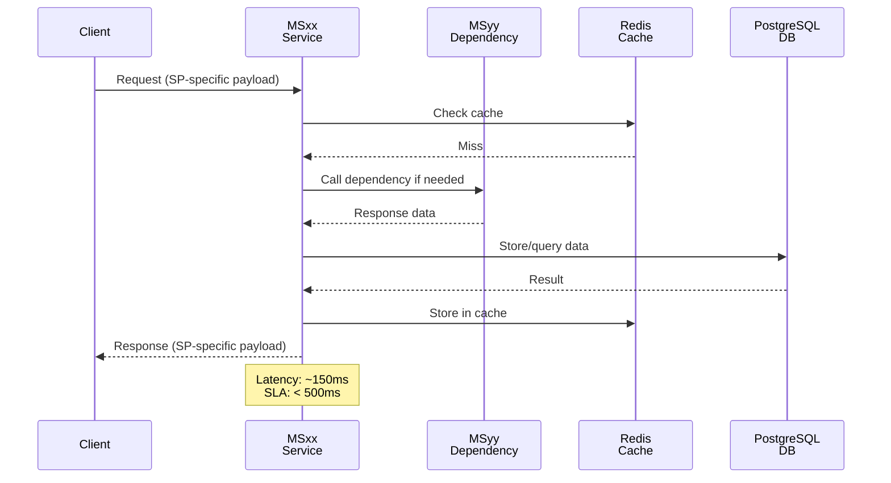

# Guida Struttura Documentazione ZenIA

Questa guida definisce la struttura standardizzata per documentare Microservizi (MS) e Casi d'Uso (UC) per massima chiarezza e navigabilità.

---

## 📋 Struttura Microservizio (MSxx)

Ogni cartella `docs/microservices/MSxx-NAME/` deve seguire questa gerarchia:

### Livello 1: Quick Start
```
README.md
├── Cos'è il microservizio (2-3 righe)
├── Responsabilità chiave (bullet list)
├── Stack tecnologico
├── Dipendenze (input from, output to, shared with)
└── Link a documentazione dettagliata
```
**Tempo lettura**: 5 minuti

---

### Livello 2: Architettura Tecnica
```
SPECIFICATION.md
├── 1. Panoramica (descrizione generale)
├── 2. Diagrammi ER (Mermaid)
│   └── Entità, relazioni, indici
├── 3. Componenti principali (descrizione)
├── 4. Sequenza diagram per ogni caso d'uso principale
│   ├── Happy path
│   ├── Alternative paths (cache, fallback, retry)
│   └── Error flows
└── 5. Performance SLA e considerazioni
```
**Tempo lettura**: 30 minuti

---

### Livello 3: Riferimento API
```
API.md
├── 1. Base URL e autenticazione
├── 2. Endpoint per funzionalità
│   ├── Method: endpoint
│   ├── Request schema (JSON)
│   ├── Response schema (JSON)
│   ├── HTTP codes
│   └── Example payload
├── 3. Rate limiting e throttling
└── 4. Errori comuni e debugging
```
**Tempo lettura**: Reference (consultazione on-demand)

---

### Livello 4: Schema Database
```
DATABASE-SCHEMA.md
├── 1. ER Diagram (Mermaid con tutte le tabelle)
├── 2. Tabelle (per ogni tabella):
│   ├── Descrizione scopo
│   ├── Colonne (con tipi, constraints, indici)
│   ├── Foreign keys
│   └── Performance considerations
├── 3. Indici (strategia e reason)
└── 4. Link a init-schema.sql
```

```
init-schema.sql
└── Script PostgreSQL DDL completo
```
**Tempo lettura**: Reference

---

### Livello 5: Problemi e Soluzioni
```
TROUBLESHOOTING.md
├── 1. Problemi comuni
│   └── Problema → Cause → Soluzioni → Prevenzione
├── 2. Procedure diagnostica
├── 3. Performance tuning
└── 4. Contatti escalation
```

---

### Livello 6: Setup Locale
```
docker-compose.yml
├── Tutti i servizi necessari
├── Environment variables
├── Health checks
└── Volume management
```

---

### Livello 7: Deployment Produzione
```
kubernetes/
├── deployment.yaml (replicas, HPA, probes)
├── service.yaml (ClusterIP, LoadBalancer)
└── configmap.yaml (config + riferimento init-schema.sql)
```

---

### Livello 8: Esempi
```
examples/
├── request.json (payload completo)
└── response.json (risposta attesa)
```

---

## 📚 Struttura Caso d'Uso (UCxx)

Ogni cartella `docs/use_cases/UCxx-NAME/` deve avere questa organizzazione:

### Livello 1: Panoramica UC
```
00_OVERVIEW.md
├── 1. Descrizione del caso d'uso (2-3 paragrafi)
├── 2. Attori coinvolti
├── 3. Obiettivi (business e tecnici)
├── 4. Trigger e postcondizioni
├── 5. SLA e metriche di successo
└── 6. Indice sottoprogetti (link a ciascun SP)
```

---

### Livello 2: Sottoprogetti (SP) - Struttura Repeatable

**Per ogni SP del caso d'uso:**

```
01_SPxx - NOME.md
│
├── 1. Descrizione Sottoprogetto
│   ├── Cosa fa (business perspective)
│   ├── Responsabilità tecniche
│   ├── MS coinvolti
│   └── SP correlati (dipendenze)
│
├── 2. Diagramma Sequenza
│   ├── Happy path (flusso normale)
│   ├── Participants: Client, MSx, MSy, MSz, Database
│   ├── Nota timing (latency expected)
│   └── Mermaid diagram
│
├── 3. Request Payload
│   ├── Descrizione campi
│   ├── Vincoli e validazioni
│   └── Esempio JSON
│
├── 4. Response Payload
│   ├── Descrizione campi
│   ├── Possibili variazioni
│   ├── Esempio JSON success
│   └── Esempio JSON error
│
├── 5. Sequence Diagram Alternativi (se esistono)
│   ├── Cache hit (performance optimization)
│   ├── Fallback path (degraded mode)
│   ├── Error scenario
│   └── Retry logic
│
├── 6. Modelli Dati
│   ├── Entity relationship (se nuove tabelle)
│   ├── Data types e constraints
│   └── Link a DATABASE-SCHEMA.md del MS responsabile
│
└── 7. Integrazione con UC
    ├── Dove si inserisce nel flusso
    ├── Dipendenze da altri SP
    └── Handoff a prossimo SP
```

---

### Livello 3: Diagrammi Generali (opzionale)
```
02_ARCHITECTURE.md
├── 1. Diagramma architettura UC (Mermaid C4 o sequence)
├── 2. Matrice dipendenze SP
├── 3. Flusso temporale esecuzione
└── 4. Matrice compliance normativa
```

---

### Livello 4: Accettazione e Testing
```
03_ACCEPTANCE-CRITERIA.md
├── 1. Criteri accettazione per UC
├── 2. Scenario di test (happy path + alternative paths)
├── 3. SLA monitoring
└── 4. Rollback procedures
```

---

## 🎯 Struttura di Navigazione per Developer

Quando un developer vuole capire **come implementare UC5-SP02**:

```
1. Leggi: docs/use_cases/UC5 - Produzione Documentale Integrata/
   00_OVERVIEW.md
   ↓
2. Accedi a: 01_SP02 - Document Extractor & Attachment Classifier.md
   ├── Leggi descrizione (cosa fa)
   ├── Studia sequence diagram (flusso tecnico)
   ├── Analizza request/response payload (struttura dati)
   └── Vedi payload examples (testing)
   ↓
3. Per implementazione tecnica, vai a:
   docs/microservices/MS02-ANALYZER/
   ├── README.md (5 min overview)
   ├── SPECIFICATION.md (dettagli tecnici)
   ├── DATABASE-SCHEMA.md (ER diagram)
   ├── API.md (endpoint specifico)
   └── examples/ (payload reali)
```

---

## 📐 Template Sequence Diagram per SP

Ogni SP deve avere almeno 1 sequence diagram nel file `.md`:



**Elementi chiave**:
- Participants: indicare MS coinvolti (non dettagli interni)
- Flow: mostrare flusso logico completo
- Data: etichettare quali dati passano tra servizi
- Timing: annotare latency expected
- Alternative paths: loop per retry, alt per condizioni

---

## 📝 Template Request/Response Payload

### Request

```json
{
  "description": "Descrizione del payload",
  "fields": {
    "document_id": {
      "type": "UUID",
      "required": true,
      "description": "Identificativo univoco documento"
    },
    "metadata": {
      "type": "object",
      "required": false,
      "description": "Metadati aggiuntivi"
    }
  },
  "example": {
    "document_id": "550e8400-e29b-41d4-a716-446655440000",
    "metadata": {
      "source": "email",
      "priority": "high"
    }
  },
  "validations": [
    "document_id deve essere UUID valido",
    "metadata può contenere max 10 campi"
  ]
}
```

### Response Success

```json
{
  "description": "Risposta positiva",
  "fields": {
    "status": {
      "type": "string",
      "enum": ["success", "processing", "error"],
      "description": "Stato elaborazione"
    },
    "result": {
      "type": "object",
      "description": "Risultato SP"
    }
  },
  "example": {
    "status": "success",
    "result": {
      "extracted_text": "...",
      "confidence": 0.95,
      "processing_time_ms": 342
    }
  }
}
```

### Response Error

```json
{
  "error": {
    "code": "VALIDATION_ERROR",
    "message": "Descrizione errore",
    "details": {
      "field": "document_id",
      "reason": "Invalid UUID format"
    }
  }
}
```

---

## 🔄 Workflow Implementazione

1. **Design Phase**
   - Crea `00_OVERVIEW.md` per UC
   - Definisci SP e dipendenze
   - Scrivi `01_SPxx - NAME.md` per ogni SP

2. **Architecture Phase**
   - Aggiungi sequence diagram in SP file
   - Scrivi request/response payload spec
   - Crea `02_ARCHITECTURE.md`

3. **Implementation Phase**
   - Implementa MS (SPECIFICATION.md)
   - Crea DATABASE-SCHEMA.md con ER
   - Scrivi API.md con endpoint reali
   - Popola examples/ con payload reali

4. **Testing Phase**
   - Verifica payload examples in `03_ACCEPTANCE-CRITERIA.md`
   - Aggiungi alternative paths in SP
   - Update SLA in SPECIFICATION.md

5. **Deployment Phase**
   - Kubernetes manifests
   - Runbook procedures
   - TROUBLESHOOTING.md

---

## ✅ Checklist Completezza Documentazione

### Per Microservizio (MSxx)
- [ ] README.md (5 min quickstart)
- [ ] SPECIFICATION.md (30 min technical)
- [ ] API.md (complete endpoint reference)
- [ ] DATABASE-SCHEMA.md (ER diagram + tables)
- [ ] init-schema.sql (separate DDL script)
- [ ] TROUBLESHOOTING.md (common issues)
- [ ] docker-compose.yml (local dev)
- [ ] kubernetes/deployment.yaml (prod)
- [ ] examples/ (request + response)

### Per Caso d'Uso (UCxx)
- [ ] 00_OVERVIEW.md (UC description)
- [ ] 01_SPxx.md per ogni SP (description + sequence + payloads)
- [ ] 02_ARCHITECTURE.md (general diagrams)
- [ ] 03_ACCEPTANCE-CRITERIA.md (test criteria)

### Per Sottoprogetto (SPxx in UC)
- [ ] Descrizione (business + technical)
- [ ] Sequence diagram (happy path)
- [ ] Request payload (with validation)
- [ ] Response payload (success + error)
- [ ] Alternative paths (cache, error, retry)
- [ ] Data model (if applicable)
- [ ] Integration notes (where in flow)

---

## 📌 Best Practices

1. **Clarity First**
   - Scrivi per developer che non conosce il codice
   - Diagrammi > parole lunghe
   - Esempi reali > descrizioni astratte

2. **Hierarchy Matters**
   - UC level: cosa fa, perché, attori
   - SP level: come si integra, flusso tecnico, payload
   - MS level: implementazione, API, DB schema

3. **Payload Examples**
   - Usare dati realistici, non "foo/bar"
   - Mostrare errori comuni
   - Includere edge cases

4. **Diagrams**
   - Sequence per flussi (MS-to-MS)
   - ER per dati (tabelle, relazioni)
   - C4 per architettura generale

5. **Keep Updated**
   - Modificare doc quando modifica MS/API
   - Update payload examples quando schema cambia
   - Version documentation come codice

---

**Versione**: 1.0
**Creata**: 2024-11-18
**Lingua**: Italiano
**Maintainers**: ZenIA Documentation Team
