# Piano di Refactoring Documentazione ZenIA

**Data Creazione**: 2025-11-19
**Versione**: 1.0
**Stato**: PIANIFICAZIONE COMPLETA
**Completezza Attuale**: 96.8% (Fonte: VALIDATION-CHECKLIST.md)

---

## EXECUTIVE SUMMARY

La documentazione ZenIA presenta una **qualità eccellente** con copertura completa di:
- ✅ **16 Microservizi** (MS01-MS16) completamente documentati
- ✅ **74 Sottoprogetti** (SP01-SP72, escluso SP28) documentati
- ✅ **11 Use Cases** (UC1-UC11) con architetture complete
- ✅ **292 Diagrammi Mermaid** di alta qualità
- ✅ **499 Payload JSON** di esempio documentati
- ✅ **Lingua italiana** professionale e chiara

Tuttavia, sono stati identificati **problemi critici e miglioramenti** che richiedono intervento strutturato.

---

## ANALISI PROBLEMI IDENTIFICATI

### 🔴 CRITICI (Priorità Massima)

#### C1. Mancanza Script di Verifica Automatica
**Problema**: Non esistono script per verificare:
- Link rotti tra documenti
- Riferimenti SP/MS inesistenti
- Validità payload JSON
- Coerenza cross-reference

**Impatto**: Alto rischio di drift documentale durante sviluppo iterativo.

**File Mancanti**:
- `scripts/verify_sp_references.py`
- `scripts/verify_json_examples.py`
- `scripts/verify_links.py`

---

### 🟠 ALTI (Priorità Alta)

#### A1. File Duplicati con Errore Battitura (TROUBLESHOOTING)
**Problema**: 11 microservizi hanno file `TROUBLESHOOTING.md` invece di `TROUBLESHOOTING.md`.

**Microservizi Affetti**:
```
MS06-AGGREGATOR, MS07-DISTRIBUTOR, MS08-MONITOR, MS09-MANAGER,
MS10-LOGGER, MS11-GATEWAY, MS12-CACHE, MS13-SECURITY,
MS14-AUDIT, MS15-CONFIG, MS16-REGISTRY
```

**Impatto**: Confusione navigazione, alcuni MS hanno ENTRAMBI i file.

**Soluzione**: Rinominare `TROUBLESHOOTING.md` → `TROUBLESHOOTING.md` ed eliminare duplicati.

---

#### A2. Pseudo-codice in Documenti SP
**Problema**: 3 file use_cases contengono pseudo-codice Python esplicativo che potrebbe confondere sviluppatori.

**File Affetti**:
- `UC5/01 SP11 - Security & Audit.md` (definizioni `def check_permission()`)
- `UC5/02 Sottoprogetti con Pipeline Operative.md`
- `UC11/00 Architettura UC11.md`

**Impatto**: Rischio che gli sviluppatori copino pseudo-codice invece di consultare SPECIFICATION.md.

**Soluzione**: Sostituire pseudo-codice con diagrammi mermaid flowchart.

---

#### A3. Link Testuali Senza Hyperlink
**Problema**: Maggior parte dei riferimenti SP/MS sono testuali (es. "SP02", "MS01") senza link espliciti.

**Esempio Verificato**: Solo 1 link trovato in `UC5/01 CANONICAL - Generazione Atto Completo.md`.

**Impatto**: Navigazione manuale inefficiente, difficoltà seguire dipendenze.

**Soluzione**: Convertire riferimenti testuali in markdown link `[SP02](../path/to/SP02.md)`.

---

### 🟡 MEDI (Priorità Media)

#### M1. Mancanza Glossario Terminologico
**Problema**: Uso inconsistente di terminologia inglese/italiana (es. "Workflow" vs "Flusso di lavoro").

**Impatto**: Potenziale ambiguità terminologica.

**Soluzione**: Creare `docs/GLOSSARIO.md` con decisioni terminologiche standard.

---

#### M2. Indici Centrali per UC Mancanti
**Problema**: Alcuni UC non hanno index centrale con tutti gli SP.

**Impatto**: Difficoltà overview rapida degli SP per UC.

**Soluzione**: Creare `00 INDEX.md` in ogni cartella UC.

---

### 🟢 BASSI (Priorità Bassa)

#### B1. README Microservizi Migliorabili
**Problema**: README.md dei microservizi non hanno badge status/versione/coverage.

**Soluzione**: Aggiungere badge standard, quick start guide, link a UC rilevanti.

---

#### B2. Mancanza Changelog per Microservizi
**Problema**: Nessun changelog per versionamento documentazione.

**Soluzione**: Creare `CHANGELOG.md` per ogni MS con breaking changes e migration guide.

---

## PIANO DI REFACTORING INCREMENTALE

### FASE 1: FONDAMENTA (Settimana 1-2)
**Obiettivo**: Eliminare problemi critici e automatizzare verifiche.

#### 1.1 Script di Verifica Automatica (Giorni 1-3)
**File da Creare**:

1. `scripts/verify_sp_references.py`
   ```
   Funzionalità:
   - Scansiona tutti file MD per riferimenti SP## e MS##
   - Verifica esistenza file SP/MS referenziati
   - Identifica SP/MS orfani (non referenziati)
   - Output: report HTML con errori
   ```

2. `scripts/verify_json_examples.py`
   ```
   Funzionalità:
   - Estrae tutti blocchi ```json dai file MD
   - Valida sintassi JSON (json.loads)
   - Verifica schema se presente (jsonschema)
   - Output: report errori validazione
   ```

3. `scripts/verify_links.py`
   ```
   Funzionalità:
   - Scansiona tutti link markdown [text](url)
   - Verifica esistenza file per link interni
   - Verifica HTTP 200 per link esterni (opzionale)
   - Output: report link rotti
   ```

4. `scripts/run_all_checks.sh`
   ```bash
   #!/bin/bash
   python verify_sp_references.py
   python verify_json_examples.py
   python verify_links.py
   echo "✅ Verifiche complete. Controlla reports/"
   ```

**Deliverables**:
- ✅ 4 script funzionanti
- ✅ Integrazione in `.github/workflows/docs-validation.yml` (CI/CD)
- ✅ Report baseline con stato attuale

**Stima Effort**: 2-3 giorni sviluppo + test

---

#### 1.2 Correzione File TROUBLESHOOTING (Giorni 4-5)
**Task**:
1. Identificare MS con file duplicati (TROUBLESHOOTING.md E TROUBLESHOOTING.md)
2. Per ogni MS:
   - Se esiste solo `TROUBLESHOOTING.md`: rinominare → `TROUBLESHOOTING.md`
   - Se esistono entrambi: merge contenuti → `TROUBLESHOOTING.md`, elimina `TROUBLESHOOTING.md`
3. Aggiornare link interni che puntano a file rinominati
4. Eseguire `verify_links.py` per conferma

**Microservizi da Correggere** (11):
```
MS06-AGGREGATOR, MS07-DISTRIBUTOR, MS08-MONITOR, MS09-MANAGER,
MS10-LOGGER, MS11-GATEWAY, MS12-CACHE, MS13-SECURITY,
MS14-AUDIT, MS15-CONFIG, MS16-REGISTRY
```

**Deliverables**:
- ✅ 11 file rinominati/corretti
- ✅ 0 duplicati residui
- ✅ Tutti link aggiornati

**Stima Effort**: 1 giorno

---

#### 1.3 Documentazione Gap SP28 (Giorno 6)
**Task**:
1. Creare `docs/SP28-RESERVED.md` che documenta:
   - Motivo gap numerazione (reserved per futuro use case)
   - Riferimento a decisione architetturale
2. Aggiornare `docs/riepilogo_casi_uso.md` con nota esplicita
3. Aggiungere entry in `QUICK-REFERENCE-ARCHITECTURE.md`

**Deliverables**:
- ✅ File `SP28-RESERVED.md` creato
- ✅ Note aggiunte a 2 documenti master

**Stima Effort**: 0.5 giorni

---

### FASE 2: QUALITÀ CONTENUTI (Settimana 3-4)

#### 2.1 Sostituzione Pseudo-codice con Flowchart (Giorni 1-3)
**Task**:
1. Identificare tutti blocchi ````python` nei documenti SP
2. Per ogni blocco:
   - Analizzare logica esplicata
   - Creare diagramma mermaid flowchart equivalente
   - Sostituire pseudo-codice con flowchart
   - Aggiungere link a SPECIFICATION.md per dettagli implementativi

**File da Modificare** (3):
- `UC5/01 SP11 - Security & Audit.md`
- `UC5/02 Sottoprogetti con Pipeline Operative.md`
- `UC11/00 Architettura UC11.md`

**Esempio Trasformazione**:
```
PRIMA:
```python
def check_permission(user, action, resource):
    if user.role == "admin":
        return True
    return False
```

DOPO:

Vedi [COMPLIANCE-MATRIX.md](./COMPLIANCE-MATRIX.md#sp11) per dettagli implementativi.
```

**Deliverables**:
- ✅ 3 file aggiornati con flowchart
- ✅ 0 pseudo-codice residuo in SP

**Stima Effort**: 2 giorni

---

#### 2.2 Creazione Glossario Terminologico (Giorni 4-5)
**Task**:
1. Scansionare tutta documentazione per termini tecnici ricorrenti
2. Decidere standard italiano vs inglese:
   - **Italiano**: Flusso di lavoro, Validatore, Orchestratore
   - **Inglese**: Workflow, API, JSON, REST, Cache
3. Creare `docs/GLOSSARIO.md` con:
   - Termini in ordine alfabetico
   - Definizione italiana
   - Termine inglese equivalente
   - Quando usare quale termine
4. Aggiungere link a glossario in `docs/INDEX.md`

**Deliverables**:
- ✅ File `GLOSSARIO.md` creato con 50+ termini
- ✅ Policy decisione terminologica documentata

**Stima Effort**: 1.5 giorni

---

#### 2.3 Standardizzazione Payload JSON (Giorni 6-7)
**Task**:
1. Creare `docs/templates/json-payload-template.json` con:
   - Convenzioni naming (snake_case, camelCase)
   - Campi standard (timestamp, request_id, metadata)
   - Gestione errori standard
2. Per ogni MS, verificare conformità payload a template
3. Aggiornare payload non conformi
4. Aggiungere JSON Schema dove mancante

**Deliverables**:
- ✅ Template JSON standard creato
- ✅ 100% payload conformi a standard
- ✅ JSON Schema aggiunti a 16 MS

**Stima Effort**: 2 giorni

---

### FASE 3: NAVIGAZIONE E LINKING (Settimana 5-6)

#### 3.1 Conversione Riferimenti Testuali in Link (Giorni 1-5)
**Task**:
1. Creare script `scripts/linkify_references.py`:
   ```python
   # Trova pattern "SP02", "MS01" nel testo
   # Sostituisce con [SP02](../../path/to/SP02.md)
   # Usa struttura cartelle per calcolare path relativo
   ```
2. Eseguire script su tutti file MD
3. Review manuale dei link generati (sample 10%)
4. Eseguire `verify_links.py` per conferma

**Deliverables**:
- ✅ Script `linkify_references.py` funzionante
- ✅ ~200+ link creati automaticamente
- ✅ 100% link validi

**Stima Effort**: 3 giorni sviluppo + 2 giorni review

---

#### 3.2 Creazione Indici Centrali UC (Giorni 6-7)
**Task**:
1. Per ogni UC (UC1-UC11), creare `00 INDEX.md` con:
   - Overview UC
   - Lista SP con link e descrizione 1-line
   - Matrice dipendenze (link a file esistente)
   - Link a architettura e guide
2. Aggiornare `docs/use_cases/README.md` con link a tutti INDEX

**Deliverables**:
- ✅ 11 file `00 INDEX.md` creati
- ✅ README centrale aggiornato

**Stima Effort**: 2 giorni

---

### FASE 4: MIGLIORAMENTI AVANZATI (Settimana 7-8)

#### 4.1 Badge e Quick Start per MS (Giorni 1-3)
**Task**:
1. Aggiungere a ogni `microservices/MS##/README.md`:
   ```markdown
   # MS01 - Generic Classifier Engine

   
   
   

   ## Quick Start
   ```bash
   docker run -p 8001:8000 zenia/ms01-classifier:latest
   curl http://localhost:8001/health
   ```

   ## Use Cases
   - [UC1 - Sistema Gestione Documentale](../../use_cases/UC1/...)
   - [UC2 - Protocollo Informatico](../../use_cases/UC2/...)
   ```

**Deliverables**:
- ✅ 16 README.md aggiornati con badge
- ✅ 16 Quick Start guide aggiunte
- ✅ Link bidirezionali MS ↔ UC

**Stima Effort**: 2 giorni

---

#### 4.2 Creazione Changelog per MS (Giorni 4-5)
**Task**:
1. Creare template `docs/templates/CHANGELOG-template.md`:
   ```markdown
   # Changelog - MS01 Generic Classifier Engine

   ## [1.1.0] - 2025-02-01
   ### Added
   - Nuova API endpoint /classify/batch

   ### Changed
   - BREAKING: Response format ora include confidence_score

   ### Migration Guide
   Prima: {"classification": "invoice"}
   Dopo: {"classification": "invoice", "confidence": 0.95}
   ```
2. Creare `CHANGELOG.md` per ogni MS (16 totali)
3. Documentare versione corrente (1.0.0) come baseline

**Deliverables**:
- ✅ Template CHANGELOG.md
- ✅ 16 CHANGELOG.md creati con baseline

**Stima Effort**: 1.5 giorni

---

#### 4.3 Conformità Normativa - Tracciabilità (Giorni 6-8)
**Task**:
1. Per ogni SP in `COMPLIANCE-MATRIX.md`:
   - Aggiungere sezione "## Conformità Normativa" nel file SP
   - Link alle fonti normative applicabili
   - Checklist requisiti normativi
2. Esempio per `SP11 - Security & Audit.md`:
   ```markdown
   ## Conformità Normativa

   ### GDPR (Regolamento 2016/679)
   - ✅ Art. 5: Legittimità trattamento (audit trail completo)
   - ✅ Art. 32: Integrità e confidenzialità (crittografia AES-256)

   ### CAD Art. 24
   - ✅ Audit log immutabile per controlli accesso

   **Riferimento**: Vedi [COMPLIANCE-MATRIX.md](./COMPLIANCE-MATRIX.md#sp11)
   ```

**Deliverables**:
- ✅ 74 SP aggiornati con sezione conformità
- ✅ Tracciabilità bidirezionale normativa ↔ SP

**Stima Effort**: 3 giorni

---

### FASE 5: VALIDAZIONE E DEPLOYMENT (Settimana 9)

#### 5.1 Esecuzione Verifiche Automatiche (Giorni 1-2)
**Task**:
1. Eseguire tutti script creati in Fase 1:
   - `verify_sp_references.py`
   - `verify_json_examples.py`
   - `verify_links.py`
2. Correggere tutti errori identificati
3. Iterare fino a 0 errori

**Deliverables**:
- ✅ Report finale con 0 errori
- ✅ Documentazione 100% validata

**Stima Effort**: 2 giorni

---

#### 5.2 Review Qualità Manuale (Giorni 3-5)
**Task**:
1. Sample random 10% file (7 SP + 2 MS)
2. Review manuale per:
   - Chiarezza lingua italiana
   - Diagrammi mermaid corretti
   - JSON validi e completi
   - Link funzionanti
   - Sezioni conformità complete
3. Correzioni finali

**Deliverables**:
- ✅ Report review qualità
- ✅ Correzioni applicate

**Stima Effort**: 3 giorni

---

#### 5.3 Aggiornamento VALIDATION-CHECKLIST (Giorno 6)
**Task**:
1. Aggiornare `docs/VALIDATION-CHECKLIST.md` con:
   - Completezza score finale (target: 98%+)
   - Issue risolti in questo refactoring
   - Data ultimo aggiornamento
2. Creare tag Git `v1.0-docs-complete`

**Deliverables**:
- ✅ VALIDATION-CHECKLIST.md aggiornato
- ✅ Tag Git creato

**Stima Effort**: 0.5 giorni

---

#### 5.4 Documentazione Processo Manutenzione (Giorno 7)
**Task**:
1. Creare `docs/DOCUMENTATION-MAINTENANCE.md` con:
   - Quando creare nuovo SP/MS
   - Come aggiornare diagrammi
   - Policy review documentazione (quarterly)
   - Script da eseguire pre-commit
2. Aggiornare `.github/workflows/docs-validation.yml` per CI/CD

**Deliverables**:
- ✅ Guida manutenzione completa
- ✅ CI/CD configurato

**Stima Effort**: 1 giorno

---

## METRICHE DI SUCCESSO

### Baseline (Pre-Refactoring)
| Metrica | Valore Attuale |
|---------|----------------|
| Completezza Documentazione | 96.8% |
| Link Rotti | Sconosciuto (no script) |
| Errori JSON | Sconosciuto (no validazione) |
| Riferimenti Orfani | Sconosciuto |
| File con Errori Battitura | 11 (TROUBLESHOOTING) |
| Pseudo-codice in SP | 3 file |
| Hyperlink Espliciti | <5% riferimenti |

### Target (Post-Refactoring)
| Metrica | Valore Target |
|---------|---------------|
| Completezza Documentazione | 98%+ |
| Link Rotti | 0 |
| Errori JSON | 0 |
| Riferimenti Orfani | 0 |
| File con Errori Battitura | 0 |
| Pseudo-codice in SP | 0 |
| Hyperlink Espliciti | 80%+ riferimenti |
| Script Verifica Automatica | 3+ script funzionanti |
| CI/CD Validazione Docs | Attivo |

---

## RISCHI E MITIGAZIONI

### R1. Script Generazione Link Crea Path Errati
**Probabilità**: Media
**Impatto**: Alto
**Mitigazione**:
- Review manuale sample 10% link generati
- Eseguire `verify_links.py` dopo ogni batch
- Rollback Git se errori > 5%

### R2. Merge Conflict con Branch Sviluppo Attivi
**Probabilità**: Alta
**Impatto**: Medio
**Mitigazione**:
- Coordinare con team prima Fase 1
- Creare branch `docs/refactoring` dedicato
- Merge incrementale al termine di ogni fase

### R3. Performance Script su 74+ File
**Probabilità**: Bassa
**Impatto**: Basso
**Mitigazione**:
- Parallelizzare scan file dove possibile
- Cache risultati intermedi
- Timeout 30s per link esterni

---

## TIMELINE COMPLESSIVA

```mermaid
gantt
    title Piano Refactoring Documentazione ZenIA
    dateFormat YYYY-MM-DD

    section Fase 1: Fondamenta
    Script Verifica      :f1-1, 2025-11-20, 3d
    Fix TROUBLESHOOTING  :f1-2, 2025-11-23, 1d
    Doc Gap SP28         :f1-3, 2025-11-24, 1d

    section Fase 2: Qualità
    Flowchart vs Pseudo  :f2-1, 2025-11-25, 2d
    Glossario            :f2-2, 2025-11-27, 2d
    JSON Standard        :f2-3, 2025-11-29, 2d

    section Fase 3: Navigazione
    Link Automatici      :f3-1, 2025-12-01, 5d
    Indici UC            :f3-2, 2025-12-06, 2d

    section Fase 4: Avanzati
    Badge MS             :f4-1, 2025-12-08, 2d
    Changelog MS         :f4-2, 2025-12-10, 2d
    Tracciabilità Norm   :f4-3, 2025-12-12, 3d

    section Fase 5: Validazione
    Verifiche Auto       :f5-1, 2025-12-15, 2d
    Review Qualità       :f5-2, 2025-12-17, 3d
    Update Checklist     :f5-3, 2025-12-20, 1d
    Guida Manutenzione   :f5-4, 2025-12-21, 1d
```



**Durata Totale**: 9 settimane (20 Nov - 21 Dic 2025)
**Effort Totale**: ~25 giorni/persona
**Team Raccomandato**: 1 Tech Writer + 1 Developer (part-time)

---

## DELIVERABLES FINALI

### Documentazione
- ✅ 74 SP con conformità normativa, link corretti, 0 pseudo-codice
- ✅ 16 MS con badge, changelog, quick start, link bidirezionali a UC
- ✅ 11 UC con indici centrali, navigazione migliorata
- ✅ `GLOSSARIO.md` con 50+ termini standard
- ✅ `DOCUMENTATION-MAINTENANCE.md` con processo manutenzione

### Automazione
- ✅ 3 script validazione (`verify_*.py`)
- ✅ 1 script linking automatico (`linkify_references.py`)
- ✅ CI/CD pipeline GitHub Actions per docs

### Governance
- ✅ `VALIDATION-CHECKLIST.md` aggiornato (target: 98%+)
- ✅ Tag Git `v1.0-docs-complete`
- ✅ Policy review trimestrale documentata

---

## PROSSIMI STEP

1. **Approvazione Piano** (Giorno 0)
   - Review con stakeholder
   - Approvazione budget/timeline
   - Assegnazione team

2. **Kickoff Fase 1** (Giorno 1)
   - Setup ambiente sviluppo script
   - Creazione branch `docs/refactoring`
   - Comunicazione team sviluppo

3. **Checkpoint Settimanali** (Ogni Venerdì)
   - Review progress vs timeline
   - Identificazione blockers
   - Update stakeholder

4. **Go-Live** (22 Dicembre 2025)
   - Merge branch `docs/refactoring` → `main`
   - Annuncio completamento refactoring
   - Training team su nuovi script

---

## CONTATTI

**Coordinatore Refactoring**: [TBD]
**Tech Writer**: [TBD]
**Developer Support**: [TBD]
**Slack Channel**: `#zenia-docs-refactoring`

---

**Versione Piano**: 1.0
**Data Creazione**: 2025-11-19
**Prossima Review**: 2025-11-26
**Maintainer**: ZenIA Documentation Team
