```mermaid
sequenceDiagram
    participant Client
    participant Service as MSxx<br/>Service
    participant Cache as Redis<br/>Cache

    Client->>Service: Request

    Service->>Cache: Check cache
    Cache-->>Service: HIT!<br/>(cached result)

    Service->>Service: Update metrics
    Service-->>Client: Response<br/>(from cache)<br/>FAST ⚡

    Note over Cache: Latency: < 50ms
```

# Sequence Diagrams Template - ZenIA

Questo documento contiene pattern e template di sequence diagrams in Mermaid che puoi utilizzare per documentare i flussi dei microservizi (MS) e sub-progetti (SP).

---

## 📋 Indice Pattern

1. [Happy Path (Main Flow)](#1-happy-path-main-flow)
2. [Alternative Paths (Cache, Optimization)](#2-alternative-paths)
3. [Error Flows](#3-error-flows)
4. [Integration Flows (Multi-service)](#4-integration-flows)
5. [Lifecycle & State Changes](#5-lifecycle--state-changes)
6. [Async Processing](#6-async-processing)

---

## 1. Happy Path (Main Flow)

### Template: Simple Request-Response
Use this for basic synchronous operations.


### Template: With External Dependency
Use this when service depends on another MS.


---

## 2. Alternative Paths

### Template: Cache Hit (Performance Optimization)



### Template: Fallback Path (Degraded Mode)

```mermaid
sequenceDiagram
    participant Client
    participant Service as MSxx<br/>Service
    participant Primary as Primary<br/>Service
    participant Fallback as Fallback<br/>Service

    Client->>Service: Request

    Service->>Primary: Try primary<br/>dependency
    Primary--xService: TIMEOUT/ERROR

    Note over Service: Primary unavailable<br/>switching to fallback

    Service->>Fallback: Try fallback<br/>dependency
    Fallback-->>Service: Response<br/>(degraded)<br/>SLOW ⚠️

    Service-->>Client: 200 OK<br/>(with fallback data)
```



### Template: Retry Logic


---

## 3. Error Flows

### Template: Validation Error


### Template: Authorization Error


### Template: Resource Not Found


### Template: Conflict/Duplicate


---

## 4. Integration Flows

### Template: Multi-Service Pipeline (UC-style)


### Template: Publish-Subscribe Pattern


### Template: Saga Pattern (Distributed Transaction)


---

## 5. Lifecycle & State Changes

### Template: Model/Version Lifecycle


### Template: Data Migration/Upgrade


---

## 6. Async Processing

### Template: Background Job Queue


### Template: Event-Driven Processing


### Template: Scheduled Task (Batch Processing)


---

## 🎓 Best Practices

### 1. **Clarity**
- Use descriptive labels on arrows
- Include what data/message is passed
- Show response values (not just 200 OK)

### 2. **Error Handling**
- Show both success AND failure paths
- Use `--x` for errors/exceptions
- Include error codes (404, 500, etc.)

### 3. **Performance**
- Annotate latency where relevant
- Show caching/optimization paths
- Include alternative faster paths

### 4. **Security**
- Show authentication/authorization checks
- Indicate encryption/validation steps
- Mark sensitive data handling

### 5. **Readability**
- Keep diagrams focused (max 6-8 participants)
- Use `alt`/`loop`/`opt` for conditional logic
- Break complex flows into multiple diagrams

---

## 🚀 How to Use These Templates

### For MS (Microservice) Documentation

1. Copy the appropriate template above
2. Replace generic names with your MS/service names
3. Adapt flow to match your actual implementation
4. Add error paths and alternatives
5. Update timing/latency estimates

### For SP (Sub-Project) Documentation

1. Use integration flow templates for SP-to-SP interactions
2. Show how SP integrates with parent UC
3. Include data transformation steps
4. Add validation/quality checks

### Example: Adding to SPECIFICATION.md

```markdown
## Sequence Diagrams

### Main Flow: Feature X (Happy Path)

[paste mermaid diagram from template]

### Alternative: Cache Hit Optimization

[paste cache template]

### Error: Validation Failure

[paste validation error template]
```

---

## 📝 Mermaid Syntax Quick Reference


---

## 📚 Dove Aggiungere i Diagrammi

| Documento | Pattern | Esempio |
|-----------|---------|---------|
| SPECIFICATION.md | Main flow, alternative paths, error flows | MS01: Classification, cache hit, low confidence |
| DATABASE-SCHEMA.md | Data lifecycle, state changes | Model versioning, data migration |
| TROUBLESHOOTING.md | Error flows, recovery paths | Timeout handling, retry logic |
| API.md | Request-response flows | Simple client-server interaction |

---

**Versione**: 1.0
**Creato**: 2024-11-18
**Lingua**: Italiano/English (Mermaid syntax universal)
