```mermaid
sequenceDiagram
    participant Client
    participant Service as MSxx<br/>Service
    participant Primary as Primary<br/>Service
    participant Fallback as Fallback<br/>Service

    Client->>Service: Request

    Service->>Primary: Try primary<br/>dependency
    Primary--xService: TIMEOUT/ERROR

    Note over Service: Primary unavailable<br/>switching to fallback

    Service->>Fallback: Try fallback<br/>dependency
    Fallback-->>Service: Response<br/>(degraded)<br/>SLOW ⚠️

    Service-->>Client: 200 OK<br/>(with fallback data)
```

# Template Diagrammi di Sequenza - ZenIA

Questo documento contiene pattern e template di diagrammi di sequenza (Mermaid) che puoi utilizzare per documentare i flussi dei microservizi (MS) e dei sottoprogetti (SP).

---

## 📋 Indice Pattern

1. [Happy Path (Main Flow)](#1-happy-path-main-flow)
2. [Alternative Paths (Cache, Optimization)](#2-alternative-paths)
3. [Error Flows](#3-error-flows)
4. [Integration Flows (Multi-service)](#4-integration-flows)
5. [Lifecycle & State Changes](#5-lifecycle--state-changes)
6. [Async Processing](#6-async-processing)

---

## 1. Happy Path (Main Flow)

### Template: Richiesta-Risposta Semplice
Usare per operazioni sincrone di base.


### Template: Con Dipendenza Esterna
Usare quando il servizio dipende da un altro microservizio.


---

## 2. Alternative Paths

### Template: Cache Hit (Ottimizzazione delle prestazioni)

```mermaid
sequenceDiagram
    participant Client
    participant Service as MSxx<br/>Service
    participant Cache as Redis<br/>Cache

    Client->>Service: Request

    Service->>Cache: Check cache
    Cache-->>Service: HIT!<br/>(cached result)

    Service->>Service: Update metrics
    Service-->>Client: Response<br/>(from cache)<br/>FAST ⚡

    Note over Cache: Latency: < 50ms
```



### Template: Percorso di Fallback (Modalità degradata)



### Template: Logica di Retry


---

## 3. Error Flows

### Template: Errore di Validazione


### Template: Errore di Autorizzazione


### Template: Risorsa Non Trovata


### Template: Conflitto/Duplicato


---

## 4. Integration Flows

### Template: Pipeline Multi-Servizio (stile UC)


### Template: Pattern Publish-Subscribe


### Template: Pattern Saga (Transazione distribuita)


---

## 5. Lifecycle & State Changes

### Template: Ciclo di vita Modello/Versione


### Template: Migrazione/Upgrade Dati


---

## 6. Async Processing

### Template: Coda Job Background


### Template: Elaborazione Event-Driven


### Template: Attività Pianificata (Elaborazione Batch)


---

## 🎓 Best Practices

### 1. **Chiarezza**
- Usa etichette descrittive sulle frecce
- Includi quali dati/messaggi vengono passati
- Mostra i valori di risposta (non solo 200 OK)

### 2. **Gestione Errori**
- Mostra sia i percorsi di successo che quelli di errore
- Usa `--x` per errori/eccezioni
- Include codici di errore (404, 500, ecc.)

### 3. **Prestazioni**
- Annotare le latenze quando rilevanti
- Mostrare percorsi di caching/ottimizzazione
- Includere percorsi alternativi più veloci

### 4. **Sicurezza**
- Mostrare controlli di autenticazione/autorizzazione
- Indicare passaggi di cifratura/validazione
- Segnalare la gestione di dati sensibili

### 5. **Leggibilità**
- Mantenere i diagrammi focalizzati (max 6-8 partecipanti)
- Usare `alt`/`loop`/`opt` per la logica condizionale
- Suddividere flussi complessi in più diagrammi

---

## 🚀 How to Use These Templates

### Per la documentazione MS (Microservice)

1. Copiare il template appropriato sopra
2. Sostituire i nomi generici con i nomi dei vostri MS/servizi
3. Adattare il flusso alla vostra implementazione reale
4. Aggiungere percorsi di errore e alternative
5. Aggiornare stime di tempo/latency

### Per la documentazione SP (Sottoprogetto)

1. Usare i template di integrazione per interazioni SP-to-SP
2. Mostrare come lo SP si integra con la UC principale
3. Includere i passaggi di trasformazione dati
4. Aggiungere controlli di validazione/qualità

### Example: Adding to SPECIFICATION.md

```markdown
## Sequence Diagrams

### Main Flow: Feature X (Happy Path)

[paste mermaid diagram from template]

### Alternative: Cache Hit Optimization

[paste cache template]

### Error: Validation Failure

[paste validation error template]
```

---

## 📝 Mermaid Syntax Quick Reference


---

## 📚 Dove Aggiungere i Diagrammi

| Documento | Pattern | Esempio |
|-----------|---------|---------|
| SPECIFICATION.md | Main flow, alternative paths, error flows | MS01: Classification, cache hit, low confidence |
| DATABASE-SCHEMA.md | Data lifecycle, state changes | Model versioning, data migration |
| TROUBLESHOOTING.md | Error flows, recovery paths | Timeout handling, retry logic |
| API.md | Request-response flows | Simple client-server interaction |

---

**Versione**: 1.0
**Creato**: 2024-11-18
**Lingua**: Italiano/English (la sintassi Mermaid è universale)
