# Template Standardizzazione Diagrammi Mermaid - ZenIA

**Data Creazione**: 2025-11-19
**Versione**: 1.0
**Stato**: In Production
**Scopo**: Standardizzare i diagrammi Mermaid per coerenza, chiarezza e manutenibilità su tutti i SubProjekti (SP)

---

## Indice

1. [Struttura Generale](#struttura-generale)
2. [3 Diagrammi Obbligatori](#3-diagrammi-obbligatori)
3. [Guida per Tipo di Diagramma](#guida-per-tipo-di-diagramma)
4. [Best Practices e Convenzioni](#best-practices-e-convenzioni)
5. [Template Replicabili](#template-replicabili)
6. [Validazione e Quality Assurance](#validazione-e-quality-assurance)

---

## Struttura Generale

### Sezione Diagrammi in SP/UC

Ogni SubProjekti CRITICO deve contenere una sezione **"## 📊 Diagrammi Architetturali"** con tre sottosezioni:

```markdown
## 📊 Diagrammi Architetturali

### Flowchart: [Descrizione Main Flow]

### Sequence Diagram: [Descrizione Interazioni]

### State Diagram: [Descrizione Stati/Workflow]
```

### Posizionamento nella Documentazione

```
1. Introduzione
2. Architettura & Componenti
3. 📊 Diagrammi Architetturali  <-- QUESTA SEZIONE
4. Specifiche Tecniche
5. API & Integrazioni
6. 🏛️ Conformità Normativa
7. KPI & Monitoraggio
```

**Posizionamento consigliato**: Dopo Architettura (sezione 2) e prima di Specifiche Tecniche (sezione 4)

---

## 3 Diagrammi Obbligatori

### 1. FLOWCHART - Architettura e Componenti Principali

**Scopo**: Visualizzare il flusso end-to-end del SubProjekti, evidenziando componenti, decisioni e integrazioni

**Quando è obbligatorio**:
- ✅ TUTTI i SP CRITICI (10 SP)
- ✅ SP con workflow complesso (>3 passaggi)
- ✅ SP con integrazioni esterne (database, API, services)

**Linee guida**:
- Mostra il main happy path
- Include decision points (diamanti)
- Evidenzia integrazioni esterne
- Massimo 12-15 nodi per mantenibilità

**Template Base**:

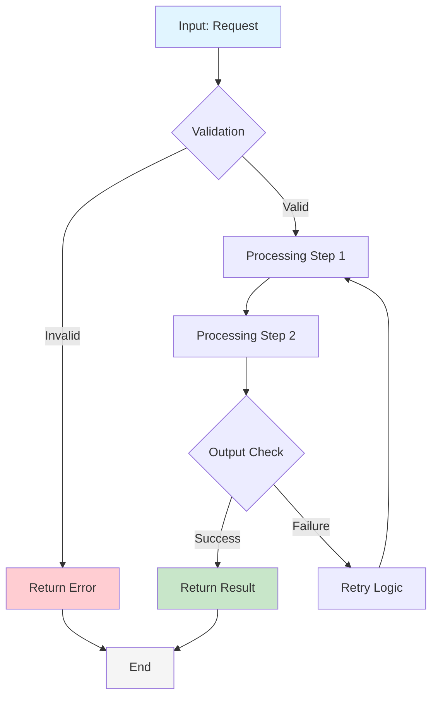

**Varianti per tipo di SP**:

#### A. SP con Estrazione/Parsing (SP01, SP02)
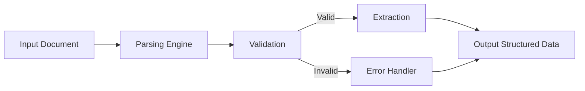

#### B. SP con Classificazione (SP03, SP07, SP16)
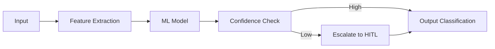

#### C. SP con Workflow Orchestrazione (SP09, SP15, SP19)
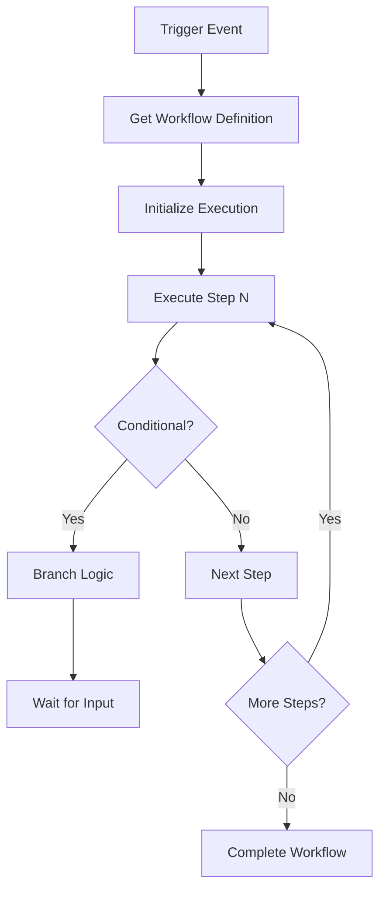

#### D. SP con Query/Ricerca (SP12, SP52)
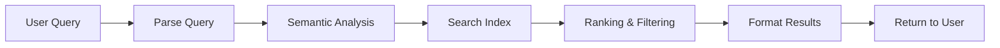

#### E. SP con Conformità/Monitoring (SP42, SP44, SP70)
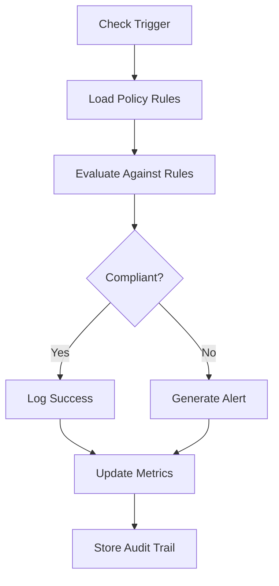

---

### 2. SEQUENCE DIAGRAM - Interazioni tra Componenti

**Scopo**: Mostrare come il SP interagisce con altri componenti, servizi esterni, database, ecc. in sequenza temporale

**Quando è obbligatorio**:
- ✅ TUTTI i SP CRITICI (10 SP)
- ✅ SP con interazioni multi-sistema
- ✅ SP con pattern asincroni (callback, events)

**Linee guida**:
- Actor principale: Client/API/External Service
- Partecipanti: SP stesso + dipendenze critiche
- Mostra almeno il happy path
- Massimo 8-10 interazioni per diagramma
- Use `autonumber` per tracciabilità

**Template Base**:

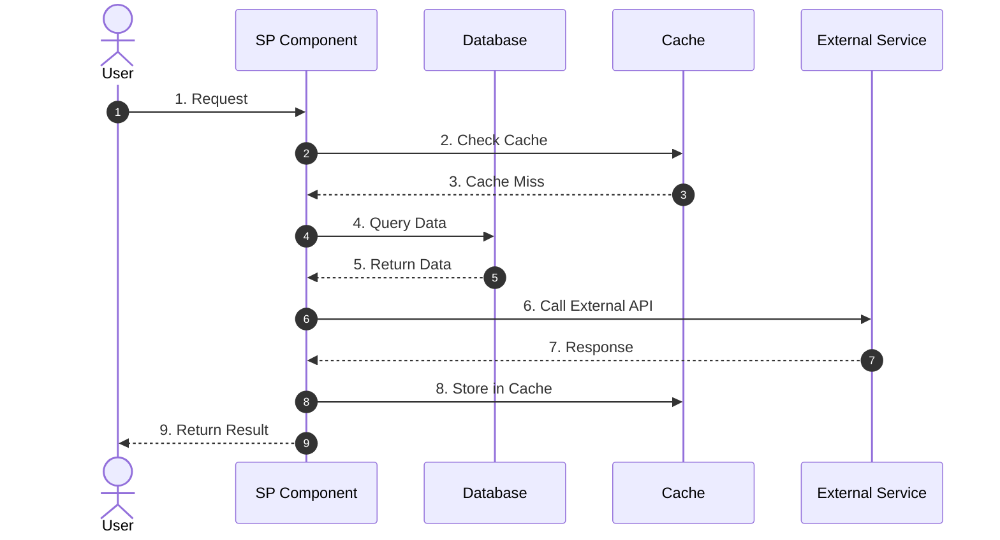

**Varianti per tipo di SP**:

#### A. SP con Validazione/Verifiche (SP01, SP06, SP08, SP29)
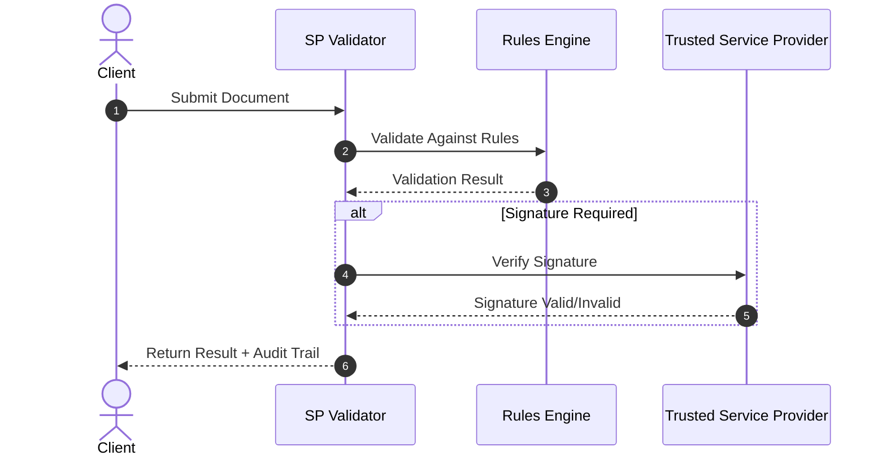

#### B. SP con Estrazione e Classificazione (SP02, SP07)
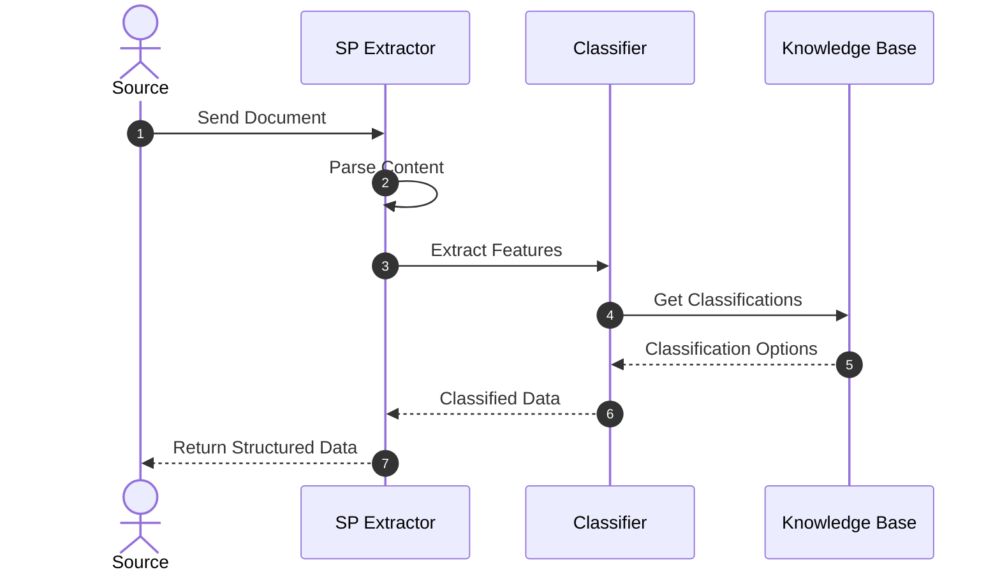

#### C. SP con Orchestrazione Workflow (SP09, SP15)
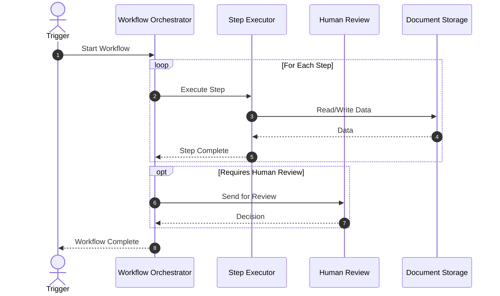

#### D. SP con Query/Search (SP12, SP52)
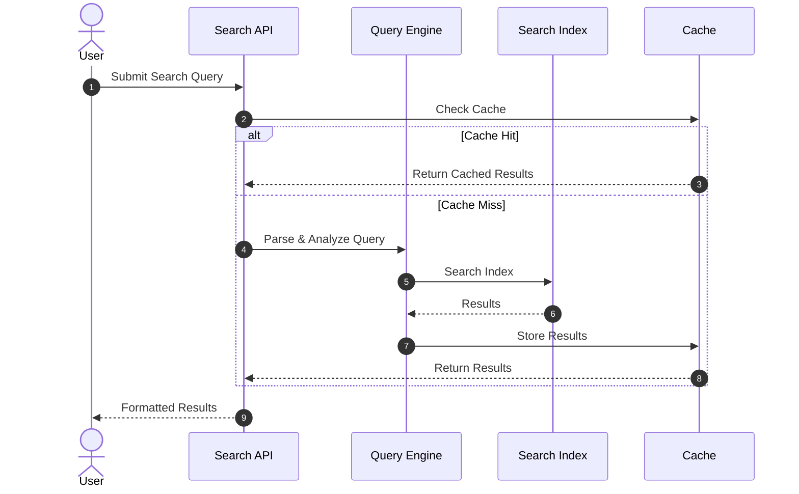

---

### 3. STATE DIAGRAM - Stati e Transizioni (Workflow-based SPs)

**Scopo**: Mostrare gli stati possibili di un'entità/documento/richiesta e come transiscono da uno stato all'altro

**Quando è obbligatorio**:
- ✅ SP con lifecycle complesso (SP01, SP02, SP05, SP09, SP15, SP29)
- ✅ SP con workflow di approvazione (SP03, SP06, SP08, SP42, SP50)
- ✅ SP con processamento asincrono

**Linee guida**:
- Stato iniziale: [*]
- Stato finale: [*]
- Transizioni: etichettate con trigger/evento
- Massimo 8-10 stati per diagramma
- Includi almeno uno stato di errore/fallimento

**Template Base**:

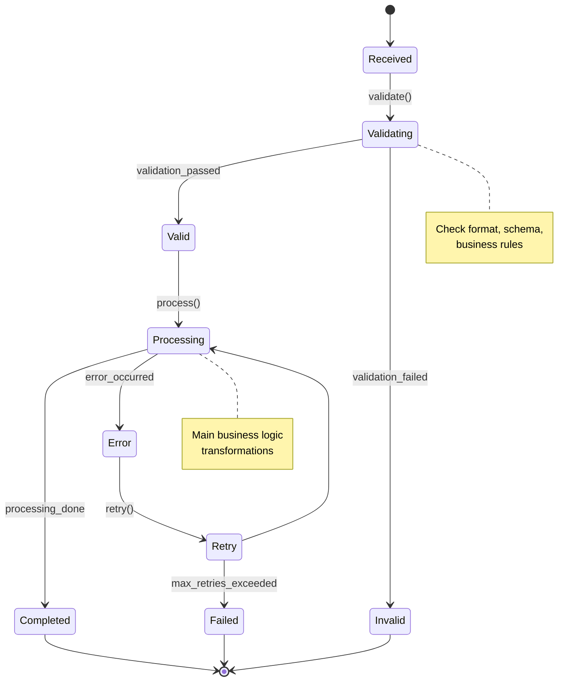

**Varianti per tipo di SP**:

#### A. SP con Email/Document Parsing (SP01, SP02)
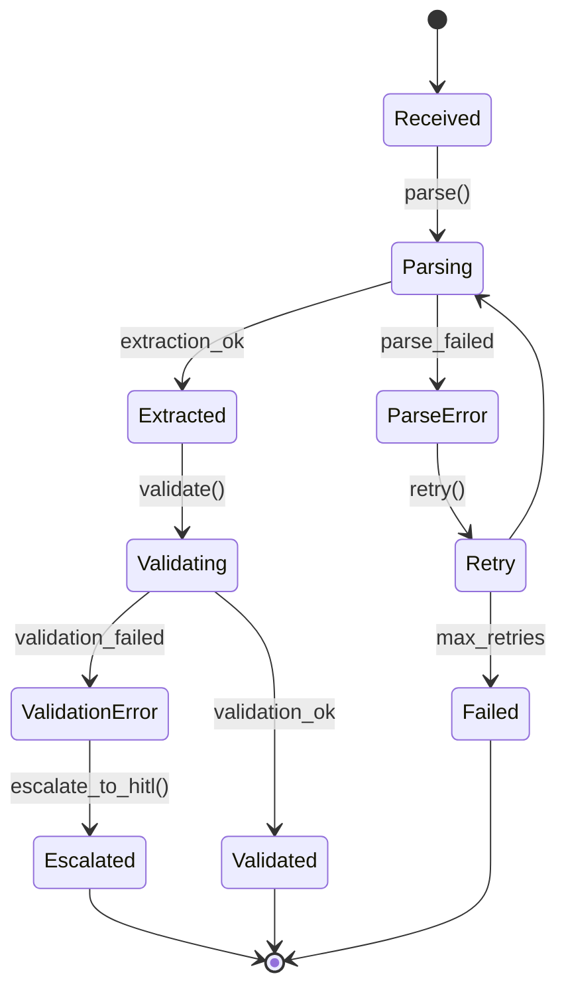

#### B. SP con Classificazione (SP03, SP07, SP16)
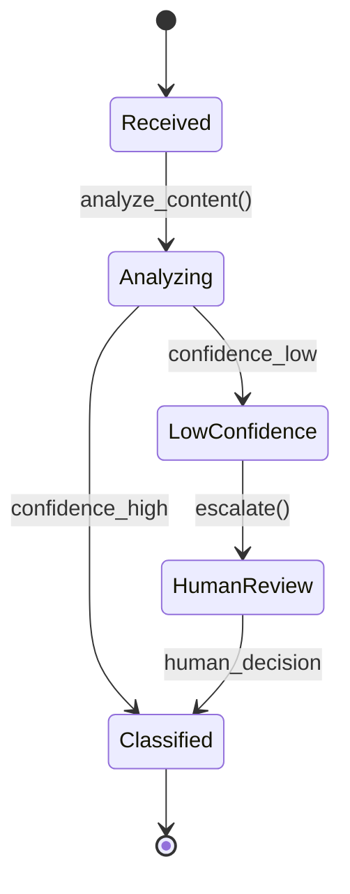

#### C. SP con Firma Digitale (SP29, SP31)
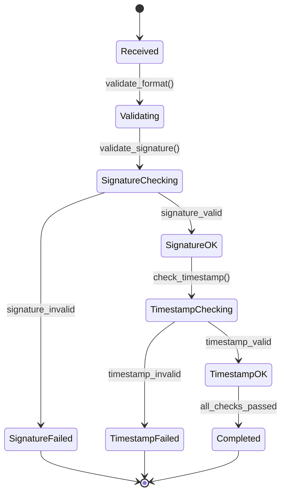

#### D. SP con Workflow Orchestrazione (SP09, SP15, SP19)
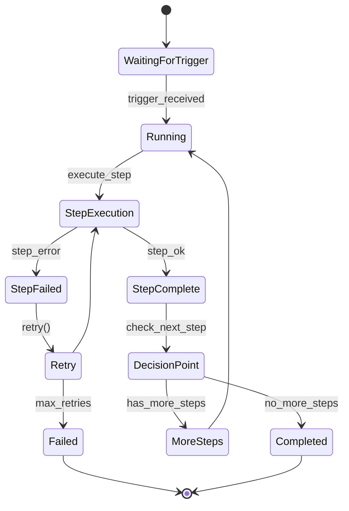

---

## Guida per Tipo di Diagramma

### Flowchart Checklist

- [ ] **Chiarezza**: Ogni nodo ha etichetta concisa (max 30 caratteri)
- [ ] **Completezza**: Include main path + error handling
- [ ] **Decisioni**: Tutti i diamond (decision points) sono etichettati
- [ ] **Stile**: Colori consistenti (blu=input, verde=success, rosso=error)
- [ ] **Complessità**: ≤ 15 nodi per diagramma
- [ ] **Leggibilità**: Massimo 2 livelli di profondità per rami

### Sequence Diagram Checklist

- [ ] **Autonumber**: Tutti i diagrammi hanno `autonumber` per tracciabilità
- [ ] **Attori**: Actor principale identificato (Client/User/System)
- [ ] **Partecipanti**: Max 5-6 partecipanti per diagramma
- [ ] **Etichettatura**: Ogni messaggio ha numero e descrizione
- [ ] **Nota**: Aggiunte note per logica complessa
- [ ] **Alternativa**: `alt` blocks per flussi condizionali
- [ ] **Loop**: `loop` blocks per iterazioni

### State Diagram Checklist

- [ ] **Inizio/Fine**: [*] marcati chiaramente
- [ ] **Transizioni**: Etichettate con evento/trigger
- [ ] **Completezza**: Tutti gli stati principali inclusi
- [ ] **Errori**: Almeno uno stato di errore/fallimento
- [ ] **Note**: Aggiunta note per stati critici
- [ ] **Coerenza**: Nomi stati in inglese (convenzione Mermaid)

---

## Best Practices e Convenzioni

### 1. Nomenclatura

**Componenti**:
- Usa nomi chiari e coerenti (es. "SP01 - Parser EML" non "parser")
- Per servizi esterni: prefisso "Ext. " (es. "Ext. SMTP Server")
- Per database: "DB - [Nome]" (es. "DB - Documents")
- Per cache: "Cache - [Tipo]" (es. "Cache - Redis")

**Transizioni/Azioni**:
- Usa verbi all'infinito (es. "validate()", "process()", non "validating")
- CamelCase per metodi/funzioni
- Per condizioni: snake_case (es. "validation_passed", "error_occurred")

### 2. Colori e Stile

**Flowchart**:
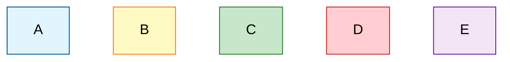

**Legenda**:
- **Blu** (`#e1f5ff`): Input/Start
- **Giallo** (`#fff9c4`): Processing
- **Verde** (`#c8e6c9`): Success
- **Rosso** (`#ffcdd2`): Error/Failure
- **Viola** (`#f3e5f5`): Decision/Branching

**Sequence & State**: Usa colori di default Mermaid (più leggibile)

### 3. Dimensione e Complessità

**Regola 1**: Un diagramma = un concetto
- Se hai più di 15 nodi (flowchart) → split in 2 diagrammi
- Se hai più di 10 interazioni (sequence) → split in 2 diagrammi
- Se hai più di 10 stati → split per fase

**Regola 2**: Mantieni il happy path visibile
- Posiziona il main flow al centro/alto
- Errori/edge cases a destra/basso
- Usa colori distintivi per branch secondary

### 4. Sincronizzazione Documentazione

Quando aggiorni un SP:
1. **Prima**: Aggiorna il diagramma in Mermaid
2. **Poi**: Aggiorna il testo della documentazione
3. **Infine**: Aggiorna la sezione Conformità (se impatta compliance)

Usa commenti nel codice Mermaid per documentare:
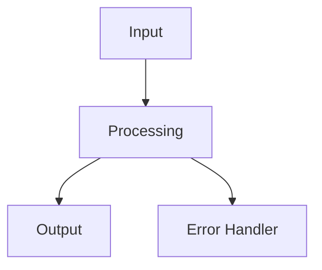

---

## Template Replicabili

### Template A: Estrazione e Classificazione (SP01, SP02, SP07)

#### Flowchart
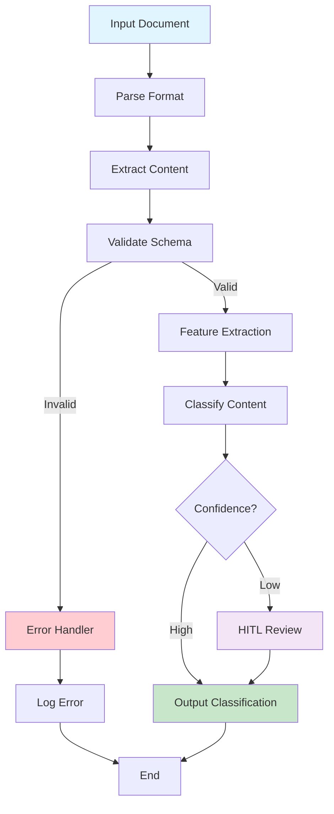

#### Sequence
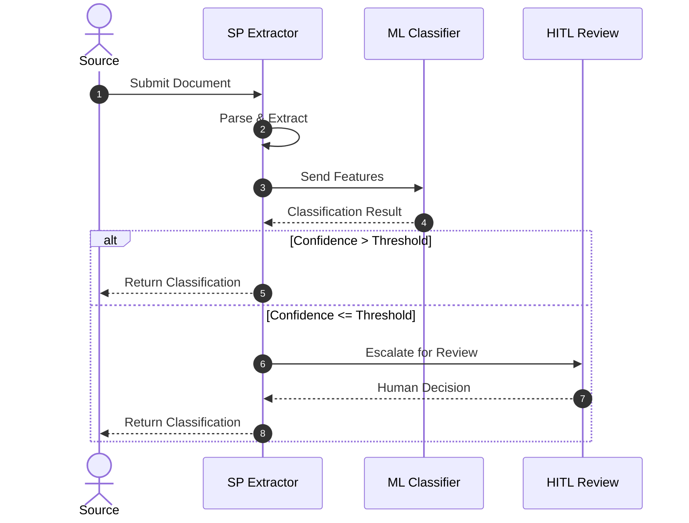

#### State
```mermaid
stateDiagram-v2
    [*] --> Received
    Received --> Parsing: parse()
    Parsing --> Extracted: extraction_ok
    Parsing --> ParseError: parse_failed

    ParseError --> [*]

    Extracted --> Classifying: classify()
    Classifying --> Classified: confidence_ok
    Classifying --> LowConfidence: confidence_low

    LowConfidence --> HumanReview: escalate()
    HumanReview --> Classified: human_decision

    Classified --> [*]
```

---

### Template B: Firma Digitale e Validazione (SP29, SP31, SP32)

#### Flowchart
```mermaid
flowchart TD
    A[Input Document] --> B[Validate Format]
    B -->|Valid| C[Check Signature]
    B -->|Invalid| D[Return Error]
    C -->|Present| E[Verify Signature]
    C -->|Missing| F[Sign Document]
    E -->|Valid| G[Check Timestamp]
    E -->|Invalid| D
    F --> G
    G -->|Valid| H[Output Signed Document]
    G -->|Invalid| I[Request Timestamp]
    I --> H
    D --> J[End]
    H --> J

    style A fill:#e1f5ff
    style H fill:#c8e6c9
    style D fill:#ffcdd2
```

#### Sequence
```mermaid
sequenceDiagram
    autonumber
    actor Client
    participant SP as SP Signature
    participant TSP as Trusted Service Provider
    participant TS as Timestamp Authority

    Client->>SP: Send Document
    SP->>TSP: Verify Signature Chain
    TSP-->>SP: Signature Status
    alt Signature Valid
        SP->>TS: Request Timestamp
        TS-->>SP: Timestamp
        SP-->>Client: Return Signed Document
    else Signature Invalid
        SP->>TSP: Request Re-signature
        TSP-->>SP: Re-signed Document
        SP-->>Client: Return Signed Document
    end
```

#### State
```mermaid
stateDiagram-v2
    [*] --> Received
    Received --> SignatureValidation: validate_signature()

    SignatureValidation --> SignatureOK: signature_valid
    SignatureValidation --> SignatureFailed: signature_invalid

    SignatureFailed --> [*]

    SignatureOK --> TimestampValidation: validate_timestamp()
    TimestampValidation --> TimestampOK: timestamp_valid
    TimestampValidation --> TimestampFailed: timestamp_invalid

    TimestampFailed --> RequestTimestamp: request_ts()
    RequestTimestamp --> TimestampOK

    TimestampOK --> [*]
```

---

### Template C: Orchestrazione Workflow (SP09, SP15, SP19)

#### Flowchart
```mermaid
flowchart TD
    A[Trigger Event] --> B[Load Workflow Definition]
    B --> C[Initialize Context]
    C --> D[Execute Step N]
    D --> E{Step Success?}
    E -->|Yes| F{More Steps?}
    E -->|No| G[Execute Error Handler]
    G --> H[Mark Failed]
    F -->|Yes| D
    F -->|No| I[Mark Completed]
    H --> J[End]
    I --> J

    style A fill:#e1f5ff
    style I fill:#c8e6c9
    style H fill:#ffcdd2
```

#### Sequence
```mermaid
sequenceDiagram
    autonumber
    actor Trigger
    participant Orchestrator as Workflow Orchestrator
    participant Engine as Step Executor
    participant Storage as Document Storage
    participant HITL as HITL Checkpoint

    Trigger->>Orchestrator: Start Workflow
    Orchestrator->>Storage: Load Workflow Definition
    Storage-->>Orchestrator: Definition
    loop For Each Step
        Orchestrator->>Engine: Execute Step
        Engine->>Storage: Read Input Data
        Storage-->>Engine: Data
        Engine->>Engine: Process
        Engine->>Storage: Write Output
        Storage-->>Engine: ACK
        Engine-->>Orchestrator: Step Complete
    end
    opt HITL Required
        Orchestrator->>HITL: Send for Review
        HITL-->>Orchestrator: Decision
    end
    Orchestrator-->>Trigger: Workflow Complete
```

#### State
```mermaid
stateDiagram-v2
    [*] --> WaitingForTrigger
    WaitingForTrigger --> Running: trigger_received

    Running --> StepExecution: execute_step
    StepExecution --> StepComplete: step_ok
    StepExecution --> StepFailed: step_error

    StepFailed --> Retry: retry()
    Retry --> StepExecution
    Retry --> Failed: max_retries_exceeded

    Failed --> [*]

    StepComplete --> MoreSteps: has_next_step()
    MoreSteps --> Running

    StepComplete --> Completed: no_more_steps()
    Completed --> [*]
```

---

### Template D: Conformità e Monitoring (SP42, SP44, SP50, SP70)

#### Flowchart
```mermaid
flowchart TD
    A[Check Trigger] --> B[Load Rules]
    B --> C[Extract Metrics]
    C --> D[Evaluate Rules]
    D --> E{Compliant?}
    E -->|Yes| F[Log Success]
    E -->|No| G[Generate Alert]
    F --> H[Update Audit Trail]
    G --> H
    H --> I[Schedule Next Check]
    I --> J[End]

    style A fill:#e1f5ff
    style F fill:#c8e6c9
    style G fill:#ffcdd2
    style I fill:#f3e5f5
```

#### Sequence
```mermaid
sequenceDiagram
    autonumber
    actor System
    participant Checker as Compliance Checker
    participant Rules as Rule Engine
    participant Storage as Audit Storage
    participant Alert as Alert System

    System->>Checker: Check Compliance
    Checker->>Rules: Load Active Rules
    Rules-->>Checker: Rules
    Checker->>Checker: Evaluate Against Rules
    alt Compliant
        Checker->>Storage: Log Success
        Storage-->>Checker: ACK
    else Non-Compliant
        Checker->>Alert: Generate Alert
        Alert-->>Checker: Alert ID
        Checker->>Storage: Log Violation
        Storage-->>Checker: ACK
    end
    Checker-->>System: Compliance Status
```

#### State
```mermaid
stateDiagram-v2
    [*] --> Checking
    Checking --> RuleEvaluation: load_rules()
    RuleEvaluation --> Compliant: all_rules_ok
    RuleEvaluation --> NonCompliant: rule_violation

    Compliant --> Logging: log_success()
    NonCompliant --> AlertGeneration: generate_alert()

    AlertGeneration --> Escalation: escalate_if_critical()
    Escalation --> Logging

    Logging --> [*]
```

---

## Validazione e Quality Assurance

### Checklist Pre-Merge

Prima di committare i diagrammi, verificare:

- [ ] **Sintassi**: Diagramma render correttamente (nessun errore rosso)
- [ ] **Leggibilità**: Testo visibile e comprensibile
- [ ] **Coerenza**: Nomenclatura allineata con il resto della documentazione
- [ ] **Completezza**: Tutti gli SP CRITICI hanno i 3 diagrammi
- [ ] **Dimensione**: Nessun diagramma > 15 nodi (flowchart) o 10 interazioni (sequence)
- [ ] **Documentazione**: Ogni diagramma ha spiegazione testuale
- [ ] **Link**: Tutti i riferimenti a servizi/componenti sono corretti
- [ ] **Conformità**: Diagrammi supportano le asserzioni nella sezione Conformità Normativa

### Script di Validazione

Creare script Python per validare Mermaid syntax:

```python
#!/usr/bin/env python3
"""Validate Mermaid diagram syntax in SP files."""

import re
from pathlib import Path

def validate_mermaid_blocks(file_path):
    """Check Mermaid syntax and structure."""
    content = Path(file_path).read_text(encoding='utf-8')
    blocks = re.findall(r'```mermaid\n(.*?)\n```', content, re.DOTALL)

    errors = []
    for i, block in enumerate(blocks, 1):
        # Check for common syntax errors
        if block.count('graph') + block.count('flowchart') + block.count('sequenceDiagram') + block.count('stateDiagram') == 0:
            errors.append(f"Block {i}: Missing diagram type")
        if '[*]' not in block and ('sequenceDiagram' not in block and 'flowchart' not in block):
            errors.append(f"Block {i}: State diagram missing [*]")

    return errors if errors else ["✓ All blocks valid"]

if __name__ == '__main__':
    import sys
    for file_path in sys.argv[1:]:
        errors = validate_mermaid_blocks(file_path)
        for error in errors:
            print(f"{file_path}: {error}")
```

### Metriche di Successo

| Metrica | Target | Validazione |
|---------|--------|-------------|
| Diagrammi per SP CRITICO | 3 (FC, Seq, State) | ✓ 100% |
| Nodi per Flowchart | ≤ 15 | ✓ Conteggio automatico |
| Interazioni per Sequence | ≤ 10 | ✓ Conteggio automatico |
| Stati per State Diagram | ≤ 10 | ✓ Conteggio automatico |
| Leggibilità Colori | ✓ Buona | ✓ Revisione manuale |
| Nomenclatura Consistente | ✓ SI | ✓ Regex check |
| Render Without Errors | ✓ 100% | ✓ GitHub preview |

---

## Appendice: Convenzioni Mermaid

### Sintassi Rapida Flowchart

```
A[Rettangolo] --> B{Diamond}
C["Testo con spazi"] --> D(Arrotondato)
E["Rettangolo stadio"] --> F["Testo <br/> multilinea"]
```

### Sintassi Rapida Sequence

```
participant A as Nome
A->>B: Messaggio sincrono
A-->>B: Messaggio asincrono (ritorno)
A-xB: Messaggio asincrono
note over A: Nota su A
note right of B: Nota a destra di B
```

### Sintassi Rapida State

```
state S1 {
    [*] --> A
    A --> B
    B --> [*]
}
A --> S1
S1 --> C
```

---

## File Versioning

| Versione | Data | Cambio | Author |
|----------|------|--------|--------|
| 1.0 | 2025-11-19 | Creazione template con 3 tipi di diagrammi, 4 varianti di template replicabili | Tech Writer |
| TBD | TBD | Aggiungere ulteriori varianti basate su feedback | TBD |

---

**Nota**: Questo template deve essere allineato con [GLOSSARIO-TERMINOLOGICO.md](GLOSSARIO-TERMINOLOGICO.md) e [TEMPLATE-CONFORMITA-NORMATIVA.md](TEMPLATE-CONFORMITA-NORMATIVA.md) per coerenza terminologica e strutturale.
