# 🏗️ ZenShareUp - Architettura Completa

## Indice

1. [Overview Architettura](#overview-architettura)
2. [Componenti Core](#componenti-core)
3. [Microservizi](#microservizi)
4. [Servizi di Supporto](#servizi-di-supporto)
5. [DTO e Data Model](#dto-e-data-model)
6. [Flussi Applicativi](#flussi-applicativi)
7. [Integrazione tra Servizi](#integrazione-tra-servizi)
8. [Sicurezza e Multi-tenancy](#sicurezza-e-multi-tenancy)

---

## Overview Architettura

ZenShareUp è una **piattaforma enterprise per la gestione documentale integrata** basata su un'architettura a **microservizi distribuiti**. Il sistema è progettato per supportare:

- **Gestione documentale completa** (creazione, versionamento, archiviazione)
- **Protocollazione informatica** (registrazione, tracciamento, repertori)
- **Automazione flussi** (workflow amministrativi e procedurali)
- **Comunicazioni email** (invio/ricezione con integrazione documentale)
- **Conformità normativa** (audit trail, legal archive, GDPR)
- **Multi-tenancy** (supporto per molteplici organizzazioni)
- **Integrazione SUAP** (Sportelli Unici delle Attività Produttive)

### Principi Architetturali

```mermaid
graph TB
    Client["👥 CLIENT APPLICATIONS<br/>(Web, Mobile, Desktop)"]
    Gateway["🚪 API GATEWAY<br/>msacloudgateway<br/>(Authentication)"]

    Client --> Gateway

    subgraph "Microservizi"
        Admin["👤 ZenAdmin<br/>25 DTOs"]
        Documents["📄 ZenDocuments<br/>65 DTOs"]
        Protocol["📋 ZenProtocollo<br/>29 DTOs"]
        Mailroom["📧 ZenMailroom<br/>13 DTOs"]
        Process["⚙️ ZenProcess<br/>24 DTOs"]
        Master["🏢 ZenMaster<br/>5 DTOs"]
        Suap["🏪 ZenSuap<br/>7 DTOs"]
        Scheduler["⏰ ZenScheduler<br/>1 DTO"]
    end

    Gateway --> Admin
    Gateway --> Documents
    Gateway --> Protocol
    Gateway --> Mailroom
    Gateway --> Process
    Gateway --> Master
    Gateway --> Suap
    Gateway --> Scheduler

    subgraph "Infrastructure"
        DB["🗄️ PostgreSQL<br/>(Multi-Tenant DB)"]
        Cache["⚡ Redis<br/>(Distributed Cache)"]
        Queue["📦 RabbitMQ<br/>(Event Bus)"]
        Storage["💾 SFTPGo<br/>(File Storage)"]
    end

    Admin --> DB
    Documents --> DB
    Protocol --> DB
    Mailroom --> DB
    Process --> DB
    Master --> DB
    Suap --> DB
    Scheduler --> DB

    Documents --> Cache
    Admin --> Cache

    Documents --> Queue
    Protocol --> Queue
    Mailroom --> Queue
    Scheduler --> Queue

    Documents --> Storage
    Mailroom --> Storage

    style Client fill:#e1f5ff,stroke:#01579b,stroke-width:2px
    style Gateway fill:#fff3e0,stroke:#e65100,stroke-width:2px
    style Admin fill:#f3e5f5,stroke:#4a148c,stroke-width:2px
    style Documents fill:#e8f5e9,stroke:#1b5e20,stroke-width:2px
    style Protocol fill:#fce4ec,stroke:#880e4f,stroke-width:2px
    style Mailroom fill:#ede7f6,stroke:#311b92,stroke-width:2px
    style Process fill:#fff8e1,stroke:#f57f17,stroke-width:2px
    style Master fill:#f1f8e9,stroke:#33691e,stroke-width:2px
    style Suap fill:#e0f2f1,stroke:#004d40,stroke-width:2px
    style Scheduler fill:#fbe9e7,stroke:#bf360c,stroke-width:2px
    style DB fill:#eceff1,stroke:#263238,stroke-width:2px
    style Cache fill:#fff1f0,stroke:#c62828,stroke-width:2px
    style Queue fill:#f0f4c3,stroke:#33691e,stroke-width:2px
    style Storage fill:#e3f2fd,stroke:#0d47a1,stroke-width:2px
```

---

## Componenti Core

### 1. API Gateway & Authentication

**Scopo**: Punto di ingresso unico per tutti i client, gestione autenticazione e autorizzazione

**Tecnologie**:
- OAuth 2.0 / OpenID Connect
- Keycloak (server di identità)
- JWT (JSON Web Tokens)

**Responsabilità**:
- Routing verso microservizi appropriati
- Validazione autenticazione
- Rate limiting
- CORS management
- API versioning


### 2. Database - PostgreSQL

**Scopo**: Persistenza dati per tutti i microservizi

**Caratteristiche**:
- Database relazionale centralizzato
- Schema multi-tenancy
- Supporto per JSON fields
- Full-text search
- Audit trails integrati

```mermaid
graph TB
    DB["🗄️ PostgreSQL<br/>(Central Database)"]

    subgraph "Tenant Isolation"
        TenantA["Tenant A<br/>(Roma)"]
        TenantB["Tenant B<br/>(Milano)"]
        TenantC["Tenant C<br/>(Company)"]
    end

    subgraph "Schemas"
        AdminSchema["👤 ADMIN<br/>users, groups, roles"]
        DocSchema["📄 DOCUMENTS<br/>docs, folders, versions"]
        ProtSchema["📋 PROTOCOL<br/>protocols, correspondents"]
        ProcSchema["⚙️ PROCESS<br/>procedures, tasks"]
        EmailSchema["📧 EMAIL<br/>params, logs"]
        ArchSchema["📦 ARCHIVE<br/>legal, retention"]
    end

    DB --> TenantA
    DB --> TenantB
    DB --> TenantC

    TenantA --> AdminSchema
    TenantA --> DocSchema
    TenantA --> ProtSchema
    TenantA --> ProcSchema
    TenantA --> EmailSchema
    TenantA --> ArchSchema

    style DB fill:#eceff1,stroke:#263238,stroke-width:3px
    style AdminSchema fill:#f3e5f5,stroke:#4a148c,stroke-width:2px
    style DocSchema fill:#e8f5e9,stroke:#1b5e20,stroke-width:2px
    style ProtSchema fill:#fce4ec,stroke:#880e4f,stroke-width:2px
    style ProcSchema fill:#fff8e1,stroke:#f57f17,stroke-width:2px
    style EmailSchema fill:#f1f8e9,stroke:#33691e,stroke-width:2px
    style ArchSchema fill:#e0f2f1,stroke:#004d40,stroke-width:2px
    style TenantA fill:#fff9c4,stroke:#f57f17,stroke-width:2px
    style TenantB fill:#fff9c4,stroke:#f57f17,stroke-width:2px
    style TenantC fill:#fff9c4,stroke:#f57f17,stroke-width:2px
```

### 3. Cache - Redis

```mermaid
graph LR
    Redis["⚡ Redis<br/>(Distributed Cache)"]

    Sessions["🔐 Sessions"]
    Lookups["📋 Lookups<br/>(Users, Groups)"]
    RateLimits["⏱️ Rate Limits"]
    Locks["🔒 Distributed Locks"]
    Temp["📝 Temp Data"]

    Redis --> Sessions
    Redis --> Lookups
    Redis --> RateLimits
    Redis --> Locks
    Redis --> Temp

    style Redis fill:#fff1f0,stroke:#c62828,stroke-width:2px
    style Sessions fill:#c8e6c9,stroke:#2e7d32,stroke-width:2px
    style Lookups fill:#bbdefb,stroke:#1565c0,stroke-width:2px
    style RateLimits fill:#ffe0b2,stroke:#e65100,stroke-width:2px
    style Locks fill:#f8bbd0,stroke:#c2185b,stroke-width:2px
    style Temp fill:#d1c4e9,stroke:#512da8,stroke-width:2px
```

### 4. Message Broker - RabbitMQ

```mermaid
graph TB
    RabbitMQ["📦 RabbitMQ<br/>(Event Bus)"]

    subgraph "Topics"
        DocTopic["documents.events"]
        ProtTopic["protocols.events"]
        WorkflowTopic["workflow.events"]
        EmailTopic["email.events"]
        ArchiveTopic["archive.events"]
    end

    subgraph "Publishers"
        DocPub["📄 ZenDocuments"]
        ProtPub["📋 ZenProtocollo"]
        WorkflowPub["⚙️ ZenProcess"]
        EmailPub["📧 ZenMailroom"]
    end

    subgraph "Consumers"
        DocConsumer["Indexer"]
        ProtConsumer["Archive Scheduler"]
        WorkflowConsumer["Notification Service"]
        EmailConsumer["Audit Service"]
    end

    RabbitMQ --> DocTopic
    RabbitMQ --> ProtTopic
    RabbitMQ --> WorkflowTopic
    RabbitMQ --> EmailTopic
    RabbitMQ --> ArchiveTopic

    DocPub --> RabbitMQ
    ProtPub --> RabbitMQ
    WorkflowPub --> RabbitMQ
    EmailPub --> RabbitMQ

    DocTopic --> DocConsumer
    ProtTopic --> ProtConsumer
    WorkflowTopic --> WorkflowConsumer
    EmailTopic --> EmailConsumer

    style RabbitMQ fill:#f0f4c3,stroke:#33691e,stroke-width:3px
    style DocPub fill:#e8f5e9,stroke:#1b5e20,stroke-width:2px
    style ProtPub fill:#fce4ec,stroke:#880e4f,stroke-width:2px
    style WorkflowPub fill:#fff8e1,stroke:#f57f17,stroke-width:2px
    style EmailPub fill:#f1f8e9,stroke:#33691e,stroke-width:2px
```

### 5. File Storage - SFTPGo

```mermaid
graph TB
    SFTPGo["💾 SFTPGo<br/>(File Storage)"]

    subgraph "Access Methods"
        SFTP["SFTP Access"]
        WebDAV["WebDAV Support"]
    end

    subgraph "Features"
        Backup["🔄 Auto Backup"]
        VirusCheck["🛡️ Virus Scanning"]
        Encrypt["🔐 Encryption"]
    end

    subgraph "Tenant Storage"
        Tenant1["Tenant A<br/>sftp/tenant-a/"]
        Tenant2["Tenant B<br/>sftp/tenant-b/"]
        Shared["Shared Resources"]
    end

    SFTPGo --> SFTP
    SFTPGo --> WebDAV
    SFTPGo --> Backup
    SFTPGo --> VirusCheck
    SFTPGo --> Encrypt

    SFTPGo --> Tenant1
    SFTPGo --> Tenant2
    SFTPGo --> Shared

    style SFTPGo fill:#e3f2fd,stroke:#0d47a1,stroke-width:2px
    style SFTP fill:#b3e5fc,stroke:#0277bd,stroke-width:2px
    style WebDAV fill:#b3e5fc,stroke:#0277bd,stroke-width:2px
    style Backup fill:#c8e6c9,stroke:#2e7d32,stroke-width:2px
    style VirusCheck fill:#ffccbc,stroke:#d84315,stroke-width:2px
    style Encrypt fill:#f8bbd0,stroke:#c2185b,stroke-width:2px
```

---

## Microservizi

### 1. ZenAdmin - User & Organization Management

```mermaid
graph TB
    ZenAdmin["👤 ZenAdmin<br/>(msazenadmin)"]

    subgraph "Entities"
        Users["👥 Users"]
        Groups["👨‍👩‍👧‍👦 Groups"]
        Companies["🏢 Companies"]
        Roles["🔐 Roles & Permissions"]
        AOO["🏛️ Protocol AOO"]
    end

    subgraph "DTOs - 25 files"
        UserDTO["UserDTO"]
        CompanyDTO["CompanyDTO"]
        GroupDTO["GroupDTO"]
        RoleDTO["RoleDTO"]
        NotifDTO["NotificationDTO"]
    end

    subgraph "Events"
        UserCreated["user.created"]
        UserUpdated["user.updated"]
        GroupUpdated["group.updated"]
    end

    ZenAdmin --> Users
    ZenAdmin --> Groups
    ZenAdmin --> Companies
    ZenAdmin --> Roles
    ZenAdmin --> AOO

    ZenAdmin --> UserDTO
    ZenAdmin --> CompanyDTO
    ZenAdmin --> GroupDTO
    ZenAdmin --> RoleDTO
    ZenAdmin --> NotifDTO

    ZenAdmin --> UserCreated
    ZenAdmin --> UserUpdated
    ZenAdmin --> GroupUpdated

    style ZenAdmin fill:#f3e5f5,stroke:#4a148c,stroke-width:3px
```

### 2. ZenDocuments - Document Lifecycle

```mermaid
graph TB
    ZenDocuments["📄 ZenDocuments<br/>(msazendocuments)"]

    subgraph "Lifecycle"
        Draft["📝 DRAFT"]
        Current["✅ CURRENT"]
        Deposit["📦 DEPOSIT"]
        Historical["📚 HISTORICAL"]
        Legal["⚖️ LEGAL ARCHIVE"]
    end

    subgraph "Core Entities"
        Documents["📄 Documents"]
        Folders["📁 Folders"]
        Versions["📑 Versions"]
        Metadata["🏷️ Metadata"]
        Models["🎨 Templates"]
        Assignment["📤 Smistamento"]
    end

    Draft --> Current
    Current --> Deposit
    Deposit --> Historical
    Historical --> Legal

    ZenDocuments --> Documents
    ZenDocuments --> Folders
    ZenDocuments --> Versions
    ZenDocuments --> Metadata
    ZenDocuments --> Models
    ZenDocuments --> Assignment

    style ZenDocuments fill:#e8f5e9,stroke:#1b5e20,stroke-width:3px
    style Draft fill:#fff9c4,stroke:#f57f17,stroke-width:2px
    style Current fill:#c8e6c9,stroke:#2e7d32,stroke-width:2px
    style Deposit fill:#b2dfdb,stroke:#004d40,stroke-width:2px
    style Historical fill:#cfd8dc,stroke:#455a64,stroke-width:2px
    style Legal fill:#f8bbd0,stroke:#c2185b,stroke-width:2px
```

### 3. ZenProtocollo - Protocol Registration

```mermaid
graph TB
    ZenProtocollo["📋 ZenProtocollo<br/>(msazenprotocollo)"]

    subgraph "Core Entities"
        Protocol["📋 Protocols"]
        Correspondents["👥 Correspondents"]
        Classification["📂 Classifications"]
        Registers["📖 Registers"]
    end

    subgraph "Features"
        Sequential["🔢 Sequential Numbers"]
        Confidential["🔒 Confidentiality Levels"]
        Emergency["🚨 Emergency Protocols"]
        SpecialReg["📜 Special Registers"]
    end

    subgraph "Events"
        RegEvent["protocol.registered"]
        UpdateEvent["protocol.updated"]
        CancelEvent["protocol.canceled"]
    end

    ZenProtocollo --> Protocol
    ZenProtocollo --> Correspondents
    ZenProtocollo --> Classification
    ZenProtocollo --> Registers

    Protocol --> Sequential
    Protocol --> Confidential
    Protocol --> Emergency
    Protocol --> SpecialReg

    ZenProtocollo --> RegEvent
    ZenProtocollo --> UpdateEvent
    ZenProtocollo --> CancelEvent

    style ZenProtocollo fill:#fce4ec,stroke:#880e4f,stroke-width:3px
```

### 4. ZenProcess - Workflow Automation

```mermaid
graph TB
    ZenProcess["⚙️ ZenProcess<br/>(msazenprocess)"]

    subgraph "Engine"
        Flowable["Flowable BPMN 2.0"]
        Tasks["User & Service Tasks"]
        Gateway["Gateways"]
    end

    subgraph "Entities"
        Procedures["📋 Administrative Procedures"]
        Forms["📝 Web Forms"]
        Variables["📊 Process Variables"]
    end

    subgraph "Example Flow"
        Task1["Task: Submit Application"]
        Task2["Task: Officer Review"]
        Task3["Approval/Rejection"]
    end

    ZenProcess --> Flowable
    ZenProcess --> Tasks
    ZenProcess --> Gateway
    ZenProcess --> Procedures
    ZenProcess --> Forms
    ZenProcess --> Variables

    Flowable --> Task1
    Flowable --> Task2
    Flowable --> Task3

    style ZenProcess fill:#fff8e1,stroke:#f57f17,stroke-width:3px
    style Flowable fill:#ffe082,stroke:#f57f17,stroke-width:2px
```

### 5. ZenMailroom - Email Integration

```mermaid
graph LR
    External["📧 External Sender"]
    ZenMailroom["📧 ZenMailroom<br/>(msazenmailroom)"]

    subgraph "Reception"
        IMAP["IMAP Polling"]
        Parse["Email Parse"]
        Attach["Download Attachments"]
    end

    subgraph "Sending"
        SMTP["SMTP/PEC"]
        Template["Templates"]
        Sign["Signatures"]
    end

    subgraph "Integration"
        CreateDoc["Create Document"]
        RegProtocol["Register Protocol"]
        Route["Route/Assign"]
    end

    External -->|Email + Attach| ZenMailroom
    ZenMailroom --> IMAP
    ZenMailroom --> SMTP

    IMAP --> Parse
    Parse --> Attach
    Attach --> CreateDoc
    CreateDoc --> RegProtocol
    RegProtocol --> Route

    SMTP --> Template
    SMTP --> Sign

    style ZenMailroom fill:#f1f8e9,stroke:#33691e,stroke-width:3px
    style External fill:#ffecb3,stroke:#f57f17,stroke-width:2px
```

### 6. ZenMaster - Multi-Tenancy Management

```mermaid
graph TB
    ZenMaster["🏢 ZenMaster<br/>(msazenmaster)"]

    subgraph "Tenant Configuration"
        Tenant1["🏛️ Tenant A<br/>Comune di Roma<br/>License: Enterprise"]
        Tenant2["🏛️ Tenant B<br/>Comune di Milano<br/>License: Professional"]
        Tenant3["🏛️ Tenant C<br/>Private Company<br/>License: Starter"]
    end

    subgraph "License Management"
        Users["👥 User Seats"]
        Features["✨ Features Enabled"]
        Expiry["⏰ Expiration"]
    end

    ZenMaster --> Tenant1
    ZenMaster --> Tenant2
    ZenMaster --> Tenant3

    Tenant1 --> Users
    Tenant1 --> Features
    Tenant1 --> Expiry

    style ZenMaster fill:#e0f2f1,stroke:#004d40,stroke-width:3px
    style Tenant1 fill:#b2dfdb,stroke:#004d40,stroke-width:2px
    style Tenant2 fill:#b2dfdb,stroke:#004d40,stroke-width:2px
    style Tenant3 fill:#b2dfdb,stroke:#004d40,stroke-width:2px
```

### 7. ZenSuap - SUAP Integration

```mermaid
graph LR
    ZenShareUp["ZenShareUp"]
    ZenSuap["🏪 ZenSuap<br/>(msazensuap)"]
    SUAP["SUAP<br/>Backoffice"]

    ZenShareUp -->|Integration Request| ZenSuap
    ZenSuap -->|Transform & Send| SUAP
    SUAP -->|Response| ZenSuap
    ZenSuap -->|Update Document| ZenShareUp

    style ZenShareUp fill:#f3e5f5,stroke:#4a148c,stroke-width:2px
    style ZenSuap fill:#e0f2f1,stroke:#004d40,stroke-width:2px
    style SUAP fill:#fff9c4,stroke:#f57f17,stroke-width:2px
```

### 8. ZenScheduler - Task Scheduling

```mermaid
graph TB
    ZenScheduler["⏰ ZenScheduler<br/>(zenscheduler)"]

    subgraph "Scheduled Tasks"
        Archive["📦 Document Archival"]
        Email["📧 Email Polling"]
        Cleanup["🧹 Workflow Cleanup"]
        Protocol["📋 Protocol Deadlines"]
        Cache["⚡ Cache Invalidation"]
        Backup["💾 Backup & Maintenance"]
        Reports["📊 Report Generation"]
    end

    ZenScheduler --> Archive
    ZenScheduler --> Email
    ZenScheduler --> Cleanup
    ZenScheduler --> Protocol
    ZenScheduler --> Cache
    ZenScheduler --> Backup
    ZenScheduler --> Reports

    style ZenScheduler fill:#fbe9e7,stroke:#bf360c,stroke-width:3px
```

---

## DTO e Data Model

### DTO Hierarchy Completa


---

## Flussi Applicativi

### Flusso 1: Creazione e Protocollazione di Documento

```mermaid
sequenceDiagram
    participant User as 👤 User
    participant Web as 🌐 Web App
    participant ZenDocs as 📄 ZenDocuments
    participant ZenProt as 📋 ZenProtocollo
    participant Queue as 📦 RabbitMQ
    participant Scheduler as ⏰ Scheduler

    User->>Web: Upload documento
    Web->>ZenDocs: POST /documents
    ZenDocs->>ZenDocs: Save file in SFTPGo
    ZenDocs-->>Web: DocumentDTO
    Web-->>User: ✅ Documento salvato

    User->>Web: Assegna documento
    Web->>ZenDocs: POST /documents/{id}/assign
    ZenDocs->>ZenDocs: Create assignment
    ZenDocs-->>Web: ✅ Assegnato

    User->>Web: Approva documento
    Web->>ZenDocs: POST /documents/{id}/approve
    ZenDocs->>ZenDocs: Update status
    ZenDocs->>Queue: document.approved event
    ZenDocs-->>Web: ✅ Approvato

    User->>Web: Registra protocollo
    Web->>ZenProt: POST /protocols/register
    ZenProt->>ZenDocs: Verify document exists
    ZenDocs-->>ZenProt: ✅ Document found
    ZenProt->>ZenProt: Generate protocol #
    ZenProt->>ZenProt: Save protocol
    ZenProt->>Queue: protocol.registered event
    ZenProt-->>Web: ProtocolDTO (numero 2024/001)
    Web-->>User: ✅ Protocollo registrato

    Queue->>Scheduler: protocol.registered event
    Scheduler->>Scheduler: Schedule archive task
    Scheduler->>ZenDocs: Update document
    ZenDocs->>ZenDocs: Link to protocol
```

### Flusso 2: Ricezione Email e Auto-registrazione

```mermaid
sequenceDiagram
    participant Sender as 📧 External Sender
    participant Mail as 📧 Mail Server
    participant ZenMail as 📧 ZenMailroom
    participant ZenDocs as 📄 ZenDocuments
    participant ZenProt as 📋 ZenProtocollo
    participant Queue as 📦 RabbitMQ
    participant User as 👤 Officer

    Sender->>Mail: Send email + attachments

    Note over ZenMail: Every 5 minutes polling

    ZenMail->>Mail: IMAP Poll
    Mail-->>ZenMail: New email
    ZenMail->>ZenMail: Parse email
    ZenMail->>ZenMail: Download attachments

    ZenMail->>ZenDocs: POST /documents
    ZenDocs->>ZenDocs: Create document
    ZenDocs->>ZenDocs: Store in SFTPGo
    ZenDocs-->>ZenMail: DocumentDTO

    ZenMail->>ZenProt: POST /protocols/register
    ZenProt->>ZenProt: Type: INPUT
    ZenProt->>ZenProt: Generate protocol #
    ZenProt-->>ZenMail: ProtocolDTO

    ZenMail->>Queue: document.created event
    ZenMail->>Queue: protocol.registered event

    Queue->>User: 🔔 Notification email
    User-->>User: ✅ See new document in inbox
```

### Flusso 3: Workflow Amministrativo

```mermaid
graph TB
    Start["👤 Citizen<br/>Submits Application"]

    Start --> CreateProcess["1️⃣ Create Process<br/>ZenProcess"]
    CreateProcess --> FormSubmit["2️⃣ User Task<br/>Submit Application<br/>(Web Form)"]

    FormSubmit --> ValidateTask["3️⃣ Service Task<br/>Validate<br/>(Auto)"]

    ValidateTask -->|Invalid| NotifyReject["Notify: Data Error<br/>Return to Step 2"]
    NotifyReject --> FormSubmit

    ValidateTask -->|Valid| ReviewTask["4️⃣ User Task<br/>Officer Review<br/>(Form + Decision)"]

    ReviewTask -->|Approve| ApproveDecision["✅ APPROVED"]
    ReviewTask -->|Reject| RejectDecision["❌ REJECTED"]
    ReviewTask -->|Request Info| InfoRequest["❓ REQUEST_INFO<br/>(10 day deadline)"]

    ApproveDecision --> SendLetter["Send Authorization Letter<br/>Register OUTPUT protocol"]
    RejectDecision --> SendRejection["Send Rejection Notice<br/>Allow Appeal"]
    InfoRequest --> WaitResponse["Wait for Response"]
    WaitResponse -->|Response| FormSubmit
    WaitResponse -->|No Response| AutoReject["Auto-REJECT"]

    SendLetter --> Archive["Archive Decision"]
    SendRejection --> Archive
    AutoReject --> Archive
    Archive --> End["Process Closed"]

    style Start fill:#e3f2fd,stroke:#0d47a1,stroke-width:2px
    style CreateProcess fill:#fff8e1,stroke:#f57f17,stroke-width:2px
    style FormSubmit fill:#c8e6c9,stroke:#2e7d32,stroke-width:2px
    style ValidateTask fill:#f8bbd0,stroke:#c2185b,stroke-width:2px
    style ReviewTask fill:#c8e6c9,stroke:#2e7d32,stroke-width:2px
    style ApproveDecision fill:#c8e6c9,stroke:#2e7d32,stroke-width:2px
    style RejectDecision fill:#ffccbc,stroke:#d84315,stroke-width:2px
    style End fill:#b2dfdb,stroke:#004d40,stroke-width:2px
```

---

## Integrazione tra Servizi

### Service-to-Service Communication

```mermaid
graph TB
    ZenProt["📋 ZenProtocollo<br/>Needs document info"]
    ZenDocs["📄 ZenDocuments"]
    Keycloak["🔐 Keycloak"]

    ZenProt -->|REST API Call<br/>GET /documents/id| ZenDocs
    ZenDocs -->|JWT Validation| Keycloak
    Keycloak -->|Token Valid| ZenDocs
    ZenDocs -->|Return DocumentDTO<br/>with metadata| ZenProt

    style ZenProt fill:#fce4ec,stroke:#880e4f,stroke-width:2px
    style ZenDocs fill:#e8f5e9,stroke:#1b5e20,stroke-width:2px
    style Keycloak fill:#fff3e0,stroke:#e65100,stroke-width:2px
```

**Communication Characteristics:**
- 🔄 **Type**: Synchronous (blocking call)
- 🔐 **Authentication**: Server-to-server JWT validation via Keycloak
- ⏱️ **Timeout**: 5 second timeout per request
- 🔁 **Retry Strategy**: 2x retry with exponential backoff
- 🛑 **Resilience**: Circuit breaker pattern (open after 5 consecutive failures)

### Event-Based Async Communication

```mermaid
graph TB
    ZenDocs["📄 ZenDocuments<br/>(Publisher)"]

    ZenDocs -->|Publish Event<br/>document.created| Exchange["📦 RabbitMQ<br/>Exchange<br/>(documents.topic)"]

    Exchange --> Queue1["Queue 1<br/>documents.protocol"]
    Exchange --> Queue2["Queue 2<br/>documents.email"]
    Exchange --> Queue3["Queue 3<br/>documents.search"]
    Exchange --> Queue4["Queue 4<br/>documents.audit"]

    Queue1 -->|Consume| ZenProt["📋 ZenProtocollo<br/>(Register as protocol)"]
    Queue2 -->|Consume| ZenMail["📧 ZenMailroom<br/>(Send notification)"]
    Queue3 -->|Consume| Indexer["🔍 Indexer<br/>(Full-text search)"]
    Queue4 -->|Consume| AuditSvc["📊 Audit Service<br/>(Compliance)"]

    style ZenDocs fill:#e8f5e9,stroke:#1b5e20,stroke-width:2px
    style Exchange fill:#f0f4c3,stroke:#33691e,stroke-width:3px
    style Queue1 fill:#fff9c4,stroke:#f57f17,stroke-width:2px
    style Queue2 fill:#fff9c4,stroke:#f57f17,stroke-width:2px
    style Queue3 fill:#fff9c4,stroke:#f57f17,stroke-width:2px
    style Queue4 fill:#fff9c4,stroke:#f57f17,stroke-width:2px
    style ZenProt fill:#fce4ec,stroke:#880e4f,stroke-width:2px
    style ZenMail fill:#f1f8e9,stroke:#33691e,stroke-width:2px
    style Indexer fill:#e0f2f1,stroke:#004d40,stroke-width:2px
    style AuditSvc fill:#ede7f6,stroke:#311b92,stroke-width:2px
```

---

## Sicurezza e Multi-tenancy

### Multi-Tenancy Architecture

```mermaid
graph TB
    Request["📥 Client Request<br/>(with JWT token)"]

    Request -->|Extract tenant_id| Gateway["🚪 API Gateway"]

    Gateway -->|tenant_id: 'tenant_A'| Router["Routing Decision"]

    Router -->|PostgreSQL| DB_A["🗄️ PostgreSQL<br/>Tenant A Database"]
    Router -->|Redis key prefix| Cache_A["⚡ Redis<br/>tenant_A:*"]
    Router -->|SFTP folder| Storage_A["💾 SFTPGo<br/>sftp/tenant-a/"]
    Router -->|Queue prefix| Queue_A["📦 RabbitMQ<br/>tenant_A.events"]

    subgraph "Isolation Level"
        IsoData["✅ Complete Data Isolation"]
        IsoStorage["✅ File Segregation"]
        IsoBusiness["✅ Business Logic Separation"]
    end

    Router --> IsoData
    Router --> IsoStorage
    Router --> IsoBusiness

    subgraph "Result"
        UserA["User A<br/>sees only<br/>Tenant A data"]
        UserB["User B<br/>sees only<br/>Tenant B data"]
    end

    DB_A --> UserA
    Cache_A --> UserA
    Storage_A --> UserA
    Queue_A --> UserA

    style Request fill:#e3f2fd,stroke:#0d47a1,stroke-width:2px
    style Gateway fill:#f3e5f5,stroke:#4a148c,stroke-width:2px
    style Router fill:#fff3e0,stroke:#e65100,stroke-width:2px
    style DB_A fill:#eceff1,stroke:#263238,stroke-width:2px
    style Cache_A fill:#fff1f0,stroke:#c62828,stroke-width:2px
    style Storage_A fill:#e3f2fd,stroke:#0d47a1,stroke-width:2px
    style Queue_A fill:#f0f4c3,stroke:#33691e,stroke-width:2px
```

### Security Layers

```mermaid
graph TB
    Layer1["🛡️ LAYER 1: Perimeter<br/>TLS/HTTPS, CORS, WAF<br/>DDoS Protection"]
    Layer2["🔐 LAYER 2: Authentication<br/>OAuth 2.0, JWT<br/>Multi-factor Auth"]
    Layer3["🔑 LAYER 3: Authorization<br/>RBAC, Role Hierarchy<br/>Permission Model"]
    Layer4["🔒 LAYER 4: Data Security<br/>Encryption at rest<br/>Encrypted in transit"]
    Layer5["📋 LAYER 5: Audit<br/>Audit trail, createdBy/modifiedBy<br/>Event logging"]
    Layer6["🔍 LAYER 6: API Security<br/>Input validation<br/>SQL injection prevention"]

    Layer1 --> Layer2
    Layer2 --> Layer3
    Layer3 --> Layer4
    Layer4 --> Layer5
    Layer5 --> Layer6

    style Layer1 fill:#ffcdd2,stroke:#c62828,stroke-width:2px
    style Layer2 fill:#f8bbd0,stroke:#c2185b,stroke-width:2px
    style Layer3 fill:#f5c6b8,stroke:#d84315,stroke-width:2px
    style Layer4 fill:#ffccbc,stroke:#e64a19,stroke-width:2px
    style Layer5 fill:#ffe0b2,stroke:#e65100,stroke-width:2px
    style Layer6 fill:#fff9c4,stroke:#f57f17,stroke-width:2px
```

---

## Deployment Architecture

```mermaid
graph TB
    LB["⚖️ Load Balancer<br/>nginx / HAProxy<br/>TLS Termination"]

    LB --> Gateway["🚪 API Gateway<br/>(msacloudgateway)<br/>replicas: 2"]
    LB --> Keycloak["🔐 Keycloak<br/>replicas: 2"]

    subgraph "Service Mesh (Istio)"
        Admin["👤 ZenAdmin<br/>replicas: 1"]
        Documents["📄 ZenDocuments<br/>replicas: 3"]
        Protocol["📋 ZenProtocollo<br/>replicas: 2"]
        Mailroom["📧 ZenMailroom<br/>replicas: 2"]
        Process["⚙️ ZenProcess<br/>replicas: 1"]
        Master["🏢 ZenMaster<br/>replicas: 1"]
        Scheduler["⏰ Scheduler<br/>replicas: 1"]
    end

    subgraph "StatefulSet"
        PostgreSQL["🗄️ PostgreSQL<br/>Primary + Standby"]
        Redis["⚡ Redis<br/>Master + Replicas"]
        RabbitMQ["📦 RabbitMQ<br/>Cluster"]
        SFTPGo["💾 SFTPGo<br/>Replicated"]
    end

    Gateway --> Admin
    Gateway --> Documents
    Gateway --> Protocol
    Gateway --> Mailroom
    Gateway --> Process
    Gateway --> Master
    Gateway --> Scheduler

    Admin --> PostgreSQL
    Documents --> PostgreSQL
    Protocol --> PostgreSQL
    Mailroom --> PostgreSQL
    Process --> PostgreSQL
    Master --> PostgreSQL
    Scheduler --> PostgreSQL

    Documents --> Redis
    Admin --> Redis

    Documents --> RabbitMQ
    Protocol --> RabbitMQ
    Mailroom --> RabbitMQ
    Process --> RabbitMQ

    Documents --> SFTPGo
    Mailroom --> SFTPGo

    style LB fill:#fff3e0,stroke:#e65100,stroke-width:2px
    style Gateway fill:#f3e5f5,stroke:#4a148c,stroke-width:2px
    style Keycloak fill:#fff3e0,stroke:#e65100,stroke-width:2px
    style PostgreSQL fill:#eceff1,stroke:#263238,stroke-width:2px
    style Redis fill:#fff1f0,stroke:#c62828,stroke-width:2px
    style RabbitMQ fill:#f0f4c3,stroke:#33691e,stroke-width:2px
    style SFTPGo fill:#e3f2fd,stroke:#0d47a1,stroke-width:2px
```

---

## Conclusione

ZenShareUp è una piattaforma enterprise **moderna, scalabile e sicura** per la gestione documentale integrata.

**Punti di Forza**:
- ✅ Architettura a microservizi decoupled
- ✅ Comunicazione asincrona via eventi
- ✅ Multi-tenancy nativa
- ✅ Compliance normativo (audit trail, legal archive)
- ✅ Scalabilità orizzontale
- ✅ Alta disponibilità e disaster recovery
- ✅ Security by design

**Componenti Chiave**:
1. **API Gateway** - Autenticazione e routing
2. **8 Microservizi** - Funzionalità specifiche
3. **PostgreSQL** - Persistenza dati
4. **Redis** - Cache distribuito
5. **RabbitMQ** - Event bus asincrono
6. **SFTPGo** - Storage documentale
7. **Keycloak** - Identity management

Questa architettura supporta la gestione di **centinaia di migliaia di documenti** con **conformità normativa italiana** e **protezione dati GDPR**.
