# ZenShareUp ↔ ZenIA: Architettura di Integrazione

**Documento**: Mappatura completa dei flussi di integrazione tra ZenShareUp e ZenIA
**Data**: 20 novembre 2025
**Status**: DEFINITIVA
**Versione**: 1.0

---

## Indice

1. [Visione d'Insieme](#visione-dinsieme)
2. [Architettura di Integrazione](#architettura-di-integrazione)
3. [Flussi Documentali Principali](#flussi-documentali-principali)
4. [Mapping Microservizi ZenIA](#mapping-microservizi-zenia)
5. [Input/Output per Microservizio](#inputoutput-per-microservizio)
6. [Protocolli di Comunicazione](#protocolli-di-comunicazione)
7. [Workflow End-to-End](#workflow-end-to-end)
8. [Dati Scambiati](#dati-scambiati)
9. [Gestione Errori e Fallback](#gestione-errori-e-fallback)
10. [Performance e SLA](#performance-e-sla)

---

## Visione d'Insieme

### Ruoli Funzionali

```mermaid
graph LR
    ZS["🗄️ ZenShareUp<br/>(Document Storage & Management)"]
    ZIA["🧠 ZenIA<br/>(Intelligent Processing)"]

    ZS -->|📤 Invia Documenti<br/>per Elaborazione| ZIA
    ZIA -->|📥 Ritorna Risultati<br/>Arricchiti| ZS

    style ZS fill:#e3f2fd,stroke:#1976d2,stroke-width:3px
    style ZIA fill:#f3e5f5,stroke:#7b1fa2,stroke-width:3px
```



**ZenShareUp** è il **repository centralized** di gestione documentale:
- Archiviazione persistente dei documenti
- Gestione del ciclo di vita (creazione, modifica, archivio)
- Multi-tenancy e isolamento dei dati
- Audit trail e compliance

**ZenIA** è il **motore intelligente** di elaborazione:
- Classificazione automatica dei documenti
- Validazione e trasformazione contenuti
- Estrazione intelligente di metadati
- Ottimizzazione e arricchimento dati
- Orchestrazione di processi complessi

### Relazione Fondamentale

ZenShareUp fornisce i **dati grezzi** (raw documents), ZenIA li **processa intelligentemente** e ritorna i **risultati arricchiti** (enriched metadata, classifications, transformations) a ZenShareUp per la memorizzazione e l'utilizzo nei workflow successivi.

---

## Architettura di Integrazione

### Topologia Generale


### Punti di Integrazione Critici

| Componente | Ruolo | Protocollo | Frequenza |
|-----------|-------|-----------|-----------|
| **MS11-GATEWAY** | Porta d'ingresso | REST/gRPC | Sincrono |
| **Message Broker** | Async communication | RabbitMQ AMQP | Asincrono |
| **Cache Layer** | Result sharing | Redis Pub/Sub | Real-time |
| **Database Layer** | Data persistence | PostgreSQL | Transazionale |

---

## Flussi Documentali Principali

### 1. Flusso di Classificazione Automatica

Quando ZenShareUp riceve un nuovo documento, lo invia a ZenIA per classificazione intelligente.


**Input da ZenShareUp:**
- `documentId`: Identificatore univoco
- `fileHash`: SHA-256 per integrità
- `metadata`: Nome, dimensione, tipo MIME, data caricamento
- `tenantId`: Identificatore tenant per isolamento

**Output da ZenIA:**
- `classificationId`: UUID della classificazione
- `documentType`: Tipo riconosciuto (Fattura, Contratto, etc.)
- `confidence`: Score 0.0-1.0
- `labels`: Array di categorie
- `processingTime`: Millisecondi impiegati

---

### 2. Flusso di Validazione e Trasformazione


**Input da ZenShareUp:**
- `documentId`: Identificatore del documento
- `format`: Formato attuale (PDF, DOCX, etc.)
- `rules`: Set di regole di validazione
- `targetFormat`: Formato di destinazione desiderato

**Output da ZenIA:**
- `validationStatus`: VALID / INVALID
- `errors`: Array dettagliato di errori
- `transformedFileId`: ID del file trasformato
- `enrichedMetadata`: Metadati estratti e normalizzati

---

### 3. Flusso di Orchestrazione Completa


---

## Mapping Microservizi ZenIA

### Tabella Riepilogativa

| MS | Nome | Ruolo | Input da | Output a |
|----|------|-------|----------|----------|
| **MS01** | Classifier | Classificazione documenti | ZenShareUp | MS03, CACHE |
| **MS02** | Analyzer | Analisi e estrazione | MS03 | MS06 |
| **MS03** | Orchestrator | Coordinamento workflow | MS11 | MS01-02, MS04-07 |
| **MS04** | Validator | Validazione struttura | MS03 | MS05, CACHE |
| **MS05** | Transformer | Trasformazione formato | MS04 | MS06, CACHE |
| **MS06** | Aggregator | Aggregazione risultati | MS05, MS02 | MS07, DB |
| **MS07** | Distributor | Distribuzione output | MS06 | ZenShareUp |
| **MS08** | Monitor | Monitoraggio esecuzione | Tutti | Logging, Alerts |
| **MS09** | Manager | Gestione risorse | Tutti | Resource allocation |
| **MS10** | Logger | Logging centralizzato | Tutti | Audit trail |
| **MS11** | Gateway | Ingresso richieste | ZenShareUp | MS03 |
| **MS12** | Cache | Caching distribuito | Tutti | Tutti |
| **MS13** | Security | Sicurezza e encryption | Tutti | Tutti |
| **MS14** | Audit | Audit trail | Tutti | Database |
| **MS15** | Config | Gestione configurazioni | Tutti | Tutti |
| **MS16** | Registry | Service registry | Tutti | Tutti |

---

## Input/Output per Microservizio

### MS01 - Classifier

**Input da ZenShareUp:**
```json
{
  "documentId": "doc_uuid_12345",
  "tenantId": "tenant_001",
  "fileHash": "sha256_value",
  "fileName": "fattura_2025_001.pdf",
  "fileMimeType": "application/pdf",
  "fileSize": 245000,
  "uploadedAt": "2025-11-20T10:30:00Z",
  "metadata": {
    "source": "email_gateway",
    "sender": "cliente@azienda.it"
  }
}
```

**Output a ZenShareUp:**
```json
{
  "classificationId": "cls_uuid_67890",
  "documentId": "doc_uuid_12345",
  "classification": {
    "primaryType": "INVOICE",
    "secondaryTypes": ["FINANCIAL_DOCUMENT"],
    "confidence": 0.98,
    "model": "ml_classifier_v2.3",
    "processingTime": 245
  },
  "metadata": {
    "language": "it-IT",
    "keyTerms": ["fattura", "importo", "cliente"],
    "entities": {
      "amount": "1,500.00€",
      "currency": "EUR",
      "invoiceNumber": "2025-001"
    }
  },
  "routing": {
    "nextService": "MS04-VALIDATOR",
    "priority": "NORMAL",
    "workflowId": "wf_invoice_processing"
  }
}
```

### MS02 - Analyzer

**Input da MS03 Orchestrator:**
```json
{
  "documentId": "doc_uuid_12345",
  "classificationId": "cls_uuid_67890",
  "analysisType": "FULL_EXTRACTION",
  "options": {
    "extractText": true,
    "extractTables": true,
    "extractImages": true,
    "performOCR": false,
    "identifyEntities": true
  }
}
```

**Output a MS06:**
```json
{
  "analysisId": "ana_uuid_11111",
  "documentId": "doc_uuid_12345",
  "extractedContent": {
    "text": "Full text content...",
    "tables": [{ "id": "tbl_001", "rows": 5, "columns": 3 }],
    "images": [{ "id": "img_001", "format": "png", "size": 5000 }]
  },
  "entities": {
    "person": ["Mario Rossi"],
    "organization": ["Azienda SPA"],
    "location": ["Milano"],
    "amounts": [{ "value": 1500, "currency": "EUR" }]
  },
  "summary": "Document analysis complete with 98% accuracy",
  "processingTime": 1250
}
```

### MS03 - Orchestrator

**Input da MS11:**
```json
{
  "requestId": "req_uuid_22222",
  "documentId": "doc_uuid_12345",
  "classificationId": "cls_uuid_67890",
  "workflowType": "STANDARD_DOCUMENT_PROCESSING",
  "priority": "NORMAL",
  "options": {
    "parallelProcessing": true,
    "validateStructure": true,
    "transformFormat": true,
    "enrichMetadata": true
  }
}
```

**Output:**
- Coordina l'esecuzione di MS01, MS02, MS04-05
- Gestisce la sequenza logica basata su regole di business
- Ritorna a MS11 lo stato dell'orchestrazione

### MS04 - Validator

**Input da MS03:**
```json
{
  "documentId": "doc_uuid_12345",
  "classificationId": "cls_uuid_67890",
  "validationRules": [
    { "rule": "PDF_STRUCTURE", "severity": "CRITICAL" },
    { "rule": "SIGNATURE_INTEGRITY", "severity": "HIGH" },
    { "rule": "COMPLIANCE_CAD", "severity": "HIGH" }
  ],
  "documentType": "INVOICE"
}
```

**Output a MS05:**
```json
{
  "validationId": "val_uuid_33333",
  "documentId": "doc_uuid_12345",
  "validationStatus": "VALID",
  "results": [
    {
      "rule": "PDF_STRUCTURE",
      "passed": true,
      "message": "PDF structure is valid"
    },
    {
      "rule": "SIGNATURE_INTEGRITY",
      "passed": true,
      "certificateId": "cert_xyz"
    },
    {
      "rule": "COMPLIANCE_CAD",
      "passed": true,
      "complianceLevel": "FULL"
    }
  ],
  "processingTime": 530
}
```

### MS05 - Transformer

**Input da MS04:**
```json
{
  "documentId": "doc_uuid_12345",
  "validationId": "val_uuid_33333",
  "transformationRules": {
    "sourceFormat": "PDF",
    "targetFormat": "PDF_OPTIMIZED",
    "actions": [
      "COMPRESS_IMAGES",
      "NORMALIZE_FONTS",
      "REMOVE_METADATA_ARTIFACTS"
    ]
  }
}
```

**Output a MS06:**
```json
{
  "transformationId": "tra_uuid_44444",
  "documentId": "doc_uuid_12345",
  "originalFormat": "PDF",
  "transformedFormat": "PDF_OPTIMIZED",
  "transformedFileId": "file_uuid_transformed",
  "metadata": {
    "originalSize": 245000,
    "transformedSize": 156000,
    "compressionRatio": 0.636,
    "processingTime": 875
  },
  "status": "SUCCESS"
}
```

### MS06 - Aggregator

**Input da MS05 e MS02:**
```json
{
  "documentId": "doc_uuid_12345",
  "transformationId": "tra_uuid_44444",
  "analysisId": "ana_uuid_11111",
  "classificationId": "cls_uuid_67890",
  "validationId": "val_uuid_33333"
}
```

**Output a MS07:**
```json
{
  "aggregationId": "agg_uuid_55555",
  "documentId": "doc_uuid_12345",
  "enrichedDocument": {
    "classification": { "primaryType": "INVOICE", "confidence": 0.98 },
    "analysis": { "entities": [...], "summary": "..." },
    "validation": { "status": "VALID", "complianceLevel": "FULL" },
    "transformation": { "format": "PDF_OPTIMIZED", "size": 156000 },
    "metadata": {
      "processedAt": "2025-11-20T10:32:15Z",
      "totalProcessingTime": 3820,
      "servicesInvolved": 5
    }
  }
}
```

### MS07 - Distributor

**Input da MS06:**
```json
{
  "aggregationId": "agg_uuid_55555",
  "documentId": "doc_uuid_12345",
  "enrichedDocument": { ... },
  "targetRepository": "zenshareup_documents"
}
```

**Output a ZenShareUp:**
```json
{
  "distributionId": "dis_uuid_66666",
  "documentId": "doc_uuid_12345",
  "status": "READY_FOR_STORAGE",
  "enrichedData": {
    "classification": { ... },
    "analysis": { ... },
    "validation": { ... },
    "transformation": { ... }
  },
  "storageInstructions": {
    "location": "s3://zenshareup/documents/doc_uuid_12345",
    "metadata": "postgresql://documents_metadata",
    "ttl": null
  }
}
```

---

## Protocolli di Comunicazione

### REST/HTTP (Sincrono)

Utilizzato per le integrazioni critiche e request/response immediati.

**Header comuni:**
```
Authorization: Bearer {JWT_TOKEN}
X-Tenant-ID: {tenant_001}
X-Request-ID: {uuid}
X-Correlation-ID: {uuid}
Content-Type: application/json
```

**Endpoint MS11 Gateway:**
```
POST /api/v1/documents/classify
POST /api/v1/documents/validate
POST /api/v1/documents/transform
POST /api/v1/workflows/orchestrate
GET  /api/v1/documents/{id}/status
```

### RabbitMQ (Asincrono)

Per l'elaborazione batch e le operazioni non critiche.

**Exchange principali:**
- `zenaia.documents.topic` - Topic exchange per distribuzione documenti
- `zenaia.tasks.work` - Work queue per task asincroni
- `zenaia.results.fanout` - Fanout per broadcast risultati

**Binding:**
```
documents.created → MS01, MS03
validation.completed → MS05, MS06
transformation.ready → MS07
processing.error → MS08, MS10
```

### Redis Pub/Sub (Real-time)

Per cache distribuita e notifiche real-time.

**Canali:**
- `zenshareup:document:{id}:classification` - Notifiche classificazione
- `zenshareup:document:{id}:status` - Aggiornamenti stato
- `zenaia:cache:invalidate` - Invalidamento cache

---

## Workflow End-to-End

### Scenario: Ricezione email con allegato documento


---

## Dati Scambiati

### Struttura Documento Arricchito

Quando un documento torna da ZenIA a ZenShareUp, contiene:

```json
{
  "documentId": "doc_uuid_12345",
  "tenantId": "tenant_001",
  "originalMetadata": {
    "fileName": "fattura_2025_001.pdf",
    "fileSize": 245000,
    "uploadedAt": "2025-11-20T10:30:00Z"
  },
  "enrichedMetadata": {
    "classification": {
      "primaryType": "INVOICE",
      "confidence": 0.98,
      "processingTime": 245
    },
    "validation": {
      "status": "VALID",
      "complianceLevel": "CAD_COMPLIANT",
      "signatureVerified": true
    },
    "analysis": {
      "extractedEntities": {
        "invoiceNumber": "2025-001",
        "amount": "1,500.00€",
        "customer": "Mario Rossi"
      },
      "keyTerms": ["fattura", "importo", "cliente"]
    },
    "transformation": {
      "originalFormat": "PDF",
      "transformedFormat": "PDF_OPTIMIZED",
      "compressionRatio": 0.636,
      "transformedFileId": "file_uuid_transformed"
    }
  },
  "processingMetadata": {
    "workflowId": "wf_invoice_processing",
    "totalProcessingTime": 3820,
    "servicesInvolved": 5,
    "completedAt": "2025-11-20T10:32:15Z"
  }
}
```

### Volumi di Dati

| Operazione | Dimensione Media | Throughput |
|-----------|------------------|-----------|
| Documento (raw) | 250 KB | 1200 doc/sec |
| Metadati classificazione | 2 KB | Inline |
| Analisi completa | 50 KB | 200 ana/sec |
| Risultati aggregati | 75 KB | 150 agg/sec |

---

## Gestione Errori e Fallback

### Strategie di Resilienza


### Circuit Breaker Pattern

```
Service Health: MS01 Classifier
├─ Success Rate: 99.2%
├─ Latency p95: 245ms
├─ Timeout Rate: 0.8%
└─ Circuit Status: CLOSED ✅

If:
  - Success Rate < 95% OR
  - Error Count > 100 in 1 minute OR
  - Latency p95 > 5000ms
Then:
  → OPEN circuit (reject requests)
  → Alert ops team
  → Route to fallback service
```

### Timeout e Retry

```json
{
  "classification": {
    "timeout": 5000,
    "retries": 2,
    "backoff": "exponential",
    "fallback": "manual_review_queue"
  },
  "validation": {
    "timeout": 10000,
    "retries": 1,
    "backoff": "linear",
    "fallback": "return_error"
  },
  "transformation": {
    "timeout": 15000,
    "retries": 3,
    "backoff": "exponential",
    "fallback": "keep_original_format"
  }
}
```

---

## Performance e SLA

### Service Level Agreement (SLA)


### Metriche per Microservizio

| Microservizio | Latenza p95 | Throughput | Availability | SLA |
|---------------|-------------|-----------|--------------|-----|
| MS01 Classifier | 245ms | 1200/sec | 99.97% | ✅ |
| MS02 Analyzer | 1250ms | 200/sec | 99.95% | ✅ |
| MS03 Orchestrator | 100ms | 2000/sec | 99.99% | ✅ |
| MS04 Validator | 530ms | 800/sec | 99.96% | ✅ |
| MS05 Transformer | 875ms | 500/sec | 99.94% | ✅ |
| MS06 Aggregator | 250ms | 1500/sec | 99.97% | ✅ |
| MS07 Distributor | 150ms | 2000/sec | 99.98% | ✅ |

### Monitoraggio e Alerting

**Metriche chiave monitorate:**
- 📊 Request latency distribution (p50, p95, p99)
- 📊 Error rate per service (% of failed requests)
- 📊 Queue depth (pending documents in processing)
- 📊 Resource utilization (CPU, Memory, Network)
- 📊 Cache hit ratio (% of cached responses)
- 📊 End-to-end processing time per document

**Alert triggers:**
```yaml
Alerts:
  - name: HighErrorRate
    condition: error_rate > 5%
    duration: 5m
    severity: CRITICAL

  - name: HighLatency
    condition: latency_p95 > 2000ms
    duration: 10m
    severity: WARNING

  - name: QueueBacklog
    condition: queue_depth > 10000
    duration: 5m
    severity: WARNING

  - name: ServiceDown
    condition: health_check_failed
    duration: 1m
    severity: CRITICAL
```

---

## Conclusioni

L'integrazione ZenShareUp ↔ ZenIA crea un ecosistema documentale completo:

1. **ZenShareUp** fornisce il **repository centralizzato** e la **gestione del ciclo di vita**
2. **ZenIA** fornisce l'**intelligenza artificiale** per l'elaborazione automatica
3. **Infrastruttura condivisa** garantisce **sicurezza, performance e scalabilità**

Questa architettura consente:
- ✅ Elaborazione automatica dei documenti
- ✅ Classificazione intelligente con ML
- ✅ Validazione e trasformazione standardizzate
- ✅ Arricchimento semantico dei dati
- ✅ Compliance garantito (CAD, GDPR, eIDAS)
- ✅ Performance enterprise (99.95% SLA)

L'aggiornamento graduale della documentazione permetterà di evidenziare ulteriormente questi collegamenti e facilitare l'adozione congiunta delle due piattaforme.

---

**Documento generato**: 20 novembre 2025
**Versione**: 1.0 - DEFINITIVA
**Prossimo aggiornamento**: Quando nuovi microservizi saranno integrati
