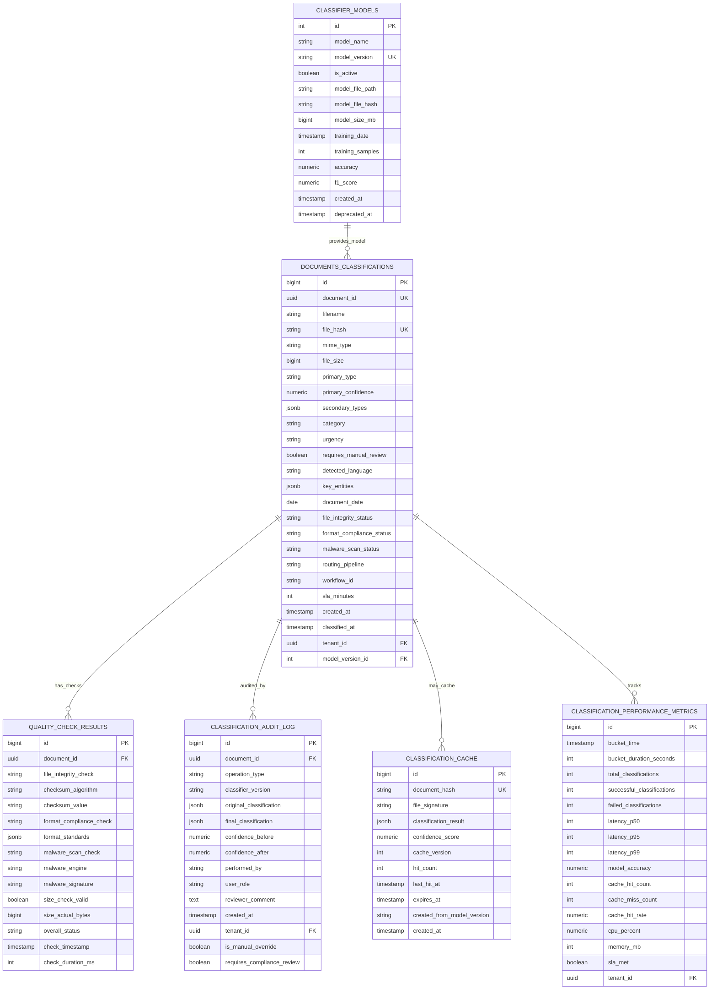

# MS01 - Schema Database Classificatore

**Navigazione**: [← API.md](API.md) | [DATABASE-SCHEMA](DATABASE-SCHEMA.md) | [TROUBLESHOOTING →](TROUBLESHOOTING.md)

## Indice

1. [Panoramica](#panoramica)
2. [Connessione al Database](#connessione-al-database)
3. [Diagramma Relazionale Entità](#diagramma-relazionale-entità)
4. [Descrizioni delle Tabelle](#descrizioni-delle-tabelle)
5. [Strategia di Indicizzazione](#strategia-di-indicizzazione)
6. [Caratteristiche di Prestazione](#caratteristiche-di-prestazione)
7. [Backup e Ripristino](#backup-e-ripristino)
8. [Politiche di Conservazione dei Dati](#politiche-di-conservazione-dei-dati)

---

## Panoramica
MS01 utilizza PostgreSQL per l'archiviazione persistente dei risultati di classificazione, metadati del modello e tracce di audit.

## Connessione al Database
```
Host: postgres.namespace
Port: 5432
Database: zenia_classifier
User: classifier_service
SSL: Required
```

See [init-schema.sql](init-schema.sql) for complete DDL scripts.

[↑ Torna al Indice](#indice)

---

## Diagramma Relazionale Entità



[↑ Torna al Indice](#indice)

---

## Descrizioni delle Tabelle

### CLASSIFIER_MODELS
Versioni del modello ML e relative metriche di prestazione.

**Scopo**: Tracciare le versioni del modello classificatore, l'accuratezza, lo stato di distribuzione e il ciclo di vita.

**Campi Principali**:
- `model_version`: Identificatore univoco (es. "v2.1")
- `is_active`: Solo un modello attivo consentito
- `accuracy`, `f1_score`: Metriche di prestazione del modello
- `deployed_at`, `deprecated_at`: Tracciamento del ciclo di vita

**Indici**:
- `idx_active_models` (is_active DESC, model_version DESC)
- `idx_version` (model_version)

---

### DOCUMENTS_CLASSIFICATIONS
Risultati di classificazione principale e metadati del documento.

**Scopo**: Memorizzare i risultati della classificazione per ogni documento elaborato.

**Campi Principali**:
- `document_id`: Identificatore univoco per documento
- `primary_type`: Classificazione principale (es. "fattura")
- `primary_confidence`: Punteggio 0.0-1.0
- `secondary_types`: Array JSONB di classificazioni alternative
- `model_version_id`: Chiave esterna al modello attivo

**Indici**:
- `idx_tenant_created` (tenant_id, created_at DESC) - Isolamento tenant + cronologia
- `idx_document_id` (document_id) - Ricerca diretta
- `idx_primary_type` (primary_type) - Distribuzione classificazione
- `idx_workflow_id` (workflow_id) - Analisi instradamento flusso di lavoro

---

### CLASSIFICATION_CACHE
Cache ad alte prestazioni per classificazioni frequenti.

**Scopo**: Memorizzare in cache i risultati della classificazione per ridurre il calcolo (TTL: 24 ore).

**Campi Principali**:
- `document_hash`: SHA256 del contenuto del documento
- `classification_result`: Risultato memorizzato in cache JSONB
- `expires_at`: Timestamp di scadenza della cache
- `hit_count`: Statistiche di utilizzo

**Indici**:
- `idx_expires` (expires_at) - Query di pulizia
- `idx_document_hash` (document_hash) - Hit della cache
- `idx_hit_count` (hit_count DESC) - Risultati più popolari

---

### CLASSIFICATION_AUDIT_LOG
Traccia di audit dettagliata per tutte le operazioni di classificazione (immutabile).

**Scopo**: Tracciare tutte le operazioni di classificazione per conformità e debug.

**Campi Principali**:
- `operation_type`: CLASSIFY, OVERRIDE, VERIFY, REVIEW
- `original_classification`: Risultato ML iniziale
- `final_classification`: Risultato finale dopo revisione
- `is_manual_override`: Vero se corretto dall'uomo

**Indici**:
- `idx_document_id` (document_id) - Cronologia documento
- `idx_created_at` (created_at DESC) - Operazioni recenti
- `idx_tenant_id` (tenant_id) - Tracce di audit tenant

---

### QUALITY_CHECK_RESULTS
Risultati dettagliati dai controlli di sicurezza, formato e integrità.

**Scopo**: Memorizzare i risultati dei controlli di sicurezza (malware, conformità formato, integrità).

**Campi Principali**:
- `file_integrity_check`: PASS, FAIL, WARNING
- `format_compliance_check`: Validazione ISO/IEC
- `malware_scan_check`: CLEAN, INFECTED, SUSPECT
- `overall_status`: PASS, FAIL, WARNING

**Indici**:
- `idx_document_id` (document_id) - Controlli documento
- `idx_timestamp` (check_timestamp DESC) - Controlli recenti

---

### CLASSIFICATION_PERFORMANCE_METRICS
Tracciamento delle prestazioni in tempo reale e monitoraggio SLA.

**Scopo**: Tracciare le metriche di prestazione in bucket di 5 minuti per il monitoraggio e gli avvisi.

**Campi Principali**:
- `bucket_time`: Bucket temporale (intervalli di 5 minuti)
- `latency_p50`, `latency_p95`, `latency_p99`: Percentili di latenza
- `cache_hit_rate`: Efficacia della cache
- `sla_met`: Flag di conformità SLA

**Indici**:
- `idx_bucket_time` (bucket_time DESC) - Query serie temporali
- `idx_tenant_metrics` (tenant_id, bucket_time DESC) - Metriche tenant

---

## Esempi di Payload Database

### Tabella: DOCUMENTS_CLASSIFICATIONS - Insert Record

Quando un documento viene classificato, viene creato un record come questo:

```sql
INSERT INTO documents_classifications (
  document_id, filename, file_hash, mime_type, file_size,
  primary_type, primary_confidence, secondary_types,
  category, urgency, requires_manual_review,
  detected_language, key_entities, document_date,
  file_integrity_status, format_compliance_status,
  malware_scan_status, routing_pipeline, workflow_id,
  sla_minutes, created_at, classified_at,
  tenant_id, model_version_id
) VALUES (
  'doc-2024-11-18-001',
  'FATTURA-2024-11-15-ACME.pdf',
  'sha256:a1b2c3d4e5f6g7h8i9j0k1l2m3n4o5p6',
  'application/pdf',
  245632,
  'invoice',
  0.97,
  '[{"type":"procurement_document","confidence":0.88},{"type":"financial_document","confidence":0.82}]',
  'financial',
  'normal',
  false,
  'it',
  '{"vendor_name":"ACME Corp","invoice_number":"2024-11-15","amount":"2450.00","currency":"EUR"}',
  '2024-11-15'::date,
  'PASS',
  'PASS',
  'CLEAN',
  'SP03-PROCEDURAL-CLASSIFIER',
  'UC5-INVOICE-PROCESSING',
  15,
  NOW(),
  NOW(),
  'tenant-001',
  1
);
```

**Output da SELECT**:
```
 id  | document_id             | filename                      | primary_type | primary_confidence
-----|-------------------------|-------------------------------|--------------|------------------
  42 | doc-2024-11-18-001      | FATTURA-2024-11-15-ACME.pdf  | invoice      | 0.97
```

---

### Tabella: CLASSIFICATION_CACHE - Redis Lookup

Quando una classificazione viene cacheata in Redis, la struttura è:

```json
{
  "key": "doc:hash:sha256:a1b2c3d4e5f6g7h8i9j0k1l2m3n4o5p6",
  "value": {
    "document_id": "doc-2024-11-18-001",
    "file_hash": "sha256:a1b2c3d4e5f6g7h8i9j0k1l2m3n4o5p6",
    "classification_result": {
      "primary_type": "invoice",
      "primary_confidence": 0.97,
      "category": "financial"
    },
    "created_at": "2024-11-18T10:15:45Z",
    "expires_at": "2024-11-19T10:15:45Z",
    "hit_count": 5
  },
  "ttl": 86400
}
```

**Operazione Redis**:
```redis
GET doc:hash:sha256:a1b2c3d4e5f6g7h8i9j0k1l2m3n4o5p6
```
Result: {classification_result with cache hit info}
```

EXPIRE key 86400  # 24 hours TTL
```

---

## [Auto-generated heading level 2]
### Tabella: CLASSIFICATION_AUDIT_LOG - Registrazione Operazioni

Ogni operazione di classificazione viene loggata per audit:

```sql
INSERT INTO classification_audit_log (
  document_id, operation_type, classifier_version,
  original_classification, final_classification,
  confidence_before, confidence_after,
  performed_by, user_role, reviewer_comment,
  created_at, tenant_id, is_manual_override,
  requires_compliance_review
) VALUES (
  'doc-2024-11-18-001',
  'CLASSIFY',
  'v2.1',
  '{"type":"invoice","confidence":0.97}',
  '{"type":"invoice","confidence":0.97}',
  0.97,
  0.97,
  'system:ml-classifier',
  'automation',
  'Automatic classification by ML model',
  NOW(),
  'tenant-001',
  false,
  false
);
```

**Caso con Override Manuale**:
```sql
INSERT INTO classification_audit_log (
  document_id, operation_type, classifier_version,
  original_classification, final_classification,
  confidence_before, confidence_after,
  performed_by, user_role, reviewer_comment,
  created_at, tenant_id, is_manual_override,
  requires_compliance_review
) VALUES (
  'doc-2024-11-18-002',
  'OVERRIDE',
  'v2.1',
  '{"type":"contract","confidence":0.58}',
  '{"type":"contract","confidence":1.0}',
  0.58,
  1.0,
  'reviewer@company.com',
  'document_classifier',
  'Manual review: Confirmed as Supplier Agreement',
  NOW(),
  'tenant-001',
  true,
  false
);
```

---

### Tabella: QUALITY_CHECK_RESULTS - Risultati Validazione

Quando un documento passa i controlli di qualità:

```sql
INSERT INTO quality_check_results (
  document_id, file_integrity_check, checksum_algorithm,
  checksum_value, format_compliance_check,
  format_standards, malware_scan_check,
  malware_engine, malware_signature,
  size_check_valid, size_actual_bytes,
  overall_status, check_timestamp, check_duration_ms
) VALUES (
  'doc-2024-11-18-001',
  'PASS',
  'SHA256',
  'a1b2c3d4e5f6g7h8i9j0k1l2m3n4o5p6',
  'PASS',
  '["ISO/IEC 32000", "PDF/A-1b"]',
  'CLEAN',
  'ClamAV',
  NULL,
  true,
  245632,
  'PASS',
  NOW(),
  324
);
```

---

### Tabella: CLASSIFICATION_PERFORMANCE_METRICS - Metriche 5 Minuti

Aggregato ogni 5 minuti per il monitoraggio:

```sql
INSERT INTO classification_performance_metrics (
  bucket_time, bucket_duration_seconds,
  total_classifications, successful_classifications,
  failed_classifications,
  latency_p50, latency_p95, latency_p99,
  model_accuracy, cache_hit_count, cache_miss_count,
  cache_hit_rate, cpu_percent, memory_mb,
  sla_met, tenant_id
) VALUES (
  '2024-11-18T10:35:00Z'::timestamp,
  300,
  150,
  148,
  2,
  250,
  420,
  480,
  0.945,
  98,
  52,
  0.653,
  45.2,
  1024,
  true,
  'tenant-001'
);
```

**Query di Lettura per Dashboard**:
```sql
SELECT
  bucket_time,
  total_classifications,
  latency_p95,
  cache_hit_rate,
  model_accuracy,
  sla_met
FROM classification_performance_metrics
WHERE tenant_id = 'tenant-001'
  AND bucket_time > NOW() - INTERVAL '24 hours'
ORDER BY bucket_time DESC;
```

---

### Tabella: CLASSIFIER_MODELS - Versioni Modello

Ciclo di vita di un modello ML:

```sql
-- Deployare nuovo modello v2.2
INSERT INTO classifier_models (
  model_name, model_version, is_active,
  model_file_path, model_file_hash,
  model_size_mb, training_date,
  training_samples, accuracy, f1_score,
  created_at, deprecated_at
) VALUES (
  'document-classifier',
  'v2.2',
  false,  -- Inattivo inizialmente
  '/models/document-classifier-v2.2.pkl',
  'hash:xyz789...',
  512,
  '2024-11-15'::date,
  50000,
  0.952,
  0.948,
  NOW(),
  NULL
);

-- Attivare v2.2 dopo test A/B
UPDATE classifier_models SET is_active = true
WHERE model_version = 'v2.2' AND model_name = 'document-classifier';

-- Disattivare v2.1
UPDATE classifier_models SET
  is_active = false,
  deprecated_at = NOW()
WHERE model_version = 'v2.1' AND model_name = 'document-classifier';

-- Verificare modello attivo
SELECT model_version, accuracy, f1_score, created_at
FROM classifier_models
WHERE model_name = 'document-classifier'
  AND is_active = true;
```

---

## Strategia di Indicizzazione

### Query Critiche per le Prestazioni

| Pattern di Query | Indice | Tempo Est. |
|---------------|-------|-----------|
| Ottieni classificazione documento | `idx_document_id` | < 10ms |
| Cronologia classificazione per tenant | `idx_tenant_created` | < 50ms |
| Ricerca cache per hash | `idx_document_hash` | < 5ms |
| Registri di audit recenti | `idx_created_at` | < 50ms |
| Distribuzione classificazione | `idx_primary_type` | < 100ms |
| Instradamento flusso di lavoro | `idx_workflow_id` | < 50ms |

[↑ Torna al Indice](#indice)

---

## Caratteristiche di Prestazione

| Operazione | Latenza | Note |
|-----------|---------|-------|
| Ricerca classificazione singola | < 10ms | Ricerca indice |
| Hit della cache | < 5ms | Supportato da Redis |
| Recupero traccia di audit | < 50ms | Query intervallo indicizzato |
| Cambio modello | < 20ms | Applicazione vincolo UNIQUE |
| Inserimento batch (1000) | < 500ms | Ottimizzazione batch |

[↑ Torna al Indice](#indice)

---

## Backup e Ripristino

### Strategia di Backup
- **Frequenza**: Incrementale orario, backup completo giornaliero
- **Conservazione**: 30 giorni
- **Crittografia**: AES-256 a riposo
- **Ridondanza**: Replica multi-regione

### Procedure di Ripristino
1. **Ripristino point-in-time** < 24 ore tramite WAL
2. **Ripristino registro di audit** per verifica conformità
3. **Rollback modello** tramite campo classifier_models.deprecated_at

[↑ Torna al Indice](#indice)

---

## Politiche di Conservazione dei Dati

| Tabella | Conservazione | Archiviazione |
|-------|-----------|----------|
| documents_classifications | 5 anni | S3 dopo 2 anni |
| classification_audit_log | 7 anni (conformità) | Archiviazione immutabile |
| classification_cache | 24 ore (TTL) | Non archiviato |
| quality_check_results | 5 anni | S3 dopo 2 anni |
| classification_performance_metrics | 2 anni | S3 dopo 1 anno |

[↑ Torna al Indice](#indice)

---

**Navigazione**: [← API.md](API.md) | [DATABASE-SCHEMA](DATABASE-SCHEMA.md) | [TROUBLESHOOTING →](TROUBLESHOOTING.md)
