# MS01 - Microservizio Classificatore di Documenti

**Navigazione**: [← MS-ARCHITECTURE-MASTER.md](../MS-ARCHITECTURE-MASTER.md) | [README](README.md) | [SPECIFICATION →](SPECIFICATION.md)

---

## Indice

1. [Descrizione del Microservizio](#descrizione-del-microservizio)
2. [Flusso Principale di Classificazione](#flusso-principale-di-classificazione)
3. [Diagrammi di Sequenza](#diagrammi-di-sequenza)
4. [Payload di Richiesta e Risposta](#payload-di-richiesta-e-risposta)
5. [Stack Tecnologico](#stack-tecnologico)
6. [Documentazione Completa](#documentazione-completa)

---

## Descrizione del Microservizio

### Cos'è MS01?
MS01 è il **motore intelligente di classificazione documenti** che rappresenta il primo step di elaborazione nel pipeline documentale integrato. Analizza il contenuto del documento e i metadati per:

- **Identificare il tipo di documento** (fattura, contratto, rapporto, corrispondenza, ecc.)
- **Calcolare un score di confidenza** (0.0-1.0) sulla classificazione
- **Applicare regole di business** (rule-based + ML-based classification)
- **Instradare ai workflow corretti** verso SP03, SP05, SP06 in base al risultato

### Responsabilità Chiave
MS01 fornisce i seguenti servizi:

1. **Classificazione Documenti**
   - Classificazione basata su regole (pattern matching, metadati)
   - Classificazione basata su ML (modelli addestrati su corpus etichettato)
   - Supporto multi-categoria (documento può appartenere a più tipi)

2. **Estrazione Metadati**
   - Proprietà file (nome, dimensione, data, autore)
   - Proprietà contenuto (lingua, termini chiave, entità estratte)
   - Informazioni formato (MIME type, validazione firma)

3. **Controlli di Qualità**
   - Validazione integrità file (checksum)
   - Conformità formato (standard ISO/IEC)
   - Vincoli dimensione file (min/max)
   - Integrazione con scansione malware (MS13-SECURITY)

4. **Instradamento Workflow**
   - Verso SP03 (Procedural Classifier) per documenti normativi
   - Verso SP05 (Template Engine) per flussi generazione
   - Verso SP06 (Validator) per elaborazione prioritaria
   - All'archivio UC7 per conservazione digitale

### Contesto di Integrazione
MS01 rappresenta il **gateway di ingresso** per i documenti nel sistema ZenIA:

```
Sorgenti Documenti (Email, Upload, etc.)
              ↓
        [MS01-CLASSIFIER]  ← Questo microservizio
              ↓
    (Classificazione + Metadati)
              ↓
    ┌─────────┬────────────┬─────────┐
    ↓         ↓            ↓         ↓
  SP03      SP05         SP06      UC7
(Procedral)(Template)  (Validator)(Archive)
```

---

## Flusso Principale di Classificazione

Il flusso principale di MS01 descrive il percorso di un documento dal ricevimento alla classificazione:

```
1. INGESTION
   Documento ricevuto (PDF, DOCX, ecc.)
   ↓
2. VALIDAZIONE INPUT
   - Verifica campi obbligatori
   - Controllo dimensione file
   - Validazione MIME type
   ↓
3. FEATURE EXTRACTION
   - Estrazione metadati file
   - Parsing contenuto documento
   - Rilevamento lingua
   - Entity extraction
   ↓
4. QUALITY CHECKS
   - Controllo integrità (checksum)
   - Conformità formato
   - Scansione malware (MS13)
   ↓
5. CLASSIFICATION ENGINE
   - Verifica cache (Redis hit?)
   - Se hit: ritorna risultato (< 50ms)
   - Se miss: esecuzione modello ML
   ↓
6. CONFIDENCE SCORING
   - Score 0.0-1.0
   - Se score < threshold: flag per revisione manuale
   ↓
7. ROUTING DECISION
   - Determina next pipeline
   - Assegna workflow_id
   - Imposta SLA
   ↓
8. PERSISTENCE
   - Salva result in PostgreSQL
   - Aggiorna cache (Redis, 24h TTL)
   - Log audit (MS14-AUDIT)
   ↓
9. RESPONSE
   - Ritorna classificazione al caller
```

---

## Diagrammi di Sequenza

### Caso 1: Flusso Positivo (Classificazione Completa)

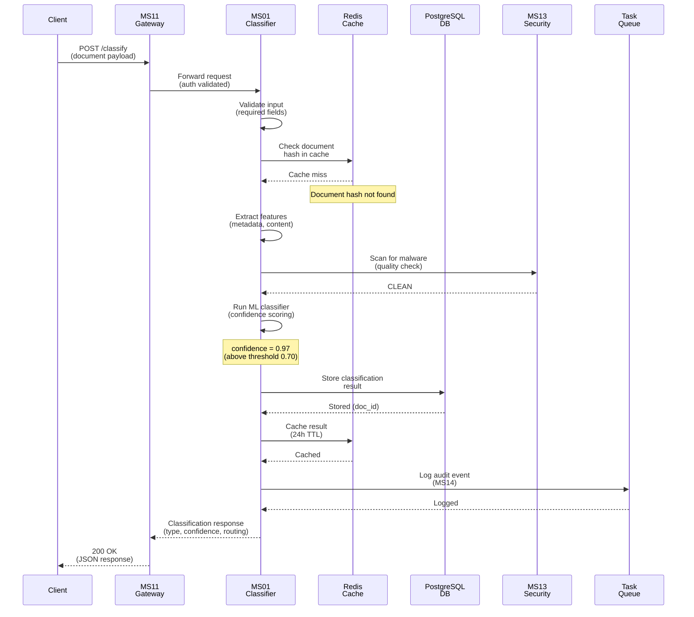

### Caso 2: Hit Cache (Percorso Veloce)

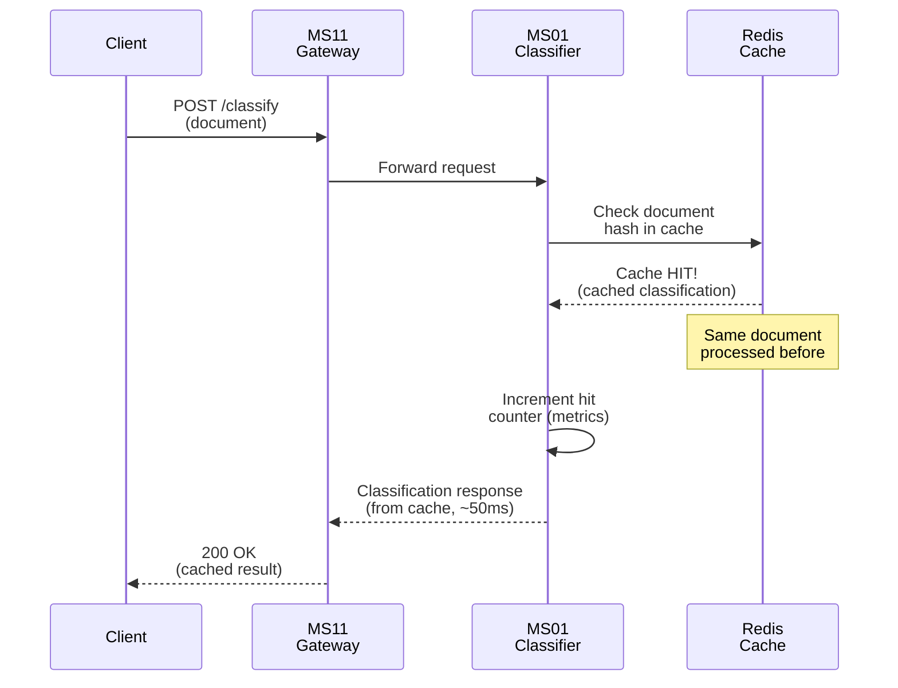

### Caso 3: Bassa Confidenza (Richiede Revisione)

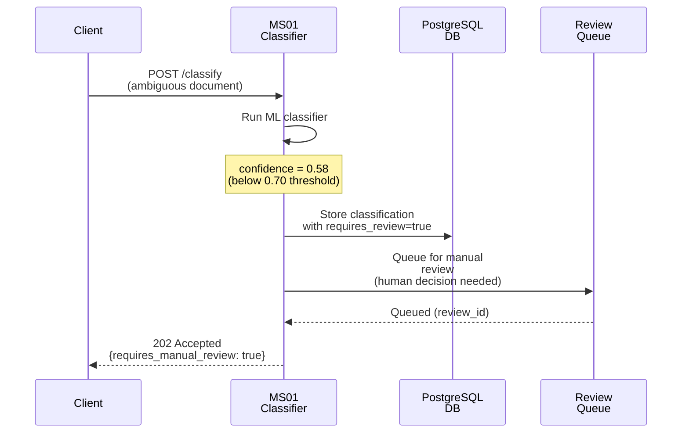

---

## Payload di Richiesta e Risposta

### Richiesta: Classifica Documento (POST /classify)

#### Input Payload
Diagramma del payload di richiesta:

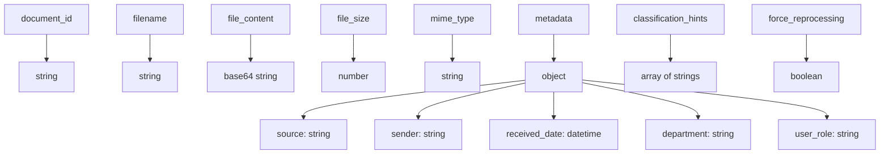

**Campi Obbligatori**:
- `document_id`: Identificatore univoco documento
- `filename`: Nome file documento
- `file_content`: Contenuto base64-encoded
- `mime_type`: Tipo MIME (application/pdf, application/vnd.ms-word, ecc.)

**Campi Opzionali**:
- `metadata`: Contesto aggiuntivo del documento
- `classification_hints`: Suggerimenti per il classificatore
- `force_reprocessing`: Forza reclassificazione anche se in cache

#### Response: 200 OK (Successo)
Diagramma del payload di risposta:

```mermaid
graph TD
    A[document_id] --> B[string]
    C[classification_result] --> D[object]
    D --> E[primary_type: string]
    D --> F[primary_confidence: number]
    D --> G[secondary_types: array]
    D --> H[category: string]
    D --> I[urgency: string]
    D --> J[requires_manual_review: boolean]
    K[metadata_extracted] --> L[object]
    L --> M[document_language: string]
    L --> N[key_entities: array]
    L --> O[document_date: date]
    L --> P[detected_currency: string]
    Q[quality_checks] --> R[object]
    R --> S[file_integrity: string]
    R --> T[format_compliance: string]
    R --> U[malware_scan: string]
    R --> V[size_valid: boolean]
    W[routing] --> X[object]
    X --> Y[next_pipeline: string]
    X --> Z[workflow_id: string]
    X --> AA[priority: string]
    X --> BB[sla_minutes: number]
    CC[processing_time_ms] --> DD[number]
    EE[timestamp] --> FF[datetime]
```

#### Response: 202 Accepted (Richiede Revisione Manuale)
Diagramma per risposta di revisione manuale:

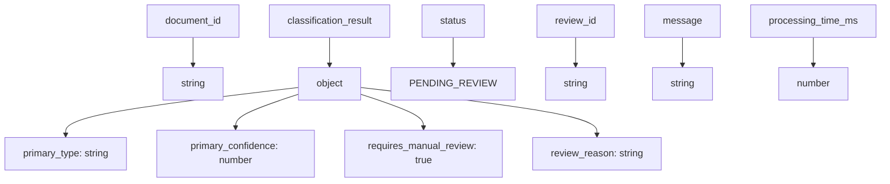

#### Response: 400 Bad Request
Diagramma per errore di richiesta:

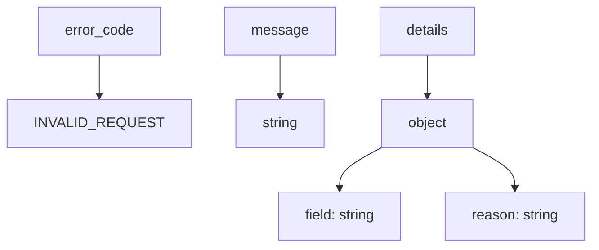

### Richiesta: Classifica in Batch (POST /classify/batch)

#### Input Payload
Diagramma del payload batch:

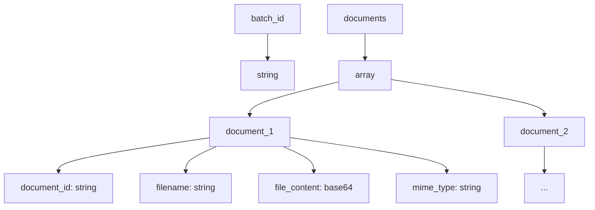

#### Response: 200 OK
Diagramma della risposta batch:

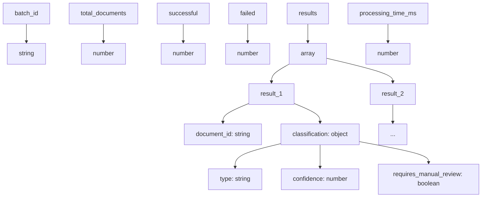

### Endpoint: Stato Modello (GET /models/status)

#### Response: 200 OK
Diagramma dello stato modello:

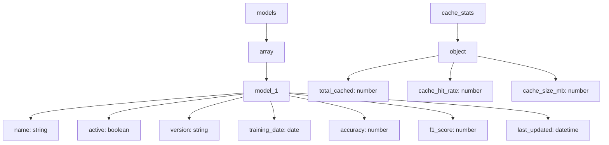

### Endpoint: Health Check (GET /health)

#### Response: 200 OK
Diagramma del controllo salute:

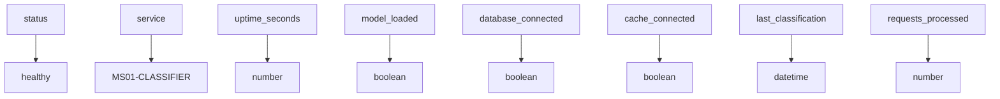

---

## Stack Tecnologico

### Linguaggi e Framework
- **Linguaggio**: Python 3.10+
- **API Framework**: FastAPI (async endpoints)
- **ML Framework**: scikit-learn / TensorFlow (modelli classificazione)

### Persistenza e Cache
- **Database**: PostgreSQL (risultati classificazione, audit log)
- **Cache**: Redis (hit cache classificazioni, TTL 24h)

### Infrastruttura
- **Container**: Docker
- **Orchestrazione**: Kubernetes
- **Service Discovery**: MS16-REGISTRY
- **Configurazione**: MS15-CONFIG
- **Monitoraggio**: MS08-MONITOR
- **Security**: MS13-SECURITY

### Dipendenze Inter-Servizio
- **Input da**: Sorgenti documenti esterne, metadati
- **Output a**: SP03 (Procedural Classifier), SP05 (Template Engine), SP06 (Validator)
- **Condiviso con**: MS02-ANALYZER, MS13-SECURITY (audit logging), MS14-AUDIT
- **Infrastruttura**: MS15-CONFIG, MS16-REGISTRY, MS13-SECURITY

---

## Documentazione Completa

### Guida Veloce per Sviluppatori
1. Vedi [SPECIFICATION.md](SPECIFICATION.md) per **specifiche tecniche dettagliate**
2. Consulta [API.md](API.md) per **riferimento endpoint API completo**
3. Studia [DATABASE-SCHEMA.md](DATABASE-SCHEMA.md) per **schema database e indici**
4. Leggi [TROUBLESHOOTING.md](TROUBLESHOOTING.md) per **risoluzione problemi comuni**

### File di Supporto
- `docker-compose.yml`: Setup locale con PostgreSQL + Redis
- `kubernetes/deployment.yaml`: Deployment Kubernetes per produzione
- `examples/`: Campioni richieste/risposte per testing
- `init-schema.sql`: Script DDL inizializzazione database

---

**Navigazione**: [← MS-ARCHITECTURE-MASTER.md](../MS-ARCHITECTURE-MASTER.md) | [README](README.md) | [SPECIFICATION →](SPECIFICATION.md)
