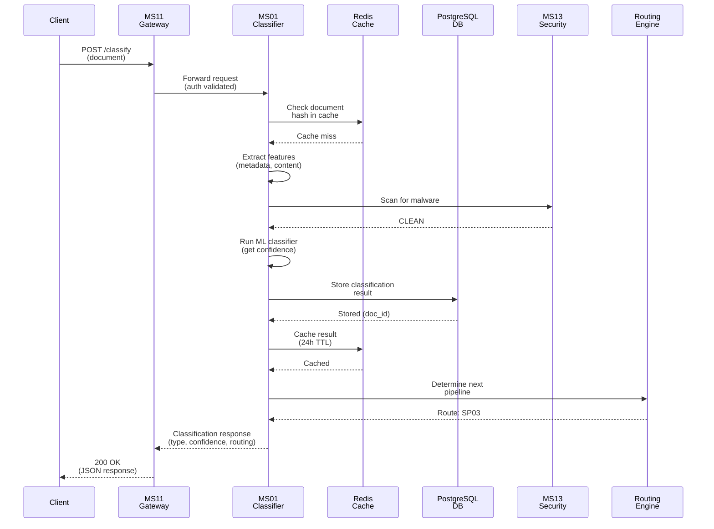
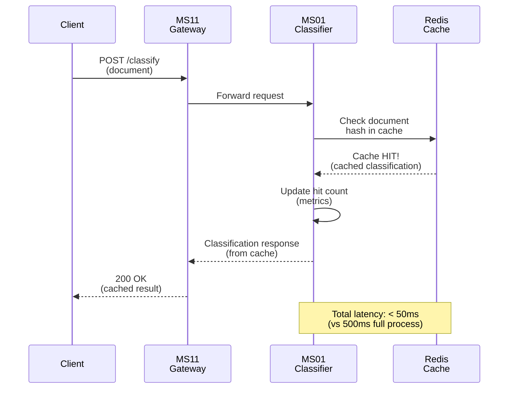
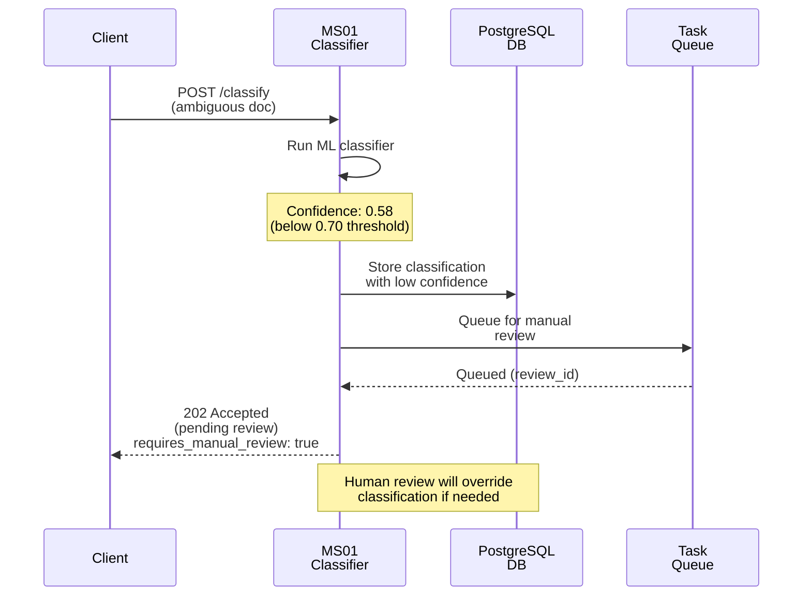
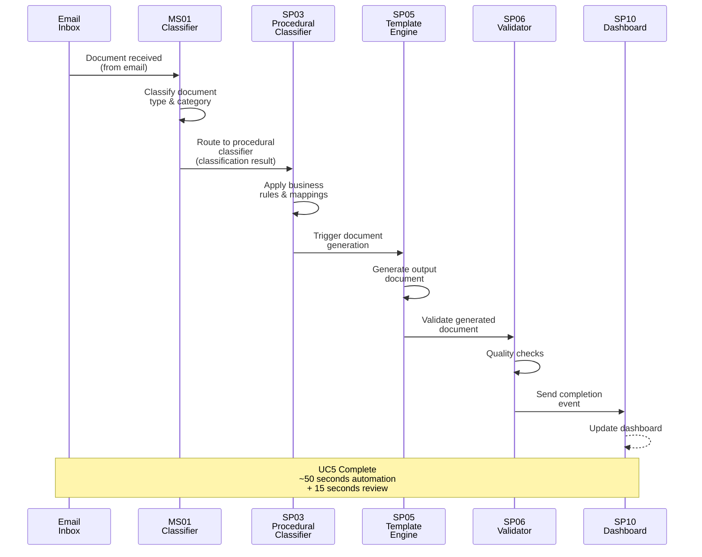
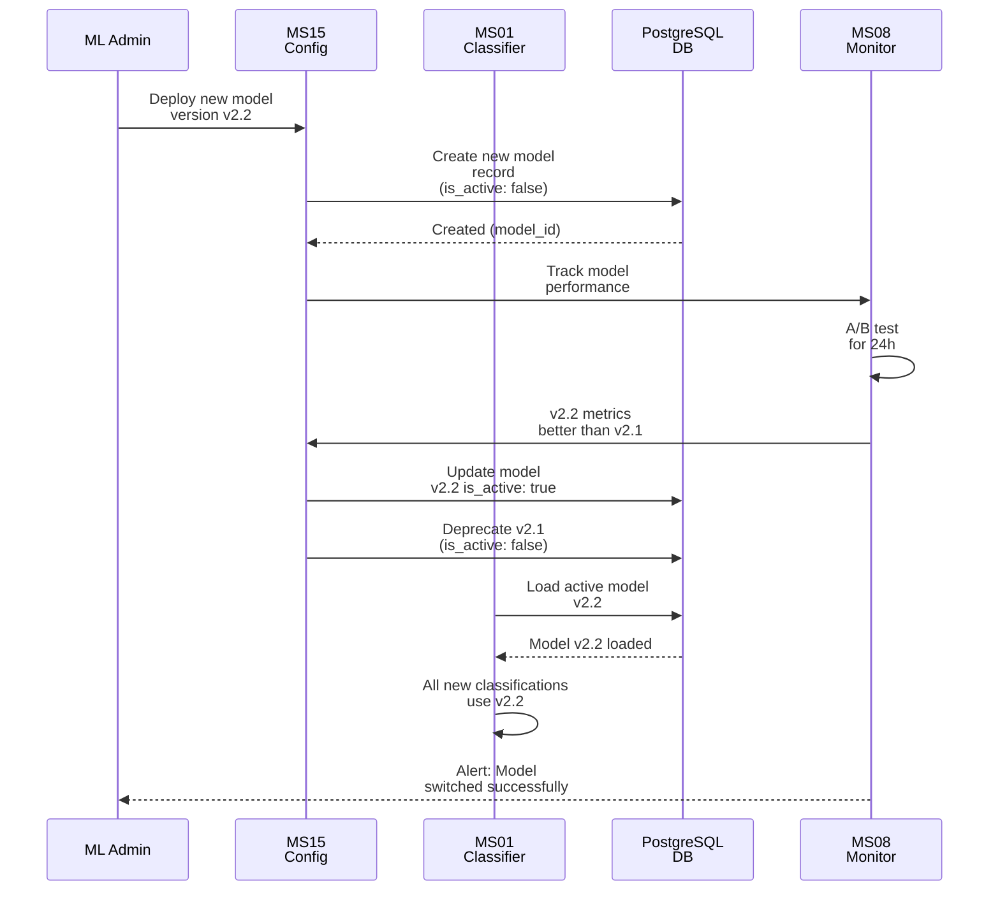

# MS01 - Classificatore di Documenti - Specifica Dettagliata

**Navigazione**: [← README.md](README.md) | [SPECIFICATION](SPECIFICATION.md) | [API →](API.md)

## Indice

1. [Panoramica Generale](#panoramica-generale)
2. [Responsabilità Principali](#responsabilità-principali)
3. [Integrazione con i Casi d'Uso](#integrazione-con-i-casi-duso)
4. [Modelli Dati](#modelli-dati)
5. [SLA di Prestazione](#sla-di-prestazione)
6. [Diagrammi di Sequenza](#diagrammi-di-sequenza)
7. [Architettura](#architettura)
8. [Sicurezza e Conformità](#sicurezza-e-conformità)
9. [Distribuzione](#distribuzione)

---

## Panoramica Generale
MS01 fornisce classificazione intelligente dei documenti come punto di ingresso per UC5 (Produzione Documentale) e UC7 (Archivio Digitale). Analizza il contenuto del documento e i metadati per determinare il tipo di documento, applica regole di business e instrada ai pipeline di elaborazione appropriati.

[↑ Torna al Indice](#indice)

---

## Responsabilità Principali

### 1. Classificazione del Tipo di Documento
- **Classificazione basata su regole**: Corrispondenza di pattern, analisi di metadati
- **Classificazione basata su ML**: Addestramento su corpus di documenti etichettati
- **Scoring di confidenza**: Scala 0.0-1.0 che indica la certezza della classificazione
- **Supporto multi-categoria**: I documenti possono appartenere a più categorie

### 2. Estrazione di Metadati
- Proprietà del file (nome, dimensione, data di creazione, autore)
- Proprietà del contenuto (rilevamento della lingua, termini chiave, entità)
- Informazioni sul formato (tipo MIME, validazione della firma del file)

### 3. Controlli di Qualità
- Validazione dell'integrità del file (verifica del checksum)
- Conformità del formato (standard ISO/IEC)
- Applicazione dei vincoli di dimensione (min/max)
- Integrazione con scansione malware (via MS13-SECURITY)

### 4. Instradamento del Flusso di Lavoro
- Instradamento a SP03 (Classificatore Procedurale) per documenti normativi
- Instradamento a SP05 (Template Engine) per flussi basati su generazione
- Instradamento a SP06 (Validatore) per elaborazione a priorità validazione
- Instradamento all'ingestion archivio UC7 per flussi di conservazione

[↑ Torna al Indice](#indice)

---

## Integrazione con i Casi d'Uso

### UC5 - Produzione Documentale Integrata
- Input: Allegati email, documenti caricati
- La classificazione attiva pipeline di generazione automatizzate
- L'output alimenta SP05 (Template Engine)

### UC6 - Firma Digitale Integrata
- Identifica documenti che richiedono firme digitali
- Instrada ai flussi di lavoro pronti per la firma
- Valida il formato del documento per compatibilità con la firma

### UC7 - Conservazione Digitale
- Classificazione iniziale all'ingestion
- Allegato di metadati di conservazione
- Applicazione delle regole di disposizione archivio

[↑ Torna al Indice](#indice)

---

## Modelli Dati

### Richiesta di Classificazione
```json
{
  "document_id": "doc-2024-11-18-001",
  "filename": "invoice_2024_11.pdf",
  "file_content": "base64-encoded-content",
  "file_size": 245632,
  "mime_type": "application/pdf",
  "metadata": {
    "source": "email",
    "sender": "vendor@company.com",
    "received_date": "2024-11-18T10:30:00Z",
    "user_context": {
      "department": "procurement",
      "user_role": "document-processor"
    }
  },
  "classification_hints": ["invoice", "procurement"],
  "force_reprocessing": false
}
```

### Risposta di Classificazione
```json
{
  "document_id": "doc-2024-11-18-001",
  "classification_result": {
    "primary_type": "invoice",
    "primary_confidence": 0.97,
    "secondary_types": [
      {
        "type": "procurement_document",
        "confidence": 0.85
      }
    ],
    "category": "financial",
    "urgency": "normal",
    "requires_manual_review": false
  },
  "metadata_extracted": {
    "document_language": "it",
    "key_entities": ["vendor", "invoice_number", "amount", "date"],
    "document_date": "2024-11-15",
    "estimated_value": "EUR 1500.00"
  },
  "quality_checks": {
    "file_integrity": "PASS",
    "format_compliance": "PASS",
    "malware_scan": "CLEAN",
    "size_valid": true
  },
  "routing": {
    "next_pipeline": "SP03-PROCEDURAL-CLASSIFIER",
    "workflow_id": "UC5-INVOICE-PROCESSING",
    "priority": "normal",
    "sla_minutes": 15
  },
  "processing_time_ms": 342,
  "timestamp": "2024-11-18T10:31:45.123Z"
}
```

[↑ Torna al Indice](#indice)

---

## SLA di Prestazione

| Metrica | Target | p50 | p95 | p99 |
|--------|--------|-----|-----|-----|
| Latenza di classificazione | < 500ms | 250ms | 420ms | 480ms |
| Throughput | 100 doc/sec | - | - | - |
| Accuratezza (modello ML) | > 92% | - | - | - |
| Tasso di hit della cache | > 75% | - | - | - |
| Disponibilità | 99.95% | - | - | - |

[↑ Torna al Indice](#indice)

---

## Diagrammi di Sequenza

### Flusso Principale: Classificazione Documento (Caso Positivo)



### Flusso Alternativo: Hit della Cache (Percorso Veloce)



### Flusso di Errore: Classificazione a Bassa Confidenza



### Flusso di Integrazione: Pipeline di Generazione Documenti UC5



[↑ Torna al Indice](#indice)

---

### Ciclo di Vita del Modello: Aggiornamento del Modello Attivo



[↑ Torna al Indice](#indice)

---

## Gestione Errori

### Scenari di Errore Comuni

1. **Timeout Query**
   - Descrizione: Query supera tempo limite di esecuzione
   - Causa: Query complessa o dati voluminosi
   - Mitigation: Implementare timeout configurabile e fallback

2. **Connessione Database**
   - Descrizione: Perdita connessione ai servizi dipendenti
   - Causa: Servizio non disponibile o problemi rete
   - Mitigation: Retry logic con exponential backoff

3. **Validazione Dati**
   - Descrizione: Input non valido o formato errato
   - Causa: Client fornisce dati non conformi
   - Mitigation: Validazione input e error messages chiari

### Error Codes

| Code | Status | Descrizione | Azione |
|------|--------|-------------|--------|
| 400 | Bad Request | Input non valido | Correggi parametri request |
| 408 | Timeout | Operazione timeout | Riprova con parametri ridotti |
| 500 | Internal Error | Errore interno | Contatta supporto |
| 503 | Service Unavailable | Servizio non disponibile | Riprova più tardi |

### Recovery Procedures

- **Automatic Retry**: Sistema riprova automaticamente con backoff esponenziale
- **Graceful Degradation**: Fallback a cache o risultati parziali se disponibili
- **Error Logging**: Tutti gli errori registrati per analisi e monitoring
- **Alerting**: Notifiche su errori critici ai team di supporto

## Architettura

MS01 è strutturato con una **architettura modulare basata su 7 componenti principali**. Ciascun componente ha una responsabilità specifica nel pipeline di classificazione.

### Componente 1: Document Intake Handler

**Responsabilità**: Riceve e valida l'input documentale prima dell'elaborazione.

**Funzioni Specifiche**:
- Verifica della presenza di campi obbligatori (`document_id`, `filename`, `file_content`, `mime_type`)
- Decodifica base64 del contenuto file
- Validazione della dimensione file (min: 1KB, max: 100MB)
- Validazione del tipo MIME (whitelist: PDF, DOCX, TXT, ecc.)
- Generazione dell'hash SHA256 del documento

**Input Payload**:
```json
{
  "document_id": "doc-2024-11-18-001",
  "filename": "invoice.pdf",
  "file_content": "JVBERi0xLjQK...",
  "file_size": 245632,
  "mime_type": "application/pdf"
}
```

**Output al Passo Successivo**:
```json
{
  "document_id": "doc-2024-11-18-001",
  "filename": "invoice.pdf",
  "file_hash": "sha256:abc123...",
  "file_size": 245632,
  "mime_type": "application/pdf",
  "validation_status": "PASS"
}
```

---

### Componente 2: Cache Layer

**Responsabilità**: Verifica se il documento è stato già classificato per evitare rielaborazione.

**Funzioni Specifiche**:
- Lookup in Redis usando SHA256 del documento
- Hit rate tracking (statistiche)
- TTL management (24 ore default)
- Invalidazione della cache su model update

**Logica di Hit/Miss**:
```
Document Hash → Redis Lookup
    ├── HIT (< 5ms)
    │   └─ Return cached classification
    └── MISS
        └─ Proceed to Feature Extraction
```

**Cache Entry Structure**:
```json
{
  "document_hash": "sha256:abc123...",
  "classification_result": {
    "primary_type": "invoice",
    "primary_confidence": 0.97
  },
  "created_at": "2024-11-18T10:30:00Z",
  "expires_at": "2024-11-19T10:30:00Z",
  "hit_count": 5
}
```

---

### Componente 3: Feature Extractor

**Responsabilità**: Estrae feature rilevanti dal documento per la classificazione.

**Funzioni Specifiche**:
- **Estrazione metadati file**: nome, dimensione, data creazione, autore
- **Parsing contenuto**: estrazione testo da PDF, DOCX, TXT
- **Rilevamento lingua**: identificazione lingua del documento
- **Entity extraction**: nomi, numeri, date, importi
- **Keyword extraction**: termini più rilevanti dal contenuto

**Processo di Extraction**:
```
Document Content
    ├─ Parse File → Raw Text
    ├─ Detect Language → "it", "en", ecc.
    ├─ Extract Entities → [vendor, amount, date, ...]
    ├─ Extract Keywords → [invoice, financial, ...]
    └─ Build Feature Vector → [feature1, feature2, ...]
```

**Output Features**:
```json
{
  "document_id": "doc-2024-11-18-001",
  "extracted_metadata": {
    "document_language": "it",
    "key_entities": ["vendor_name", "invoice_number", "amount", "date"],
    "document_date": "2024-11-15",
    "extracted_keywords": ["invoice", "payment", "procurement"]
  },
  "content_summary": {
    "word_count": 342,
    "page_count": 2,
    "has_tables": true,
    "has_images": false
  }
}
```

---

### Componente 4: Quality Validator

**Responsabilità**: Esegue controlli di sicurezza, integrità e conformità.

**Funzioni Specifiche**:
- **Integrità file**: verifica checksum SHA256
- **Conformità formato**: validazione contro standard ISO/IEC
- **Scansione malware**: integrazione MS13-SECURITY (ClamAV)
- **Vincoli dimensione**: min 1KB, max 100MB
- **Validazione MIME**: confronto tra estensione file e tipo MIME dichiarato

**Flusso di Validazione**:
```
Document Validation
    ├─ [1] File Integrity Check
    │   └─ SHA256 hash verification → PASS/FAIL
    ├─ [2] Format Compliance Check
    │   └─ ISO/IEC standard validation → PASS/FAIL/WARNING
    ├─ [3] Malware Scan (MS13)
    │   └─ ClamAV engine → CLEAN/INFECTED/SUSPECT
    └─ [4] Size Validation
        └─ 1KB ≤ size ≤ 100MB → PASS/FAIL
```

**Output Validazione**:
```json
{
  "quality_checks": {
    "file_integrity": {
      "status": "PASS",
      "checksum_algorithm": "SHA256",
      "checksum_value": "abc123..."
    },
    "format_compliance": {
      "status": "PASS",
      "standard": "ISO/IEC 32000 (PDF)",
      "warnings": []
    },
    "malware_scan": {
      "status": "CLEAN",
      "engine": "ClamAV",
      "scan_timestamp": "2024-11-18T10:31:00Z"
    },
    "size_check": {
      "status": "PASS",
      "size_bytes": 245632
    },
    "overall_status": "PASS"
  }
}
```

---

### Componente 5: Classification Engine

**Responsabilità**: Applica i modelli di classificazione (rule-based + ML) per determinare il tipo di documento.

**Strategie di Classificazione**:

**1. Rule-Based Classification**
```
Document Content
    └─ Pattern Matching (Regex)
        ├─ "Invoice.*IVA" → Type: INVOICE
        ├─ "Contratto di.*fornitura" → Type: CONTRACT
        └─ "Preventivo.*totale" → Type: QUOTATION
```

**2. ML-Based Classification**
```
Feature Vector (from Feature Extractor)
    └─ ML Model (scikit-learn RandomForest)
        ├─ Model Version: v2.1
        ├─ Accuracy: 94.5%
        └─ Output: [type_1 (0.97), type_2 (0.85), type_3 (0.12)]
```

**3. Hybrid Classification** (combinazione regole + ML)
```
Rule Score (confidence: 0.60)  +  ML Score (confidence: 0.97)
    └─ Weighted Ensemble
        └─ Final Type: INVOICE (confidence: 0.92)
```

**Output Classificazione**:
```json
{
  "classification_result": {
    "primary_type": "invoice",
    "primary_confidence": 0.97,
    "classification_method": "ml",
    "model_version": "v2.1",
    "secondary_types": [
      {
        "type": "procurement_document",
        "confidence": 0.85
      },
      {
        "type": "financial_document",
        "confidence": 0.72
      }
    ],
    "category": "financial",
    "urgency": "normal"
  }
}
```

---

### Componente 6: Router

**Responsabilità**: Determina il prossimo pipeline in base al risultato della classificazione.

**Routing Logic**:
```
Classification Result
    ├─ Type: INVOICE
    │   └─ Route: SP03 → SP05 → SP06 (UC5)
    │       ├─ Workflow ID: UC5-INVOICE-PROCESSING
    │       └─ SLA: 15 minutes
    ├─ Type: CONTRACT
    │   └─ Route: SP03 → SP06 → SP08 (Review + Signature)
    │       ├─ Workflow ID: UC6-CONTRACT-SIGNATURE
    │       └─ SLA: 30 minutes
    └─ Type: ARCHIVE_DOCUMENT
        └─ Route: UC7 Ingestion Engine
            ├─ Workflow ID: UC7-DIGITAL-PRESERVATION
            └─ SLA: 60 minutes
```

**Output Routing**:
```json
{
  "routing": {
    "next_pipeline": "SP03-PROCEDURAL-CLASSIFIER",
    "workflow_id": "UC5-INVOICE-PROCESSING",
    "priority": "normal",
    "sla_minutes": 15,
    "routing_rules_applied": [
      "document_type:invoice → UC5",
      "confidence:0.97 → fast_track"
    ]
  }
}
```

---

### Componente 7: Metrics Collector

**Responsabilità**: Cattura metriche di prestazione e accuratezza per monitoraggio e ottimizzazione.

**Metriche Collezionate**:
- **Latenza**: tempo totale classificazione (p50, p95, p99)
- **Throughput**: documenti/secondo
- **Accuratezza**: confronto classificazione ML vs. manual review
- **Cache Hit Rate**: % hit rispetto a miss
- **Model Performance**: accuracy, f1_score, precision, recall

**Output Metriche** (aggregato ogni 5 minuti):
```json
{
  "metrics": {
    "bucket_time": "2024-11-18T10:35:00Z",
    "bucket_duration_seconds": 300,
    "total_classifications": 150,
    "successful_classifications": 148,
    "failed_classifications": 2,
    "latency": {
      "p50_ms": 250,
      "p95_ms": 420,
      "p99_ms": 480
    },
    "cache": {
      "hit_count": 98,
      "miss_count": 52,
      "hit_rate": 0.653
    },
    "model_accuracy": 0.945,
    "sla_met": true
  }
}
```

---

### Integrazioni Esterne

MS01 si integra con i seguenti microservizi:

| Microservizio | Funzione | Tipo Integrazione |
|---|---|---|
| **MS13-SECURITY** | Scansione malware, crittografia | Sincrono (call) |
| **MS14-AUDIT** | Logging audit classificazioni | Asincrono (queue) |
| **MS15-CONFIG** | Gestione configurazione, versionamento modelli | Sincrono (load) |
| **MS16-REGISTRY** | Service discovery, registrazione servizi | Sincrono (discovery) |
| **MS08-MONITOR** | Monitoraggio metriche e prestazioni | Asincrono (metrics publish) |
| **Redis** | Cache risultati classificazione | Sincrono (get/set) |
| **PostgreSQL** | Persistenza risultati | Sincrono (write) |

[↑ Torna al Indice](#indice)

---

## Sicurezza e Conformità

### Protezione dei Dati
- Conformità GDPR: Crittografia a riposo e in transito
- Mascheramento dei dati sensibili nei log (redazione PII)
- Controllo degli accessi via MS13-SECURITY

### Traccia di Audit
- Tutte le classificazioni registrate via MS14-AUDIT
- Cronologia dello score di confidenza mantenuta
- Decisioni di revisione manuale tracciate
- Audit della versione del modello (dati di addestramento, modifiche)

[↑ Torna al Indice](#indice)

---

## Distribuzione

### Configurazione Container
- **Immagine Base**: python:3.10-slim
- **Porta**: 8001
- **Health Check**: endpoint /health (heartbeat)
- **Risorse**:
  - Richiesta CPU: 500m, limite: 2000m
  - Richiesta Memoria: 512Mi, limite: 2Gi
  - GPU: Opzionale (per accelerazione inferenza ML)

### Requisiti Kubernetes
- ReadinessProbe: /ready (classificatori caricati)
- LivenessProbe: /health (servizio rispondente)
- Auto-scaling Orizzontale dei Pod basato su latenza richieste
- Volume persistente per cache modello ML

### Variabili d'Ambiente
- `CLASSIFIER_MODEL_VERSION`: Versione del modello ML attivo
- `CLASSIFICATION_THRESHOLD`: Punteggio di confidenza minimo (0.6-0.95)
- `CACHE_TTL_HOURS`: Validità cache di classificazione (default: 24)
- `MAX_FILE_SIZE_MB`: Dimensione massima documento (default: 100)

[↑ Torna al Indice](#indice)

---

**Navigazione**: [← README.md](README.md) | [SPECIFICATION](SPECIFICATION.md) | [API →](API.md)
