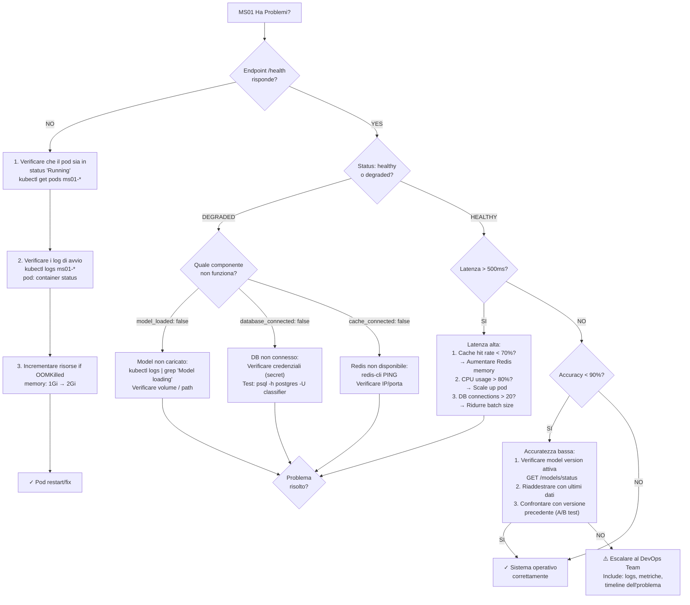

# MS01 - Guida per la Risoluzione dei Problemi

**Navigazione**: [← DATABASE-SCHEMA.md](DATABASE-SCHEMA.md) | [TROUBLESHOOTING](TROUBLESHOOTING.md) | [Back to MS →](../MS-ARCHITECTURE-MASTER.md#ms01--classifier)

## Indice

1. [Workflow Diagnostico Rapido](#workflow-diagnostico-rapido)
2. [Problemi Comuni e Soluzioni](#problemi-comuni-e-soluzioni)
3. [Endpoint di Controllo Salute](#endpoint-di-controllo-salute)
4. [Livelli di Log e Debug](#livelli-di-log-e-debug)
5. [Lista di Controllo Ottimizzazione Prestazioni](#lista-di-controllo-ottimizzazione-prestazioni)

---

## Workflow Diagnostico Rapido

Se MS01 ha problemi, seguire questo diagramma di diagnostic flow:



### Checklist di Diagnostica Rapida (5 minuti)

```bash
# 1. Health Check
curl http://ms01-classifier:8001/api/v1/health -v

# 2. Se degraded, controllare componenti
curl http://ms01-classifier:8001/models/status

# 3. Verificare logs recenti
kubectl logs ms01-classifier-pod -n production --tail=50

# 4. Metriche di sistema
kubectl top pod ms01-classifier-pod --containers

# 5. Database connectivity
kubectl exec -it ms01-classifier-pod -- \
  psql -h postgres -U classifier_service -d zendata_classifier \
  -c "SELECT version();"

# 6. Redis connectivity
kubectl exec -it ms01-classifier-pod -- redis-cli ping

# 7. Verificare configurazione attiva
kubectl get configmap ms01-config -o yaml | grep -A5 "CLASSIFICATION_THRESHOLD"
```

---

## Problemi Comuni e Soluzioni

### Problema 1: Timeout di Classificazione (> 500ms)

**Sintomi**
- Le richieste API si timeout dopo 30 secondi
- I log mostrano "Motore di classificazione non responsivo"
- Le metriche di latenza superano la soglia p99

**Cause Radice**
1. Modello ML ancora in caricamento dal disco
2. Livello cache (Redis) non disponibile o lento
3. Pool di connessioni al database esaurito
4. Utilizzo elevato di CPU/memoria

**Soluzioni**

Verificare lo stato di caricamento del modello:
```
GET /models/status
```

Verificare la connessione a Redis:
```
docker exec ms01-classifier redis-cli ping
# Should respond: PONG
```

Controllare le connessioni al database:
```sql
SELECT count(*) FROM pg_stat_activity
WHERE datname = 'zendata_classifier';
```

Monitorare l'utilizzo delle risorse:
```
kubectl top pod ms01-classifier-pod
```

**Prevenzione**
- Implementare il caching del modello all'avvio
- Abilitare il pre-warming di Redis durante la distribuzione
- Impostare la dimensione del pool di connessioni del database a 20+ per la produzione
- Configurare HPA (Horizontal Pod Autoscaling) a soglia CPU del 70%

---

### Problema 2: Bassa Accuratezza di Classificazione (< 90%)

**Sintomi**
- Alto tasso di override manuale (> 20%)
- I log di audit mostrano correzioni frequenti
- Reclami degli utenti su classificazioni errate

**Cause Radice**
1. Modello attivo obsoleto
2. Nuovi tipi di documento non nei dati di training
3. Errore di rilevamento della lingua
4. Model drift dai cambiamenti dei dati di produzione

**Soluzioni**

Verificare la versione attiva del modello:
```
GET /models/status
```

Confrontare le metriche di accuratezza:
```sql
SELECT model_version, accuracy, f1_score
FROM classifier_models
ORDER BY training_date DESC LIMIT 5;
```

Rivedere i pattern di classificazione errata:
```sql
SELECT
  primary_type,
  COUNT(*) as corrections,
  AVG(confidence_before) as avg_confidence
FROM classification_audit_log
WHERE is_manual_override = TRUE
  AND created_at > NOW() - INTERVAL '7 days'
GROUP BY primary_type
ORDER BY corrections DESC;
```

Riaddestrare il modello con dati recenti:
- Raccogliere gli ultimi 90 giorni di classificazioni corrette manualmente
- Utilizzare come nuovi dati di training
- Testare su set di holdout (20% dei dati)
- Se F1 score > 0.95, distribuire come nuovo modello attivo

**Prevenzione**
- Monitorare le metriche di accuratezza giornalmente (p50 > 0.92)
- Impostare avvisi per calo di accuratezza > 5%
- Riaddestrare il modello mensilmente con correzioni di produzione
- Test A/B dei nuovi modelli prima della distribuzione completa

---

### Problema 3: Oscillazione della Cache

**Sintomi**
- Il tasso di hit della cache scende sotto il 50%
- Alto utilizzo della memoria (> 2Gi)
- La latenza di classificazione aumenta

**Cause Radice**
1. Politica di eliminazione della cache troppo aggressiva
2. Troppi varianti di documento unici
3. TTL della cache troppo breve (< 1 ora)
4. Cache non correttamente pre-riscaldata

**Soluzioni**

Verificare le statistiche della cache:
```
GET /models/status  # Includes cache_stats
```

Verificare la configurazione della cache:
```
echo "INFO stats" | redis-cli
# Check: evicted_keys, total_connections_received
```

Visualizzare i trend del tasso di hit della cache:
```sql
SELECT
  DATE_TRUNC('hour', created_at) as hour,
  SUM(cache_hit_count) as hits,
  SUM(cache_miss_count) as misses,
  ROUND(SUM(cache_hit_count)::float /
    (SUM(cache_hit_count) + SUM(cache_miss_count)), 3) as hit_rate
FROM classification_performance_metrics
WHERE created_at > NOW() - INTERVAL '24 hours'
GROUP BY hour
ORDER BY hour DESC;
```

Ottimizzare la cache:
- Aumentare l'allocazione della memoria di Redis a 4Gi
- Regolare TTL su 24 ore (predefinito)
- Abilitare la compressione per i risultati della cache di grandi dimensioni
- Implementare il pre-riscaldamento della cache all'avvio

**Prevenzione**
- Monitorare il tasso di hit della cache ogni ora
- Avvertire se hit_rate < 0.70
- Mantenere il monitoraggio della dimensione della cache
- Profilare i pattern di accesso alle chiavi della cache

---

### Problema 4: Errori di Connessione al Database

**Sintomi**
- "FATAL: autenticazione della password non riuscita"
- Errori "Connection timeout"
- Risposte sporadiche 503 Service Unavailable

**Cause Radice**
1. Servizio PostgreSQL inattivo
2. Pool di connessioni esaurito
3. Credenziali non valide
4. Problema di connettività di rete

**Soluzioni**

Verificare l'integrità del database:
```
kubectl exec -it ms01-classifier-pod -- \
  psql -h postgres -U classifier_service -d zendata_classifier \
  -c "SELECT version();"
```

Verificare le credenziali nel segreto Kubernetes:
```
kubectl get secret classifier-db-secret -o yaml
# Decode base64 and verify password matches PostgreSQL
```

Controllare lo stato del pool di connessioni:
```sql
SELECT
  datname,
  usename,
  state,
  count(*)
FROM pg_stat_activity
GROUP BY datname, usename, state;
```

Monitorare il pool di connessioni nell'applicazione:
```
GET /health
# Check: database_connected status
```

Forzare la riconnessione:
```
kubectl rollout restart deployment ms01-classifier
```

**Prevenzione**
- Utilizzare il pooling delle connessioni (PgBouncer con 50+ connessioni)
- Implementare i controlli di salute della connessione ogni 30 secondi
- Impostare il timeout della connessione a 10 secondi
- Monitorare pg_stat_activity nel sistema di avvisi

---

### Problema 5: Errori di Validazione del Formato del File

**Sintomi**
- Molti documenti falliscono con "UNSUPPORTED_FORMAT"
- Gli utenti possono aprire file in Word/Adobe ma MS01 li rifiuta
- Errori sporadici per lo stesso tipo di documento

**Cause Radice**
1. Rilevamento del tipo MIME non corretto
2. Mancata corrispondenza della firma del file (magic bytes)
3. Intestazioni di file corrotte
4. Elenco dei formati supportati obsoleto

**Soluzioni**

Verificare i tipi MIME supportati:
```
GET /health
# Includes supported_types array
```

Testare la validazione del file:
```
curl -X POST http://localhost:8001/api/v1/classify \
  -H "Content-Type: application/json" \
  -d @request.json
```

Eseguire il debug del rilevamento del tipo MIME:
```
file -b invoice.pdf  # System file utility
# Compare with ms01 detection
```

Verificare l'integrità del file:
```
sha256sum invoice.pdf
# Test if same file always works or fails sporadically
```

Aggiornare i formati supportati se necessario:
- Aggiungere alla variabile di ambiente SUPPORTED_FORMATS
- Aggiornare le regole di validazione in DATABASE-SCHEMA.md
- Riavviare il servizio

**Prevenzione**
- Testare con file di esempio da tutti i tipi di documento
- Mantenere l'elenco dei formati supportati
- Implementare la validazione della firma del file (magic bytes)
- Aggiungere messaggi di errore dettagliati alle risposte API

---

### Problema 6: Memory Leak nel Caricamento del Modello ML

**Sintomi**
- L'utilizzo della memoria cresce nel tempo (1Gi → 2Gi su giorni)
- Il pod si blocca con stato OOMKilled
- Gli riavvii risolvono il problema temporaneamente

**Cause Radice**
1. Modello non correttamente scaricato durante il cambio di versione
2. Accumulo di cache in memoria
3. Memory leak nelle dipendenze (scikit-learn, TensorFlow)
4. Oggetti dei risultati di classificazione non sottoposti a garbage collection

**Soluzioni**

Monitorare i trend della memoria:
```
kubectl top pod ms01-classifier-pod --containers
# Check memory usage every hour for 24 hours
```

Verificare la cronologia di riavvio del pod:
```
kubectl get pods ms01-classifier-pod -o jsonpath='{.status.containerStatuses[0].restartCount}'
```

Verificare che il cambio del modello non abbia perdite:
1. Record current memory usage
2. Trigger model switch via API
3. Force garbage collection
4. Compare memory after 5 minutes

Implement fixes:
```
# In application code:
# 1. Explicitly release old model: del old_model; gc.collect()
# 2. Limit cache size to 500MB max
# 3. Add periodic cleanup every 24 hours
```

Aumentare i limiti di risorse del pod:
```yaml
resources:
  requests:
    memory: "1Gi"
  limits:
    memory: "3Gi"  # Increased from 2Gi
```

**Prevenzione**
- Profilare l'utilizzo della memoria settimanalmente
- Avvertire se l'utilizzo della memoria > 80% dei limiti
- Implementare il riavvio automatico del pod ogni 30 giorni
- Utilizzare il profiler di memoria durante lo sviluppo

[↑ Torna al Indice](#indice)

---

## Endpoint di Controllo Salute

Tutti i problemi di salute possono essere diagnosticati tramite:

```
GET /health
```

La risposta indica:
- Stato del servizio (healthy/degraded/unhealthy)
- Stato di caricamento del modello
- Connettività del database
- Connettività della cache
- Ultima classificazione riuscita
- Numero di richieste elaborate

[↑ Torna al Indice](#indice)

---

## Livelli di Log e Debug

### Abilitare Debug Logging
```
kubectl set env deployment/ms01-classifier LOG_LEVEL=DEBUG
```

### Visualizzare Log in Tempo Reale
```
kubectl logs -f ms01-classifier-pod -c classifier --timestamps=true
```

### Pattern di Log Comuni

| Pattern | Significato | Azione |
|---------|---------|--------|
| `Model loading from /models/v2.1` | Avvio normale | Monitorare il completamento |
| `Cache hit rate: 0.78` | Cache salutare | Nessuna azione |
| `Classification confidence below threshold` | Bassa confidenza | Potrebbe richiedere revisione |
| `Database connection timeout` | Problema critico | Verificare il database |
| `OOMKilled by kubelet` | Memoria superata | Aumentare i limiti |

[↑ Torna al Indice](#indice)

---

## Lista di Controllo Ottimizzazione Prestazioni

- [ ] Tasso di hit della cache > 0.75
- [ ] Latenza p95 < 420ms
- [ ] Accuratezza del modello > 0.92
- [ ] Utilizzo della memoria < 1.5Gi
- [ ] Utilizzo della CPU < 1000m sostenuto
- [ ] Connessioni al database < 20
- [ ] Uptime > 99.95%
- [ ] Tasso di errore < 0.1%

[↑ Torna al Indice](#indice)

---

**Navigazione**: [← DATABASE-SCHEMA.md](DATABASE-SCHEMA.md) | [TROUBLESHOOTING](TROUBLESHOOTING.md) | [Back to MS →](../MS-ARCHITECTURE-MASTER.md#ms01--classifier)
