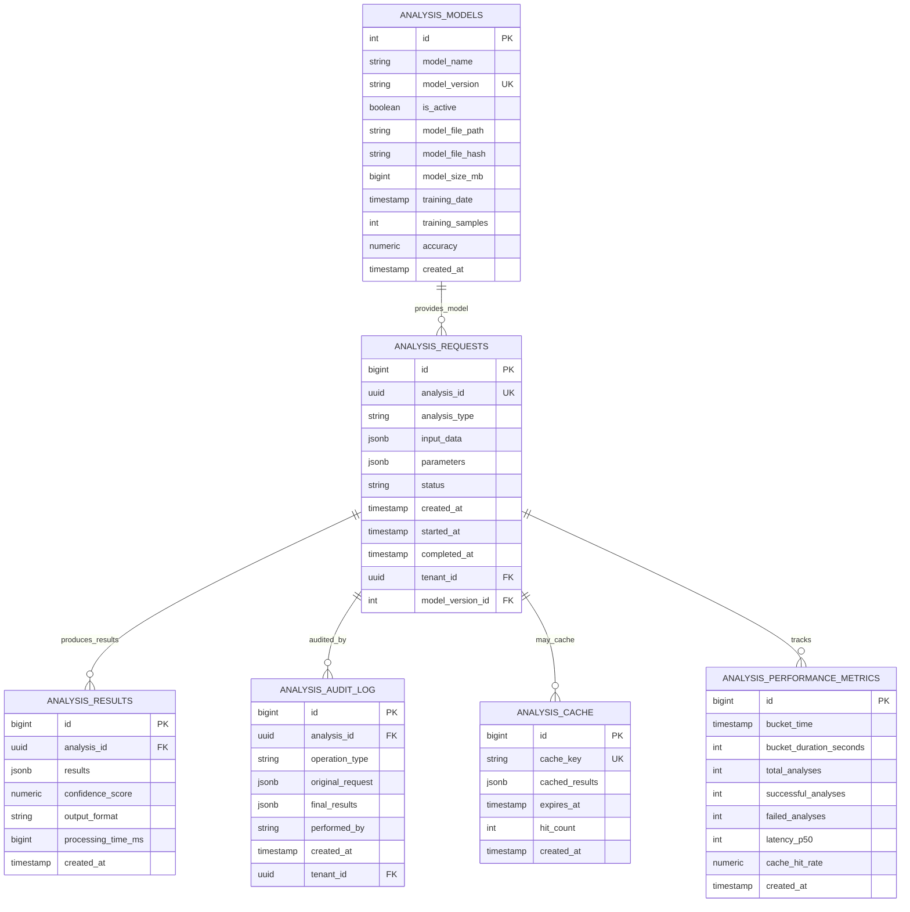

# MS02 - Schema Database Analizzatore

**Navigazione**: [← API.md](API.md) | [DATABASE-SCHEMA](DATABASE-SCHEMA.md) | [TROUBLESHOOTING →](TROUBLESHOOTING.md)

## Indice

1. [Panoramica](#panoramica)
2. [Connessione al Database](#connessione-al-database)
3. [Diagramma Relazionale Entità](#diagramma-relazionale-entità)
4. [Descrizioni delle Tabelle](#descrizioni-delle-tabelle)
5. [Strategia di Indicizzazione](#strategia-di-indicizzazione)
6. [Caratteristiche di Prestazione](#caratteristiche-di-prestazione)
7. [Backup e Ripristino](#backup-e-ripristino)
8. [Politiche di Conservazione dei Dati](#politiche-di-conservazione-dei-dati)

---

## Panoramica
MS02 utilizza PostgreSQL per l'archiviazione persistente dei risultati di analisi, metadati dei modelli e tracce di audit.

## Connessione al Database
```
Host: postgres.namespace
Port: 5432
Database: zendata_analyzer
User: analyzer_service
SSL: Required
```

---

## Diagramma Relazionale Entità



---

## Descrizioni delle Tabelle

### ANALYSIS_MODELS
Versioni del modello di analisi e relative metriche di prestazione.

**Scopo**: Tracciare le versioni del modello analitico, l'accuratezza, lo stato di distribuzione e il ciclo di vita.

**Campi Principali**:
- `model_version`: Identificatore univoco (es. "v2.1")
- `is_active`: Solo un modello attivo consentito
- `accuracy`: Metriche di prestazione del modello

### ANALYSIS_REQUESTS
Richieste di analisi e metadati di esecuzione.

**Scopo**: Memorizzare le richieste di analisi per tracciamento e audit.

**Campi Principali**:
- `analysis_id`: Identificatore univoco per analisi
- `analysis_type`: Tipo di analisi (semantic, anomaly, etc.)
- `input_data`: Dati di input in JSONB
- `status`: Stato dell'analisi (pending, running, completed, failed)

### ANALYSIS_RESULTS
Risultati delle analisi completate.

**Scopo**: Memorizzare i risultati finali delle analisi.

**Campi Principali**:
- `analysis_id`: Riferimento alla richiesta
- `results`: Risultati in formato JSONB
- `confidence_score`: Punteggio di confidenza
- `processing_time_ms`: Tempo di elaborazione

### ANALYSIS_CACHE
Cache ad alte prestazioni per risultati di analisi frequenti.

**Scopo**: Memorizzare risultati per ridurre rielaborazione (TTL: 24 ore).

**Campi Principali**:
- `cache_key`: Chiave basata su hash input
- `cached_results`: Risultati memorizzati
- `expires_at`: Scadenza cache

### ANALYSIS_AUDIT_LOG
Traccia di audit dettagliata per tutte le operazioni di analisi.

**Scopo**: Tracciare tutte le operazioni per conformità e debug.

**Campi Principali**:
- `operation_type`: Tipo operazione (ANALYZE, CACHE_HIT, etc.)
- `original_request`: Richiesta originale
- `final_results`: Risultati finali

### ANALYSIS_PERFORMANCE_METRICS
Tracciamento delle prestazioni in tempo reale.

**Scopo**: Tracciare metriche di prestazione in bucket di 5 minuti.

**Campi Principali**:
- `bucket_time`: Bucket temporale
- `total_analyses`: Numero totale analisi
- `latency_p50`: Latenza mediana
- `cache_hit_rate`: Tasso hit cache

---

## Esempi di Payload Database

### Tabella: ANALYSIS_REQUESTS - Insert Record

Quando viene ricevuta una richiesta di analisi:

```json
{
  "analysis_id": "analysis-2024-11-18-001",
  "analysis_type": "semantic",
  "input_data": {
    "content": "testo da analizzare",
    "language": "it"
  },
  "parameters": {
    "extract_entities": true
  },
  "status": "pending",
  "created_at": "2024-11-18T10:30:00Z",
  "tenant_id": "tenant-001"
}
```

### Tabella: ANALYSIS_RESULTS - Store Results

Quando l'analisi è completata:

```json
{
  "analysis_id": "analysis-2024-11-18-001",
  "results": {
    "entities": [
      {
        "text": "contratto",
        "type": "LEGAL_DOCUMENT",
        "confidence": 0.95
      }
    ],
    "sentiment": "neutral"
  },
  "confidence_score": 0.92,
  "processing_time_ms": 245,
  "created_at": "2024-11-18T10:30:15Z"
}
```

### Tabella: ANALYSIS_CACHE - Cache Lookup

Struttura cache:

```json
{
  "cache_key": "hash:input_data",
  "cached_results": {
    "analysis_type": "semantic",
    "results": {
      "entities": [],
      "sentiment": "neutral"
    },
    "confidence_score": 0.92
  },
  "expires_at": "2024-11-19T10:30:15Z",
  "hit_count": 5,
  "created_at": "2024-11-18T10:30:15Z"
}
```

---

## Strategia di Indicizzazione

### Query Critiche per le Prestazioni

| Pattern di Query | Indice | Tempo Est. |
|---------------|-------|-----------|
| Ottieni richiesta analisi | `idx_analysis_id` | < 10ms |
| Cronologia analisi per tenant | `idx_tenant_created` | < 50ms |
| Ricerca cache per chiave | `idx_cache_key` | < 5ms |
| Registri di audit recenti | `idx_created_at` | < 50ms |

---

## Caratteristiche di Prestazione

| Operazione | Latenza | Note |
|-----------|---------|-------|
| Ricerca analisi singola | < 10ms | Ricerca indice |
| Hit della cache | < 5ms | Supportato da Redis |
| Recupero traccia di audit | < 50ms | Query intervallo indicizzato |

---

## Backup e Ripristino

### Strategia di Backup
- **Frequenza**: Incrementale orario, backup completo giornaliero
- **Conservazione**: 30 giorni
- **Crittografia**: AES-256 a riposo

### Procedure di Ripristino
1. **Ripristino point-in-time** < 24 ore tramite WAL
2. **Ripristino registro di audit** per verifica conformità

---

## Politiche di Conservazione dei Dati

| Tabella | Conservazione | Archiviazione |
|-------|-----------|----------|
| analysis_requests | 5 anni | S3 dopo 2 anni |
| analysis_results | 5 anni | S3 dopo 2 anni |
| analysis_audit_log | 7 anni (conformità) | Archiviazione immutabile |
| analysis_cache | 24 ore (TTL) | Non archiviato |
| analysis_performance_metrics | 2 anni | S3 dopo 1 anno |

---

**Navigazione**: [← API.md](API.md) | [DATABASE-SCHEMA](DATABASE-SCHEMA.md) | [TROUBLESHOOTING →](TROUBLESHOOTING.md)