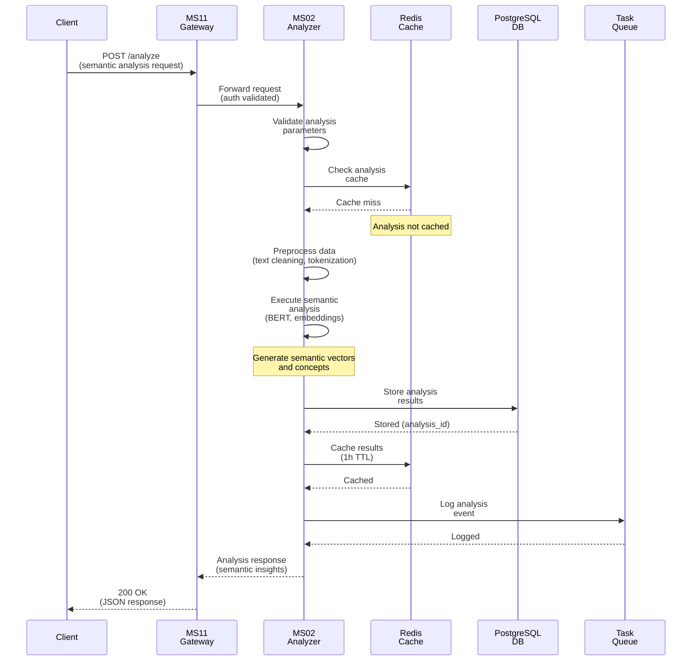
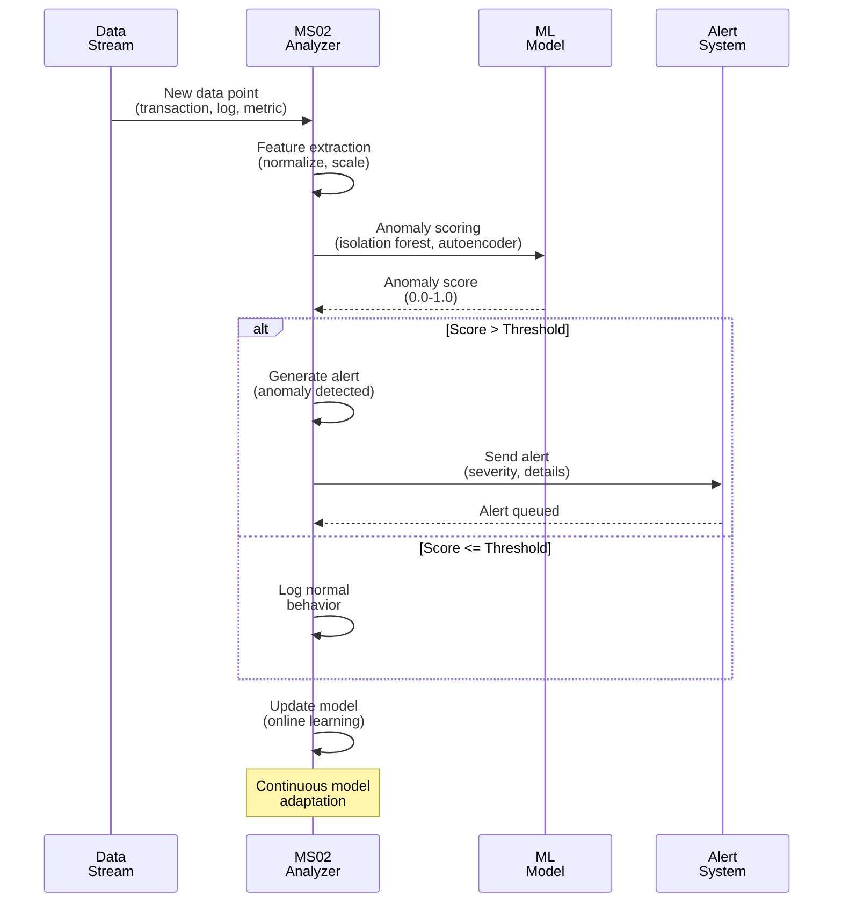
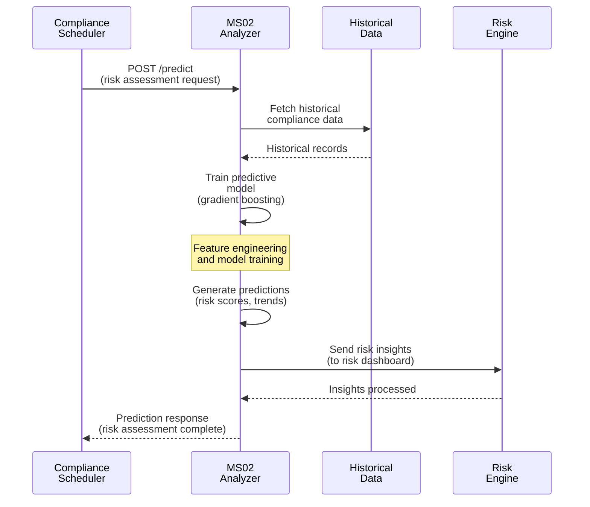

# MS02 - Microservizio Analizzatore Generico

**Navigazione**: [← MS-ARCHITECTURE-MASTER.md](../MS-ARCHITECTURE-MASTER.md) | [README](README.md) | [SPECIFICATION →](SPECIFICATION.md)

---

## Indice

1. [Descrizione del Microservizio](#descrizione-del-microservizio)
2. [Flusso Principale di Analisi](#flusso-principale-di-analisi)
3. [Diagrammi di Sequenza](#diagrammi-di-sequenza)
4. [Payload di Richiesta e Risposta](#payload-di-richiesta-e-risposta)
5. [Stack Tecnologico](#stack-tecnologico)
6. [Documentazione Completa](#documentazione-completa)

---

## Descrizione del Microservizio

### Cos'è MS02?
MS02 è il **motore di analisi intelligente generico** che fornisce capacità analitiche avanzate per l'intero ecosistema ZenIA. Rappresenta il cuore analitico della piattaforma, abilitando l'analisi semantica, il rilevamento di anomalie, l'analisi predittiva e l'intelligenza artificiale applicata.

### Responsabilità Chiave
MS02 fornisce i seguenti servizi analitici:

1. **Analisi Semantica**
   - Analisi del contenuto testuale avanzata
   - Estrazione di concetti e relazioni
   - Analisi del sentiment e del tono
   - Rilevamento di entità e relazioni

2. **Rilevamento di Anomalie**
   - Identificazione di pattern irregolari nei dati
   - Analisi statistica per outlier detection
   - Machine learning per anomaly detection
   - Alert generation per comportamenti anomali

3. **Analisi Predittiva**
   - Forecasting basato su serie temporali
   - Modelli predittivi per rischio e compliance
   - Analisi di trend e pattern
   - Scenario planning e simulazioni

4. **Process Mining e Analytics**
   - Analisi dei flussi di processo
   - Discovery di modelli di processo
   - Analisi delle performance dei processi
   - Identificazione di colli di bottiglia

### Contesto di Integrazione
MS02 rappresenta il **motore analitico centrale** che alimenta molteplici casi d'uso:

```
Dati Strutturati e Non Strutturati
              ↓
        [MS02-ANALYZER]  ← Questo microservizio
              ↓
    ┌─────────┬────────────┬─────────┬─────────┐
    ↓         ↓            ↓         ↓         ↓
  UC1       UC2          UC3       UC4       UC5
(Semantic)(Anomaly)   (Governance)(BPM)  (Document)
 Search    Detection     Risk      Process  Production
```

---

## Flusso Principale di Analisi

Il flusso principale di MS02 descrive il percorso di un task analitico dal ricevimento alla consegna dei risultati:

```
1. INGESTION TASK
   Richiesta di analisi ricevuta (testo, dati, documenti)
   ↓
2. TASK VALIDATION
   - Verifica parametri obbligatori
   - Validazione formato dati
   - Controllo limiti dimensionali
   ↓
3. ANALYSIS TYPE DETERMINATION
   - Identificazione tipo di analisi richiesta
   - Selezione algoritmo appropriato
   - Configurazione parametri specifici
   ↓
4. DATA PREPROCESSING
   - Pulizia e normalizzazione dati
   - Feature extraction
   - Trasformazione in formato analizzabile
   ↓
5. ANALYSIS EXECUTION
   - Esecuzione algoritmo ML/statistico
   - Elaborazione parallela se necessario
   - Monitoraggio progresso e risorse
   ↓
6. RESULT POST-PROCESSING
   - Formattazione risultati
   - Calcolo metriche di confidenza
   - Generazione insights aggiuntivi
   ↓
7. QUALITY VALIDATION
   - Validazione risultati
   - Controllo coerenza
   - Threshold di qualità
   ↓
8. RESULT DELIVERY
   - Restituzione risultati al caller
   - Caching per future richieste
   - Logging audit completo
```

---

## Diagrammi di Sequenza

### Caso 1: Analisi Semantica per Ricerca Documentale (UC1)



### Caso 2: Rilevamento Anomalie in Tempo Reale (UC2)



### Caso 3: Analisi Predittiva per Compliance (UC9)



---

## Payload di Richiesta e Risposta

### Richiesta: Analisi Semantica (POST /analyze/semantic)

#### Input Payload
```json
{
  "analysis_id": "analysis-2024-11-18-001",
  "analysis_type": "semantic",
  "content": {
    "text": "Il contratto di fornitura prevede la consegna entro 30 giorni...",
    "language": "it",
    "domain": "legal"
  },
  "parameters": {
    "extract_entities": true,
    "extract_concepts": true,
    "sentiment_analysis": true,
    "confidence_threshold": 0.7
  },
  "metadata": {
    "source": "document_processor",
    "priority": "normal",
    "callback_url": "http://ms01/callback"
  }
}
```

#### Response: 200 OK (Successo)
```json
{
  "analysis_id": "analysis-2024-11-18-001",
  "analysis_type": "semantic",
  "status": "completed",
  "results": {
    "entities": [
      {
        "text": "contratto di fornitura",
        "type": "LEGAL_DOCUMENT",
        "confidence": 0.92,
        "position": {"start": 3, "end": 23}
      },
      {
        "text": "30 giorni",
        "type": "TIME_PERIOD",
        "confidence": 0.88,
        "position": {"start": 45, "end": 53}
      }
    ],
    "concepts": [
      {
        "concept": "contratto commerciale",
        "relevance": 0.95,
        "category": "legal"
      },
      {
        "concept": "termine di consegna",
        "relevance": 0.87,
        "category": "logistics"
      }
    ],
    "sentiment": {
      "overall": "neutral",
      "confidence": 0.78,
      "aspects": {
        "urgency": "low",
        "risk": "medium"
      }
    }
  },
  "metadata": {
    "processing_time_ms": 245,
    "model_version": "semantic-v3.2",
    "quality_score": 0.91
  },
  "timestamp": "2024-11-18T10:31:15.123Z"
}
```

### Richiesta: Rilevamento Anomalie (POST /analyze/anomaly)

#### Input Payload
```json
{
  "analysis_id": "anomaly-2024-11-18-002",
  "analysis_type": "anomaly_detection",
  "data_points": [
    {
      "timestamp": "2024-11-18T10:00:00Z",
      "features": {
        "transaction_amount": 1500.00,
        "user_location": "Rome",
        "device_type": "desktop",
        "time_of_day": "10:00"
      }
    }
  ],
  "context": {
    "baseline_period_days": 30,
    "sensitivity": "medium",
    "alert_threshold": 0.85
  }
}
```

#### Response: 200 OK
```json
{
  "analysis_id": "anomaly-2024-11-18-002",
  "analysis_type": "anomaly_detection",
  "status": "completed",
  "results": {
    "anomalies_detected": 1,
    "anomaly_score": 0.92,
    "is_anomaly": true,
    "anomaly_type": "transaction_pattern",
    "confidence": 0.89,
    "explanation": "Transaction amount significantly higher than user's historical average",
    "recommended_actions": [
      "flag_for_review",
      "send_alert_to_compliance"
    ]
  },
  "baseline_stats": {
    "average_amount": 245.67,
    "standard_deviation": 89.23,
    "normal_range": {"min": 67.21, "max": 424.13}
  },
  "processing_time_ms": 156
}
```

### Richiesta: Analisi Predittiva (POST /analyze/predictive)

#### Input Payload
```json
{
  "analysis_id": "predict-2024-11-18-003",
  "analysis_type": "predictive",
  "model_type": "time_series_forecasting",
  "data": {
    "time_series": [
      {"timestamp": "2024-10-01", "value": 1200},
      {"timestamp": "2024-10-02", "value": 1350},
      {"timestamp": "2024-11-01", "value": 1180}
    ],
    "forecast_horizon": 30,
    "seasonality": "monthly"
  },
  "parameters": {
    "algorithm": "prophet",
    "confidence_interval": 0.95
  }
}
```

#### Response: 200 OK
```json
{
  "analysis_id": "predict-2024-11-18-003",
  "analysis_type": "predictive",
  "status": "completed",
  "results": {
    "forecast": [
      {
        "timestamp": "2024-11-19",
        "predicted_value": 1420.50,
        "confidence_lower": 1250.30,
        "confidence_upper": 1590.70
      },
      {
        "timestamp": "2024-11-20",
        "predicted_value": 1380.25,
        "confidence_lower": 1210.15,
        "confidence_upper": 1550.35
      }
    ],
    "model_quality": {
      "mae": 45.23,
      "rmse": 67.89,
      "mape": 0.032
    },
    "insights": [
      "Trend crescente del 12% mensile",
      "Stagionalità settimanale rilevata",
      "Picco previsto per venerdì"
    ]
  },
  "processing_time_ms": 890
}
```

### Endpoint: Stato Modelli (GET /models/status)

#### Response: 200 OK
```json
{
  "models": [
    {
      "name": "semantic-analyzer-v3.2",
      "type": "bert-based",
      "active": true,
      "accuracy": 0.94,
      "last_updated": "2024-11-15T14:30:00Z"
    },
    {
      "name": "anomaly-detector-v2.1",
      "type": "isolation-forest",
      "active": true,
      "precision": 0.91,
      "recall": 0.87
    },
    {
      "name": "predictive-model-v1.8",
      "type": "gradient-boosting",
      "active": true,
      "feature_importance": {
        "historical_trend": 0.35,
        "seasonal_pattern": 0.28,
        "external_factors": 0.22
      }
    }
  ],
  "cache_stats": {
    "total_cached": 45230,
    "cache_hit_rate": 0.82,
    "cache_size_mb": 1245
  }
}
```

### Endpoint: Health Check (GET /health)

#### Response: 200 OK
```json
{
  "status": "healthy",
  "service": "MS02-ANALYZER",
  "uptime_seconds": 345600,
  "models_loaded": true,
  "database_connected": true,
  "cache_connected": true,
  "last_analysis": "2024-11-18T10:45:30Z",
  "analyses_processed": 125430
}
```

---

## Stack Tecnologico

### Linguaggi e Framework
- **Linguaggio**: Python 3.10+
- **API Framework**: FastAPI (async endpoints)
- **ML Framework**: scikit-learn, TensorFlow, PyTorch
- **NLP**: spaCy, transformers (Hugging Face)

### Persistenza e Cache
- **Database**: PostgreSQL (risultati analisi, metadati modelli)
- **Cache**: Redis (risultati analisi, modelli caricati)

### Infrastruttura
- **Container**: Docker
- **Orchestrazione**: Kubernetes
- **Service Discovery**: MS16-REGISTRY
- **Configurazione**: MS15-CONFIG
- **Monitoraggio**: MS08-MONITOR
- **Security**: MS13-SECURITY

### Dipendenze Inter-Servizio
- **Input da**: Dati da MS01, MS07, MS10, sistemi esterni
- **Output a**: Risultati analitici per MS03, MS04, MS12, dashboard
- **Condiviso con**: MS01 (classificazione), MS10 (analytics avanzate)
- **Infrastruttura**: MS15-CONFIG, MS16-REGISTRY, MS13-SECURITY

---

## Documentazione Completa

### Guida Veloce per Sviluppatori
1. Vedi [SPECIFICATION.md](SPECIFICATION.md) per **specifiche tecniche dettagliate**
2. Consulta [API.md](API.md) per **riferimento endpoint API completo**
3. Studia [DATABASE-SCHEMA.md](DATABASE-SCHEMA.md) per **schema database e indici**
4. Leggi [TROUBLESHOOTING.md](TROUBLESHOOTING.md) per **risoluzione problemi comuni**

### File di Supporto
- `docker-compose.yml`: Setup locale con PostgreSQL + Redis
- `kubernetes/deployment.yaml`: Deployment Kubernetes per produzione
- `examples/`: Campioni richieste/risposte per testing
- `init-schema.sql`: Script DDL inizializzazione database

---

**Navigazione**: [← MS-ARCHITECTURE-MASTER.md](../MS-ARCHITECTURE-MASTER.md) | [README](README.md) | [SPECIFICATION →](SPECIFICATION.md)
