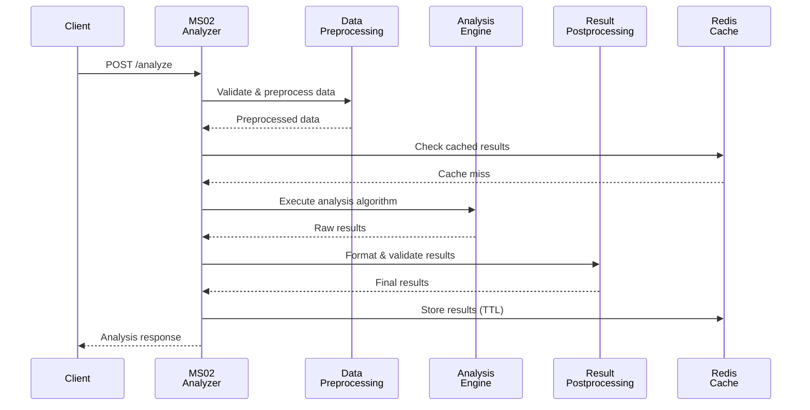
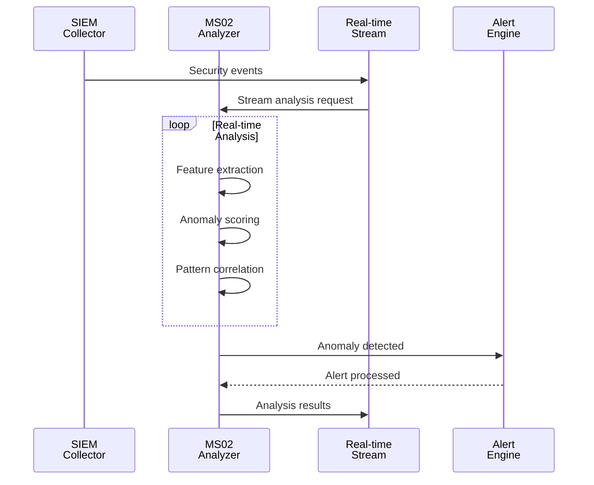

# MS02 - Analizzatore Generico - Specifica Dettagliata

**Navigazione**: [← README.md](README.md) | [SPECIFICATION](SPECIFICATION.md) | [API →](API.md)

## Indice

1. [Panoramica Generale](#panoramica-generale)
2. [Responsabilità Principali](#responsabilità-principali)
3. [Integrazione con i Casi d'Uso](#integrazione-con-i-casi-duso)
4. [Modelli Dati](#modelli-dati)
5. [SLA di Prestazione](#sla-di-prestazione)
6. [Diagrammi di Sequenza](#diagrammi-di-sequenza)
7. [Architettura](#architettura)
8. [Sicurezza e Conformità](#sicurezza-e-conformità)
9. [Distribuzione](#distribuzione)

---

## Panoramica Generale
MS02 fornisce analisi intelligente generica per l'intero ecosistema ZenIA, supportando analisi semantica, rilevamento anomalie, analisi predittiva e process mining. Il microservizio elabora dati strutturati e non strutturati per estrarre insights, identificare pattern e supportare decisioni automatizzate.

[↑ Torna al Indice](#indice)

---

## Responsabilità Principali

### 1. Analisi Semantica e NLP
- **Elaborazione del linguaggio naturale**: Tokenizzazione, POS tagging, dependency parsing
- **Estrazione entità**: Rilevamento nomi, date, importi, organizzazioni
- **Analisi concetti**: Identificazione temi e argomenti principali
- **Analisi sentiment**: Determinazione tono e atteggiamento del testo

### 2. Rilevamento Anomalie
- **Analisi statistica**: Z-score, percentile analysis, outlier detection
- **Machine Learning**: Isolation Forest, Autoencoder, One-Class SVM
- **Time Series Analysis**: Seasonal decomposition, trend analysis
- **Pattern Recognition**: Sequence mining, frequent pattern discovery

### 3. Analisi Predittiva
- **Forecasting**: ARIMA, Prophet, LSTM per previsioni temporali
- **Classification**: Gradient Boosting, Random Forest per predizioni categoriche
- **Regression**: Linear regression, polynomial regression per valori continui
- **Risk Assessment**: Modelli di scoring per valutazione rischi

### 4. Process Mining e Analytics
- **Process Discovery**: Algoritmi Alpha, Heuristic miner per discovery processi
- **Conformance Checking**: Verifica conformità processi vs modelli
- **Performance Analysis**: Throughput, waiting times, bottlenecks
- **Process Optimization**: Suggerimenti miglioramento efficienza

[↑ Torna al Indice](#indice)

---

## Integrazione con i Casi d'Uso

### UC1 - Sistema di Gestione Documentale
- Analisi semantica per ricerca avanzata documenti
- Estrazione concetti per categorizzazione automatica
- Generazione riassunti automatici

### UC2 - Protocollo Informatico
- Rilevamento anomalie in protocolli e corrispondenza
- Analisi pattern irregolari in flussi documentali
- Validazione conformità procedure protocollari

### UC3 - Governance
- Analisi rischi in processi amministrativi
- Process mining per ottimizzazione governance
- Forecasting workload per capacity planning

### UC4 - BPM e Automazione Processi
- Process mining per discovery workflow
- Forecasting colli di bottiglia
- Analisi performance processi esistenti

### UC5 - Produzione Documentale Integrata
- Analisi qualità contenuto documenti
- Estrazione entità per template population
- Validazione semantica documenti generati

### UC8 - Integrazione con SIEM
- Analisi correlazione eventi di sicurezza
- Rilevamento pattern anomalie in log
- Forecasting tendenze sicurezza

### UC9 - Compliance & Risk Management
- Risk assessment predittivo
- Analisi compliance avanzata
- Forecasting violazioni regolamentari

### UC10 - Supporto all'Utente
- Analisi sentiment feedback utenti
- Forecasting ticket volume
- Classificazione automatica richieste supporto

### UC11 - Analisi Dati e Reporting
- Analytics real-time per dashboard
- Forecasting metriche business
- Analisi predittiva performance

[↑ Torna al Indice](#indice)

---

## Modelli Dati

### Richiesta di Analisi Generica
```json
{
  "analysis_id": "analysis-2024-11-18-001",
  "analysis_type": "semantic|anomaly|predictive|process_mining",
  "input_data": {
    "content": "Testo o dati da analizzare",
    "format": "text|json|csv|binary",
    "metadata": {
      "source": "system_component",
      "domain": "business_domain",
      "language": "it|en|fr"
    }
  },
  "parameters": {
    "algorithm": "specific_algorithm",
    "confidence_threshold": 0.8,
    "max_processing_time": 30000
  },
  "output_format": "json|xml|binary"
}
```

### Risposta di Analisi Completata
```json
{
  "analysis_id": "analysis-2024-11-18-001",
  "status": "completed|failed|partial",
  "results": {
    "insights": [],
    "metrics": {},
    "confidence_score": 0.92,
    "processing_metadata": {
      "algorithm_used": "bert-base-italian",
      "processing_time_ms": 1250,
      "model_version": "v3.2"
    }
  },
  "warnings": [],
  "timestamp": "2024-11-18T10:31:15.123Z"
}
```

[↑ Torna al Indice](#indice)

---

## SLA di Prestazione

| Tipo Analisi | Latenza Target | Throughput | Accuratezza |
|-------------|----------------|------------|-------------|
| Analisi Semantica | < 2 secondi | 50 req/sec | > 90% |
| Rilevamento Anomalie | < 500ms | 100 req/sec | > 85% |
| Analisi Predittiva | < 5 secondi | 20 req/sec | > 80% |
| Process Mining | < 10 secondi | 5 req/sec | > 95% |

[↑ Torna al Indice](#indice)

---

## Diagrammi di Sequenza

### Flusso Principale: Pipeline di Analisi



### Analisi in Tempo Reale per SIEM (UC8)



[↑ Torna al Indice](#indice)

---

## Gestione Errori

### Scenari di Errore Comuni

1. **Timeout Query**
   - Descrizione: Query supera tempo limite di esecuzione
   - Causa: Query complessa o dati voluminosi
   - Mitigation: Implementare timeout configurabile e fallback

2. **Connessione Database**
   - Descrizione: Perdita connessione ai servizi dipendenti
   - Causa: Servizio non disponibile o problemi rete
   - Mitigation: Retry logic con exponential backoff

3. **Validazione Dati**
   - Descrizione: Input non valido o formato errato
   - Causa: Client fornisce dati non conformi
   - Mitigation: Validazione input e error messages chiari

### Error Codes

| Code | Status | Descrizione | Azione |
|------|--------|-------------|--------|
| 400 | Bad Request | Input non valido | Correggi parametri request |
| 408 | Timeout | Operazione timeout | Riprova con parametri ridotti |
| 500 | Internal Error | Errore interno | Contatta supporto |
| 503 | Service Unavailable | Servizio non disponibile | Riprova più tardi |

### Recovery Procedures

- **Automatic Retry**: Sistema riprova automaticamente con backoff esponenziale
- **Graceful Degradation**: Fallback a cache o risultati parziali se disponibili
- **Error Logging**: Tutti gli errori registrati per analisi e monitoring
- **Alerting**: Notifiche su errori critici ai team di supporto

## Architettura

MS02 è strutturato con una **architettura modulare basata su 7 componenti principali**. Ciascun componente ha una responsabilità specifica nel pipeline di analisi.

### Componente 1: Request Intake Handler

**Responsabilità**: Riceve e valida le richieste di analisi prima dell'elaborazione.

**Funzioni Specifiche**:
- Verifica della presenza di campi obbligatori (`analysis_id`, `analysis_type`, `input_data`)
- Validazione del tipo di analisi supportato
- Controllo dimensione dati di input (min: 1KB, max: 50MB)
- Generazione dell'ID univoco per tracciamento

**Input Payload**:
```json
{
  "analysis_id": "analysis-2024-11-18-001",
  "analysis_type": "semantic",
  "input_data": {
    "content": "testo da analizzare",
    "format": "text"
  }
}
```

**Output al Passo Successivo**:
```json
{
  "analysis_id": "analysis-2024-11-18-001",
  "validated_request": {
    "type": "semantic",
    "data_size": 1024,
    "validation_status": "PASS"
  }
}
```

---

### Componente 2: Data Preprocessing Pipeline

**Responsabilità**: Prepara e normalizza i dati per l'analisi algoritmica.

**Funzioni Specifiche**:
- **Pulizia dati**: rimozione rumore, normalizzazione testo
- **Tokenizzazione**: suddivisione in token per NLP
- **Feature extraction**: estrazione caratteristiche rilevanti
- **Formattazione**: conversione in formato adatto agli algoritmi

**Processo di Preprocessing**:
```
Input Data
    ├─ Clean & Normalize → Cleaned Text
    ├─ Tokenize → Tokens Array
    ├─ Extract Features → Feature Vector
    └─ Format for Model → Model Input
```

**Output Features**:
```json
{
  "preprocessed_data": {
    "tokens": ["token1", "token2"],
    "features": {
      "word_count": 150,
      "language": "it",
      "sentiment_score": 0.7
    },
    "model_input": "formatted_data"
  }
}
```

---

### Componente 3: Analysis Orchestrator

**Responsabilità**: Coordina l'esecuzione degli algoritmi di analisi appropriati.

**Funzioni Specifiche**:
- Selezione algoritmo basato su `analysis_type`
- Orchestrazione pipeline sequenziale o parallela
- Gestione timeout e risorse
- Aggregazione risultati parziali

**Logica di Orchestrazione**:
```
Analysis Type
    ├─ semantic → NLP Pipeline
    │   └─ BERT → Sentiment → Entities
    ├─ anomaly → ML Pipeline
    │   └─ Isolation Forest → Statistical Tests
    ├─ predictive → Forecasting Pipeline
    │   └─ ARIMA → LSTM → Ensemble
    └─ process_mining → Discovery Pipeline
        └─ Alpha Algorithm → Conformance Check
```

**Output Orchestration**:
```json
{
  "orchestration_plan": {
    "algorithms": ["bert", "sentiment"],
    "execution_order": "sequential",
    "estimated_time_ms": 2000
  }
}
```

---

### Componente 4: ML Model Executor

**Responsabilità**: Esegue i modelli di machine learning per l'analisi.

**Strategie di Esecuzione**:

**1. Semantic Analysis**
```
Text Input → BERT Model → Embeddings → Classification
```

**2. Anomaly Detection**
```
Data → Feature Extraction → ML Model → Anomaly Score
```

**3. Predictive Analysis**
```
Time Series → Preprocessing → Forecasting Model → Predictions
```

**Output Esecuzione**:
```json
{
  "execution_results": {
    "algorithm": "bert-semantic",
    "raw_output": {
      "embeddings": [0.1, 0.2, 0.3],
      "probabilities": [0.8, 0.15, 0.05]
    },
    "confidence": 0.92,
    "execution_time_ms": 450
  }
}
```

---

### Componente 5: Result Processor

**Responsabilità**: Elabora e formatta i risultati dell'analisi.

**Funzioni Specifiche**:
- **Interpretazione risultati**: conversione output raw in insights
- **Validazione**: controllo qualità e coerenza risultati
- **Arricchimento**: aggiunta metadati e contesto
- **Formattazione**: output nel formato richiesto

**Processo di Processing**:
```
Raw Results
    ├─ Interpret → Insights
    ├─ Validate → Quality Check
    ├─ Enrich → Metadata Addition
    └─ Format → Final Output
```

**Output Finale**:
```json
{
  "processed_results": {
    "insights": [
      {
        "type": "sentiment",
        "value": "positive",
        "confidence": 0.88
      }
    ],
    "metrics": {
      "accuracy": 0.92,
      "processing_time": 1250
    }
  }
}
```

---

### Componente 6: Caching Layer

**Responsabilità**: Gestisce la cache per ottimizzare performance.

**Funzioni Specifiche**:
- Lookup cache basato su hash input
- Storage risultati con TTL
- Invalidazione cache su aggiornamenti modello
- Statistiche hit/miss

**Cache Structure**:
```json
{
  "cache_key": "hash:input_data",
  "results": {
    "analysis_type": "semantic",
    "insights": [],
    "cached_at": "2024-11-18T10:30:00Z",
    "expires_at": "2024-11-19T10:30:00Z"
  }
}
```

---

### Componente 7: Metrics Collector

**Responsabilità**: Raccoglie metriche di performance e accuratezza.

**Metriche Raccogliete**:
- Latenza esecuzione algoritmi
- Accuratezza risultati vs ground truth
- Throughput richieste/secondo
- Utilizzo risorse (CPU, memoria)

**Output Metriche**:
```json
{
  "metrics": {
    "analysis_type": "semantic",
    "latency_ms": 1250,
    "accuracy": 0.92,
    "throughput_req_per_sec": 45,
    "resource_usage": {
      "cpu_percent": 65,
      "memory_mb": 1024
    }
  }
}
```

---

### Integrazioni Esterne

MS02 si integra con i seguenti microservizi:

| Microservizio | Funzione | Tipo Integrazione |
|---|---|---|
| **MS01-CLASSIFIER** | Input dati classificati | Sincrono (call) |
| **MS03-ORCHESTRATOR** | Orchestrazione analisi | Asincrono (queue) |
| **MS08-MONITOR** | Metriche performance | Asincrono (publish) |
| **MS14-AUDIT** | Logging audit analisi | Asincrono (queue) |
| **MS15-CONFIG** | Configurazione algoritmi | Sincrono (load) |

[↑ Torna al Indice](#indice)

---

## Sicurezza e Conformità

### Protezione dei Dati
- Crittografia end-to-end per dati sensibili
- Tokenizzazione per PII nei log
- Access control basato su ruoli per algoritmi

### Audit Trail
- Logging completo di tutte le analisi eseguite
- Tracciabilità versioni modelli utilizzati
- Audit parametri di configurazione

[↑ Torna al Indice](#indice)

---

## Distribuzione

### Configurazione Container
- **Immagine Base**: python:3.10-slim
- **Porta**: 8002
- **Risorse**: CPU 2-4 core, RAM 4-8GB
- **GPU**: Opzionale per accelerazione ML

### Requisiti Kubernetes
- Horizontal Pod Autoscaling basato su CPU/utilizzo
- Configurazione per GPU se disponibile
- Persistent volume per modelli ML

### Variabili d'Ambiente
- `ANALYSIS_MODELS_PATH`: Path modelli ML
- `MAX_ANALYSIS_TIME`: Timeout analisi massima
- `CACHE_TTL_ANALYSIS`: TTL cache risultati

[↑ Torna al Indice](#indice)

---

**Navigazione**: [← README.md](README.md) | [SPECIFICATION](SPECIFICATION.md) | [API →](API.md)
