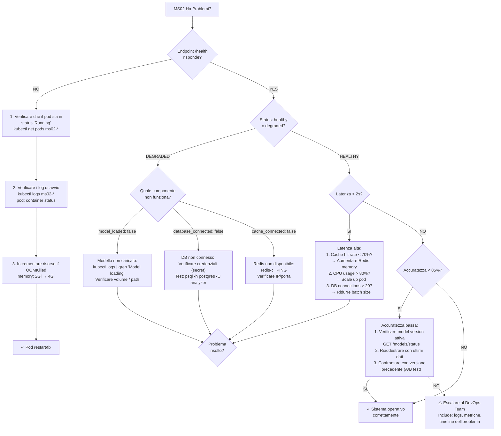

# MS02 - Guida per la Risoluzione dei Problemi

**Navigazione**: [← DATABASE-SCHEMA.md](DATABASE-SCHEMA.md) | [TROUBLESHOOTING](TROUBLESHOOTING.md) | [Back to MS →](../MS-ARCHITECTURE-MASTER.md#ms02--analyzer)

## Indice

1. [Workflow Diagnostico Rapido](#workflow-diagnostico-rapido)
2. [Problemi Comuni e Soluzioni](#problemi-comuni-e-soluzioni)
3. [Endpoint di Controllo Salute](#endpoint-di-controllo-salute)
4. [Livelli di Log e Debug](#livelli-di-log-e-debug)
5. [Lista di Controllo Ottimizzazione Prestazioni](#lista-di-controllo-ottimizzazione-prestazioni)

---

## Workflow Diagnostico Rapido

Se MS02 ha problemi, seguire questo diagramma di diagnostic flow:



### Checklist di Diagnostica Rapida (5 minuti)

```bash
# 1. Health Check
curl http://ms02-analyzer:8002/api/v1/health -v

# 2. Se degraded, controllare componenti
curl http://ms02-analyzer:8002/models/status

# 3. Verificare logs recenti
kubectl logs ms02-analyzer-pod -n production --tail=50

# 4. Metriche di sistema
kubectl top pod ms02-analyzer-pod --containers

# 5. Database connectivity
kubectl exec -it ms02-analyzer-pod -- \
  psql -h postgres -U analyzer_service -d zenia_analyzer \
  -c "SELECT version();"

# 6. Redis connectivity
kubectl exec -it ms02-analyzer-pod -- redis-cli ping

# 7. Verificare configurazione attiva
kubectl get configmap ms02-config -o yaml | grep -A5 "ANALYSIS_THRESHOLD"
```

---

## Problemi Comuni e Soluzioni

### Problema 1: Timeout di Analisi (> 5 secondi)

**Sintomi**
- Le richieste API si timeout dopo 30 secondi
- I log mostrano "Motore di analisi non responsivo"
- Le metriche di latenza superano la soglia

**Cause Radice**
1. Modello ML ancora in caricamento
2. Livello cache non disponibile
3. Pool di connessioni database esaurito
4. Utilizzo elevato di CPU/memoria

**Soluzioni**

Verificare lo stato di caricamento del modello:
```
GET /models/status
```

Verificare la connessione a Redis:
```
docker exec ms02-analyzer redis-cli ping
# Should respond: PONG
```

Controllare le connessioni al database:
```json
{
  "query": "SELECT count(*) FROM pg_stat_activity WHERE datname = 'zenia_analyzer';"
}
```

Monitorare l'utilizzo delle risorse:
```
kubectl top pod ms02-analyzer-pod
```

**Prevenzione**
- Implementare il caching del modello all'avvio
- Abilitare il pre-warming di Redis
- Impostare pool connessioni database a 20+
- Configurare HPA basato su latenza

---

### Problema 2: Bassa Accuratezza di Analisi (< 85%)

**Sintomi**
- Risultati di analisi incoerenti
- Reclami utenti su analisi errate
- Metriche accuratezza sotto soglia

**Cause Radice**
1. Modello attivo obsoleto
2. Nuovi tipi di dati non nei dati di training
3. Errore di rilevamento lingua
4. Model drift

**Soluzioni**

Verificare la versione attiva del modello:
```
GET /models/status
```

Confrontare le metriche di accuratezza:
```json
{
  "models": [
    {
      "version": "v2.1",
      "accuracy": 0.88
    },
    {
      "version": "v2.0",
      "accuracy": 0.82
    }
  ]
}
```

Rivedere i pattern di errore:
```json
{
  "failed_analyses": [
    {
      "analysis_type": "semantic",
      "error_rate": 0.15
    }
  ]
}
```

Riaddestrare il modello con dati recenti.

**Prevenzione**
- Monitorare accuratezza giornalmente (> 0.85)
- Riaddestrare modello mensilmente
- Test A/B nuovi modelli

---

### Problema 3: Oscillazione della Cache

**Sintomi**
- Tasso hit cache scende sotto 50%
- Alto utilizzo memoria
- Latenza analisi aumenta

**Cause Radice**
1. Politica eliminazione cache aggressiva
2. TTL troppo breve
3. Cache non pre-riscaldata

**Soluzioni**

Verificare statistiche cache:
```
GET /models/status  # Includes cache_stats
```

Ottimizzare cache:
- Aumentare memoria Redis a 4Gi
- Regolare TTL su 24 ore
- Abilitare compressione

**Prevenzione**
- Monitorare tasso hit cache ogni ora
- Avvertire se hit_rate < 0.70

---

## Endpoint di Controllo Salute

```
GET /health
```

Risposta indica:
- Stato servizio (healthy/degraded/unhealthy)
- Stato caricamento modello
- Connettività database
- Connettività cache
- Ultima analisi riuscita
- Numero richieste elaborate

---

## Livelli di Log e Debug

### Abilitare Debug Logging
```
kubectl set env deployment/ms02-analyzer LOG_LEVEL=DEBUG
```

### Visualizzare Log in Tempo Reale
```
kubectl logs -f ms02-analyzer-pod -c analyzer --timestamps=true
```

### Pattern di Log Comuni

| Pattern | Significato | Azione |
|---------|---------|--------|
| `Model loading from /models/v2.1` | Avvio normale | Monitorare completamento |
| `Cache hit rate: 0.78` | Cache salutare | Nessuna azione |
| `Analysis confidence below threshold` | Bassa confidenza | Possibile revisione |
| `Database connection timeout` | Problema critico | Verificare database |
| `OOMKilled by kubelet` | Memoria superata | Aumentare limiti |

---

## Lista di Controllo Ottimizzazione Prestazioni

- [ ] Tasso hit cache > 0.75
- [ ] Latenza p50 < 2 secondi
- [ ] Accuratezza modello > 0.85
- [ ] Utilizzo memoria < 3Gi
- [ ] Utilizzo CPU < 2000m
- [ ] Connessioni database < 20
- [ ] Uptime > 99.95%

---

**Navigazione**: [← DATABASE-SCHEMA.md](DATABASE-SCHEMA.md) | [TROUBLESHOOTING](TROUBLESHOOTING.md) | [Back to MS →](../MS-ARCHITECTURE-MASTER.md#ms02--analyzer)