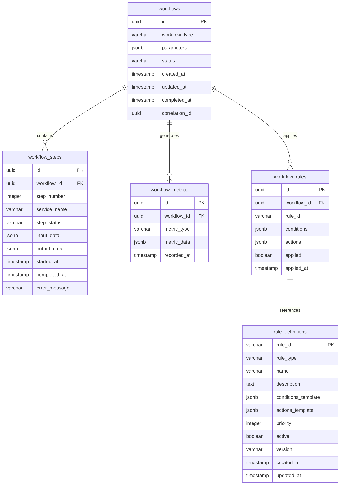

# MS03 - Orchestratore - Schema Database

**Navigazione**: [← API.md](API.md) | [DATABASE-SCHEMA](DATABASE-SCHEMA.md) | [TROUBLESHOOTING →](TROUBLESHOOTING.md)

## Indice

1. [Panoramica Database](#panoramica-database)
2. [Diagramma ER](#diagramma-er)
3. [Tabelle Principali](#tabelle-principali)
   - [workflows](#workflows)
   - [workflow_steps](#workflow_steps)
   - [workflow_rules](#workflow_rules)
   - [workflow_metrics](#workflow_metrics)
   - [rule_definitions](#rule_definitions)
4. [Esempi JSON](#esempi-json)

---

## Panoramica Database

MS03 utilizza PostgreSQL per la persistenza dello stato dei workflow e delle regole business. Il database è ottimizzato per operazioni OLTP con supporto per transazioni distribuite e audit trail completo.

**Tecnologie**:
- PostgreSQL 15+
- Connection pooling con PgBouncer
- Replica per alta disponibilità

[↑ Torna al Indice](#indice)

---

## Diagramma ER



[↑ Torna al Indice](#indice)

---

## Tabelle Principali

### workflows

Tabella principale per la gestione dei workflow orchestrati.

| Campo | Tipo | Nullable | Descrizione |
|-------|------|----------|-------------|
| `id` | UUID | NO | Primary key, ID univoco workflow |
| `workflow_type` | VARCHAR(50) | NO | Tipo workflow (document_generation, signature_workflow, etc.) |
| `parameters` | JSONB | NO | Parametri workflow in formato JSON |
| `status` | VARCHAR(20) | NO | Stato corrente (started, running, paused, completed, failed, cancelled) |
| `created_at` | TIMESTAMP | NO | Timestamp creazione |
| `updated_at` | TIMESTAMP | YES | Timestamp ultimo aggiornamento |
| `completed_at` | TIMESTAMP | YES | Timestamp completamento |
| `correlation_id` | UUID | YES | ID correlazione per tracciamento distribuito |

**Indici**:
- PRIMARY KEY su `id`
- INDEX su `workflow_type`
- INDEX su `status`
- INDEX su `created_at`
- INDEX su `correlation_id`

[↑ Torna al Indice](#indice)

---

### workflow_steps

Traccia l'esecuzione dei singoli passi di ogni workflow.

| Campo | Tipo | Nullable | Descrizione |
|-------|------|----------|-------------|
| `id` | UUID | NO | Primary key |
| `workflow_id` | UUID | NO | Foreign key verso workflows |
| `step_number` | INTEGER | NO | Numero sequenziale del passo |
| `service_name` | VARCHAR(100) | NO | Nome del microservizio eseguito |
| `step_status` | VARCHAR(20) | NO | Stato passo (pending, running, completed, failed) |
| `input_data` | JSONB | YES | Dati input al passo |
| `output_data` | JSONB | YES | Dati output dal passo |
| `started_at` | TIMESTAMP | YES | Timestamp inizio esecuzione |
| `completed_at` | TIMESTAMP | YES | Timestamp completamento |
| `error_message` | TEXT | YES | Messaggio errore se fallito |

**Indici**:
- PRIMARY KEY su `id`
- FOREIGN KEY su `workflow_id` REFERENCES workflows(id)
- INDEX su `workflow_id`, `step_number`
- INDEX su `service_name`
- INDEX su `step_status`

[↑ Torna al Indice](#indice)

---

### workflow_rules

Registra quali regole business sono state applicate a ciascun workflow.

| Campo | Tipo | Nullable | Descrizione |
|-------|------|----------|-------------|
| `id` | UUID | NO | Primary key |
| `workflow_id` | UUID | NO | Foreign key verso workflows |
| `rule_id` | VARCHAR(100) | NO | ID della regola applicata |
| `conditions` | JSONB | NO | Condizioni che hanno attivato la regola |
| `actions` | JSONB | NO | Azioni eseguite dalla regola |
| `applied` | BOOLEAN | NO | Se la regola è stata applicata con successo |
| `applied_at` | TIMESTAMP | YES | Quando la regola è stata applicata |

**Indici**:
- PRIMARY KEY su `id`
- FOREIGN KEY su `workflow_id` REFERENCES workflows(id)
- INDEX su `workflow_id`
- INDEX su `rule_id`

[↑ Torna al Indice](#indice)

---

### workflow_metrics

Metriche di performance e monitoraggio per ogni workflow.

| Campo | Tipo | Nullable | Descrizione |
|-------|------|----------|-------------|
| `id` | UUID | NO | Primary key |
| `workflow_id` | UUID | NO | Foreign key verso workflows |
| `metric_type` | VARCHAR(50) | NO | Tipo metrica (performance, error, timing) |
| `metric_data` | JSONB | NO | Dati metrica in formato JSON |
| `recorded_at` | TIMESTAMP | NO | Timestamp registrazione metrica |

**Indici**:
- PRIMARY KEY su `id`
- FOREIGN KEY su `workflow_id` REFERENCES workflows(id)
- INDEX su `workflow_id`, `metric_type`
- INDEX su `recorded_at`

[↑ Torna al Indice](#indice)

---

### rule_definitions

Definizioni delle regole business configurabili.

| Campo | Tipo | Nullable | Descrizione |
|-------|------|----------|-------------|
| `rule_id` | VARCHAR(100) | NO | Primary key, ID univoco regola |
| `rule_type` | VARCHAR(20) | NO | Tipo regola (business, routing, validation) |
| `name` | VARCHAR(200) | NO | Nome descrittivo regola |
| `description` | TEXT | YES | Descrizione dettagliata |
| `conditions_template` | JSONB | NO | Template condizioni regola |
| `actions_template` | JSONB | NO | Template azioni regola |
| `priority` | INTEGER | NO | Priorità esecuzione (1-100, 100=max) |
| `active` | BOOLEAN | NO | Se la regola è attiva |
| `version` | VARCHAR(20) | NO | Versione regola |
| `created_at` | TIMESTAMP | NO | Timestamp creazione |
| `updated_at` | TIMESTAMP | YES | Timestamp ultimo aggiornamento |

**Indici**:
- PRIMARY KEY su `rule_id`
- INDEX su `rule_type`
- INDEX su `active`
- INDEX su `priority`

[↑ Torna al Indice](#indice)

---

## Esempi JSON

### Workflow Parameters
```json
{
  "workflow_type": "document_generation",
  "parameters": {
    "input_data": {
      "document_type": "invoice",
      "template_id": "inv-001",
      "customer_data": {
        "id": "cust-123",
        "name": "ACME Corp",
        "tax_id": "IT12345678901"
      },
      "items": [
        {
          "description": "Software License",
          "quantity": 1,
          "unit_price": 1000.00,
          "total": 1000.00
        }
      ]
    },
    "options": {
      "priority": "high",
      "deadline": "2024-11-18T12:00:00Z",
      "output_format": "pdf",
      "delivery_method": "email"
    },
    "metadata": {
      "requester": "erp_system",
      "correlation_id": "req-2024-11-18-001",
      "business_unit": "sales"
    }
  }
}
```

### Workflow Step Data
```json
{
  "step_number": 2,
  "service_name": "ms05_transformer",
  "step_status": "completed",
  "input_data": {
    "template_id": "inv-001",
    "customer_data": {
      "name": "ACME Corp",
      "address": "Via Roma 123, Milano"
    },
    "invoice_data": {
      "number": "INV-2024-001",
      "date": "2024-11-18",
      "total": 1220.00
    }
  },
  "output_data": {
    "generated_document": {
      "id": "doc-2024-11-18-001",
      "format": "pdf",
      "size_bytes": 245760,
      "checksum": "a1b2c3d4e5f6..."
    },
    "validation_results": {
      "template_applied": true,
      "data_integrity": "passed",
      "format_compliance": "passed"
    }
  },
  "started_at": "2024-11-18T10:32:15Z",
  "completed_at": "2024-11-18T10:35:42Z"
}
```

### Rule Definition
```json
{
  "rule_id": "rule_compliance_check",
  "rule_type": "business",
  "name": "Controllo Conformità Fatturazione",
  "description": "Verifica conformità fiscale per fatture oltre €1000",
  "conditions_template": {
    "document_type": "invoice",
    "total_amount": {
      "operator": ">",
      "value": 1000
    },
    "customer_type": "business"
  },
  "actions_template": [
    {
      "action_type": "add_step",
      "service": "ms06_validator",
      "parameters": {
        "validation_type": "tax_compliance"
      }
    },
    {
      "action_type": "set_priority",
      "value": "high"
    }
  ],
  "priority": 80,
  "active": true,
  "version": "2.1"
}
```

### Workflow Metrics
```json
{
  "workflow_id": "wf-2024-11-18-001",
  "metric_type": "performance",
  "metric_data": {
    "total_execution_time_ms": 450000,
    "step_execution_times": {
      "ms01_classifier": 25000,
      "ms05_transformer": 180000,
      "ms06_validator": 120000,
      "ms07_signer": 125000
    },
    "queue_time_ms": 15000,
    "resource_usage": {
      "cpu_percent": 45.2,
      "memory_mb": 256,
      "network_io_kb": 1250
    },
    "success_rate": 1.0,
    "error_count": 0
  },
  "recorded_at": "2024-11-18T10:37:30Z"
}
```

[↑ Torna al Indice](#indice)

---

**Navigazione**: [← API.md](API.md) | [DATABASE-SCHEMA](DATABASE-SCHEMA.md) | [TROUBLESHOOTING →](TROUBLESHOOTING.md)