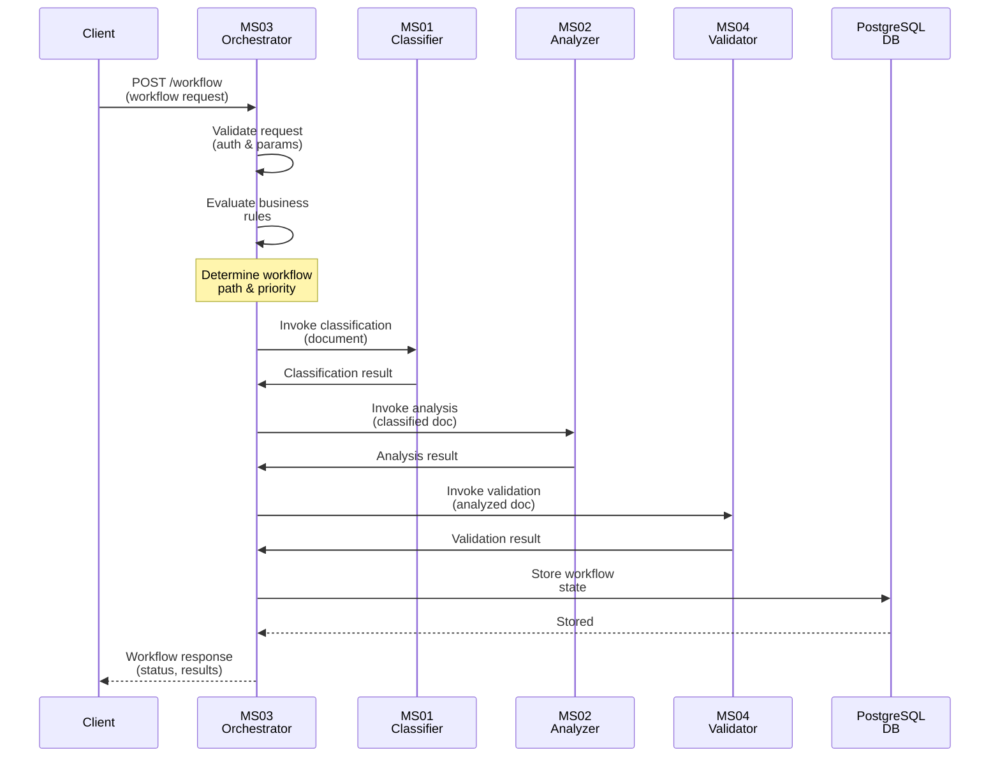
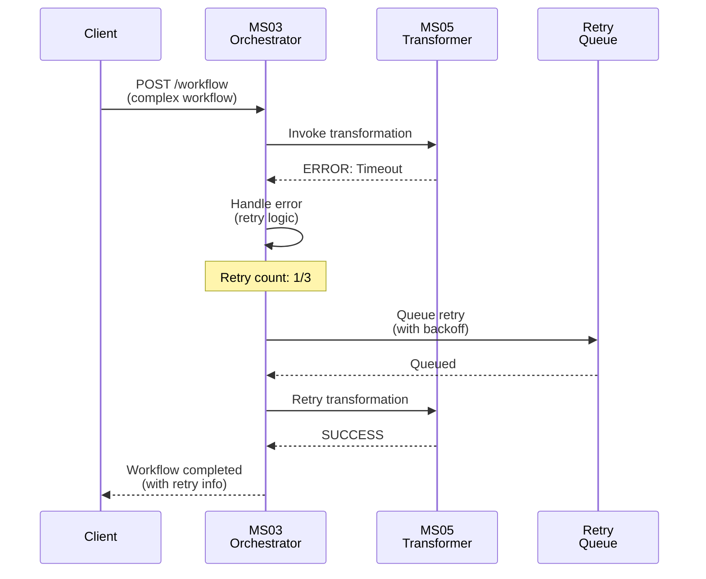
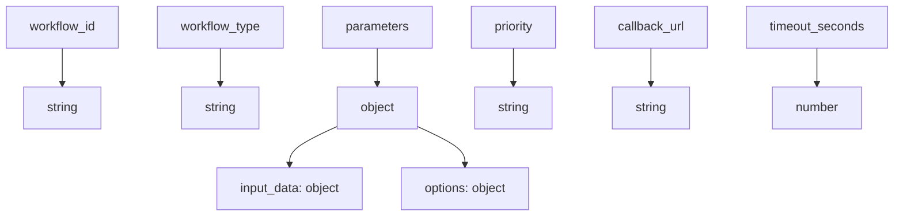
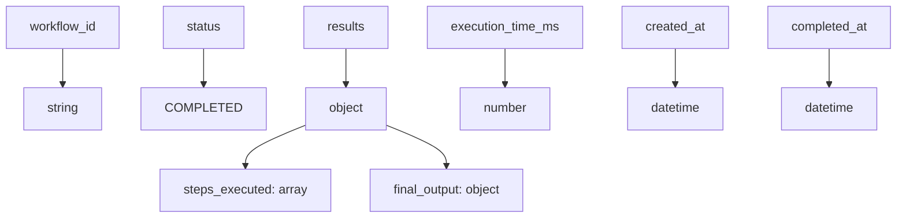

# MS03 - Microservizio Orchestratore

**Navigazione**: [← MS-ARCHITECTURE-MASTER.md](../MS-ARCHITECTURE-MASTER.md) | [README](README.md) | [SPECIFICATION →](SPECIFICATION.md)

---

## Indice

1. [Descrizione del Microservizio](#descrizione-del-microservizio)
2. [Flusso Principale di Orchestrazione](#flusso-principale-di-orchestrazione)
3. [Diagrammi di Sequenza](#diagrammi-di-sequenza)
4. [Payload di Richiesta e Risposta](#payload-di-richiesta-e-risposta)
5. [Stack Tecnologico](#stack-tecnologico)
6. [Documentazione Completa](#documentazione-completa)

---

## Descrizione del Microservizio

### Cos'è MS03?
MS03 è il **motore di orchestrazione intelligente** che coordina l'esecuzione dei workflow documentali nel pipeline integrato. Rappresenta il cervello decisionale della piattaforma, gestendo la logica di business, il routing dinamico e l'orchestrazione dei processi.

### Responsabilità Chiave
MS03 fornisce i seguenti servizi di orchestrazione:

1. **Workflow Orchestration**
   - Gestione dello stato dei workflow
   - Coordinamento tra microservizi
   - Routing basato su regole di business
   - Gestione delle transazioni distribuite

2. **Business Rules Engine**
   - Valutazione delle regole di business
   - Decision making dinamico
   - Configurazione delle policy
   - Versionamento delle regole

3. **Process Monitoring**
   - Tracciamento dell'esecuzione dei processi
   - Metriche di performance
   - Alert e notifiche
   - Report di stato

4. **Integration Hub**
   - Coordinamento con sistemi esterni
   - Gestione delle API gateway
   - Protocolli di comunicazione
   - Sicurezza delle integrazioni

### Contesto di Integrazione
MS03 rappresenta il **coordinatore centrale** che orchestra i workflow tra tutti i microservizi:

```
Sorgenti Workflow
      ↓
[MS03-ORCHESTRATOR] ← Questo microservizio
      ↓
Orchestrazione Workflow
      ↓
┌─────────┬────────────┬─────────┐
↓         ↓            ↓         ↓
MS01     MS02        MS04      MS05
(Class)  (Analy)     (Valid)   (Trans)
```

---

## Flusso Principale di Orchestrazione

Il flusso principale di MS03 descrive il percorso di un workflow dall'avvio all'esecuzione:

```
1. WORKFLOW INITIATION
   Richiesta di workflow ricevuta
   ↓
2. VALIDATION & AUTH
   - Verifica autorizzazioni
   - Validazione parametri
   - Controllo SLA
   ↓
3. BUSINESS RULES EVALUATION
   - Applicazione regole di business
   - Determinazione percorso workflow
   - Assegnazione priorità
   ↓
4. RESOURCE ALLOCATION
   - Allocazione risorse necessarie
   - Verifica disponibilità servizi
   - Setup ambiente esecuzione
   ↓
5. EXECUTION COORDINATION
   - Invocazione microservizi sequenziali
   - Gestione stato transizioni
   - Error handling e retry
   ↓
6. MONITORING & LOGGING
   - Tracciamento esecuzione
   - Metriche collection
   - Audit logging
   ↓
7. COMPLETION HANDLING
   - Consolidamento risultati
   - Notifiche completamento
   - Cleanup risorse
   ↓
8. RESPONSE
   - Ritorno stato finale al caller
```

---

## Diagrammi di Sequenza

### Caso 1: Workflow Orchestration Completo



### Caso 2: Workflow con Error Handling



---

## Payload di Richiesta e Risposta

### Richiesta: Avvio Workflow (POST /workflow)

Diagramma del payload di richiesta:



### Response: 200 OK (Successo)

Diagramma del payload di risposta:



---

## Stack Tecnologico

### Linguaggi e Framework
- **Linguaggio**: Python 3.10+
- **API Framework**: FastAPI (async orchestration)
- **Rules Engine**: Drools / Custom Python rules

### Persistenza e Cache
- **Database**: PostgreSQL (stati workflow, regole business)
- **Cache**: Redis (stati workflow temporanei, sessioni)

### Infrastruttura
- **Container**: Docker
- **Orchestrazione**: Kubernetes
- **Message Queue**: RabbitMQ (comunicazione asincrona)
- **Service Discovery**: MS16-REGISTRY

### Dipendenze Inter-Servizio
- **Input da**: Client esterni, altri MS per workflow
- **Output a**: Tutti gli MS per esecuzione coordinata
- **Condiviso con**: MS08-MONITOR (metriche), MS14-AUDIT (audit)
- **Infrastruttura**: MS15-CONFIG, MS16-REGISTRY

---

## Documentazione Completa

### Guida Veloce per Sviluppatori
1. Vedi [SPECIFICATION.md](SPECIFICATION.md) per **specifiche tecniche dettagliate**
2. Consulta [API.md](API.md) per **riferimento endpoint API completo**
3. Studia [DATABASE-SCHEMA.md](DATABASE-SCHEMA.md) per **schema database e indici**
4. Leggi [TROUBLESHOOTING.md](TROUBLESHOOTING.md) per **risoluzione problemi comuni**

### File di Supporto
- `docker-compose.yml`: Setup locale con PostgreSQL + Redis
- `kubernetes/deployment.yaml`: Deployment Kubernetes per produzione
- `examples/`: Campioni richieste/risposte per testing
- `init-schema.sql`: Script DDL inizializzazione database

---

**Navigazione**: [← MS-ARCHITECTURE-MASTER.md](../MS-ARCHITECTURE-MASTER.md) | [README](README.md) | [SPECIFICATION →](SPECIFICATION.md)
