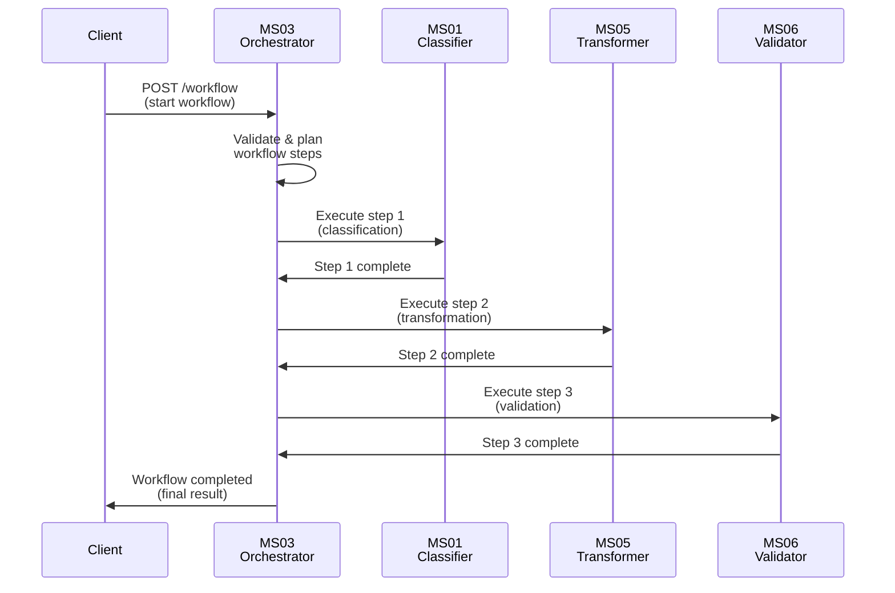
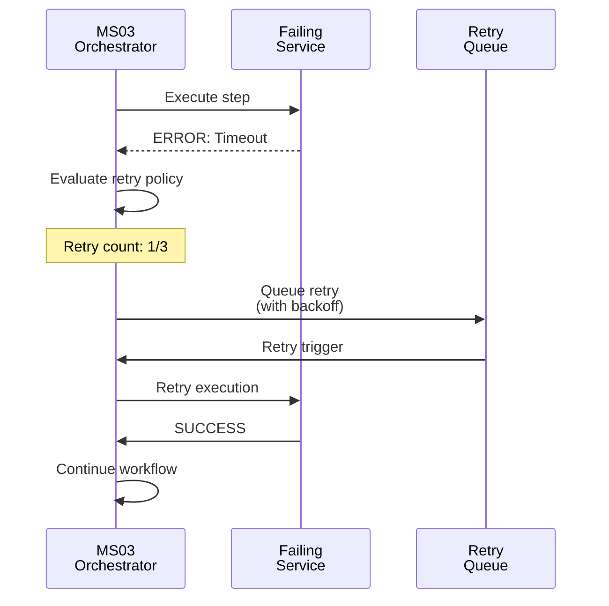

# MS03 - Orchestratore - Specifica Dettagliata

**Navigazione**: [← README.md](README.md) | [SPECIFICATION](SPECIFICATION.md) | [API →](API.md)

## Indice

1. [Panoramica Generale](#panoramica-generale)
2. [Responsabilità Principali](#responsabilità-principali)
3. [Integrazione con i Casi d'Uso](#integrazione-con-i-casi-duso)
4. [Modelli Dati](#modelli-dati)
5. [SLA di Prestazione](#sla-di-prestazione)
6. [Diagrammi di Sequenza](#diagrammi-di-sequenza)
7. [Architettura](#architettura)
8. [Sicurezza e Conformità](#sicurezza-e-conformità)
9. [Distribuzione](#distribuzione)

---

## Panoramica Generale
MS03 fornisce orchestrazione intelligente dei workflow documentali, gestendo la logica di business, il routing dinamico e la coordinazione tra microservizi. Il microservizio elabora richieste di workflow, applica regole di business e orchestra l'esecuzione sequenziale o parallela dei servizi necessari.

[↑ Torna al Indice](#indice)

---

## Responsabilità Principali

### 1. Workflow Orchestration
- **Gestione stato workflow**: Tracciamento fasi esecuzione, transizioni stato
- **Coordinamento servizi**: Invocazione sequenziale/parallela microservizi
- **Routing dinamico**: Determinazione percorsi basati su regole business
- **Gestione transazioni**: Coordinamento transazioni distribuite

### 2. Business Rules Engine
- **Valutazione regole**: Applicazione logica business configurabile
- **Decision making**: Algoritmi di decisione automatizzati
- **Configurazione policy**: Gestione policy workflow
- **Versionamento regole**: Controllo versioni regole business

### 3. Process Monitoring
- **Tracciamento esecuzione**: Monitoraggio real-time processi
- **Metriche performance**: Raccolta KPI esecuzione
- **Alert generazione**: Notifiche anomalie
- **Report stato**: Dashboard stato workflow

### 4. Integration Hub
- **Coordinamento API**: Gestione chiamate tra servizi
- **Protocolli comunicazione**: Supporto protocolli async/sync
- **Sicurezza integrazioni**: Autenticazione e autorizzazione
- **Error handling**: Gestione errori distribuiti

[↑ Torna al Indice](#indice)

---

## Integrazione con i Casi d'Uso

### UC5 - Produzione Documentale Integrata
- Input: Richieste generazione documenti
- Orchestrazione pipeline: MS01 → MS03 → MS05 → MS06
- Gestione workflow end-to-end

### UC6 - Firma Digitale Integrata
- Coordinamento flusso firma
- Routing basato su policy sicurezza
- Tracciamento stato firma

### UC7 - Conservazione Digitale
- Orchestrazione ingestion archivio
- Validazione compliance
- Audit trail completo

[↑ Torna al Indice](#indice)

---

## Modelli Dati

### Richiesta Avvio Workflow
```json
{
  "workflow_id": "wf-2024-11-18-001",
  "workflow_type": "document_generation",
  "parameters": {
    "input_data": {
      "document_type": "invoice",
      "template_id": "inv-001"
    },
    "options": {
      "priority": "high",
      "deadline": "2024-11-18T12:00:00Z"
    }
  },
  "rules": {
    "business_rules": ["rule_compliance", "rule_validation"],
    "routing_rules": ["route_to_ms05"]
  }
}
```

### Risposta Stato Workflow
```json
{
  "workflow_id": "wf-2024-11-18-001",
  "status": "running",
  "current_step": "ms05_template_engine",
  "progress": {
    "completed_steps": 2,
    "total_steps": 4,
    "percentage": 50
  },
  "next_steps": [
    {
      "service": "ms06_validator",
      "estimated_time": "5 minutes"
    }
  ],
  "created_at": "2024-11-18T10:30:00Z",
  "updated_at": "2024-11-18T10:45:00Z"
}
```

[↑ Torna al Indice](#indice)

---

## SLA di Prestazione

| Metrica | Target | p50 | p95 | p99 |
|--------|--------|-----|-----|-----|
| Latenza orchestrazione | < 100ms | 50ms | 80ms | 95ms |
| Throughput workflow | 100 wf/min | - | - | - |
| Disponibilità | 99.95% | - | - | - |
| Tempo completamento workflow | < 15 min | 8 min | 12 min | 14 min |

[↑ Torna al Indice](#indice)

---

## Diagrammi di Sequenza

### Flusso Principale: Orchestrazione Workflow



### Gestione Errori e Retry



[↑ Torna al Indice](#indice)

---

## Architettura

MS03 è strutturato con una **architettura modulare basata su 7 componenti principali**. Ciascun componente ha una responsabilità specifica nel pipeline di orchestrazione.

### Componente 1: Workflow Intake Handler

**Responsabilità**: Riceve e valida richieste di workflow.

**Funzioni Specifiche**:
- Verifica campi obbligatori (`workflow_id`, `workflow_type`)
- Validazione parametri workflow
- Generazione ID tracciamento

**Input Payload**:
```json
{
  "workflow_id": "wf-2024-11-18-001",
  "workflow_type": "document_generation"
}
```

**Output al Passo Successivo**:
```json
{
  "validated_workflow": {
    "id": "wf-2024-11-18-001",
    "type": "document_generation",
    "status": "validated"
  }
}
```

---

### Componente 2: Rules Engine

**Responsabilità**: Valuta regole business per determinare workflow path.

**Funzioni Specifiche**:
- Caricamento regole da database
- Valutazione condizioni
- Determinazione percorso esecuzione

**Logica Regole**:
```
Business Rules
    ├─ Rule 1: document_type == "invoice" → Route to MS05
    ├─ Rule 2: priority == "high" → SLA 5 minutes
    └─ Rule 3: compliance_required → Add MS06 validation
```

**Output Regole**:
```json
{
  "applied_rules": [
    {
      "rule_id": "rule_compliance",
      "result": true,
      "actions": ["add_validation_step"]
    }
  ],
  "workflow_path": ["ms01", "ms05", "ms06"]
}
```

---

### Componente 3: Execution Coordinator

**Responsabilità**: Coordina esecuzione passi workflow.

**Funzioni Specifiche**:
- Invocazione servizi in sequenza
- Gestione stato esecuzione
- Coordinamento transazioni

**Processo Coordinamento**:
```
Workflow Steps
    ├─ Step 1: Invoke MS01
    │   └─ Wait for completion
    ├─ Step 2: Invoke MS05
    │   └─ Parallel if possible
    └─ Step 3: Invoke MS06
        └─ Final validation
```

**Output Coordinamento**:
```json
{
  "execution_status": {
    "current_step": 2,
    "total_steps": 4,
    "step_status": "running"
  }
}
```

---

### Componente 4: State Manager

**Responsabilità**: Gestisce stato workflow in database.

**Funzioni Specifiche**:
- Persistenza stato corrente
- Recupero stato per resume
- Audit trail completo

**Struttura Stato**:
```json
{
  "workflow_state": {
    "id": "wf-2024-11-18-001",
    "status": "running",
    "current_step": "ms05",
    "step_history": [
      {
        "step": "ms01",
        "status": "completed",
        "timestamp": "2024-11-18T10:31:00Z"
      }
    ]
  }
}
```

---

### Componente 5: Error Handler

**Responsabilità**: Gestisce errori e recovery.

**Funzioni Specifiche**:
- Classificazione errori
- Applicazione policy retry
- Escalation se necessario

**Gestione Errori**:
```
Error Types
    ├─ Timeout → Retry with backoff
    ├─ Service Unavailable → Queue for later
    ├─ Validation Error → Human review
    └─ Critical Error → Abort workflow
```

**Output Error**:
```json
{
  "error_handling": {
    "error_type": "timeout",
    "action": "retry",
    "retry_count": 1,
    "next_retry": "2024-11-18T10:32:00Z"
  }
}
```

---

### Componente 6: Metrics Collector

**Responsabilità**: Raccoglie metriche performance.

**Metriche**:
- Tempo esecuzione passi
- Tasso successo workflow
- Latenza media
- Error rate

**Output Metriche**:
```json
{
  "metrics": {
    "workflow_type": "document_generation",
    "execution_time_ms": 450000,
    "success_rate": 0.95,
    "average_latency_ms": 120
  }
}
```

---

### Componente 7: Notification Manager

**Responsabilità**: Gestisce notifiche e callback.

**Funzioni Specifiche**:
- Invio notifiche completamento
- Callback a sistemi esterni
- Alert per anomalie

**Notifiche**:
```json
{
  "notification": {
    "type": "workflow_completed",
    "workflow_id": "wf-2024-11-18-001",
    "recipient": "client_system",
    "payload": {
      "status": "success",
      "result_url": "/results/wf-2024-11-18-001"
    }
  }
}
```

---

### Integrazioni Esterne

MS03 si integra con i seguenti microservizi:

| Microservizio | Funzione | Tipo Integrazione |
|---|---|---|
| **MS01-CLASSIFIER** | Classificazione iniziale | Sincrono |
| **MS02-ANALYZER** | Analisi avanzata | Asincrono |
| **MS05-TRANSFORMER** | Generazione documenti | Sincrono |
| **MS06-VALIDATOR** | Validazione finale | Sincrono |
| **MS08-MONITOR** | Metriche performance | Asincrono |

[↑ Torna al Indice](#indice)

---

## Sicurezza e Conformità

### Protezione dei Dati
- Workflow state encryption
- Audit trail immutabile
- Access control basato su ruoli

### Traccia di Audit
- Logging completo workflow execution
- Audit parametri regole applicate
- Compliance reporting

[↑ Torna al Indice](#indice)

---

## Distribuzione

### Configurazione Container
- **Immagine Base**: python:3.10-slim
- **Porta**: 8003
- **Risorse**: CPU 1-2 core, RAM 1-2GB

### Requisiti Kubernetes
- Horizontal Pod Autoscaling
- Persistent volume per state DB

### Variabili d'Ambiente
- `WORKFLOW_TIMEOUT`: Timeout workflow massima
- `MAX_CONCURRENT_WORKFLOWS`: Workflow concorrenti massimi
- `RULES_CACHE_TTL`: TTL cache regole

[↑ Torna al Indice](#indice)

---

**Navigazione**: [← README.md](README.md) | [SPECIFICATION](SPECIFICATION.md) | [API →](API.md)