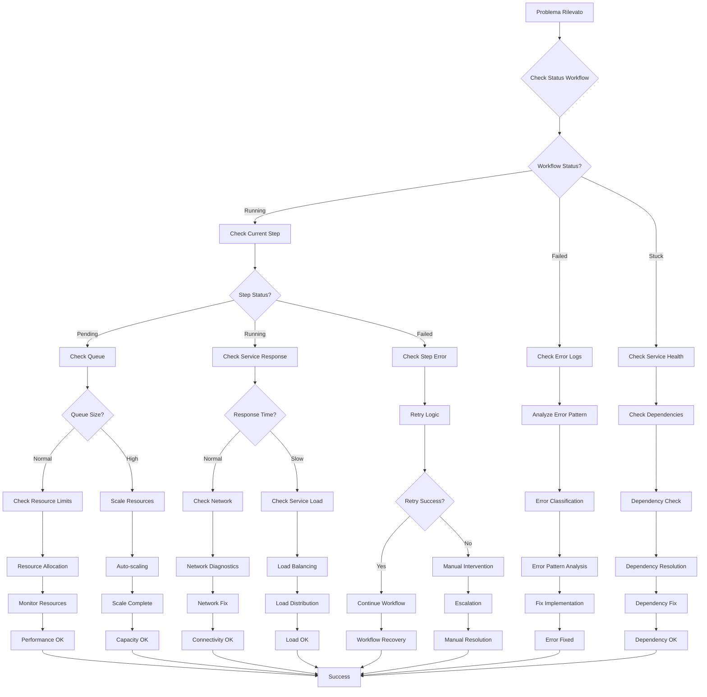
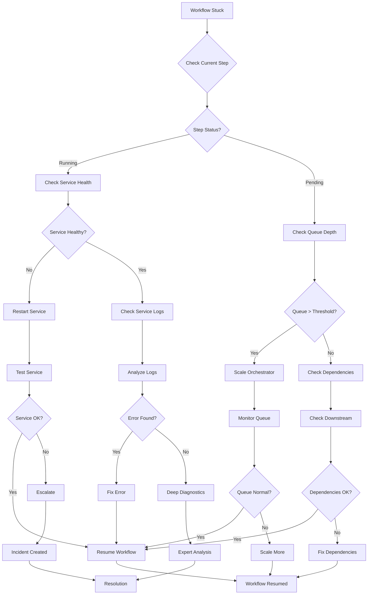
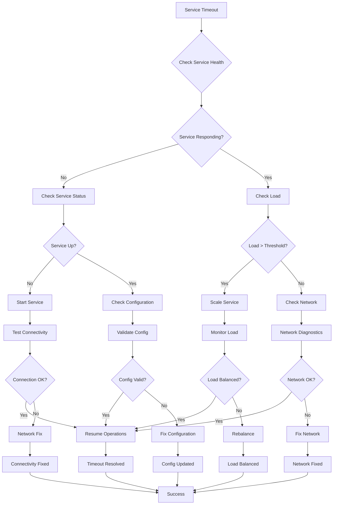
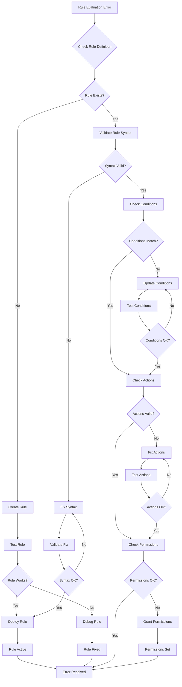
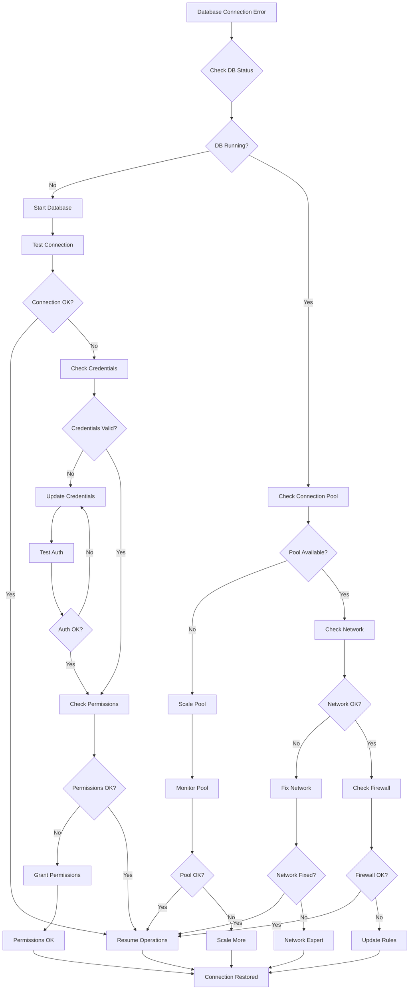
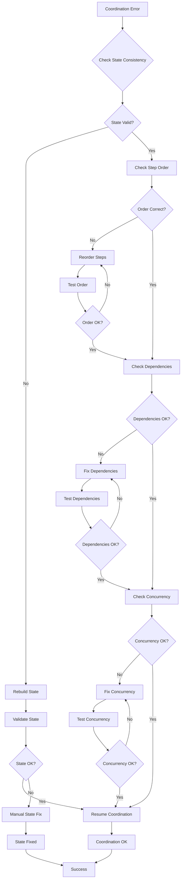
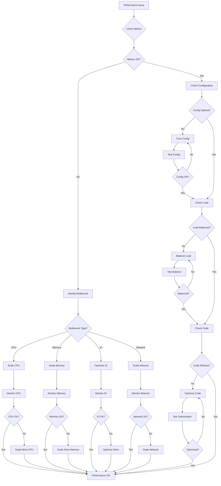

# MS03 - Orchestratore - Troubleshooting

**Navigazione**: [← DATABASE-SCHEMA.md](DATABASE-SCHEMA.md) | [TROUBLESHOOTING](TROUBLESHOOTING.md) | [docker-compose.yml →](./docker-compose.yml)

## Indice

1. [Flusso Diagnostico Generale](#flusso-diagnostico-generale)
2. [Problemi Comuni](#problemi-comuni)
   - [Workflow Bloccato](#workflow-bloccato)
   - [Timeout Servizio](#timeout-servizio)
   - [Errore Valutazione Regole](#errore-valutazione-regole)
   - [Connessione Database](#connessione-database)
   - [Errore Coordinamento](#errore-coordinamento)
   - [Problemi Performance](#problemi-performance)
3. [Strumenti Diagnostici](#strumenti-diagnostici)
4. [Procedure Recovery](#procedure-recovery)

---

## Flusso Diagnostico Generale



[↑ Torna al Indice](#indice)

---

## Problemi Comuni

### Workflow Bloccato

**Sintomi**:
- Workflow status rimane "running" per più di 30 minuti
- Nessun progresso nei passi successivi
- Metriche mostrano step corrente bloccato

**Flusso Diagnostico**:


**Soluzione JSON**:
```json
{
  "diagnostic_result": {
    "issue_type": "workflow_stuck",
    "workflow_id": "wf-2024-11-18-001",
    "current_step": {
      "step_number": 2,
      "service": "ms05_transformer",
      "status": "running",
      "stuck_duration_minutes": 45
    },
    "root_cause": "service_timeout",
    "solution": {
      "action": "restart_service",
      "service": "ms05_transformer",
      "fallback": "route_to_backup_service"
    },
    "recovery_payload": {
      "workflow_id": "wf-2024-11-18-001",
      "action": "resume",
      "from_step": 2,
      "retry_count": 1
    }
  }
}
```

[↑ Torna al Indice](#indice)

---

### Timeout Servizio

**Sintomi**:
- Errori "408 Request Timeout"
- Workflow fallisce dopo timeout configurato
- Metriche mostrano latenza elevata

**Flusso Diagnostico**:


**Soluzione JSON**:
```json
{
  "diagnostic_result": {
    "issue_type": "service_timeout",
    "service": "ms05_transformer",
    "timeout_duration_seconds": 300,
    "root_cause": "high_load",
    "solution": {
      "action": "scale_service",
      "replicas": 3,
      "timeout_extension": 600
    },
    "recovery_payload": {
      "service": "ms05_transformer",
      "action": "scale",
      "target_replicas": 3,
      "health_check_timeout": 30
    }
  }
}
```

[↑ Torna al Indice](#indice)

---

### Errore Valutazione Regole

**Sintomi**:
- Workflow fallisce durante rule evaluation
- Errori "RULE_VALIDATION_ERROR"
- Regole non applicate correttamente

**Flusso Diagnostico**:


**Soluzione JSON**:
```json
{
  "diagnostic_result": {
    "issue_type": "rule_evaluation_error",
    "rule_id": "rule_compliance_check",
    "error_details": {
      "error_type": "INVALID_CONDITION",
      "condition": "total_amount > 1000",
      "actual_value": "amount",
      "expected_value": "total_amount"
    },
    "solution": {
      "action": "fix_rule_condition",
      "field_name": "total_amount",
      "operator": ">",
      "value": 1000
    },
    "recovery_payload": {
      "rule_id": "rule_compliance_check",
      "action": "update",
      "conditions": {
        "total_amount": {
          "operator": ">",
          "value": 1000
        }
      },
      "version": "2.2"
    }
  }
}
```

[↑ Torna al Indice](#indice)

---

### Connessione Database

**Sintomi**:
- Errori "CONNECTION_REFUSED"
- Workflow non può salvare stato
- Timeout connessione database

**Flusso Diagnostico**:


**Soluzione JSON**:
```json
{
  "diagnostic_result": {
    "issue_type": "database_connection",
    "connection_details": {
      "host": "postgres-orchestrator",
      "port": 5432,
      "database": "orchestrator_db",
      "error": "CONNECTION_TIMEOUT"
    },
    "root_cause": "pool_exhausted",
    "solution": {
      "action": "scale_connection_pool",
      "max_connections": 50,
      "health_check_interval": 30
    },
    "recovery_payload": {
      "database": "orchestrator_db",
      "action": "scale_pool",
      "max_connections": 50,
      "timeout_seconds": 30
    }
  }
}
```

[↑ Torna al Indice](#indice)

---

### Errore Coordinamento

**Sintomi**:
- Workflow perde sincronizzazione tra passi
- Errori "COORDINATION_FAILED"
- Passi eseguiti fuori ordine

**Flusso Diagnostico**:


**Soluzione JSON**:
```json
{
  "diagnostic_result": {
    "issue_type": "coordination_error",
    "workflow_id": "wf-2024-11-18-001",
    "error_details": {
      "expected_step": 3,
      "actual_step": 2,
      "coordination_failure": "step_out_of_order"
    },
    "solution": {
      "action": "resync_workflow",
      "correct_step": 3,
      "rollback_to_step": 2
    },
    "recovery_payload": {
      "workflow_id": "wf-2024-11-18-001",
      "action": "resync",
      "target_step": 3,
      "force_sync": true
    }
  }
}
```

[↑ Torna al Indice](#indice)

---

### Problemi Performance

**Sintomi**:
- Latenza workflow elevata
- Throughput ridotto
- CPU/Memory usage alto

**Flusso Diagnostico**:


**Soluzione JSON**:
```json
{
  "diagnostic_result": {
    "issue_type": "performance_degradation",
    "metrics": {
      "average_latency_ms": 850,
      "throughput_wf_per_min": 8,
      "cpu_usage_percent": 78,
      "memory_usage_percent": 82
    },
    "bottleneck": "memory_exhaustion",
    "solution": {
      "action": "scale_resources",
      "cpu_cores": 4,
      "memory_gb": 8,
      "replicas": 3
    },
    "recovery_payload": {
      "service": "ms03_orchestrator",
      "action": "scale",
      "resources": {
        "cpu": "2",
        "memory": "4Gi"
      },
      "replicas": 3
    }
  }
}
```

[↑ Torna al Indice](#indice)

---

## Strumenti Diagnostici

### Health Check Endpoint
```bash
curl -X GET "http://localhost:8003/api/v1/health" \
  -H "Authorization: Bearer {token}"
```

**Response**:
```json
{
  "status": "healthy",
  "checks": {
    "database": "up",
    "redis": "up",
    "services": {
      "ms01": "healthy",
      "ms05": "degraded",
      "ms06": "healthy"
    }
  },
  "timestamp": "2024-11-18T14:30:00Z"
}
```

### Workflow Debug Endpoint
```bash
curl -X GET "http://localhost:8003/api/v1/debug/workflow/{workflow_id}" \
  -H "Authorization: Bearer {token}"
```

**Response**:
```json
{
  "workflow_id": "wf-2024-11-18-001",
  "debug_info": {
    "state_machine": {
      "current_state": "step_2_running",
      "transitions": [
        {
          "from": "step_1_completed",
          "to": "step_2_running",
          "timestamp": "2024-11-18T10:32:00Z"
        }
      ]
    },
    "rule_engine": {
      "applied_rules": ["rule_compliance"],
      "rule_evaluation_time_ms": 45
    },
    "performance": {
      "total_time_ms": 120000,
      "step_times": {
        "ms01": 25000,
        "ms05": 95000
      }
    }
  }
}
```

[↑ Torna al Indice](#indice)

---

## Procedure Recovery

### Recovery da Workflow Stuck
```json
{
  "recovery_procedure": {
    "workflow_id": "wf-2024-11-18-001",
    "steps": [
      {
        "step": 1,
        "action": "check_service_health",
        "service": "ms05_transformer",
        "timeout": 30
      },
      {
        "step": 2,
        "action": "restart_service",
        "service": "ms05_transformer",
        "condition": "health_check_failed"
      },
      {
        "step": 3,
        "action": "resume_workflow",
        "from_step": 2,
        "retry_count": 1
      }
    ],
    "rollback_plan": {
      "rollback_to_step": 1,
      "preserve_state": true,
      "notify_stakeholders": true
    }
  }
}
```

### Recovery da Database Failure
```json
{
  "recovery_procedure": {
    "database": "orchestrator_db",
    "steps": [
      {
        "step": 1,
        "action": "check_connection",
        "timeout": 60
      },
      {
        "step": 2,
        "action": "failover_to_replica",
        "condition": "primary_down"
      },
      {
        "step": 3,
        "action": "sync_pending_workflows",
        "batch_size": 10
      }
    ],
    "data_integrity_check": {
      "check_type": "checksum_validation",
      "affected_workflows": "last_24h"
    }
  }
}
```

[↑ Torna al Indice](#indice)

---

**Navigazione**: [← DATABASE-SCHEMA.md](DATABASE-SCHEMA.md) | [TROUBLESHOOTING](TROUBLESHOOTING.md) | [docker-compose.yml →](./docker-compose.yml)
