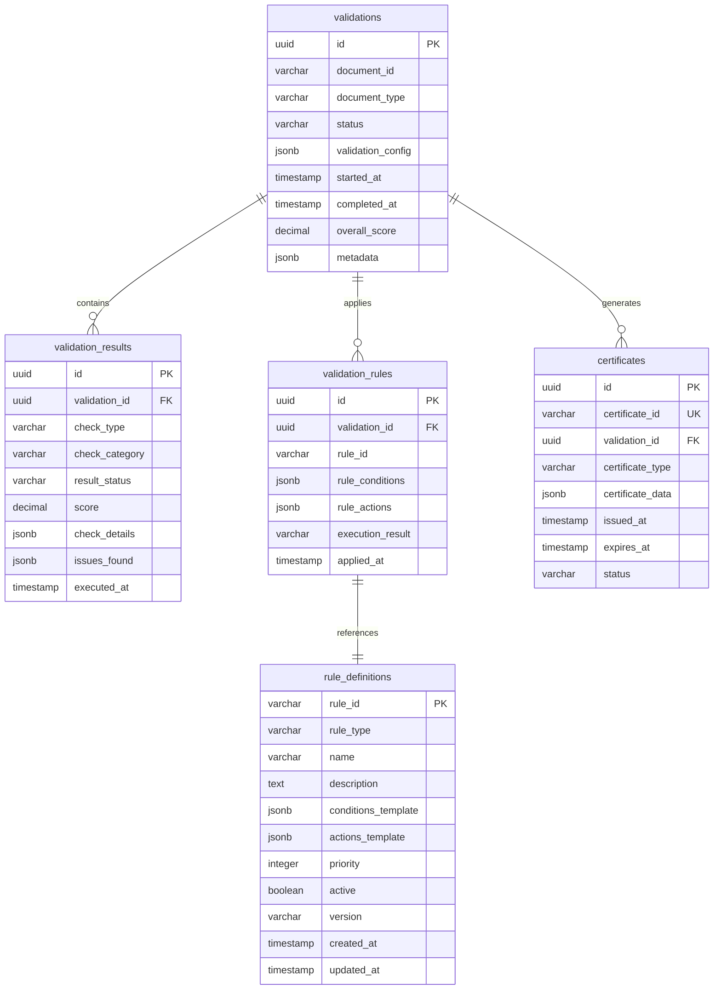

# MS04 - Validatore - Schema Database

**Navigazione**: [← API.md](API.md) | [DATABASE-SCHEMA](DATABASE-SCHEMA.md) | [TROUBLESHOOTING →](TROUBLESHOOTING.md)

## Indice

1. [Panoramica Database](#panoramica-database)
2. [Diagramma ER](#diagramma-er)
3. [Tabelle Principali](#tabelle-principali)
   - [validations](#validations)
   - [validation_results](#validation_results)
   - [validation_rules](#validation_rules)
   - [certificates](#certificates)
   - [rule_definitions](#rule_definitions)
4. [Esempi JSON](#esempi-json)

---

## Panoramica Database

MS04 utilizza PostgreSQL per la persistenza dei risultati di validazione, regole di business e certificati. Il database è ottimizzato per operazioni OLTP con supporto per JSON complesso e ricerche full-text.

**Tecnologie**:
- PostgreSQL 15+
- PostGIS per validazioni geografiche
- Full-text search per regole
- Partitioning per archivio storico

[↑ Torna al Indice](#indice)

---

## Diagramma ER



[↑ Torna al Indice](#indice)

---

## Tabelle Principali

### validations

Tabella principale per le sessioni di validazione.

| Campo | Tipo | Nullable | Descrizione |
|-------|------|----------|-------------|
| `id` | UUID | NO | Primary key, ID univoco validazione |
| `document_id` | VARCHAR(100) | NO | ID del documento validato |
| `document_type` | VARCHAR(50) | NO | Tipo documento (invoice, contract, etc.) |
| `status` | VARCHAR(20) | NO | Stato validazione (pending, running, completed, failed) |
| `validation_config` | JSONB | NO | Configurazione validazione |
| `started_at` | TIMESTAMP | YES | Timestamp inizio validazione |
| `completed_at` | TIMESTAMP | YES | Timestamp completamento |
| `overall_score` | DECIMAL(3,2) | YES | Punteggio complessivo validazione (0.00-1.00) |
| `metadata` | JSONB | YES | Metadati aggiuntivi |

**Indici**:
- PRIMARY KEY su `id`
- INDEX su `document_id`
- INDEX su `document_type`
- INDEX su `status`
- INDEX su `started_at`
- INDEX su `overall_score`

[↑ Torna al Indice](#indice)

---

### validation_results

Risultati dettagliati dei controlli di validazione.

| Campo | Tipo | Nullable | Descrizione |
|-------|------|----------|-------------|
| `id` | UUID | NO | Primary key |
| `validation_id` | UUID | NO | Foreign key verso validations |
| `check_type` | VARCHAR(50) | NO | Tipo controllo (structural, business, compliance) |
| `check_category` | VARCHAR(50) | NO | Categoria controllo |
| `result_status` | VARCHAR(20) | NO | Stato risultato (passed, failed, warning) |
| `score` | DECIMAL(3,2) | YES | Punteggio controllo (0.00-1.00) |
| `check_details` | JSONB | YES | Dettagli controllo eseguito |
| `issues_found` | JSONB | YES | Problemi rilevati |
| `executed_at` | TIMESTAMP | NO | Timestamp esecuzione controllo |

**Indici**:
- PRIMARY KEY su `id`
- FOREIGN KEY su `validation_id` REFERENCES validations(id)
- INDEX su `validation_id`, `check_type`
- INDEX su `result_status`
- INDEX su `executed_at`

[↑ Torna al Indice](#indice)

---

### validation_rules

Registra quali regole sono state applicate in ogni validazione.

| Campo | Tipo | Nullable | Descrizione |
|-------|------|----------|-------------|
| `id` | UUID | NO | Primary key |
| `validation_id` | UUID | NO | Foreign key verso validations |
| `rule_id` | VARCHAR(100) | NO | ID della regola applicata |
| `rule_conditions` | JSONB | NO | Condizioni regola al momento applicazione |
| `rule_actions` | JSONB | NO | Azioni regola al momento applicazione |
| `execution_result` | VARCHAR(20) | NO | Risultato esecuzione (success, failed, skipped) |
| `applied_at` | TIMESTAMP | NO | Quando la regola è stata applicata |

**Indici**:
- PRIMARY KEY su `id`
- FOREIGN KEY su `validation_id` REFERENCES validations(id)
- INDEX su `validation_id`
- INDEX su `rule_id`
- INDEX su `execution_result`

[↑ Torna al Indice](#indice)

---

### certificates

Certificati di validazione generati.

| Campo | Tipo | Nullable | Descrizione |
|-------|------|----------|-------------|
| `id` | UUID | NO | Primary key |
| `certificate_id` | VARCHAR(100) | NO | ID univoco certificato |
| `validation_id` | UUID | NO | Foreign key verso validations |
| `certificate_type` | VARCHAR(50) | NO | Tipo certificato (validation, compliance) |
| `certificate_data` | JSONB | NO | Dati certificato firmati |
| `issued_at` | TIMESTAMP | NO | Timestamp emissione |
| `expires_at` | TIMESTAMP | NO | Timestamp scadenza |
| `status` | VARCHAR(20) | NO | Stato certificato (valid, expired, revoked) |

**Indici**:
- PRIMARY KEY su `id`
- UNIQUE su `certificate_id`
- FOREIGN KEY su `validation_id` REFERENCES validations(id)
- INDEX su `certificate_type`
- INDEX su `status`
- INDEX su `expires_at`

[↑ Torna al Indice](#indice)

---

### rule_definitions

Definizioni delle regole di validazione.

| Campo | Tipo | Nullable | Descrizione |
|-------|------|----------|-------------|
| `rule_id` | VARCHAR(100) | NO | Primary key, ID univoco regola |
| `rule_type` | VARCHAR(20) | NO | Tipo regola (business, compliance, quality) |
| `name` | VARCHAR(200) | NO | Nome descrittivo regola |
| `description` | TEXT | YES | Descrizione dettagliata |
| `conditions_template` | JSONB | NO | Template condizioni regola |
| `actions_template` | JSONB | NO | Template azioni regola |
| `priority` | INTEGER | NO | Priorità esecuzione (1-100, 100=max) |
| `active` | BOOLEAN | NO | Se la regola è attiva |
| `version` | VARCHAR(20) | NO | Versione regola |
| `created_at` | TIMESTAMP | NO | Timestamp creazione |
| `updated_at` | TIMESTAMP | YES | Timestamp ultimo aggiornamento |

**Indici**:
- PRIMARY KEY su `rule_id`
- INDEX su `rule_type`
- INDEX su `active`
- INDEX su `priority`
- INDEX su `created_at`

[↑ Torna al Indice](#indice)

---

## Esempi JSON

### Validation Config
```json
{
  "validation_type": "full",
  "rules": {
    "business_rules": ["rule_compliance_check", "rule_amount_validation"],
    "compliance_rules": ["gdpr_compliance", "tax_validation"],
    "quality_rules": ["spelling_check", "format_validation"],
    "structural_rules": ["schema_validation", "required_fields"]
  },
  "options": {
    "fail_fast": false,
    "detailed_report": true,
    "generate_certificate": true,
    "notify_on_completion": true
  },
  "metadata": {
    "requester": "ms05_transformer",
    "correlation_id": "wf-2024-11-18-001",
    "priority": "high"
  }
}
```

### Validation Result Details
```json
{
  "check_type": "business_validation",
  "check_category": "compliance",
  "result_status": "passed",
  "score": 0.98,
  "check_details": {
    "rules_applied": 5,
    "rules_passed": 5,
    "rules_failed": 0,
    "execution_time_ms": 245
  },
  "issues_found": [
    {
      "severity": "warning",
      "code": "RULE_WARNING",
      "message": "Amount close to limit threshold",
      "rule_id": "rule_amount_limit",
      "details": {
        "actual_amount": 45000,
        "limit": 50000,
        "threshold_percentage": 90
      }
    }
  ],
  "executed_at": "2024-11-18T10:36:45Z"
}
```

### Rule Definition
```json
{
  "rule_id": "rule_tax_validation",
  "rule_type": "compliance",
  "name": "Validazione Imposte",
  "description": "Verifica correttezza calcolo imposte IVA",
  "conditions_template": {
    "document_type": "invoice",
    "country": "IT",
    "has_taxable_amount": true
  },
  "actions_template": [
    {
      "action_type": "calculate_tax",
      "tax_rate_field": "iva_rate",
      "taxable_amount_field": "subtotal",
      "expected_tax_field": "iva_amount"
    },
    {
      "action_type": "validate_tax_amount",
      "tolerance_percentage": 0.01
    },
    {
      "action_type": "flag_discrepancy",
      "threshold_amount": 1.00
    }
  ],
  "priority": 90,
  "active": true,
  "version": "2.1"
}
```

### Certificate Data
```json
{
  "certificate_id": "cert-val-2024-11-18-001",
  "certificate_type": "validation_certificate",
  "certificate_data": {
    "version": "2.0",
    "serial_number": "VAL-2024-11-18-001",
    "issuer": {
      "common_name": "ZenIA Validation Authority",
      "organization": "ZenIA S.p.A.",
      "country": "IT"
    },
    "subject": {
      "document_id": "doc-2024-11-18-001",
      "document_type": "invoice",
      "validation_score": 0.95,
      "validation_level": "full"
    },
    "validity": {
      "not_before": "2024-11-18T10:37:00Z",
      "not_after": "2025-11-18T10:37:00Z"
    },
    "validation_results": {
      "structural": {
        "status": "passed",
        "score": 1.0
      },
      "business": {
        "status": "passed",
        "score": 0.98
      },
      "compliance": {
        "status": "passed",
        "score": 0.92
      },
      "integrity": {
        "status": "passed",
        "score": 1.0
      },
      "quality": {
        "status": "warning",
        "score": 0.88
      }
    },
    "signature": {
      "algorithm": "SHA-256",
      "signature": "base64-encoded-signature"
    }
  },
  "issued_at": "2024-11-18T10:37:00Z",
  "expires_at": "2025-11-18T10:37:00Z",
  "status": "valid"
}
```

[↑ Torna al Indice](#indice)

---

**Navigazione**: [← API.md](API.md) | [DATABASE-SCHEMA](DATABASE-SCHEMA.md) | [TROUBLESHOOTING →](TROUBLESHOOTING.md)
