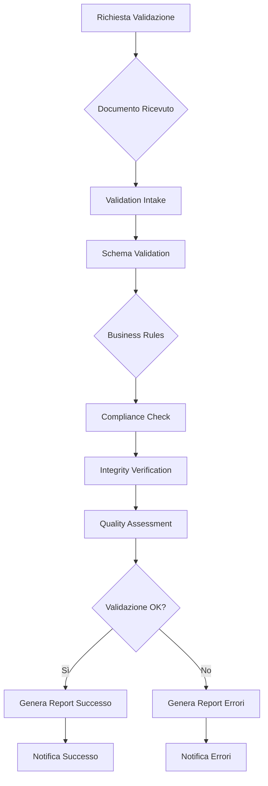
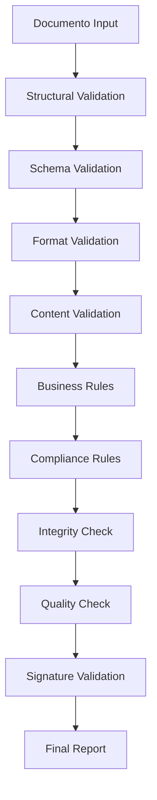

# MS04 - Validatore - Panoramica

**Navigazione**: [README](README.md) | [SPECIFICATION →](SPECIFICATION.md)

## Indice

1. [Panoramica Generale](#panoramica-generale)
2. [Responsabilità Principali](#responsabilità-principali)
3. [Integrazione con i Casi d'Uso](#integrazione-con-i-casi-duso)
4. [Architettura e Componenti](#architettura-e-componenti)
5. [Tecnologie Utilizzate](#tecnologie-utilizzate)
6. [Flussi di Elaborazione](#flussi-di-elaborazione)
7. [Sicurezza e Conformità](#sicurezza-e-conformità)
8. [Distribuzione](#distribuzione)

---

## Panoramica Generale
MS04 fornisce validazione completa e multi-livello dei documenti generati, assicurando conformità normativa, integrità dei dati e qualità del contenuto. Il microservizio elabora documenti attraverso pipeline di validazione configurabili, applicando regole business, controlli di conformità e verifiche di integrità.

[↑ Torna al Indice](#indice)

---

## Responsabilità Principali

### 1. Validazione Strutturale
- **Schema validation**: Verifica conformità schemi XML/JSON
- **Formato documenti**: Controllo integrità PDF, DOCX, XML
- **Struttura dati**: Validazione campi obbligatori e formati

### 2. Validazione di Contenuto
- **Regole business**: Applicazione policy aziendali
- **Conformità normativa**: Verifiche fiscali, legali, settoriali
- **Qualità contenuto**: Controlli ortografici, grammaticali

### 3. Validazione Integrità
- **Checksum validation**: Verifica integrità file
- **Firma digitale**: Validazione certificati e firme
- **Audit trail**: Tracciamento modifiche e validazioni

### 4. Reporting e Notifiche
- **Report validazione**: Documentazione risultati
- **Notifiche errori**: Alert per violazioni
- **Metriche qualità**: KPI validazione

[↑ Torna al Indice](#indice)

---

## Integrazione con i Casi d'Uso

### UC5 - Produzione Documentale Integrata
- Input: Documenti da MS05-Transformer
- Validazione: Conformità, integrità, qualità
- Output: Documenti validati o correzioni richieste

### UC6 - Firma Digitale Integrata
- Pre-validazione: Controllo documento prima firma
- Post-validazione: Verifica firma applicata
- Compliance: Certificazione conformità

### UC7 - Conservazione Digitale
- Validazione archivio: Controlli pre-conservazione
- Certificazione: Attestati validità
- Audit: Tracciamento validazioni

[↑ Torna al Indice](#indice)

---

## Architettura e Componenti

MS04 è strutturato con una **architettura modulare basata su 7 componenti principali**:

### Componente 1: Validation Intake Handler
Riceve richieste validazione e prepara pipeline

### Componente 2: Schema Validator
Valida struttura documenti contro schemi definiti

### Componente 3: Business Rules Engine
Applica regole business configurabili

### Componente 4: Compliance Checker
Verifica conformità normativa

### Componente 5: Integrity Verifier
Controlla integrità e autenticità documenti

### Componente 6: Quality Assessor
Valuta qualità contenuto e formato

### Componente 7: Report Generator
Genera report validazione e notifiche

[↑ Torna al Indice](#indice)

---

## Tecnologie Utilizzate

| Componente | Tecnologia | Versione | Scopo |
|------------|------------|----------|--------|
| **Runtime** | Python | 3.10+ | Linguaggio principale |
| **Framework** | FastAPI | 0.100+ | API REST |
| **Database** | PostgreSQL | 15+ | Persistenza regole e audit |
| **Cache** | Redis | 7+ | Cache regole e risultati |
| **Message Queue** | RabbitMQ | 3.12+ | Code asincrone |
| **Validation** | Cerberus | 1.3+ | Schema validation |
| **PDF Processing** | PyPDF2 | 3.0+ | Manipolazione PDF |
| **XML Processing** | lxml | 4.9+ | Parsing XML |

[↑ Torna al Indice](#indice)

---

## Flussi di Elaborazione

### Flusso Principale: Validazione Documento

### Pipeline di Validazione

[↑ Torna al Indice](#indice)

---

## Sicurezza e Conformità

### Protezione dei Dati
- **Crittografia**: Documenti crittografati in transito e storage
- **Access Control**: RBAC per tipi validazione
- **Audit Logging**: Tracciamento completo operazioni

### Conformità GDPR
- **Data Minimization**: Solo dati necessari per validazione
- **Right to Rectification**: Possibilità correzione dati
- **Data Portability**: Esportazione risultati validazione

### Certificazioni
- **ISO 27001**: Information Security Management
- **ISO 9001**: Quality Management Systems
- **eIDAS**: Firma elettronica qualificata

[↑ Torna al Indice](#indice)

---

## Distribuzione

### Configurazione Container
- **Immagine Base**: python:3.10-slim
- **Porta**: 8004
- **Risorse**: CPU 1-2 core, RAM 2-4GB

### Requisiti Kubernetes
- **Storage**: Persistent volume per database regole
- **Secrets**: Gestione certificati validazione
- **ConfigMaps**: Regole validazione configurabili

### Variabili Ambiente
- `VALIDATION_TIMEOUT`: Timeout validazione massima
- `MAX_DOCUMENT_SIZE`: Dimensione massima documento
- `RULES_CACHE_TTL`: TTL cache regole

[↑ Torna al Indice](#indice)

---

**Navigazione**: [README](README.md) | [SPECIFICATION →](SPECIFICATION.md)