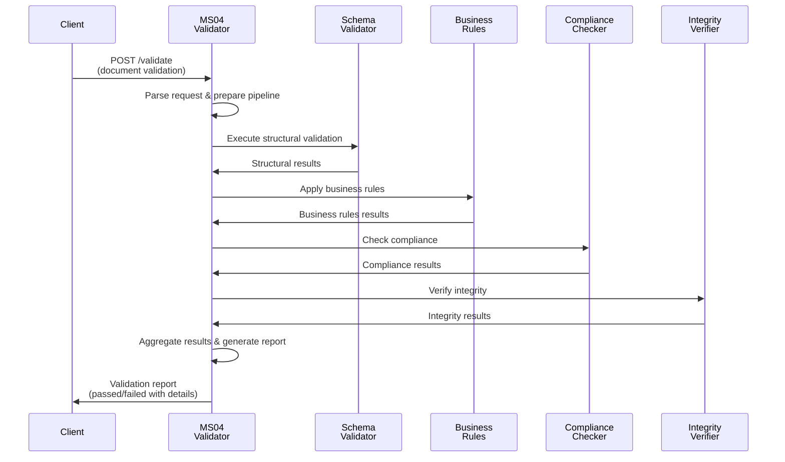
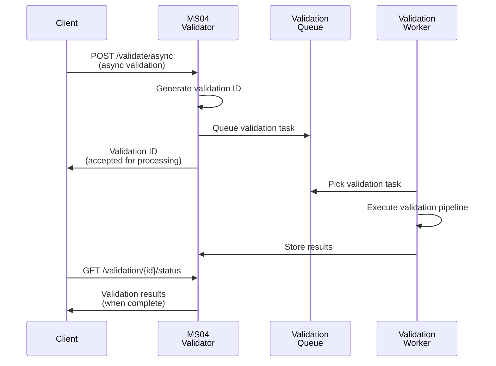

# MS04 - Validatore - Specifica Dettagliata

**Navigazione**: [← README.md](README.md) | [SPECIFICATION](SPECIFICATION.md) | [API →](API.md)

## Indice

1. [Panoramica Generale](#panoramica-generale)
2. [Responsabilità Principali](#responsabilità-principali)
3. [Integrazione con i Casi d'Uso](#integrazione-con-i-casi-duso)
4. [Modelli Dati](#modelli-dati)
5. [SLA di Prestazione](#sla-di-prestazione)
6. [Diagrammi di Sequenza](#diagrammi-di-sequenza)
7. [Architettura](#architettura)
8. [Sicurezza e Conformità](#sicurezza-e-conformità)
9. [Distribuzione](#distribuzione)

---

## Panoramica Generale
MS04 fornisce validazione completa e multi-livello dei documenti generati, assicurando conformità normativa, integrità dei dati e qualità del contenuto. Il microservizio elabora documenti attraverso pipeline di validazione configurabili, applicando regole business, controlli di conformità e verifiche di integrità.

[↑ Torna al Indice](#indice)

---

## Responsabilità Principali

### 1. Validazione Strutturale
- **Schema validation**: Verifica conformità schemi XML/JSON
- **Formato documenti**: Controllo integrità PDF, DOCX, XML
- **Struttura dati**: Validazione campi obbligatori e formati

### 2. Validazione di Contenuto
- **Regole business**: Applicazione policy aziendali
- **Conformità normativa**: Verifiche fiscali, legali, settoriali
- **Qualità contenuto**: Controlli ortografici, grammaticali

### 3. Validazione Integrità
- **Checksum validation**: Verifica integrità file
- **Firma digitale**: Validazione certificati e firme
- **Audit trail**: Tracciamento modifiche e validazioni

### 4. Reporting e Notifiche
- **Report validazione**: Documentazione risultati
- **Notifiche errori**: Alert per violazioni
- **Metriche qualità**: KPI validazione

[↑ Torna al Indice](#indice)

---

## Integrazione con i Casi d'Uso

### UC5 - Produzione Documentale Integrata
- Input: Documenti da MS05-Transformer
- Validazione: Conformità, integrità, qualità
- Output: Documenti validati o correzioni richieste

### UC6 - Firma Digitale Integrata
- Pre-validazione: Controllo documento prima firma
- Post-validazione: Verifica firma applicata
- Compliance: Certificazione conformità

### UC7 - Conservazione Digitale
- Validazione archivio: Controlli pre-conservazione
- Certificazione: Attestati validità
- Audit: Tracciamento validazioni

[↑ Torna al Indice](#indice)

---

## Modelli Dati

### Richiesta Validazione Documento
```json
{
  "document_id": "doc-2024-11-18-001",
  "document_type": "invoice",
  "validation_type": "full",
  "content": {
    "format": "pdf",
    "size_bytes": 245760,
    "checksum": "a1b2c3d4e5f6...",
    "metadata": {
      "created_at": "2024-11-18T10:35:00Z",
      "author": "ms05_transformer",
      "version": "1.0"
    }
  },
  "rules": {
    "business_rules": ["rule_compliance", "rule_quality"],
    "compliance_rules": ["gdpr_compliance", "tax_validation"],
    "quality_rules": ["spelling_check", "format_validation"]
  },
  "options": {
    "fail_fast": false,
    "detailed_report": true,
    "notify_on_error": true
  }
}
```

### Risposta Validazione
```json
{
  "validation_id": "val-2024-11-18-001",
  "document_id": "doc-2024-11-18-001",
  "status": "passed",
  "overall_score": 0.95,
  "validation_results": {
    "structural_validation": {
      "status": "passed",
      "score": 1.0,
      "checks": [
        {
          "check_type": "schema_validation",
          "result": "passed",
          "details": "XML schema compliant"
        }
      ]
    },
    "content_validation": {
      "status": "passed",
      "score": 0.98,
      "checks": [
        {
          "check_type": "business_rules",
          "result": "passed",
          "applied_rules": 5,
          "failed_rules": 0
        }
      ]
    },
    "compliance_validation": {
      "status": "passed",
      "score": 0.92,
      "checks": [
        {
          "check_type": "gdpr_compliance",
          "result": "passed",
          "details": "No PII data detected"
        }
      ]
    },
    "integrity_validation": {
      "status": "passed",
      "score": 1.0,
      "checks": [
        {
          "check_type": "checksum_verification",
          "result": "passed",
          "algorithm": "SHA-256"
        }
      ]
    }
  },
  "issues": [
    {
      "severity": "warning",
      "category": "quality",
      "message": "Minor spelling suggestion: 'recieved' should be 'received'",
      "location": "page 2, line 15",
      "suggestion": "received"
    }
  ],
  "certificates": [
    {
      "type": "validation_certificate",
      "issued_at": "2024-11-18T10:37:00Z",
      "valid_until": "2025-11-18T10:37:00Z",
      "certificate_id": "cert-val-2024-11-18-001"
    }
  ],
  "processing_time_ms": 1250,
  "validated_at": "2024-11-18T10:37:00Z"
}
```

[↑ Torna al Indice](#indice)

---

## SLA di Prestazione

| Metrica | Target | p50 | p95 | p99 |
|--------|--------|-----|-----|-----|
| Latenza validazione | < 2s | 800ms | 1.5s | 1.8s |
| Throughput documenti | 50 doc/min | - | - | - |
| Disponibilità | 99.9% | - | - | - |
| Accuratezza validazione | > 99% | - | - | - |
| Tempo generazione report | < 500ms | 200ms | 400ms | 480ms |

[↑ Torna al Indice](#indice)

---

## Diagrammi di Sequenza

### Flusso Principale: Validazione Completa



### Validazione Asincrona



[↑ Torna al Indice](#indice)

---

## Gestione Errori

### Scenari di Errore Comuni

1. **Timeout Query**
   - Descrizione: Query supera tempo limite di esecuzione
   - Causa: Query complessa o dati voluminosi
   - Mitigation: Implementare timeout configurabile e fallback

2. **Connessione Database**
   - Descrizione: Perdita connessione ai servizi dipendenti
   - Causa: Servizio non disponibile o problemi rete
   - Mitigation: Retry logic con exponential backoff

3. **Validazione Dati**
   - Descrizione: Input non valido o formato errato
   - Causa: Client fornisce dati non conformi
   - Mitigation: Validazione input e error messages chiari

### Error Codes

| Code | Status | Descrizione | Azione |
|------|--------|-------------|--------|
| 400 | Bad Request | Input non valido | Correggi parametri request |
| 408 | Timeout | Operazione timeout | Riprova con parametri ridotti |
| 500 | Internal Error | Errore interno | Contatta supporto |
| 503 | Service Unavailable | Servizio non disponibile | Riprova più tardi |

### Recovery Procedures

- **Automatic Retry**: Sistema riprova automaticamente con backoff esponenziale
- **Graceful Degradation**: Fallback a cache o risultati parziali se disponibili
- **Error Logging**: Tutti gli errori registrati per analisi e monitoring
- **Alerting**: Notifiche su errori critici ai team di supporto

## Architettura

MS04 è strutturato con una **architettura modulare basata su 7 componenti principali**. Ciascun componente ha una responsabilità specifica nel pipeline di validazione.

### Componente 1: Validation Intake Handler

**Responsabilità**: Riceve e valida richieste di validazione.

**Funzioni Specifiche**:
- Verifica campi obbligatori (`document_id`, `document_type`)
- Validazione formato documento
- Preparazione pipeline validazione

**Input Payload**:
```json
{
  "document_id": "doc-2024-11-18-001",
  "document_type": "invoice"
}
```

**Output al Passo Successivo**:
```json
{
  "prepared_validation": {
    "id": "val-2024-11-18-001",
    "document_id": "doc-2024-11-18-001",
    "pipeline_steps": ["structural", "business", "compliance", "integrity"]
  }
}
```

---

### Componente 2: Schema Validator

**Responsabilità**: Valida struttura documenti contro schemi definiti.

**Funzioni Specifiche**:
- Caricamento schemi XML/JSON
- Validazione struttura documento
- Generazione errori strutturali

**Logica Validazione**:
```
Schema Validation
    ├─ XML Schema (XSD) → Validate against XSD
    ├─ JSON Schema → Validate against JSON Schema
    ├─ Custom Rules → Apply custom validation rules
    └─ Format Check → Verify file format integrity
```

**Output Validazione**:
```json
{
  "structural_validation": {
    "status": "passed",
    "score": 1.0,
    "schema_used": "invoice-v1.0.xsd",
    "validation_time_ms": 150
  }
}
```

---

### Componente 3: Business Rules Engine

**Responsabilità**: Applica regole business configurabili.

**Funzioni Specifiche**:
- Caricamento regole da database
- Valutazione condizioni business
- Esecuzione azioni regole

**Regole Business**:
```
Business Rules
    ├─ Rule 1: amount > 1000 → Require approval
    ├─ Rule 2: customer_type == "business" → Apply tax rules
    └─ Rule 3: document_age > 30 days → Flag for review
```

**Output Regole**:
```json
{
  "business_validation": {
    "status": "passed",
    "applied_rules": 5,
    "failed_rules": 0,
    "warnings": 1,
    "execution_time_ms": 200
  }
}
```

---

### Componente 4: Compliance Checker

**Responsabilità**: Verifica conformità normativa.

**Funzioni Specifiche**:
- Controlli GDPR compliance
- Validazione fiscale
- Verifiche settoriali

**Controlli Compliance**:
```
Compliance Checks
    ├─ GDPR → PII detection, consent validation
    ├─ Tax → Tax calculation verification
    ├─ Legal → Legal requirements validation
    └─ Industry → Sector-specific compliance
```

**Output Compliance**:
```json
{
  "compliance_validation": {
    "status": "passed",
    "gdpr_compliant": true,
    "tax_valid": true,
    "legal_compliant": true,
    "score": 0.95
  }
}
```

---

### Componente 5: Integrity Verifier

**Responsabilità**: Controlla integrità e autenticità documenti.

**Funzioni Specifiche**:
- Verifica checksum
- Validazione firma digitale
- Controllo tampering

**Verifiche Integrità**:
```
Integrity Checks
    ├─ Checksum → SHA-256 verification
    ├─ Digital Signature → Certificate validation
    ├─ Timestamp → Time integrity check
    └─ Chain of Custody → Audit trail verification
```

**Output Integrità**:
```json
{
  "integrity_validation": {
    "status": "passed",
    "checksum_valid": true,
    "signature_valid": true,
    "certificate_chain_valid": true,
    "tampering_detected": false
  }
}
```

---

### Componente 6: Quality Assessor

**Responsabilità**: Valuta qualità contenuto e formato.

**Funzioni Specifiche**:
- Controlli ortografici
- Validazione formato
- Analisi qualità contenuto

**Metriche Qualità**:
```
Quality Metrics
    ├─ Spelling → Grammar and spelling check
    ├─ Format → Layout and formatting validation
    ├─ Completeness → Required fields verification
    └─ Consistency → Data consistency checks
```

**Output Qualità**:
```json
{
  "quality_assessment": {
    "overall_score": 0.92,
    "spelling_errors": 0,
    "format_issues": 1,
    "completeness_score": 1.0,
    "consistency_score": 0.95
  }
}
```

---

### Componente 7: Report Generator

**Responsabilità**: Genera report validazione e notifiche.

**Funzioni Specifiche**:
- Aggregazione risultati
- Generazione report JSON/PDF
- Invio notifiche

**Struttura Report**:
```json
{
  "validation_report": {
    "validation_id": "val-2024-11-18-001",
    "document_id": "doc-2024-11-18-001",
    "status": "passed",
    "overall_score": 0.95,
    "generated_at": "2024-11-18T10:37:00Z"
  }
}
```

---

### Integrazioni Esterne

MS04 si integra con i seguenti microservizi:

| Microservizio | Funzione | Tipo Integrazione |
|---|---|---|
| **MS05-TRANSFORMER** | Riceve documenti da validare | Sincrono |
| **MS07-SIGNER** | Valida firme digitali | Sincrono |
| **MS08-MONITOR** | Invia metriche validazione | Asincrono |
| **MS09-AUDIT** | Registra audit validazioni | Asincrono |

[↑ Torna al Indice](#indice)

---

## Sicurezza e Conformità

### Protezione dei Dati
- Documenti crittografati durante validazione
- Access control basato su ruoli
- Audit trail completo validazioni

### Conformità GDPR
- Minimizzazione dati processati
- Diritto di rettifica implementato
- Portabilità dati risultati

### Certificazioni
- ISO 27001 per sicurezza
- eIDAS per firma digitale
- ISO 9001 per qualità

[↑ Torna al Indice](#indice)

---

## Distribuzione

### Configurazione Container
- **Immagine Base**: python:3.10-slim
- **Porta**: 8004
- **Risorse**: CPU 1-2 core, RAM 2-4GB

### Requisiti Kubernetes
- Horizontal Pod Autoscaling basato su carico
- Persistent volume per regole validazione
- Secrets per certificati

### Variabili d'Ambiente
- `VALIDATION_TIMEOUT`: Timeout validazione massima
- `MAX_DOCUMENT_SIZE`: Dimensione massima documento
- `RULES_CACHE_TTL`: TTL cache regole

[↑ Torna al Indice](#indice)

---

**Navigazione**: [← README.md](README.md) | [SPECIFICATION](SPECIFICATION.md) | [API →](API.md)
