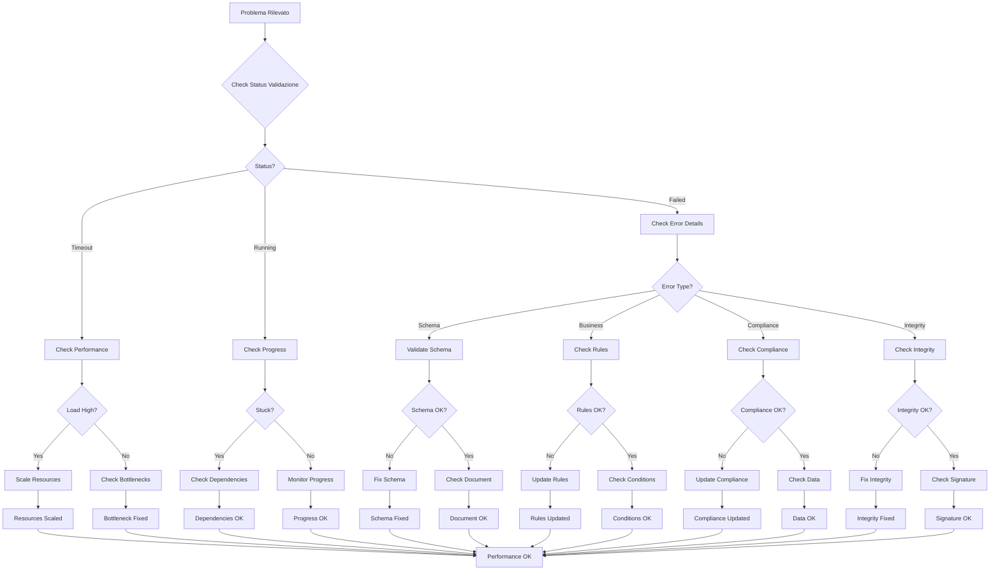
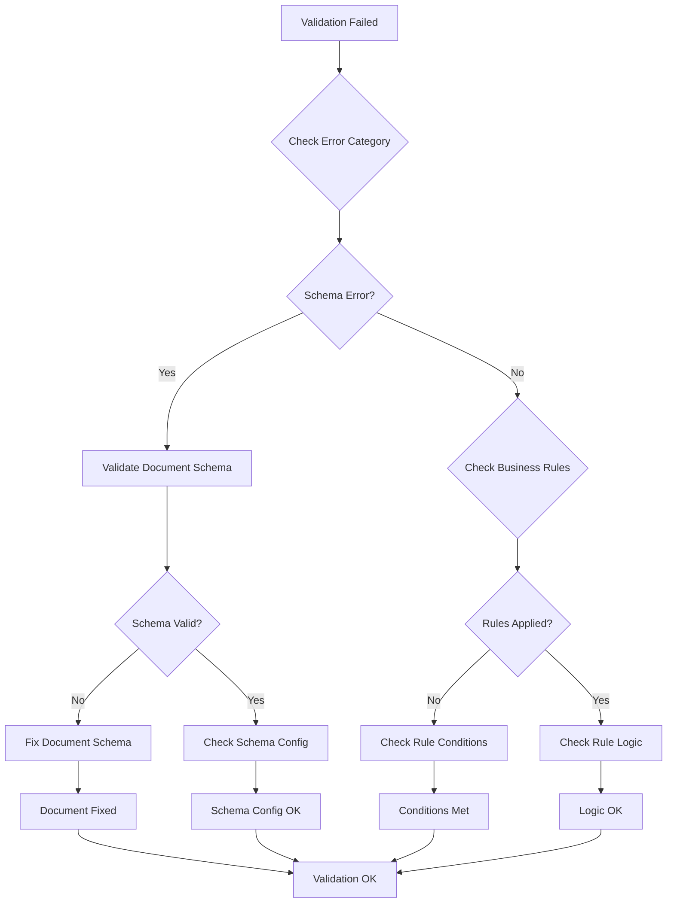
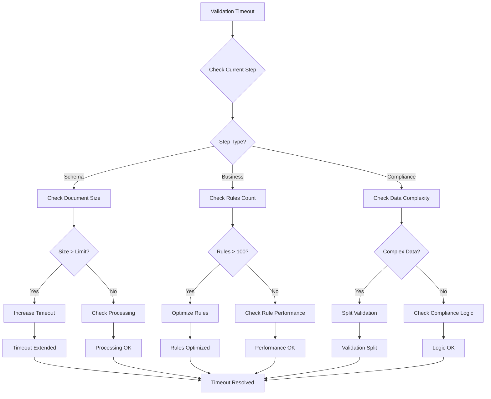
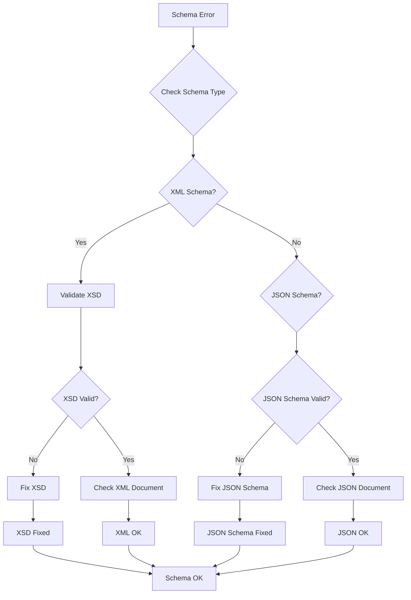
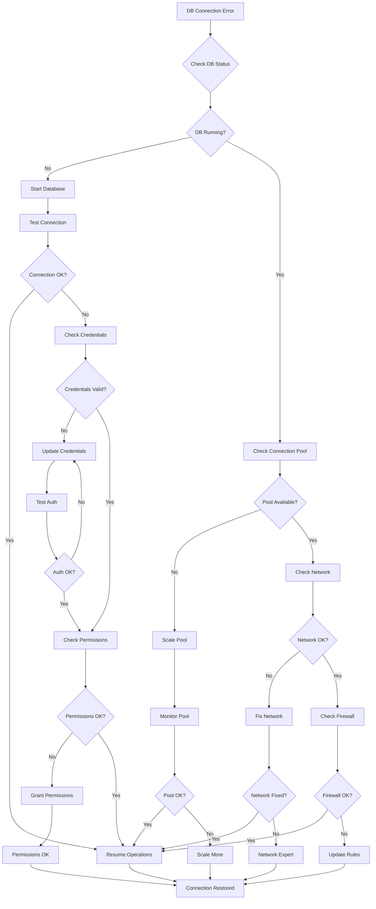
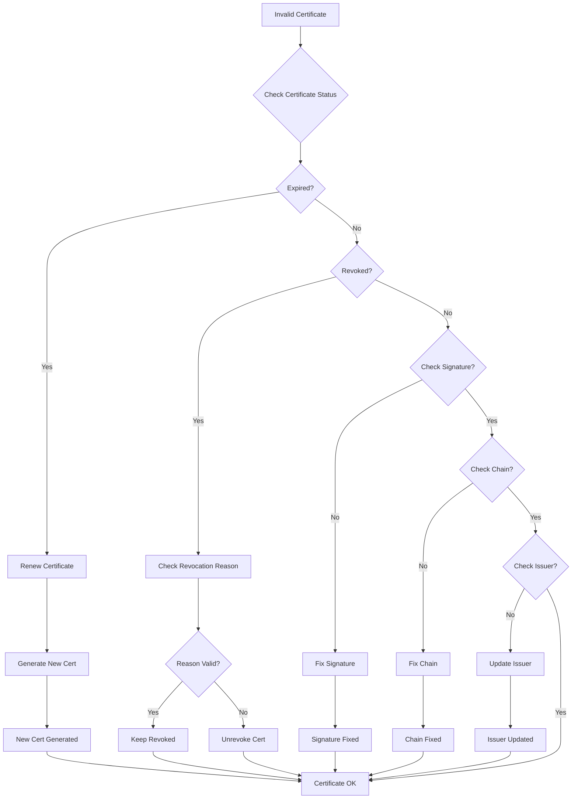
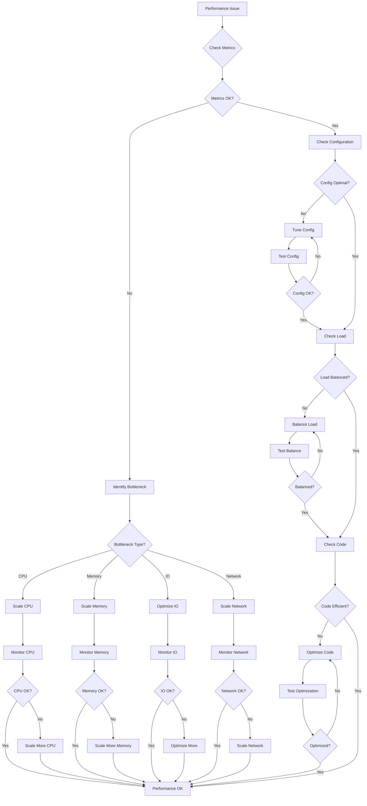

# MS04 - Validatore - Troubleshooting

**Navigazione**: [← DATABASE-SCHEMA.md](DATABASE-SCHEMA.md) | [TROUBLESHOOTING](TROUBLESHOOTING.md) | [docker-compose.yml →](docker-compose.yml)

## Indice

1. [Flusso Diagnostico Generale](#flusso-diagnostico-generale)
2. [Problemi Comuni](#problemi-common)
   - [Validazione Fallita](#validazione-fallita)
   - [Timeout Validazione](#timeout-validazione)
   - [Errore Schema](#errore-schema)
   - [Connessione Database](#connessione-database)
   - [Certificato Non Valido](#certificato-non-valido)
   - [Problemi Performance](#problemi-performance)
3. [Strumenti Diagnostici](#strumenti-diagnostici)
4. [Procedure Recovery](#procedure-recovery)

---

## Flusso Diagnostico Generale



[↑ Torna al Indice](#indice)

---

## Problemi Comuni

### Validazione Fallita

**Sintomi**:
- Status validazione "failed"
- Errori critici nei risultati
- Documento non validato

**Flusso Diagnostico**:


**Soluzione JSON**:
```json
{
  "diagnostic_result": {
    "issue_type": "validation_failed",
    "validation_id": "val-2024-11-18-001",
    "root_cause": "schema_violation",
    "solution": {
      "action": "fix_document_schema",
      "missing_fields": ["invoice_number", "tax_amount"],
      "invalid_fields": ["customer_id"]
    },
    "recovery_payload": {
      "validation_id": "val-2024-11-18-001",
      "action": "retry_validation",
      "skip_failed_checks": false,
      "updated_document": {
        "invoice_number": "INV-2024-001",
        "tax_amount": 704.00,
        "customer_id": "CUST-12345"
      }
    }
  }
}
```

[↑ Torna al Indice](#indice)

---

### Timeout Validazione

**Sintomi**:
- Validazione non completa entro timeout
- Status rimane "running"
- Errori timeout nei log

**Flusso Diagnostico**:


**Soluzione JSON**:
```json
{
  "diagnostic_result": {
    "issue_type": "validation_timeout",
    "validation_id": "val-2024-11-18-001",
    "current_step": "compliance_validation",
    "timeout_duration_seconds": 300,
    "root_cause": "large_document_complexity",
    "solution": {
      "action": "extend_timeout_and_optimize",
      "new_timeout": 600,
      "split_validation": true,
      "parallel_processing": true
    },
    "recovery_payload": {
      "validation_id": "val-2024-11-18-001",
      "action": "resume_with_extended_timeout",
      "timeout_seconds": 600,
      "processing_mode": "parallel"
    }
  }
}
```

[↑ Torna al Indice](#indice)

---

### Errore Schema

**Sintomi**:
- Errori "SCHEMA_VALIDATION_ERROR"
- Campi richiesti mancanti
- Tipi dati non validi

**Flusso Diagnostico**:


**Soluzione JSON**:
```json
{
  "diagnostic_result": {
    "issue_type": "schema_validation_error",
    "validation_id": "val-2024-11-18-001",
    "schema_type": "xml",
    "errors": [
      {
        "field": "invoice/invoice_number",
        "error": "required_field_missing",
        "expected_type": "string"
      },
      {
        "field": "invoice/total_amount",
        "error": "invalid_data_type",
        "expected_type": "decimal",
        "actual_type": "string"
      }
    ],
    "solution": {
      "action": "fix_document_fields",
      "corrections": {
        "invoice_number": "INV-2024-001",
        "total_amount": 3904.00
      }
    },
    "recovery_payload": {
      "validation_id": "val-2024-11-18-001",
      "action": "retry_with_corrections",
      "corrected_document": {
        "invoice": {
          "invoice_number": "INV-2024-001",
          "total_amount": 3904.00
        }
      }
    }
  }
}
```

[↑ Torna al Indice](#indice)

---

### Connessione Database

**Sintomi**:
- Errori "CONNECTION_REFUSED"
- Validazione non può salvare risultati
- Timeout connessione database

**Flusso Diagnostico**:


**Soluzione JSON**:
```json
{
  "diagnostic_result": {
    "issue_type": "database_connection",
    "connection_details": {
      "host": "postgres-validator",
      "port": 5432,
      "database": "validator_db",
      "error": "CONNECTION_TIMEOUT"
    },
    "root_cause": "pool_exhausted",
    "solution": {
      "action": "scale_connection_pool",
      "max_connections": 50,
      "health_check_interval": 30
    },
    "recovery_payload": {
      "database": "validator_db",
      "action": "scale_pool",
      "max_connections": 50,
      "timeout_seconds": 30
    }
  }
}
```

[↑ Torna al Indice](#indice)

---

### Certificato Non Valido

**Sintomi**:
- Errori "CERTIFICATE_EXPIRED"
- Certificati non verificabili
- Validazioni non certificate

**Flusso Diagnostico**:


**Soluzione JSON**:
```json
{
  "diagnostic_result": {
    "issue_type": "invalid_certificate",
    "certificate_id": "cert-val-2024-11-18-001",
    "certificate_status": "expired",
    "root_cause": "certificate_expired",
    "solution": {
      "action": "renew_certificate",
      "new_validity_days": 365,
      "auto_renewal": true
    },
    "recovery_payload": {
      "certificate_id": "cert-val-2024-11-18-001",
      "action": "renew",
      "validity_period_days": 365,
      "renewal_reason": "expired_certificate"
    }
  }
}
```

[↑ Torna al Indice](#indice)

---

### Problemi Performance

**Sintomi**:
- Latenza validazione elevata
- Throughput ridotto
- CPU/Memory usage alto

**Flusso Diagnostico**:


**Soluzione JSON**:
```json
{
  "diagnostic_result": {
    "issue_type": "performance_degradation",
    "metrics": {
      "average_latency_ms": 1850,
      "throughput_docs_per_min": 15,
      "cpu_usage_percent": 85,
      "memory_usage_percent": 78
    },
    "bottleneck": "cpu_exhaustion",
    "solution": {
      "action": "scale_resources",
      "cpu_cores": 4,
      "memory_gb": 8,
      "replicas": 3
    },
    "recovery_payload": {
      "service": "ms04_validator",
      "action": "scale",
      "resources": {
        "cpu": "2",
        "memory": "4Gi"
      },
      "replicas": 3
    }
  }
}
```

[↑ Torna al Indice](#indice)

---

## Strumenti Diagnostici

### Health Check Endpoint
```bash
curl -X GET "http://localhost:8004/api/v1/health" \
  -H "Authorization: Bearer {token}"
```

**Response**:
```json
{
  "status": "healthy",
  "checks": {
    "database": "up",
    "redis": "up",
    "certificate_authority": "up",
    "validation_engine": "healthy"
  },
  "timestamp": "2024-11-18T14:30:00Z"
}
```

### Validation Debug Endpoint
```bash
curl -X GET "http://localhost:8004/api/v1/debug/validation/{validation_id}" \
  -H "Authorization: Bearer {token}"
```

**Response**:
```json
{
  "validation_id": "val-2024-11-18-001",
  "debug_info": {
    "current_step": "compliance_validation",
    "step_progress": {
      "completed": 3,
      "total": 5,
      "percentage": 60
    },
    "rule_engine": {
      "active_rules": 12,
      "rules_applied": 8,
      "rules_failed": 0
    },
    "performance": {
      "total_time_ms": 1200,
      "step_times": {
        "schema_validation": 150,
        "business_rules": 450,
        "compliance_check": 600
      }
    },
    "memory_usage": {
      "current_mb": 256,
      "peak_mb": 512
    }
  }
}
```

[↑ Torna al Indice](#indice)

---

## Procedure Recovery

### Recovery da Validazione Fallita
```json
{
  "recovery_procedure": {
    "validation_id": "val-2024-11-18-001",
    "steps": [
      {
        "step": 1,
        "action": "analyze_failure_cause",
        "error_category": "schema_violation",
        "timeout": 30
      },
      {
        "step": 2,
        "action": "generate_correction_suggestions",
        "missing_fields": ["invoice_number"],
        "invalid_fields": ["total_amount"]
      },
      {
        "step": 3,
        "action": "apply_corrections",
        "corrections": {
          "invoice_number": "INV-2024-001",
          "total_amount": 3904.00
        }
      },
      {
        "step": 4,
        "action": "retry_validation",
        "skip_previous_failures": false
      }
    ],
    "rollback_plan": {
      "preserve_original_document": true,
      "max_retry_attempts": 3,
      "notify_on_final_failure": true
    }
  }
}
```

### Recovery da Timeout
```json
{
  "recovery_procedure": {
    "validation_id": "val-2024-11-18-001",
    "steps": [
      {
        "step": 1,
        "action": "extend_timeout",
        "new_timeout_seconds": 600
      },
      {
        "step": 2,
        "action": "optimize_processing",
        "enable_parallel_processing": true,
        "split_large_documents": true
      },
      {
        "step": 3,
        "action": "resume_validation",
        "from_current_step": true
      }
    ],
    "monitoring": {
      "progress_tracking": true,
      "performance_monitoring": true,
      "alert_on_issues": true
    }
  }
}
```

[↑ Torna al Indice](#indice)

---

**Navigazione**: [← DATABASE-SCHEMA.md](DATABASE-SCHEMA.md) | [TROUBLESHOOTING](TROUBLESHOOTING.md) | [docker-compose.yml →](docker-compose.yml)
