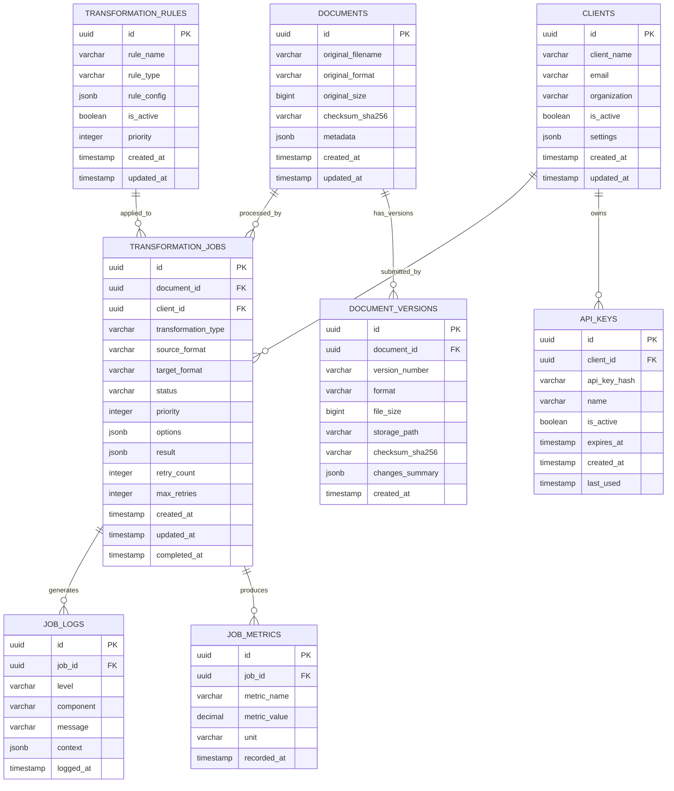

# Schema Database - MS05-TRANSFORMER

## Panoramica Database

Il database PostgreSQL di MS05-TRANSFORMER gestisce metadati, configurazioni e audit trail delle trasformazioni documentali.

## Diagramma ER



## Tabelle Principali

### documents

Tabella principale per i documenti originali e trasformati.

```sql
CREATE TABLE documents (
    id UUID PRIMARY KEY DEFAULT gen_random_uuid(),
    original_filename VARCHAR(255) NOT NULL,
    original_format VARCHAR(10) NOT NULL,
    original_size BIGINT NOT NULL,
    checksum_sha256 VARCHAR(64) NOT NULL,
    metadata JSONB DEFAULT '{}',
    created_at TIMESTAMP WITH TIME ZONE DEFAULT NOW(),
    updated_at TIMESTAMP WITH TIME ZONE DEFAULT NOW()
);

-- Indici
CREATE INDEX idx_documents_format ON documents(original_format);
CREATE INDEX idx_documents_created_at ON documents(created_at);
CREATE INDEX idx_documents_checksum ON documents(checksum_sha256);
CREATE INDEX idx_documents_metadata ON documents USING GIN(metadata);
```

**Esempio Record**:
```json
{
  "id": "550e8400-e29b-41d4-a716-446655440000",
  "original_filename": "provvedimento_urbanistico.pdf",
  "original_format": "PDF",
  "original_size": 2048576,
  "checksum_sha256": "a665a45920422f9d417e4867efdc4fb8a04a1f3fff1fa07e998e86f7f7a27ae3",
  "metadata": {
    "title": "Provvedimento Urbanistico N. 123/2025",
    "author": "Ufficio Tecnico Comunale",
    "created_date": "2025-11-15T09:30:00Z",
    "page_count": 12,
    "language": "it"
  },
  "created_at": "2025-11-18T10:15:00Z",
  "updated_at": "2025-11-18T10:15:00Z"
}
```

### transformation_jobs

Tabella per tracciare tutti i job di trasformazione.

```sql
CREATE TABLE transformation_jobs (
    id UUID PRIMARY KEY DEFAULT gen_random_uuid(),
    document_id UUID NOT NULL REFERENCES documents(id),
    client_id UUID REFERENCES clients(id),
    transformation_type VARCHAR(50) NOT NULL,
    source_format VARCHAR(10) NOT NULL,
    target_format VARCHAR(10) NOT NULL,
    status VARCHAR(20) NOT NULL DEFAULT 'PENDING',
    priority INTEGER DEFAULT 0,
    options JSONB DEFAULT '{}',
    result JSONB,
    retry_count INTEGER DEFAULT 0,
    max_retries INTEGER DEFAULT 3,
    created_at TIMESTAMP WITH TIME ZONE DEFAULT NOW(),
    updated_at TIMESTAMP WITH TIME ZONE DEFAULT NOW(),
    completed_at TIMESTAMP WITH TIME ZONE
);

-- Indici
CREATE INDEX idx_jobs_document_id ON transformation_jobs(document_id);
CREATE INDEX idx_jobs_client_id ON transformation_jobs(client_id);
CREATE INDEX idx_jobs_status ON transformation_jobs(status);
CREATE INDEX idx_jobs_created_at ON transformation_jobs(created_at);
CREATE INDEX idx_jobs_priority ON transformation_jobs(priority DESC);
CREATE INDEX idx_jobs_options ON transformation_jobs USING GIN(options);
```

**Esempio Record**:
```json
{
  "id": "550e8400-e29b-41d4-a716-446655440001",
  "document_id": "550e8400-e29b-41d4-a716-446655440000",
  "client_id": "550e8400-e29b-41d4-a716-446655440002",
  "transformation_type": "CONVERT",
  "source_format": "PDF",
  "target_format": "DOCX",
  "status": "COMPLETED",
  "priority": 1,
  "options": {
    "compression_level": "HIGH",
    "preserve_metadata": true,
    "ocr_enabled": false
  },
  "result": {
    "output_document_id": "550e8400-e29b-41d4-a716-446655440003",
    "processing_time": 15.7,
    "file_size": 245760,
    "warnings": [],
    "errors": []
  },
  "retry_count": 0,
  "max_retries": 3,
  "created_at": "2025-11-18T10:15:00Z",
  "updated_at": "2025-11-18T10:30:45Z",
  "completed_at": "2025-11-18T10:30:45Z"
}
```

### document_versions

Tracciamento delle versioni dei documenti trasformati.

```sql
CREATE TABLE document_versions (
    id UUID PRIMARY KEY DEFAULT gen_random_uuid(),
    document_id UUID NOT NULL REFERENCES documents(id),
    version_number VARCHAR(20) NOT NULL,
    format VARCHAR(10) NOT NULL,
    file_size BIGINT NOT NULL,
    storage_path VARCHAR(500) NOT NULL,
    checksum_sha256 VARCHAR(64) NOT NULL,
    changes_summary JSONB DEFAULT '{}',
    created_at TIMESTAMP WITH TIME ZONE DEFAULT NOW()
);

-- Indici
CREATE INDEX idx_versions_document_id ON document_versions(document_id);
CREATE INDEX idx_versions_format ON document_versions(format);
CREATE INDEX idx_versions_created_at ON document_versions(created_at);
```

**Esempio Record**:
```json
{
  "id": "550e8400-e29b-41d4-a716-446655440004",
  "document_id": "550e8400-e29b-41d4-a716-446655440000",
  "version_number": "1.0",
  "format": "DOCX",
  "file_size": 245760,
  "storage_path": "/storage/transformed/2025/11/18/550e8400-e29b-41d4-a716-446655440000.docx",
  "checksum_sha256": "b665a45920422f9d417e4867efdc4fb8a04a1f3fff1fa07e998e86f7f7a27ae4",
  "changes_summary": {
    "transformation_type": "PDF to DOCX",
    "compression_applied": true,
    "metadata_preserved": true
  },
  "created_at": "2025-11-18T10:30:45Z"
}
```

### job_logs

Log dettagliati per ogni job di trasformazione.

```sql
CREATE TABLE job_logs (
    id UUID PRIMARY KEY DEFAULT gen_random_uuid(),
    job_id UUID NOT NULL REFERENCES transformation_jobs(id),
    level VARCHAR(10) NOT NULL,
    component VARCHAR(50) NOT NULL,
    message TEXT NOT NULL,
    context JSONB DEFAULT '{}',
    logged_at TIMESTAMP WITH TIME ZONE DEFAULT NOW()
);

-- Indici
CREATE INDEX idx_logs_job_id ON job_logs(job_id);
CREATE INDEX idx_logs_level ON job_logs(level);
CREATE INDEX idx_logs_component ON job_logs(component);
CREATE INDEX idx_logs_logged_at ON job_logs(logged_at);
```

**Esempio Record**:
```json
{
  "id": "550e8400-e29b-41d4-a716-446655440005",
  "job_id": "550e8400-e29b-41d4-a716-446655440001",
  "level": "INFO",
  "component": "TransformationEngine",
  "message": "PDF conversion completed successfully",
  "context": {
    "pages_processed": 12,
    "processing_time": 15.7,
    "output_size": 245760
  },
  "logged_at": "2025-11-18T10:30:40Z"
}
```

### job_metrics

Metriche dettagliate per ogni job.

```sql
CREATE TABLE job_metrics (
    id UUID PRIMARY KEY DEFAULT gen_random_uuid(),
    job_id UUID NOT NULL REFERENCES transformation_jobs(id),
    metric_name VARCHAR(100) NOT NULL,
    metric_value DECIMAL(10,4) NOT NULL,
    unit VARCHAR(20),
    recorded_at TIMESTAMP WITH TIME ZONE DEFAULT NOW()
);

-- Indici
CREATE INDEX idx_metrics_job_id ON job_metrics(job_id);
CREATE INDEX idx_metrics_name ON job_metrics(metric_name);
CREATE INDEX idx_metrics_recorded_at ON job_metrics(recorded_at);
```

**Esempio Record**:
```json
{
  "id": "550e8400-e29b-41d4-a716-446655440006",
  "job_id": "550e8400-e29b-41d4-a716-446655440001",
  "metric_name": "processing_time",
  "metric_value": 15.7000,
  "unit": "seconds",
  "recorded_at": "2025-11-18T10:30:45Z"
}
```

### transformation_rules

Regole di trasformazione configurabili.

```sql
CREATE TABLE transformation_rules (
    id UUID PRIMARY KEY DEFAULT gen_random_uuid(),
    rule_name VARCHAR(100) NOT NULL UNIQUE,
    rule_type VARCHAR(50) NOT NULL,
    rule_config JSONB NOT NULL DEFAULT '{}',
    is_active BOOLEAN DEFAULT true,
    priority INTEGER DEFAULT 0,
    created_at TIMESTAMP WITH TIME ZONE DEFAULT NOW(),
    updated_at TIMESTAMP WITH TIME ZONE DEFAULT NOW()
);

-- Indici
CREATE INDEX idx_rules_type ON transformation_rules(rule_type);
CREATE INDEX idx_rules_active ON transformation_rules(is_active);
CREATE INDEX idx_rules_priority ON transformation_rules(priority DESC);
```

**Esempio Record**:
```json
{
  "id": "550e8400-e29b-41d4-a716-446655440007",
  "rule_name": "pdf_compression_high",
  "rule_type": "COMPRESSION",
  "rule_config": {
    "compression_level": "HIGH",
    "image_quality": 0.8,
    "remove_metadata": false
  },
  "is_active": true,
  "priority": 10,
  "created_at": "2025-11-01T00:00:00Z",
  "updated_at": "2025-11-01T00:00:00Z"
}
```

### clients

Gestione dei client che utilizzano il servizio.

```sql
CREATE TABLE clients (
    id UUID PRIMARY KEY DEFAULT gen_random_uuid(),
    client_name VARCHAR(100) NOT NULL,
    email VARCHAR(255) NOT NULL,
    organization VARCHAR(100),
    is_active BOOLEAN DEFAULT true,
    settings JSONB DEFAULT '{}',
    created_at TIMESTAMP WITH TIME ZONE DEFAULT NOW(),
    updated_at TIMESTAMP WITH TIME ZONE DEFAULT NOW()
);

-- Indici
CREATE UNIQUE INDEX idx_clients_email ON clients(email);
CREATE INDEX idx_clients_active ON clients(is_active);
CREATE INDEX idx_clients_organization ON clients(organization);
```

**Esempio Record**:
```json
{
  "id": "550e8400-e29b-41d4-a716-446655440002",
  "client_name": "Sistema Gestionale Documentale",
  "email": "admin@comune.milano.it",
  "organization": "Comune di Milano",
  "is_active": true,
  "settings": {
    "rate_limit": 100,
    "max_file_size": "10MB",
    "allowed_formats": ["PDF", "DOCX", "XML"]
  },
  "created_at": "2025-10-01T00:00:00Z",
  "updated_at": "2025-11-01T00:00:00Z"
}
```

### api_keys

Gestione delle chiavi API per l'autenticazione.

```sql
CREATE TABLE api_keys (
    id UUID PRIMARY KEY DEFAULT gen_random_uuid(),
    client_id UUID NOT NULL REFERENCES clients(id),
    api_key_hash VARCHAR(128) NOT NULL UNIQUE,
    name VARCHAR(100) NOT NULL,
    is_active BOOLEAN DEFAULT true,
    expires_at TIMESTAMP WITH TIME ZONE,
    created_at TIMESTAMP WITH TIME ZONE DEFAULT NOW(),
    last_used TIMESTAMP WITH TIME ZONE
);

-- Indici
CREATE INDEX idx_api_keys_client_id ON api_keys(client_id);
CREATE INDEX idx_api_keys_active ON api_keys(is_active);
CREATE INDEX idx_api_keys_expires_at ON api_keys(expires_at);
CREATE UNIQUE INDEX idx_api_keys_hash ON api_keys(api_key_hash);
```

**Esempio Record**:
```json
{
  "id": "550e8400-e29b-41d4-a716-446655440008",
  "client_id": "550e8400-e29b-41d4-a716-446655440002",
  "api_key_hash": "sha256$abc123...",
  "name": "Production API Key",
  "is_active": true,
  "expires_at": "2026-11-18T00:00:00Z",
  "created_at": "2025-11-01T00:00:00Z",
  "last_used": "2025-11-18T10:15:00Z"
}
```

## Viste e Funzioni

### Vista: active_jobs_summary

```sql
CREATE VIEW active_jobs_summary AS
SELECT
    tj.id,
    tj.status,
    tj.transformation_type,
    tj.source_format,
    tj.target_format,
    tj.priority,
    tj.created_at,
    tj.updated_at,
    d.original_filename,
    c.client_name
FROM transformation_jobs tj
JOIN documents d ON tj.document_id = d.id
LEFT JOIN clients c ON tj.client_id = c.id
WHERE tj.status IN ('PENDING', 'PROCESSING');
```

### Funzione: get_job_statistics

```sql
CREATE OR REPLACE FUNCTION get_job_statistics(
    p_start_date TIMESTAMP WITH TIME ZONE DEFAULT NOW() - INTERVAL '24 hours',
    p_end_date TIMESTAMP WITH TIME ZONE DEFAULT NOW()
)
RETURNS TABLE (
    total_jobs BIGINT,
    completed_jobs BIGINT,
    failed_jobs BIGINT,
    avg_processing_time DECIMAL,
    success_rate DECIMAL
) AS $$
BEGIN
    RETURN QUERY
    SELECT
        COUNT(*) as total_jobs,
        COUNT(*) FILTER (WHERE status = 'COMPLETED') as completed_jobs,
        COUNT(*) FILTER (WHERE status = 'FAILED') as failed_jobs,
        AVG(EXTRACT(EPOCH FROM (completed_at - created_at))) as avg_processing_time,
        ROUND(
            COUNT(*) FILTER (WHERE status = 'COMPLETED')::DECIMAL /
            NULLIF(COUNT(*), 0) * 100, 2
        ) as success_rate
    FROM transformation_jobs
    WHERE created_at BETWEEN p_start_date AND p_end_date;
END;
$$ LANGUAGE plpgsql;
```

## Strategie di Partizionamento

### Partizionamento per Tempo

```sql
-- Partizionamento mensile per job_logs
CREATE TABLE job_logs_y2025m11 PARTITION OF job_logs
    FOR VALUES FROM ('2025-11-01') TO ('2025-12-01');

-- Partizionamento mensile per job_metrics
CREATE TABLE job_metrics_y2025m11 PARTITION OF job_metrics
    FOR VALUES FROM ('2025-11-01') TO ('2025-12-01');
```

### Partizionamento per Cliente

```sql
-- Partizionamento per client ad alto volume
CREATE TABLE transformation_jobs_client_high PARTITION OF transformation_jobs
    FOR VALUES IN ('client-high-volume-id');
```

## Backup e Recovery

### Strategia di Backup

- **Full Backup**: Settimanale (domenica 02:00)
- **Incremental Backup**: Giornaliero (02:00)
- **Log Backup**: Ogni 15 minuti
- **Retention**: 30 giorni per incrementali, 1 anno per full

### Recovery Time Objective (RTO)

- **Database completo**: 4 ore
- **Singola tabella**: 1 ora
- **Point-in-time recovery**: 15 minuti