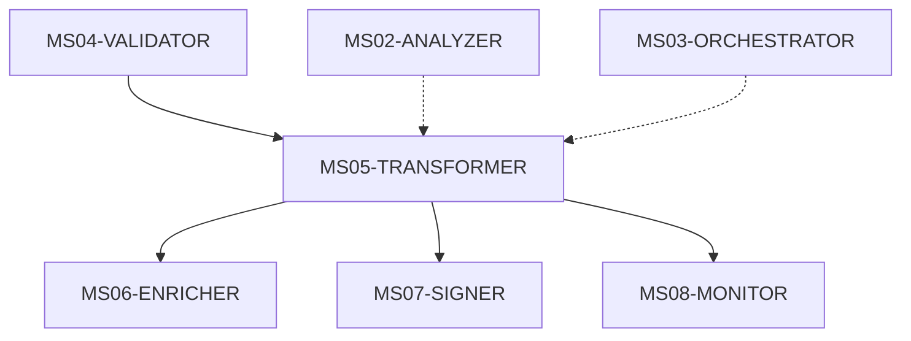
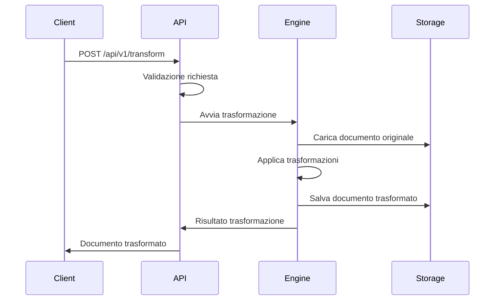
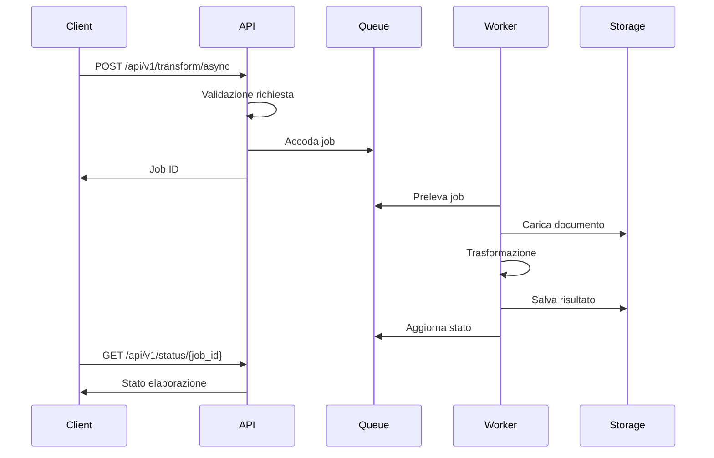

# MS05 - TRANSFORMER

## Panoramica

Il microservizio **MS05-TRANSFORMER** è il motore di trasformazione documentale della piattaforma ZenIA. Responsabile della conversione, normalizzazione e ottimizzazione dei documenti validati, garantisce che tutti i contenuti siano in formato standardizzato e ottimizzato per l'elaborazione successiva.

## Responsabilità Principali

- **Conversione Formati**: Trasformazione tra diversi formati documentali (PDF, DOCX, XML, JSON)
- **Normalizzazione Contenuti**: Standardizzazione della struttura e del formato dei dati
- **Ottimizzazione Documenti**: Compressione, pulizia e ottimizzazione delle dimensioni
- **Validazione Post-Trasformazione**: Verifica dell'integrità dopo le trasformazioni
- **Gestione Metadati**: Manutenzione e arricchimento dei metadati durante le trasformazioni

## Integrazione con Altri Microservizi

## Architettura

### Componenti Principali

1. **API Gateway**: Punto di ingresso per le richieste di trasformazione
2. **Queue Manager**: Gestione delle code di trasformazione asincrona
3. **Transformation Engine**: Motore principale di conversione
4. **Format Validators**: Validatori per formati specifici
5. **Metadata Processor**: Gestore dei metadati
6. **Storage Manager**: Gestione dell'archiviazione temporanea
7. **Monitoring Agent**: Monitoraggio delle prestazioni

### Tecnologie Utilizzate

- **Framework**: FastAPI per l'API REST
- **Database**: PostgreSQL per metadati e configurazioni
- **Cache**: Redis per risultati intermedi
- **Message Queue**: Redis Queue per elaborazione asincrona
- **Librerie Trasformazione**:
  - PyPDF2, pdfkit per PDF
  - python-docx per DOCX
  - lxml per XML
  - ReportLab per generazione PDF

## Flussi Operativi

### Flusso di Trasformazione Sincrona

### Flusso di Trasformazione Asincrona

## Configurazioni Supportate

### Trasformazioni PDF

- **PDF → DOCX**: Estrazione testo e layout
- **PDF → XML**: Strutturazione semantica
- **PDF → JSON**: Estrazione dati strutturati
- **DOCX → PDF**: Conversione con formattazione
- **XML → PDF**: Rendering basato su template

### Ottimizzazioni

- **Compressione**: Riduzione dimensioni senza perdita qualità
- **Pulizia**: Rimozione elementi non necessari
- **Normalizzazione**: Standardizzazione formati
- **Validazione**: Controllo integrità post-trasformazione

## Monitoraggio e Metriche

### KPI Principali

- **Throughput**: Documenti trasformati al minuto
- **Success Rate**: Percentuale trasformazioni riuscite
- **Average Processing Time**: Tempo medio di elaborazione
- **Error Rate**: Percentuale errori per tipo
- **Queue Length**: Lunghezza code di elaborazione

### Alert e Soglie

- **Critico**: Error rate > 5%
- **Warning**: Queue length > 100
- **Info**: Processing time > 30 secondi

## Sicurezza

### Autenticazione e Autorizzazione

- JWT tokens per autenticazione API
- Role-based access control (RBAC)
- API key validation per client esterni

### Protezione Dati

- Crittografia end-to-end per documenti sensibili
- Sanitizzazione input per prevenzione injection
- Rate limiting per protezione DoS

## Scalabilità

### Strategie di Scalabilità

- **Orizzontale**: Aggiunta worker nodes
- **Verticale**: Aumento risorse per nodo
- **Auto-scaling**: Basato su load e queue length

### Limiti e Quotas

- **Max Concurrent Jobs**: 50 per istanza
- **Max Document Size**: 10MB
- **Max Processing Time**: 300 secondi
- **Rate Limit**: 100 richieste/minuto per client