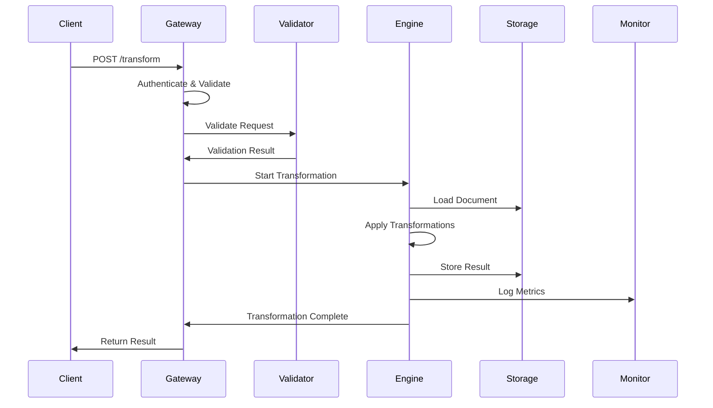
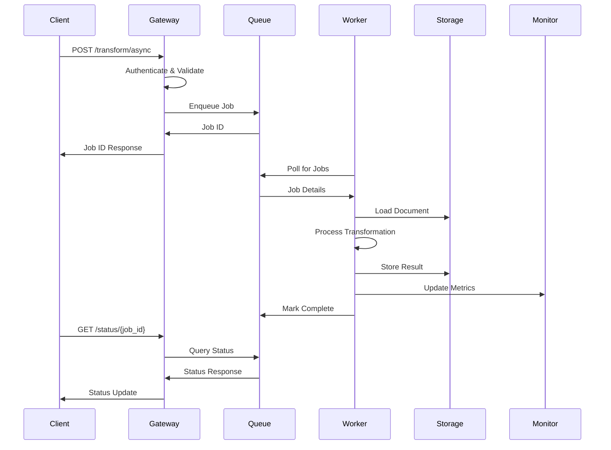

# Specifiche Tecniche - MS05-TRANSFORMER

## Architettura del Sistema

### Componenti Architetturali

#### 1. API Gateway Layer
**Responsabilità**: Punto di ingresso unificato per tutte le richieste di trasformazione
- **Tecnologie**: FastAPI, Uvicorn
- **Protocolli**: REST API, WebSocket per aggiornamenti real-time
- **Sicurezza**: JWT validation, rate limiting, CORS
- **Scalabilità**: Load balancing, circuit breaker

#### 2. Queue Management System
**Responsabilità**: Gestione delle code di elaborazione asincrona
- **Tecnologie**: Redis Queue, Celery
- **Funzionalità**: Priority queuing, job scheduling, retry logic
- **Monitoraggio**: Queue depth, processing rates, failure rates
- **Resilienza**: Dead letter queues, exponential backoff

#### 3. Transformation Engine Core
**Responsabilità**: Motore principale di conversione documentale
- **Tecnologie**: Python multiprocessing, concurrent.futures
- **Formati Supportati**:
  - PDF ↔ DOCX ↔ XML ↔ JSON
  - Immagini → PDF (OCR integrato)
  - Template-based generation
- **Ottimizzazioni**: Memory pooling, streaming processing

#### 4. Format Validation Layer
**Responsabilità**: Validazione pre e post trasformazione
- **Tecnologie**: Cerberus, jsonschema, XML schema validation
- **Validazioni**:
  - Struttura documentale
  - Integrità contenuti
  - Conformità standard
  - Metadati completi

#### 5. Metadata Processing Unit
**Responsabilità**: Gestione e arricchimento metadati
- **Funzionalità**:
  - Estrazione metadati da documenti
  - Arricchimento con informazioni contestuali
  - Mantenimento catena di custodia
  - Versioning e audit trail

#### 6. Storage Abstraction Layer
**Responsabilità**: Gestione archiviazione temporanea e permanente
- **Tecnologie**: MinIO S3-compatible, Redis cache
- **Strategie**:
  - Temporary storage per elaborazione
  - CDN integration per distribuzione
  - Backup e disaster recovery
  - Lifecycle management

#### 7. Monitoring & Observability Layer
**Responsabilità**: Monitoraggio completo del sistema
- **Metriche**:
  - Performance: latency, throughput, error rates
  - Business: transformation success rate, format distribution
  - System: CPU, memory, disk I/O, network
- **Logging**: Strutturato, correlazione richieste, audit logging
- **Alerting**: Threshold-based, anomaly detection

## Modelli di Dati

### Document Model
```json
{
  "document_id": "uuid",
  "original_format": "PDF|DOCX|XML|JSON",
  "target_format": "PDF|DOCX|XML|JSON",
  "metadata": {
    "title": "string",
    "author": "string",
    "created_date": "ISO8601",
    "modified_date": "ISO8601",
    "page_count": "integer",
    "file_size": "integer",
    "checksum": "SHA256"
  },
  "processing_options": {
    "compression_level": "LOW|MEDIUM|HIGH",
    "quality_preservation": "boolean",
    "metadata_preservation": "boolean",
    "ocr_enabled": "boolean"
  },
  "status": "PENDING|PROCESSING|COMPLETED|FAILED",
  "created_at": "ISO8601",
  "updated_at": "ISO8601"
}
```

### Transformation Job Model
```json
{
  "job_id": "uuid",
  "document_id": "uuid",
  "transformation_type": "CONVERT|OPTIMIZE|VALIDATE",
  "priority": "LOW|NORMAL|HIGH|URGENT",
  "status": "QUEUED|PROCESSING|COMPLETED|FAILED",
  "progress": {
    "percentage": "integer",
    "current_step": "string",
    "estimated_completion": "ISO8601"
  },
  "result": {
    "output_document_id": "uuid",
    "processing_time": "integer",
    "file_size_reduction": "integer",
    "warnings": ["string"],
    "errors": ["string"]
  },
  "retry_count": "integer",
  "max_retries": "integer",
  "created_at": "ISO8601",
  "updated_at": "ISO8601"
}
```

## Requisiti di Servizio (SLA)

### Disponibilità
- **Target**: 99.9% uptime mensile
- **Manutenzione**: Finestre programmate 2-4 AM CET
- **RTO**: 4 ore per disaster recovery
- **RPO**: 1 ora perdita dati massima

### Performance
- **Latenza Media**: < 30 secondi per documenti < 5MB
- **Throughput**: 100 documenti/minuto per istanza
- **Concorrenza**: 50 trasformazioni simultanee
- **Scalabilità**: Auto-scaling basato su queue length

### Qualità
- **Success Rate**: > 95% trasformazioni riuscite
- **Accuratezza**: > 99% fedeltà conversione
- **Integrità**: 100% conservazione metadati critici

## Sicurezza e Compliance

### Controlli di Sicurezza
- **Autenticazione**: OAuth2/JWT con refresh tokens
- **Autorizzazione**: RBAC con granular permissions
- **Crittografia**: AES-256 per dati a riposo e in transito
- **Audit**: Logging completo di tutte le operazioni

### Compliance
- **GDPR**: Data minimization, right to erasure
- **ISO 27001**: Information security management
- **AgID**: Conformità PA digitale italiana

## Sequenze Operative

### Sequenza Trasformazione Sincrona


### Sequenza Trasformazione Asincrona


## Gestione Errori e Recovery

### Strategie di Recovery
- **Retry Logic**: Exponential backoff per errori temporanei
- **Circuit Breaker**: Isolamento componenti fault
- **Fallback**: Modalità degraded per servizi critici
- **Rollback**: Ripristino stato precedente per fallimenti

### Codici Errore
- **400**: Richiesta malformata
- **401**: Non autorizzato
- **403**: Accesso negato
- **404**: Risorsa non trovata
- **409**: Conflitto (job già in elaborazione)
- **413**: Payload troppo grande
- **422**: Validazione fallita
- **429**: Rate limit superato
- **500**: Errore interno server
- **503**: Servizio temporaneamente non disponibile

## Monitoraggio e Alerting

### Metriche Chiave
- **Business Metrics**:
  - Transformation success rate
  - Average processing time per format
  - Queue depth and processing rate
- **Technical Metrics**:
  - CPU/Memory utilization
  - Disk I/O and network throughput
  - Error rates per component
- **Security Metrics**:
  - Failed authentication attempts
  - Suspicious activity patterns
  - Data access audit trails

### Soglie Alert
- **Critico**: Error rate > 5%, Queue depth > 200
- **Warning**: Processing time > 60s, Memory usage > 85%
- **Info**: New format requests, Performance degradation