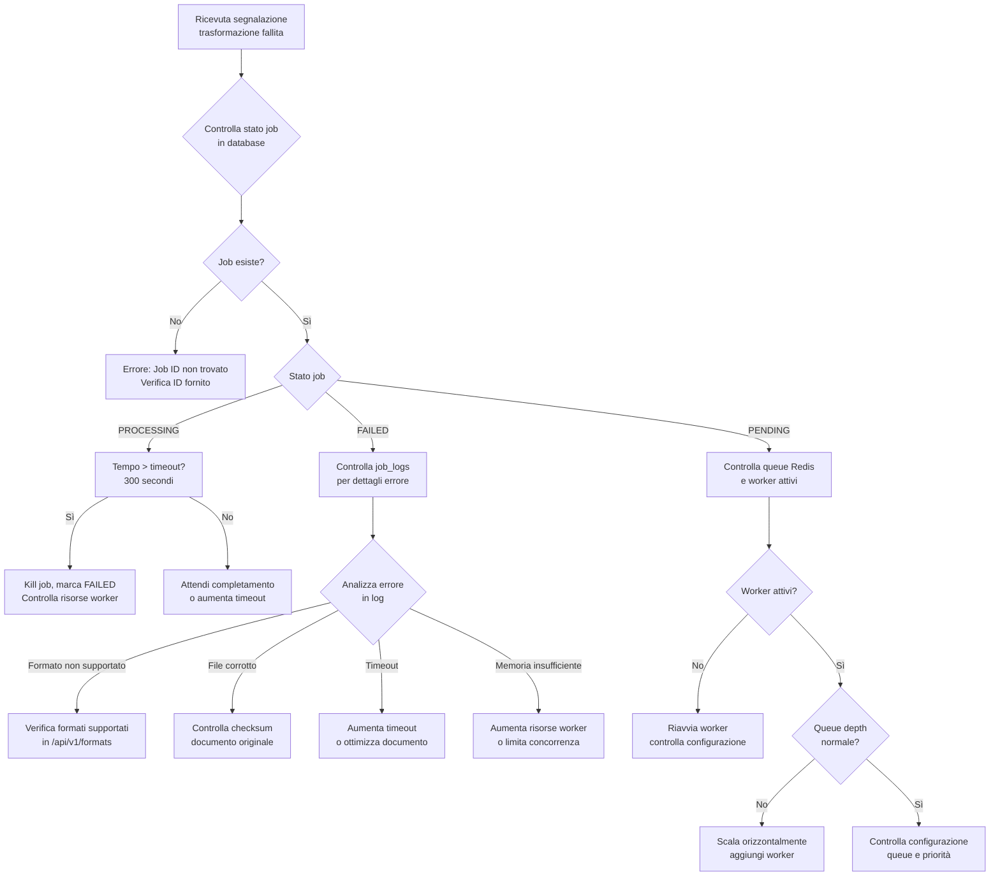
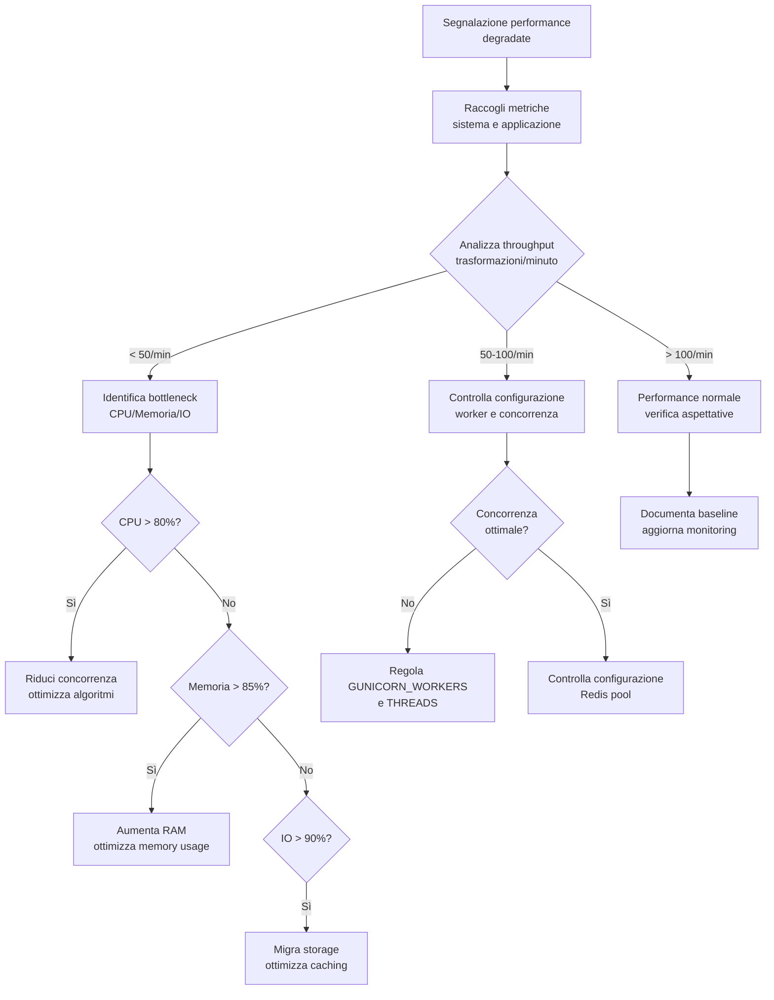
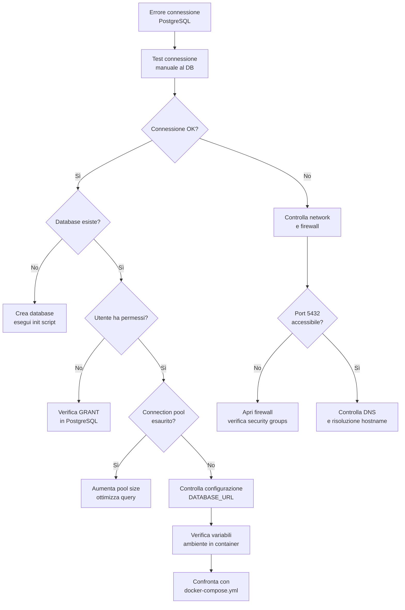

# Troubleshooting - MS05-TRANSFORMER

## Panoramica Troubleshooting

Questa guida fornisce flussi diagnostici e soluzioni per i problemi più comuni nel microservizio MS05-TRANSFORMER.

## Flussi Diagnostici

### Flusso: Trasformazione Fallita



### Flusso: Performance Degradate



### Flusso: Errori Connessione Database



## Problemi Comuni e Soluzioni

### 1. Trasformazioni PDF Fallite

**Sintomi**:
- Errori "PDF parsing failed"
- Trasformazioni che rimangono in stato PROCESSING
- Log mostrano "Invalid PDF structure"

**Soluzioni**:
```bash
# Verifica integrità PDF
pdfinfo documento.pdf

# Controlla se PDF è protetto
qpdf --check documento.pdf

# Prova riparazione PDF
qpdf documento.pdf repaired.pdf
```

**Configurazione**:
```yaml
# In docker-compose.yml
environment:
  - PDF_PARSER_STRICT=false
  - PDF_REPAIR_ENABLED=true
  - MAX_PDF_SIZE=10485760
```

### 2. Timeout Trasformazioni

**Sintomi**:
- Job marcati come FAILED dopo 300 secondi
- Log mostrano "Processing timeout"
- Documenti di grandi dimensioni falliscono

**Soluzioni**:
```yaml
# Aumenta timeout per documenti grandi
environment:
  - TRANSFORMATION_TIMEOUT_DEFAULT=600
  - MAX_DOCUMENT_SIZE=20971520
  - GUNICORN_TIMEOUT=600
```

**Ottimizzazioni**:
- Comprimere documenti prima dell'upload
- Suddividere documenti molto grandi
- Utilizzare trasformazione asincrona per documenti >5MB

### 3. Memoria Insufficiente

**Sintomi**:
- Worker crashano con "Out of memory"
- Performance degradano gradualmente
- Log mostrano "Memory allocation failed"

**Soluzioni**:
```yaml
# Aumenta risorse container
services:
  ms05-transformer:
    deploy:
      resources:
        limits:
          memory: 2G
        reservations:
          memory: 1G

# Riduci concorrenza
environment:
  - GUNICORN_WORKERS=2
  - MAX_CONCURRENT_JOBS=25
```

### 4. Code Redis Piena

**Sintomi**:
- Nuovi job rimangono in PENDING
- Latenza alta per accettazione job
- Metriche mostrano queue_depth > 100

**Soluzioni**:
```yaml
# Scala orizzontalmente
services:
  ms05-transformer:
    scale: 3

# Aumenta risorse Redis
redis-transformer:
  deploy:
    resources:
      limits:
        memory: 512M
```

### 5. Errori Conversione Formato

**Sintomi**:
- Trasformazioni DOCX→PDF falliscono
- Caratteri speciali corrotti
- Layout non preservato

**Soluzioni**:
```yaml
# Aggiorna librerie conversione
environment:
  - LIBREOFFICE_ENABLED=true
  - FONT_EMBEDDING=true
  - IMAGE_QUALITY=0.95
```

## Monitoraggio e Alert

### Metriche Chiave da Monitorare

```yaml
# Prometheus metrics
transformation_success_rate{job="ms05-transformer"} < 0.95
transformation_processing_time{job="ms05-transformer"} > 60
queue_depth{job="ms05-transformer"} > 50
memory_usage{job="ms05-transformer"} > 0.85
cpu_usage{job="ms05-transformer"} > 0.80
```

### Log Pattern da Cercare

```bash
# Errori critici
grep "CRITICAL\|ERROR" /app/logs/transformer.log

# Timeout
grep "timeout\|Timeout" /app/logs/transformer.log

# Memory issues
grep "MemoryError\|OutOfMemory" /app/logs/transformer.log

# Database connection issues
grep "connection\|Connection" /app/logs/transformer.log
```

## Comandi Diagnostici

### Verifica Stato Servizio

```bash
# Health check
curl -f http://ms05-transformer:8005/api/v1/health

# Metrics
curl http://ms05-transformer:8005/api/v1/metrics

# Database connection
docker exec ms05-transformer pg_isready -h postgres-transformer -U transformer_user
```

### Analisi Performance

```bash
# CPU e memoria
docker stats ms05-transformer

# Redis queue status
docker exec redis-transformer redis-cli LLEN transformer:queue

# Database connections
docker exec postgres-transformer psql -U transformer_user -d transformer_db -c "SELECT count(*) FROM pg_stat_activity;"
```

### Log Analysis

```bash
# Ultimi errori
docker logs ms05-transformer --tail 100 | grep ERROR

# Job specifici
docker logs ms05-transformer | grep "job_id=550e8400-e29b-41d4-a716-446655440000"

# Performance summary
docker logs ms05-transformer | grep "processing_time" | awk '{sum+=$2} END {print "Avg:", sum/NR}'
```

## Recovery Procedures

### Recovery da Crash Worker

```bash
# 1. Verifica stato
docker ps | grep ms05-transformer

# 2. Riavvia container
docker restart ms05-transformer

# 3. Controlla recovery job
curl http://ms05-transformer:8005/api/v1/status/{job_id}

# 4. Se necessario, retry manuale
curl -X POST http://ms05-transformer:8005/api/v1/admin/retry/{job_id}
```

### Recovery da Perdita Database

```bash
# 1. Stop servizio
docker stop ms05-transformer

# 2. Restore da backup
docker exec postgres-transformer pg_restore -U transformer_user -d transformer_db /backup/latest.dump

# 3. Verifica integrità
docker exec postgres-transformer psql -U transformer_user -d transformer_db -c "SELECT count(*) FROM transformation_jobs;"

# 4. Riavvia servizio
docker start ms05-transformer
```

### Emergency Procedures

#### Arresto di Emergenza
```bash
# Stop immediato tutti i servizi
docker-compose down --timeout 10

# Kill forzato se necessario
docker kill $(docker ps -q --filter name=ms05)
```

#### Modalità Maintenance
```yaml
# Configurazione maintenance
environment:
  - MAINTENANCE_MODE=true
  - ALLOWED_CLIENTS=admin_only
```

## Prevenzione Problemi

### Best Practices

1. **Monitoring Proattivo**
   - Alert su metriche chiave
   - Dashboard real-time
   - Log aggregation centralizzato

2. **Capacity Planning**
   - Monitoraggio trend utilizzo
   - Scaling automatico basato su metriche
   - Backup e disaster recovery testati

3. **Code Quality**
   - Test automatizzati per nuove funzionalità
   - Code review obbligatorie
   - Dependency scanning regolare

### Checklist Manutenzione Settimanale

- [ ] Verifica spazio disco (>20% libero)
- [ ] Controllo backup database
- [ ] Aggiornamento dipendenze sicurezza
- [ ] Analisi log per pattern anomali
- [ ] Test performance baseline
- [ ] Verifica configurazione monitoring

## Contatti Supporto

- **Team Sviluppo**: dev@zen-ia.it
- **Supporto Operativo**: ops@zen-ia.it
- **Security**: security@zen-ia.it
- **Documentazione**: docs@zen-ia.it