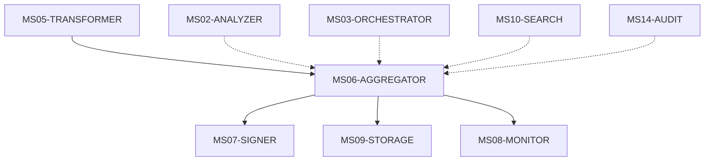
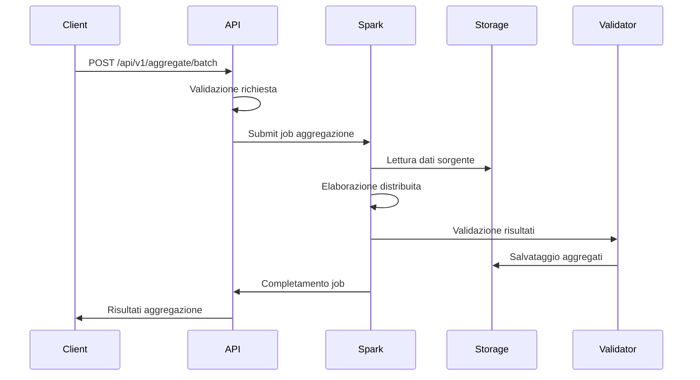
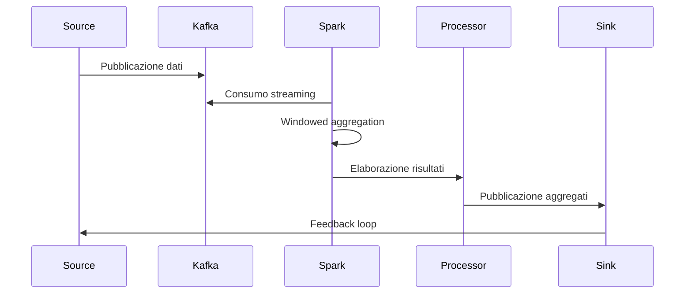

# MS06 - AGGREGATOR

## Panoramica

Il microservizio **MS06-AGGREGATOR** è il motore di aggregazione dati della piattaforma ZenIA. Responsabile della raccolta, consolidamento e aggregazione di dati provenienti da molteplici fonti, garantisce l'integrazione efficiente di informazioni eterogenee per analisi avanzate e reporting consolidato.

## Responsabilità Principali

- **Aggregazione Dati**: Consolidamento dati da fonti multiple
- **Data Integration**: Integrazione dati eterogenei e normalizzazione
- **Batch Processing**: Elaborazione batch di grandi volumi di dati
- **Real-time Aggregation**: Aggregazione streaming per dati in tempo reale
- **Data Quality**: Validazione e pulizia dati aggregati
- **Performance Optimization**: Ottimizzazione query e aggregazioni
- **Data Lineage**: Tracciamento provenienza e trasformazioni dati

## Integrazione con Altri Microservizi

## Architettura

### Componenti Principali

1. **API Gateway**: Punto di ingresso per richieste di aggregazione
2. **Data Collector**: Raccoglitore dati da fonti multiple
3. **Aggregation Engine**: Motore di aggregazione basato su Apache Spark
4. **Data Processor**: Processore per normalizzazione e pulizia
5. **Cache Manager**: Gestore cache per risultati aggregati
6. **Quality Validator**: Validatore qualità dati aggregati
7. **Result Store**: Archivio risultati aggregazione

### Tecnologie Utilizzate

- **Framework**: FastAPI per l'API REST
- **Database**: PostgreSQL per metadati e risultati aggregati
- **Cache**: Redis per risultati intermedi
- **Big Data Engine**: Apache Spark per elaborazione distribuita
- **Message Queue**: Kafka per streaming aggregation
- **Storage**: MinIO/HDFS per dati grezzi
- **Monitoring**: Prometheus per metriche Spark

## Flussi Operativi

### Flusso di Aggregazione Batch

### Flusso di Aggregazione Streaming

## Tipi di Aggregazione Supportati

### Aggregazioni Temporali

- **Time Series**: Aggregazione per intervalli temporali
- **Sliding Windows**: Finestre mobili per analisi trend
- **Event Aggregation**: Aggregazione basata su eventi
- **Periodic Reports**: Report periodici automatici

### Aggregazioni Statistiche

- **Sum/Avg/Min/Max**: Aggregazioni matematiche base
- **Percentiles**: Calcolo percentili e distribuzioni
- **Distinct Count**: Conteggio valori unici (HyperLogLog)
- **Statistical Functions**: Deviazione standard, varianza

### Aggregazioni Business

- **Document Aggregation**: Consolidamento documenti per fascicolo
- **Entity Aggregation**: Aggregazione entità correlate
- **Process Metrics**: Metriche di processo aggregate
- **Compliance Reports**: Report conformità aggregati

## Configurazioni Supportate

### Modalità di Esecuzione

- **Batch Mode**: Elaborazione batch pianificata
- **Streaming Mode**: Elaborazione real-time
- **Interactive Mode**: Query interattive ad-hoc
- **Scheduled Mode**: Esecuzioni programmate

### Fonti Dati Supportate

- **Database**: PostgreSQL, MySQL, MongoDB
- **Message Queues**: Kafka, RabbitMQ
- **File Systems**: HDFS, S3, MinIO
- **APIs**: REST APIs, GraphQL endpoints
- **Streams**: Kinesis, Event Hubs

### Output Formats

- **JSON**: Formato strutturato per API
- **Parquet**: Formato columnar ottimizzato
- **CSV**: Formato tabulare per export
- **Avro**: Formato schema-based per streaming

## Monitoraggio e Metriche

### KPI Principali

- **Throughput**: Record aggregati al secondo
- **Latency**: Tempo medio di aggregazione
- **Data Quality**: Percentuale dati validi post-aggregazione
- **Resource Utilization**: Utilizzo CPU/Memoria Spark
- **Error Rate**: Percentuale fallimenti aggregazione

### Alert e Soglie

- **Critico**: Error rate > 5%, Latency > 300 secondi
- **Warning**: Resource utilization > 80%, Data quality < 95%
- **Info**: Nuovi job completati, Performance trends

## Sicurezza

### Protezione Dati

- **Data Encryption**: Crittografia dati in transito e at-rest
- **Access Control**: Controllo granular per fonti dati
- **Audit Logging**: Tracciamento completo operazioni aggregazione
- **Data Masking**: Mascheramento dati sensibili

### Compliance

- **GDPR**: Gestione consenso per dati aggregati
- **PA Security**: Conformità sicurezza pubblica amministrazione
- **Data Retention**: Policy retention per dati aggregati

## Scalabilità

### Strategie di Scalabilità

- **Orizzontale**: Aggiunta nodi Spark worker
- **Verticale**: Aumento risorse per nodi esistenti
- **Auto-scaling**: Scaling automatico basato su workload
- **Data Partitioning**: Partizionamento dati per parallelismo

### Limiti e Quotas

- **Max Batch Size**: 100GB per job batch
- **Max Streaming Rate**: 10,000 eventi/secondo
- **Max Concurrent Jobs**: 50 job simultanei
- **Query Timeout**: 3600 secondi per query singola
- **Storage Limit**: 10TB per risultati aggregati

## Integrazione con Data Lake

### Storage Layer

- **Raw Layer**: Dati grezzi non processati
- **Processed Layer**: Dati normalizzati e puliti
- **Aggregated Layer**: Risultati aggregazioni consolidate
- **Serving Layer**: Dati ottimizzati per query

### Data Catalog

- **Metadata Management**: Catalogo metadati aggregati
- **Data Lineage**: Tracciamento trasformazione dati
- **Quality Metrics**: Metriche qualità per dataset
- **Access Patterns**: Pattern di accesso per ottimizzazione

### Analytics Integration

- **BI Tools**: Integrazione con Tableau, Power BI
- **ML Pipeline**: Alimentazione modelli machine learning
- **Real-time Dashboards**: Dashboard real-time aggregati
- **API Access**: Accesso programmatico risultati