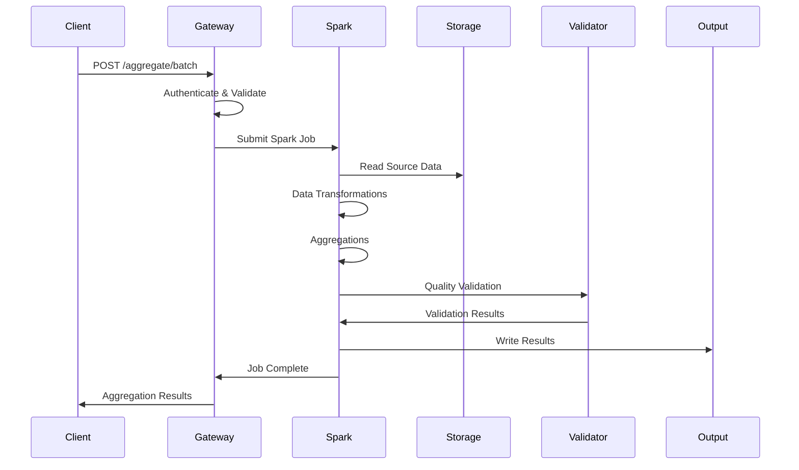
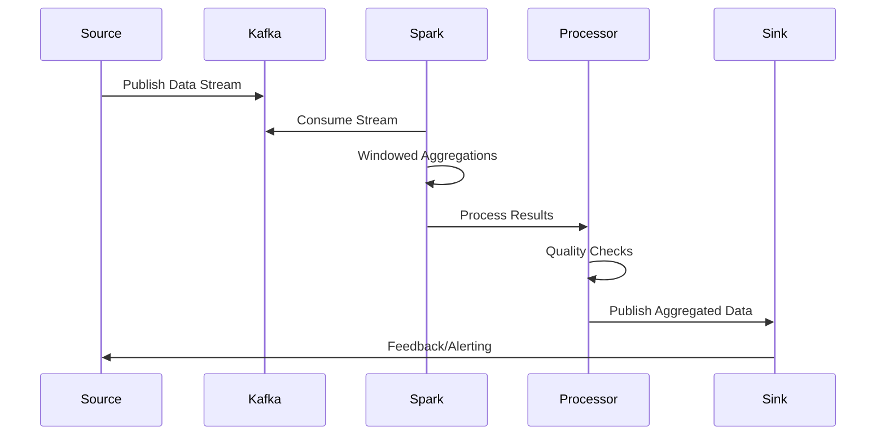

# Specifiche Tecniche - MS06-AGGREGATOR

## Architettura del Sistema

### Componenti Architetturali

#### 1. API Gateway Layer
**Responsabilità**: Punto di ingresso unificato per tutte le richieste di aggregazione
- **Tecnologie**: FastAPI, Uvicorn, API versioning
- **Protocolli**: REST API, GraphQL per query complesse, WebSocket per aggiornamenti
- **Sicurezza**: JWT validation, rate limiting, request throttling
- **Scalabilità**: Load balancing, circuit breaker, request queuing

#### 2. Data Collection & Ingestion Engine
**Responsabilità**: Raccolta e ingestion dati da fonti multiple
- **Tecnologie**: Apache Spark Streaming, Kafka Connect, Debezium
- **Fonti Supportate**:
  - Database relazionali (PostgreSQL, MySQL)
  - NoSQL databases (MongoDB, Cassandra)
  - Message queues (Kafka, RabbitMQ)
  - File systems (HDFS, S3, MinIO)
  - REST APIs e GraphQL endpoints
- **Ingestion Patterns**: Batch, streaming, change data capture

#### 3. Apache Spark Processing Core
**Responsabilità**: Motore centrale di elaborazione distribuita
- **Tecnologie**: Apache Spark Core, Spark SQL, Spark Streaming, MLlib
- **Processing Modes**:
  - Batch processing per grandi volumi
  - Structured streaming per real-time
  - Interactive queries per analisi ad-hoc
  - Machine learning per aggregazioni avanzate
- **Optimization**: Catalyst optimizer, Tungsten execution engine

#### 4. Data Transformation & Aggregation Layer
**Responsabilità**: Trasformazione e aggregazione dati strutturati
- **Funzionalità**:
  - SQL aggregations (GROUP BY, window functions)
  - Custom UDFs per business logic specifica
  - Data deduplication e cleansing
  - Schema evolution e data migration
  - Time-series aggregations
- **Aggregation Types**: Sum, count, avg, min/max, percentiles, distinct counts

#### 5. Data Quality & Validation Engine
**Responsabilità**: Validazione qualità e integrità dati aggregati
- **Quality Checks**:
  - Schema validation
  - Data type consistency
  - Referential integrity
  - Business rule validation
  - Statistical outlier detection
- **Data Profiling**: Automated discovery di qualità dati
- **Lineage Tracking**: Tracciamento trasformazione dati

#### 6. Caching & Performance Optimization Layer
**Responsabilità**: Ottimizzazione performance attraverso caching intelligente
- **Cache Levels**:
  - Query result cache per risultati aggregazioni frequenti
  - Data cache per dataset intermedi
  - Metadata cache per schemi e statistiche
  - Computation cache per risultati parziali
- **Cache Strategies**: LRU, TTL-based, size-based eviction, distributed caching

#### 7. Result Storage & Serving Layer
**Responsabilità**: Archiviazione e servizio risultati aggregazione
- **Storage Formats**: Parquet, ORC, Delta Lake
- **Serving Options**: REST APIs, JDBC/ODBC, streaming APIs
- **Indexing**: Automatic indexing per query optimization
- **Partitioning**: Time-based e hash-based partitioning

## Modelli di Dati

### Aggregation Request Model
```json
{
  "aggregation_id": "uuid",
  "aggregation_type": "BATCH|STREAMING|INTERACTIVE",
  "sources": [
    {
      "type": "database|kafka|file|api",
      "connection": {
        "url": "connection_string",
        "credentials": "encrypted_credentials"
      },
      "query": "SELECT * FROM table WHERE condition",
      "format": "json|csv|parquet|avro"
    }
  ],
  "transformations": [
    {
      "type": "filter|join|aggregate|transform",
      "config": {
        "condition": "column > value",
        "group_by": ["col1", "col2"],
        "aggregations": [
          {"column": "amount", "function": "SUM"},
          {"column": "count", "function": "COUNT"}
        ]
      }
    }
  ],
  "output": {
    "format": "json|parquet|csv",
    "destination": {
      "type": "database|file|api",
      "location": "output_path_or_url"
    },
    "partitioning": {
      "type": "time|hash|range",
      "columns": ["date_column"]
    }
  },
  "options": {
    "parallelism": 10,
    "batch_size": 1000,
    "timeout": 3600,
    "quality_checks": true,
    "cache_enabled": true
  },
  "metadata": {
    "request_id": "uuid",
    "client_id": "string",
    "priority": "LOW|NORMAL|HIGH",
    "callback_url": "url"
  }
}
```

### Aggregation Result Model
```json
{
  "job_id": "uuid",
  "status": "COMPLETED",
  "execution_time": 125.5,
  "result": {
    "aggregation_id": "uuid",
    "summary": {
      "total_records_processed": 1500000,
      "total_records_output": 50000,
      "data_quality_score": 0.95,
      "processing_stages": [
        {"stage": "ingestion", "duration": 15.2, "records": 1500000},
        {"stage": "transformation", "duration": 45.8, "records": 1450000},
        {"stage": "aggregation", "duration": 32.1, "records": 50000},
        {"stage": "validation", "duration": 8.4, "records": 47500},
        {"stage": "output", "duration": 24.0, "records": 47500}
      ]
    },
    "data": [
      {
        "group_key": "2024-01-15",
        "metrics": {
          "total_amount": 1250000.50,
          "transaction_count": 1250,
          "avg_amount": 1000.00,
          "max_amount": 50000.00,
          "min_amount": 10.00,
          "distinct_customers": 850
        },
        "quality_indicators": {
          "completeness": 0.98,
          "accuracy": 0.96,
          "consistency": 0.94
        }
      }
    ],
    "metadata": {
      "schema": {
        "fields": [
          {"name": "group_key", "type": "string"},
          {"name": "total_amount", "type": "decimal"},
          {"name": "transaction_count", "type": "integer"}
        ]
      },
      "lineage": [
        {"source": "transactions_db", "transformation": "filter_valid", "records": 1500000},
        {"source": "customers_db", "transformation": "join_customer_data", "records": 1450000},
        {"transformation": "aggregate_by_date", "records": 50000}
      ],
      "quality_report": {
        "validation_rules_passed": 8,
        "validation_rules_failed": 1,
        "data_quality_issues": [
          {"rule": "amount_range_check", "violations": 250}
        ]
      }
    }
  }
}
```

## Requisiti di Servizio (SLA)

### Disponibilità
- **Target**: 99.5% uptime mensile
- **Manutenzione**: Finestre programmate 2-4 AM CET
- **RTO**: 4 ore per disaster recovery
- **RPO**: 15 minuti perdita dati massima

### Performance
- **Latenza Media**: < 30 secondi per job < 1M record
- **Throughput**: 100,000 record/secondo per cluster
- **Concorrenza**: 50 job simultanei
- **Scalabilità**: Auto-scaling basato su workload

### Qualità
- **Data Accuracy**: > 95% dati aggregati corretti
- **Completeness**: > 98% record processati completamente
- **Consistency**: > 99% aggregazioni consistenti
- **Success Rate**: > 96% job completati con successo

## Sicurezza e Compliance

### Controlli di Sicurezza
- **Data Encryption**: Crittografia dati in transito e at-rest
- **Access Control**: Row-level security per aggregazioni
- **Query Auditing**: Logging completo delle query eseguite
- **Data Masking**: Mascheramento dati sensibili nei risultati

### Compliance
- **GDPR**: Data minimization per dati personali aggregati
- **PA Digitale**: Conformità normativa pubblica amministrazione
- **ISO 27001**: Information security management

## Sequenze Operative

### Sequenza Aggregazione Batch


### Sequenza Aggregazione Streaming


## Gestione Errori e Recovery

### Strategie di Recovery
- **Retry Logic**: Exponential backoff per errori temporanei
- **Checkpointing**: Salvataggio stato per recovery streaming
- **Partial Results**: Restituzione risultati parziali per job lunghi
- **Circuit Breaker**: Isolamento componenti fault

### Codici Errore
- **400**: Richiesta malformata o parametri invalidi
- **401**: Autenticazione fallita
- **403**: Autorizzazione negata per fonte dati
- **404**: Job o dataset non trovato
- **413**: Dataset troppo grande per aggregazione
- **422**: Validazione qualità fallita
- **429**: Rate limit superato
- **500**: Errore interno elaborazione Spark
- **503**: Cluster Spark temporaneamente non disponibile

## Monitoraggio e Alerting

### Metriche Chiave
- **Business Metrics**:
  - Job success rate per tipo aggregazione
  - Average processing time per job size
  - Data quality trends over time
  - Resource utilization efficiency

- **Technical Metrics**:
  - Spark stage/task metrics
  - Cluster resource utilization
  - Data skew detection
  - Cache performance metrics

- **Quality Metrics**:
  - Data completeness per source
  - Aggregation accuracy validation
  - Schema consistency checks
  - Duplicate detection rates

### Soglie Alert
- **Critico**: Success rate < 90%, Data quality < 95%
- **Warning**: Processing time > 60s per 100k records, Resource usage > 80%
- **Info**: New aggregation patterns detected, Performance optimization opportunities

## Integrazione Data Pipeline

### Data Catalog Integration
- **Metadata Management**: Registrazione automatica dataset aggregati
- **Data Discovery**: Ricerca dataset per business users
- **Lineage Tracking**: Tracciamento end-to-end data flow
- **Governance**: Policy enforcement per data access

### Workflow Orchestration
- **Job Scheduling**: Integrazione con Apache Airflow
- **Dependency Management**: Gestione dipendenze tra aggregazioni
- **Retry & Recovery**: Orchestrazione recovery automatica
- **Monitoring Integration**: Alerting integrato con sistemi enterprise

### Analytics Integration
- **BI Tools**: Direct connection con Tableau, Power BI
- **ML Pipeline**: Feeding aggregated data to ML models
- **Real-time Dashboards**: Streaming aggregations per dashboard
- **API Integration**: REST APIs per sistemi esterni