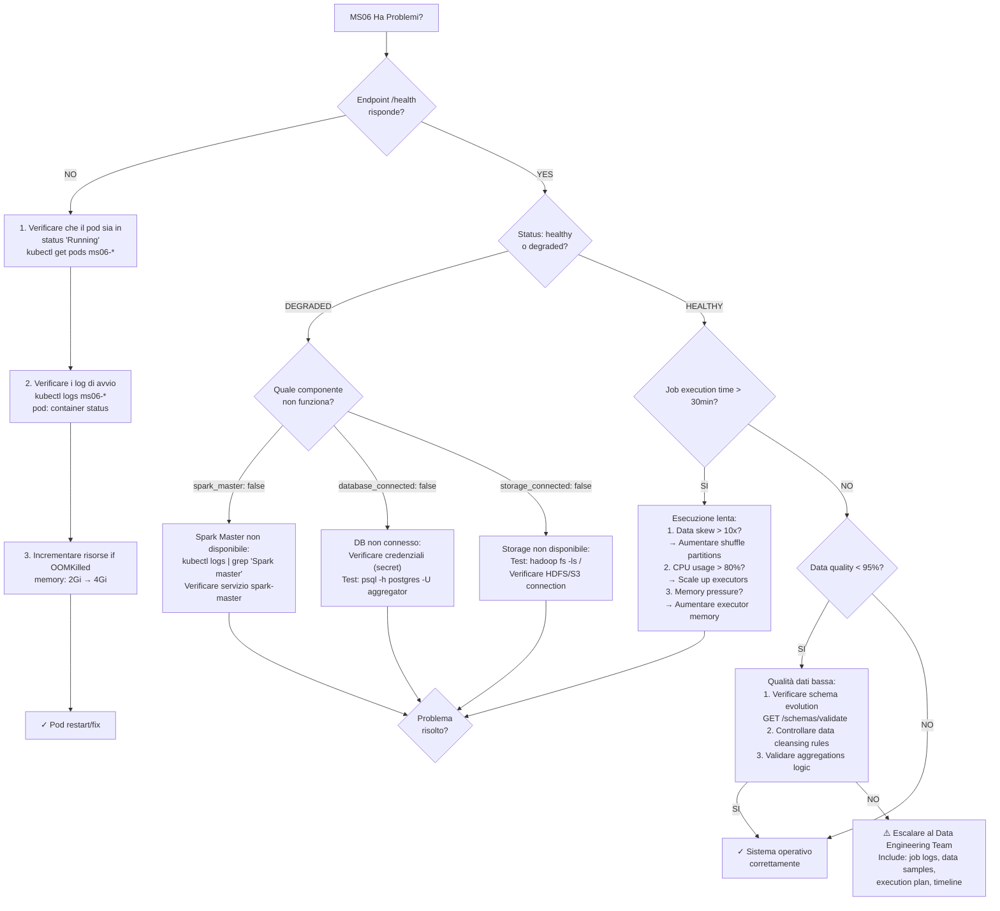

# MS06 - Guida per la Risoluzione dei Problemi

**Navigazione**: [← DATABASE-SCHEMA.md](DATABASE-SCHEMA.md) | [TROUBLESHOOTING](TROUBLESHOOTING.md) | [Back to MS →](../MS-ARCHITECTURE-MASTER.md#ms06--aggregator)

## Indice

1. [Workflow Diagnostico Rapido](#workflow-diagnostico-rapido)
2. [Problemi Comuni e Soluzioni](#problemi-comuni-e-soluzioni)
3. [Endpoint di Controllo Salute](#endpoint-di-controllo-salute)
4. [Livelli di Log e Debug](#livelli-di-log-e-debug)
5. [Lista di Controllo Ottimizzazione Prestazioni](#lista-di-controllo-ottimizzazione-prestazioni)

---

## Workflow Diagnostico Rapido

Se MS06 ha problemi, seguire questo diagramma di diagnostic flow:



---

## Problemi Comuni e Soluzioni

### 1. Job di Aggregazione Falliti

**Sintomi:**
- Job status: `FAILED`
- Error logs con `SparkException` o `DataSourceException`

**Soluzioni:**
```bash
# Verificare lo stato del job
GET /jobs/{job_id}/status

# Controllare i log dettagliati
GET /jobs/{job_id}/logs?level=ERROR

# Riavviare job con configurazione corretta
POST /jobs/{job_id}/restart
{
  "options": {
    "spark.sql.adaptive.enabled": true,
    "spark.sql.adaptive.coalescePartitions.enabled": true
  }
}
```

## [Auto-generated heading level 2]
### 2. Out of Memory negli Executor Spark

**Sintomi:**
- `java.lang.OutOfMemoryError: Java heap space`
- Job execution time aumenta gradualmente
- Container killed da Kubernetes

**Soluzioni:**
```yaml
# Aumentare memoria executor
spark.executor.memory: 4g
spark.executor.memoryOverhead: 1g

# Abilitare off-heap memory
spark.memory.offHeap.enabled: true
spark.memory.offHeap.size: 2g

# Configurare garbage collection
spark.executor.extraJavaOptions: -XX:+UseG1GC -XX:MaxGCPauseMillis=200
```

## [Auto-generated heading level 2]
### 3. Data Skew nelle Aggregazioni

**Sintomi:**
- Alcuni task impiegano molto più tempo degli altri
- `TaskSetManager: Finished task` mostra tempi molto variabili
- Throughput irregolare

**Soluzioni:**
```sql
-- Aumentare shuffle partitions
SET spark.sql.shuffle.partitions = 200;

-- Usare salting per chiavi hot
SELECT
  CONCAT(key, '_', CAST(RAND() * 10 AS INT)) as salted_key,
  value
FROM skewed_table;

-- Ridistribuire dati con repartition
df.repartition(100, "hot_key_column")
```

### 4. Connessione Database Perduta

**Sintomi:**
- `org.postgresql.util.PSQLException: Connection refused`
- Job bloccati in stato `RUNNING` senza progresso

**Soluzioni:**
```bash
# Test connessione database
psql -h postgres-aggregator -U aggregator -d zen_ia

# Verificare pool connessioni
GET /health/database

# Ricreare connection pool
POST /admin/database/reconnect
```

## [Auto-generated heading level 2]
### 5. Storage HDFS/S3 Non Disponibile

**Sintomi:**
- `java.io.IOException: Filesystem closed`
- Job falliti con errori di I/O

**Soluzioni:**
```bash
# Test connessione storage
hadoop fs -ls /

# Verificare credenziali AWS S3
aws s3 ls s3://zen-ia-results/

# Ricontrollare configurazione
spark.hadoop.fs.s3a.access.key: ${AWS_ACCESS_KEY}
spark.hadoop.fs.s3a.secret.key: ${AWS_SECRET_KEY}
spark.hadoop.fs.s3a.endpoint: s3.eu-south-1.amazonaws.com
```

## [Auto-generated heading level 2]
### 6. Streaming Window Lagging

**Sintomi:**
- Finestre di aggregazione in ritardo
- `StreamWindowProcessor: Window lag > threshold`

**Soluzioni:**
```yaml
# Aumentare parallelismo streaming
spark.streaming.concurrentJobs: 4

# Ridurre batch interval
spark.streaming.batch.duration: 10s

# Configurare watermarking
watermark:
  delayThreshold: 5m
  allowedLateness: 10m
```

---

## Endpoint di Controllo Salute

### GET /health

Risposta completa dello stato di salute:

```json
{
  "status": "healthy|degraded|unhealthy",
  "timestamp": "2025-11-18T10:30:00Z",
  "version": "1.0.0",
  "checks": {
    "spark_master": {
      "status": "healthy",
      "details": {
        "master_url": "spark://spark-master:7077",
        "workers": 3,
        "cores": 12,
        "memory": "24GB"
      }
    },
    "database": {
      "status": "healthy",
      "details": {
        "connection_pool": "active",
        "active_connections": 5,
        "idle_connections": 10
      }
    },
    "storage": {
      "status": "healthy",
      "details": {
        "filesystem": "hdfs://namenode:9000",
        "space_available": "500GB"
      }
    },
    "streams": {
      "status": "healthy",
      "details": {
        "active_streams": 2,
        "total_lag": "45s"
      }
    }
  }
}
```

### GET /metrics

Metriche dettagliate per monitoraggio:

```json
{
  "jvm": {
    "heap_used": "2.1GB",
    "heap_max": "4GB",
    "gc_count": 150,
    "gc_time": "2.3s"
  },
  "spark": {
    "active_jobs": 3,
    "completed_jobs": 1250,
    "failed_jobs": 2,
    "running_executors": 8
  },
  "database": {
    "connections_active": 12,
    "query_count": 15430,
    "query_avg_time": "45ms"
  },
  "storage": {
    "bytes_read": "1.2TB",
    "bytes_written": "890GB",
    "operations_per_second": 250
  }
}
```

### GET /jobs/status

Stato corrente dei job attivi:

```json
{
  "active_jobs": 5,
  "jobs": [
    {
      "id": "550e8400-e29b-41d4-a716-446655440000",
      "type": "BATCH",
      "status": "RUNNING",
      "progress": 0.65,
      "start_time": "2025-11-18T10:15:00Z",
      "estimated_completion": "2025-11-18T10:45:00Z"
    }
  ]
}
```

---

## Livelli di Log e Debug

### Configurazione Logging

```yaml
# application.yml
logging:
  level:
    com.zenia.ms06: INFO
    org.apache.spark: WARN
    org.postgresql: DEBUG
  pattern:
    console: "%d{yyyy-MM-dd HH:mm:ss} [%thread] %-5level %logger{36} - %msg%n"
```

## [Auto-generated heading level 2]
### Log Levels per Componente

| Componente | Normal Operation | Debug | Problemi |
|------------|------------------|-------|----------|
| Spark Engine | WARN | INFO | DEBUG |
| Database Layer | INFO | DEBUG | TRACE |
| Storage Layer | INFO | DEBUG | TRACE |
| Streaming Processor | INFO | DEBUG | TRACE |
| Job Scheduler | INFO | DEBUG | TRACE |

### Debug Commands

```bash
# Abilitare debug per job specifico
POST /admin/debug/enable
{
  "job_id": "550e8400-e29b-41d4-a716-446655440000",
  "components": ["spark", "database"]
}

# Catturare thread dump
GET /admin/debug/threaddump

# Analizzare heap dump
GET /admin/debug/heapdump
```

---

## Lista di Controllo Ottimizzazione Prestazioni

### ✅ Configurazione Spark Ottimale

- [ ] `spark.sql.adaptive.enabled = true`
- [ ] `spark.sql.adaptive.coalescePartitions.enabled = true`
- [ ] `spark.serializer = org.apache.spark.serializer.KryoSerializer`
- [ ] `spark.sql.shuffle.partitions = 200`
- [ ] `spark.executor.memory = 4g`
- [ ] `spark.executor.cores = 2`

### ✅ Database Optimization

- [ ] Connection pool size: 20-50 connessioni
- [ ] Prepared statements abilitati
- [ ] Indici su colonne frequentemente filtrate
- [ ] Partitioning per tabelle grandi
- [ ] Query result caching

### ✅ Storage Optimization

- [ ] File format: Parquet con compressione Snappy
- [ ] Partitioning per data/categoria
- [ ] Bucket sort per chiavi hot
- [ ] Data locality abilitata
- [ ] Speculative execution per task lenti

### ✅ Streaming Optimization

- [ ] Window watermarking configurato
- [ ] Late data handling abilitato
- [ ] Checkpointing ogni 5 minuti
- [ ] Backpressure mechanism attivo
- [ ] Exactly-once delivery garantito

### ✅ Monitoring e Alerting

- [ ] Metriche JVM monitorate
- [ ] Spark UI accessibile
- [ ] Job failure alerting attivo
- [ ] Performance thresholds definiti
- [ ] Log aggregation centralizzato

---

## Comandi di Recovery

### Recovery da Job Falliti

```bash
# Identificare job falliti
GET /jobs?status=FAILED

# Analizzare causa fallimento
GET /jobs/{job_id}/logs?level=ERROR

# Recovery con configurazione corretta
POST /jobs/{job_id}/recover
{
  "recovery_options": {
    "skip_failed_partitions": true,
    "increase_memory": true,
    "reduce_parallelism": false
  }
}
```

## [Auto-generated heading level 2]
### Recovery da Perdita di Connettività

```bash
# Verificare stato connessioni
GET /health/connectivity

# Ricreare pool connessioni
POST /admin/database/reset-pool

# Restart servizi downstream
kubectl rollout restart deployment ms07-validator
kubectl rollout restart deployment ms09-reporter
```

## [Auto-generated heading level 2]
### Emergency Shutdown

```bash
# Arresto graceful di tutti i job
POST /admin/jobs/graceful-shutdown
{
  "timeout_seconds": 300,
  "save_state": true
}

# Arresto immediato (ultima spiaggia)
POST /admin/jobs/force-shutdown
```