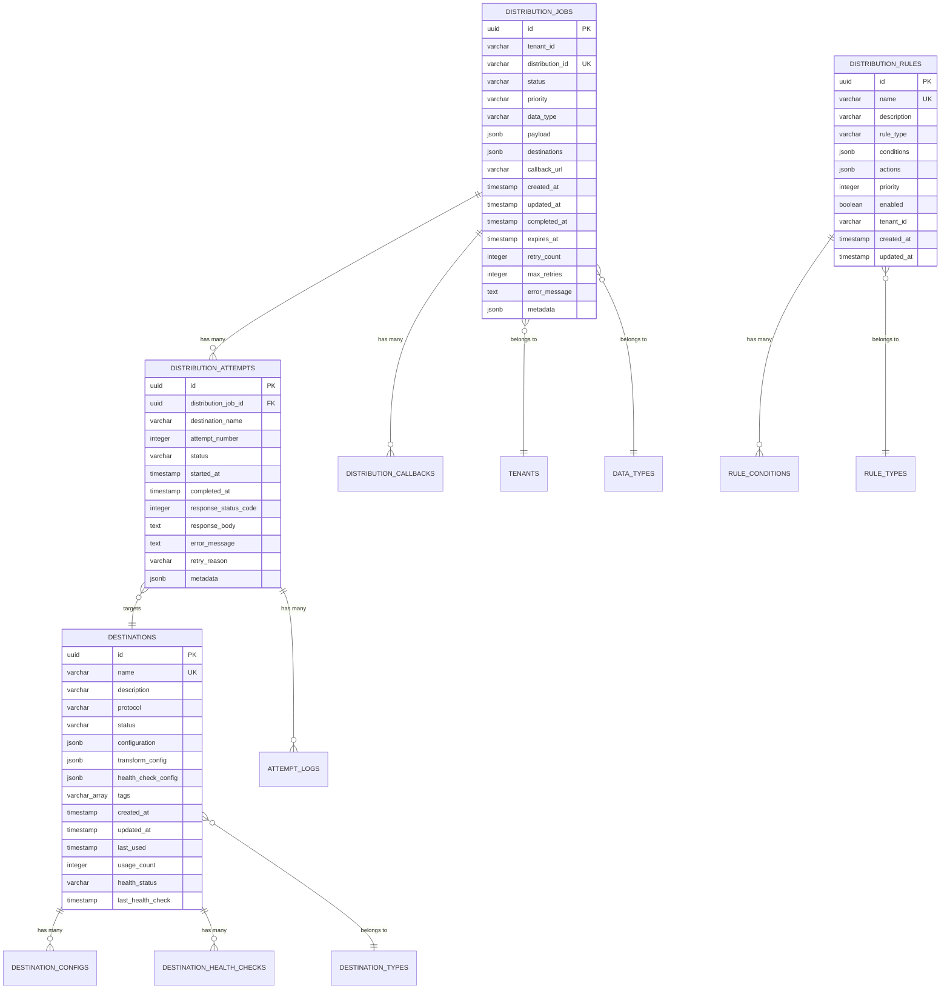

# Database Schema - MS07-DISTRIBUTOR

**Navigazione**: [README.md](README.md) | [SPECIFICATION.md](SPECIFICATION.md) | [API.md](API.md) | [← TROUBLESHOOTING.md](TROUBLESHOOTING.md) | [Back to MS →](../MS-ARCHITECTURE-MASTER.md#ms07--distributor)

## Panoramica Schema Database

MS07-DISTRIBUTOR utilizza PostgreSQL come database primario per la persistenza dei metadati delle distribuzioni, audit trail e configurazioni. Lo schema è ottimizzato per alta concorrenza e performance su operazioni di scrittura intensive.

## Diagramma ER



## Tabelle Principali

### 1. distribution_jobs

Tabella principale per tracciare le distribuzioni di dati.

```sql
CREATE TABLE distribution_jobs (
    id UUID PRIMARY KEY DEFAULT gen_random_uuid(),
    tenant_id VARCHAR(50) NOT NULL,
    distribution_id VARCHAR(100) UNIQUE NOT NULL,
    status VARCHAR(20) NOT NULL DEFAULT 'pending'
        CHECK (status IN ('pending', 'processing', 'completed', 'failed', 'cancelled')),
    priority VARCHAR(10) NOT NULL DEFAULT 'normal'
        CHECK (priority IN ('low', 'normal', 'high', 'critical')),
    data_type VARCHAR(50) NOT NULL,
    payload JSONB NOT NULL,
    destinations JSONB NOT NULL,
    callback_url TEXT,
    created_at TIMESTAMP WITH TIME ZONE DEFAULT NOW(),
    updated_at TIMESTAMP WITH TIME ZONE DEFAULT NOW(),
    completed_at TIMESTAMP WITH TIME ZONE,
    expires_at TIMESTAMP WITH TIME ZONE,
    retry_count INTEGER DEFAULT 0,
    max_retries INTEGER DEFAULT 3,
    error_message TEXT,
    metadata JSONB DEFAULT '{}',

    -- Constraints
    CONSTRAINT chk_distribution_jobs_valid_dates
        CHECK (completed_at IS NULL OR completed_at >= created_at),
    CONSTRAINT chk_distribution_jobs_expires_future
        CHECK (expires_at IS NULL OR expires_at > created_at)
);

-- Indici per performance
CREATE INDEX CONCURRENTLY idx_distribution_jobs_tenant_status
    ON distribution_jobs(tenant_id, status);
CREATE INDEX CONCURRENTLY idx_distribution_jobs_created_at
    ON distribution_jobs(created_at DESC);
CREATE INDEX CONCURRENTLY idx_distribution_jobs_distribution_id
    ON distribution_jobs(distribution_id);
CREATE INDEX CONCURRENTLY idx_distribution_jobs_data_type
    ON distribution_jobs(data_type);
CREATE INDEX CONCURRENTLY idx_distribution_jobs_priority
    ON distribution_jobs(priority);
CREATE INDEX CONCURRENTLY idx_distribution_jobs_expires_at
    ON distribution_jobs(expires_at) WHERE expires_at IS NOT NULL;

-- Indici JSONB per query avanzate
CREATE INDEX CONCURRENTLY idx_distribution_jobs_payload_gin
    ON distribution_jobs USING GIN (payload);
CREATE INDEX CONCURRENTLY idx_distribution_jobs_metadata_gin
    ON distribution_jobs USING GIN (metadata);

-- Indice parziale per cleanup automatico
CREATE INDEX CONCURRENTLY idx_distribution_jobs_expired
    ON distribution_jobs(expires_at)
    WHERE status IN ('completed', 'failed') AND expires_at < NOW();
```

**Campi Chiave**:
- `id`: UUID primario generato automaticamente
- `distribution_id`: ID business unico per tracking esterno
- `status`: Stato corrente della distribuzione
- `payload`: Dati da distribuire (JSONB per flessibilità)
- `destinations`: Lista destinazioni con configurazioni (JSONB)

### 2. distribution_attempts

Traccia ogni tentativo di consegna a una destinazione specifica.

```sql
CREATE TABLE distribution_attempts (
    id UUID PRIMARY KEY DEFAULT gen_random_uuid(),
    distribution_job_id UUID NOT NULL REFERENCES distribution_jobs(id) ON DELETE CASCADE,
    destination_name VARCHAR(100) NOT NULL,
    attempt_number INTEGER NOT NULL,
    status VARCHAR(20) NOT NULL DEFAULT 'pending'
        CHECK (status IN ('pending', 'processing', 'success', 'failed', 'retry', 'cancelled')),
    started_at TIMESTAMP WITH TIME ZONE NOT NULL DEFAULT NOW(),
    completed_at TIMESTAMP WITH TIME ZONE,
    response_status_code INTEGER,
    response_body TEXT,
    error_message TEXT,
    retry_reason VARCHAR(100),
    metadata JSONB DEFAULT '{}',

    -- Constraints
    CONSTRAINT chk_distribution_attempts_valid_dates
        CHECK (completed_at IS NULL OR completed_at >= started_at),
    CONSTRAINT chk_distribution_attempts_attempt_number
        CHECK (attempt_number > 0),
    CONSTRAINT uk_distribution_attempts_unique_attempt
        UNIQUE (distribution_job_id, destination_name, attempt_number)
);

-- Indici per performance
CREATE INDEX CONCURRENTLY idx_distribution_attempts_job_id
    ON distribution_attempts(distribution_job_id);
CREATE INDEX CONCURRENTLY idx_distribution_attempts_status
    ON distribution_attempts(status);
CREATE INDEX CONCURRENTLY idx_distribution_attempts_started_at
    ON distribution_attempts(started_at DESC);
CREATE INDEX CONCURRENTLY idx_distribution_attempts_destination
    ON distribution_attempts(destination_name);
CREATE INDEX CONCURRENTLY idx_distribution_attempts_response_code
    ON distribution_attempts(response_status_code);

-- Indice composto per query di troubleshooting
CREATE INDEX CONCURRENTLY idx_distribution_attempts_job_destination_status
    ON distribution_attempts(distribution_job_id, destination_name, status);
```

**Campi Chiave**:
- `distribution_job_id`: Riferimento alla distribuzione principale
- `destination_name`: Nome della destinazione target
- `attempt_number`: Numero tentativo (1, 2, 3, ...)
- `response_status_code`: HTTP status code o codice errore del protocollo

### 3. destinations

Catalogo delle destinazioni configurate per le distribuzioni.

```sql
CREATE TABLE destinations (
    id UUID PRIMARY KEY DEFAULT gen_random_uuid(),
    name VARCHAR(100) UNIQUE NOT NULL,
    description TEXT,
    protocol VARCHAR(20) NOT NULL
        CHECK (protocol IN ('REST', 'AMQP', 'JDBC', 'S3', 'SFTP', 'EMAIL')),
    status VARCHAR(20) NOT NULL DEFAULT 'active'
        CHECK (status IN ('active', 'inactive', 'maintenance', 'deprecated')),
    configuration JSONB NOT NULL DEFAULT '{}',
    transform_config JSONB DEFAULT '{}',
    health_check_config JSONB DEFAULT '{}',
    tags TEXT[] DEFAULT '{}',
    created_at TIMESTAMP WITH TIME ZONE DEFAULT NOW(),
    updated_at TIMESTAMP WITH TIME ZONE DEFAULT NOW(),
    last_used TIMESTAMP WITH TIME ZONE,
    usage_count INTEGER DEFAULT 0,
    health_status VARCHAR(20) DEFAULT 'unknown'
        CHECK (health_status IN ('healthy', 'unhealthy', 'unknown')),
    last_health_check TIMESTAMP WITH TIME ZONE,

    -- Constraints
    CONSTRAINT chk_destinations_valid_config
        CHECK (jsonb_typeof(configuration) = 'object'),
    CONSTRAINT chk_destinations_name_format
        CHECK (name ~ '^[a-zA-Z0-9_-]+$')
);

-- Indici per performance
CREATE INDEX CONCURRENTLY idx_destinations_protocol
    ON destinations(protocol);
CREATE INDEX CONCURRENTLY idx_destinations_status
    ON destinations(status);
CREATE INDEX CONCURRENTLY idx_destinations_health_status
    ON destinations(health_status);
CREATE INDEX CONCURRENTLY idx_destinations_last_used
    ON destinations(last_used DESC);
CREATE INDEX CONCURRENTLY idx_destinations_tags
    ON destinations USING GIN (tags);

-- Indice JSONB per configurazione
CREATE INDEX CONCURRENTLY idx_destinations_config_gin
    ON destinations USING GIN (configuration);
```

**Campi Chiave**:
- `name`: Nome univoco della destinazione
- `protocol`: Protocollo di comunicazione (REST, AMQP, JDBC, etc.)
- `configuration`: Configurazione specifica del protocollo (JSONB)
- `health_status`: Stato di salute della destinazione

### 4. distribution_rules

Regole di business per il routing intelligente delle distribuzioni.

```sql
CREATE TABLE distribution_rules (
    id UUID PRIMARY KEY DEFAULT gen_random_uuid(),
    name VARCHAR(100) UNIQUE NOT NULL,
    description TEXT,
    rule_type VARCHAR(30) NOT NULL
        CHECK (rule_type IN ('routing', 'transformation', 'filtering', 'prioritization')),
    conditions JSONB NOT NULL DEFAULT '{}',
    actions JSONB NOT NULL DEFAULT '{}',
    priority INTEGER NOT NULL DEFAULT 0,
    enabled BOOLEAN NOT NULL DEFAULT true,
    tenant_id VARCHAR(50),
    created_at TIMESTAMP WITH TIME ZONE DEFAULT NOW(),
    updated_at TIMESTAMP WITH TIME ZONE DEFAULT NOW(),

    -- Constraints
    CONSTRAINT chk_distribution_rules_valid_conditions
        CHECK (jsonb_typeof(conditions) = 'object'),
    CONSTRAINT chk_distribution_rules_valid_actions
        CHECK (jsonb_typeof(actions) = 'object')
);

-- Indici per performance
CREATE INDEX CONCURRENTLY idx_distribution_rules_type
    ON distribution_rules(rule_type);
CREATE INDEX CONCURRENTLY idx_distribution_rules_enabled
    ON distribution_rules(enabled);
CREATE INDEX CONCURRENTLY idx_distribution_rules_tenant
    ON distribution_rules(tenant_id);
CREATE INDEX CONCURRENTLY idx_distribution_rules_priority
    ON distribution_rules(priority DESC);

-- Indice JSONB per condizioni
CREATE INDEX CONCURRENTLY idx_distribution_rules_conditions_gin
    ON distribution_rules USING GIN (conditions);
```

**Campi Chiave**:
- `rule_type`: Tipo di regola (routing, transformation, etc.)
- `conditions`: Condizioni per applicare la regola (JSONB)
- `actions`: Azioni da eseguire se condizioni soddisfatte (JSONB)
- `priority`: Priorità di esecuzione (ordine decrescente)

## Tabelle di Supporto

### 5. tenants

Informazioni sui tenant che utilizzano il servizio.

```sql
CREATE TABLE tenants (
    id VARCHAR(50) PRIMARY KEY,
    name VARCHAR(100) NOT NULL,
    description TEXT,
    status VARCHAR(20) NOT NULL DEFAULT 'active'
        CHECK (status IN ('active', 'suspended', 'inactive')),
    config JSONB DEFAULT '{}',
    created_at TIMESTAMP WITH TIME ZONE DEFAULT NOW(),
    updated_at TIMESTAMP WITH TIME ZONE DEFAULT NOW(),

    -- Rate limiting config
    rate_limit_requests INTEGER DEFAULT 1000,
    rate_limit_window_seconds INTEGER DEFAULT 60,
    burst_limit INTEGER DEFAULT 200
);

-- Indici
CREATE INDEX CONCURRENTLY idx_tenants_status ON tenants(status);
```

### 6. data_types

Catalogo dei tipi di dati supportati.

```sql
CREATE TABLE data_types (
    id VARCHAR(50) PRIMARY KEY,
    name VARCHAR(100) NOT NULL,
    description TEXT,
    schema_definition JSONB,
    validation_rules JSONB DEFAULT '{}',
    created_at TIMESTAMP WITH TIME ZONE DEFAULT NOW()
);

-- Indici
CREATE INDEX CONCURRENTLY idx_data_types_name ON data_types(name);
```

### 7. destination_types

Tipi di destinazioni supportate.

```sql
CREATE TABLE destination_types (
    id VARCHAR(20) PRIMARY KEY,
    name VARCHAR(50) NOT NULL,
    description TEXT,
    protocol VARCHAR(20) NOT NULL,
    config_schema JSONB,
    created_at TIMESTAMP WITH TIME ZONE DEFAULT NOW()
);
```

## Viste Materializzate

### 1. distribution_summary_mv

Vista materializzata per riepiloghi delle distribuzioni.

```sql
CREATE MATERIALIZED VIEW distribution_summary_mv AS
SELECT
    DATE_TRUNC('hour', dj.created_at) AS hour_bucket,
    dj.tenant_id,
    dj.data_type,
    dj.status,
    COUNT(*) AS total_distributions,
    COUNT(CASE WHEN dj.status = 'completed' THEN 1 END) AS completed_distributions,
    COUNT(CASE WHEN dj.status = 'failed' THEN 1 END) AS failed_distributions,
    AVG(EXTRACT(EPOCH FROM (dj.completed_at - dj.created_at))) AS avg_completion_time_seconds,
    SUM(dj.retry_count) AS total_retries
FROM distribution_jobs dj
WHERE dj.created_at >= CURRENT_DATE - INTERVAL '30 days'
GROUP BY DATE_TRUNC('hour', dj.created_at), dj.tenant_id, dj.data_type, dj.status;

-- Indice per refresh efficiente
CREATE INDEX CONCURRENTLY idx_distribution_summary_mv_hour_bucket
    ON distribution_summary_mv(hour_bucket DESC);

-- Refresh policy: ogni ora
-- REFRESH MATERIALIZED VIEW CONCURRENTLY distribution_summary_mv;
```

### 2. destination_health_mv

Vista materializzata per monitoraggio salute destinazioni.

```sql
CREATE MATERIALIZED VIEW destination_health_mv AS
SELECT
    d.name,
    d.protocol,
    d.health_status,
    d.last_health_check,
    COUNT(da.id) AS total_attempts_last_24h,
    COUNT(CASE WHEN da.status = 'success' THEN 1 END) AS successful_attempts_last_24h,
    COUNT(CASE WHEN da.status = 'failed' THEN 1 END) AS failed_attempts_last_24h,
    ROUND(
        COUNT(CASE WHEN da.status = 'success' THEN 1 END)::numeric /
        NULLIF(COUNT(da.id), 0) * 100, 2
    ) AS success_rate_last_24h,
    AVG(EXTRACT(EPOCH FROM (da.completed_at - da.started_at))) AS avg_response_time_seconds
FROM destinations d
LEFT JOIN distribution_attempts da ON da.destination_name = d.name
    AND da.started_at >= CURRENT_TIMESTAMP - INTERVAL '24 hours'
GROUP BY d.id, d.name, d.protocol, d.health_status, d.last_health_check;

-- Indici
CREATE INDEX CONCURRENTLY idx_destination_health_mv_name
    ON destination_health_mv(name);
CREATE INDEX CONCURRENTLY idx_destination_health_mv_health_status
    ON destination_health_mv(health_status);
```

## Stored Procedures

### 1. submit_distribution

Procedure per submit di una nuova distribuzione.

```sql
CREATE OR REPLACE PROCEDURE submit_distribution(
    p_tenant_id VARCHAR(50),
    p_distribution_id VARCHAR(100),
    p_data_type VARCHAR(50),
    p_payload JSONB,
    p_destinations JSONB,
    p_priority VARCHAR(10) DEFAULT 'normal',
    p_callback_url TEXT DEFAULT NULL,
    p_max_retries INTEGER DEFAULT 3,
    p_expires_at TIMESTAMP WITH TIME ZONE DEFAULT NULL
)
LANGUAGE plpgsql
AS $$
DECLARE
    v_job_id UUID;
BEGIN
    -- Insert distribution job
    INSERT INTO distribution_jobs (
        tenant_id, distribution_id, data_type, payload, destinations,
        priority, callback_url, max_retries, expires_at
    ) VALUES (
        p_tenant_id, p_distribution_id, p_data_type, p_payload, p_destinations,
        p_priority, p_callback_url, p_max_retries, p_expires_at
    ) RETURNING id INTO v_job_id;

    -- Log submission
    INSERT INTO audit_log (action, resource_type, resource_id, details)
    VALUES ('submit', 'distribution_job', v_job_id, jsonb_build_object(
        'tenant_id', p_tenant_id,
        'distribution_id', p_distribution_id
    ));

    -- Notify workers via queue (this would trigger actual processing)
    -- PERFORM pg_notify('distribution_queue', v_job_id::text);

    COMMIT;
END;
$$;
```

### 2. update_distribution_status

Procedure per aggiornare lo stato di una distribuzione.

```sql
CREATE OR REPLACE PROCEDURE update_distribution_status(
    p_distribution_id VARCHAR(100),
    p_new_status VARCHAR(20),
    p_error_message TEXT DEFAULT NULL
)
LANGUAGE plpgsql
AS $$
DECLARE
    v_job_id UUID;
    v_old_status VARCHAR(20);
BEGIN
    -- Get current status
    SELECT id, status INTO v_job_id, v_old_status
    FROM distribution_jobs
    WHERE distribution_id = p_distribution_id;

    IF NOT FOUND THEN
        RAISE EXCEPTION 'Distribution job not found: %', p_distribution_id;
    END IF;

    -- Update status
    UPDATE distribution_jobs
    SET status = p_new_status,
        updated_at = NOW(),
        completed_at = CASE WHEN p_new_status IN ('completed', 'failed', 'cancelled')
                           THEN NOW() ELSE completed_at END,
        error_message = CASE WHEN p_new_status = 'failed'
                           THEN p_error_message ELSE error_message END
    WHERE id = v_job_id;

    -- Log status change
    INSERT INTO audit_log (action, resource_type, resource_id, details)
    VALUES ('status_update', 'distribution_job', v_job_id, jsonb_build_object(
        'old_status', v_old_status,
        'new_status', p_new_status,
        'error_message', p_error_message
    ));

    COMMIT;
END;
$$;
```

## Partizionamento

### Strategia di Partizionamento

Le tabelle principali utilizzano partizionamento per gestire grandi volumi di dati:

```sql
-- Partizionamento distribution_jobs per mese
CREATE TABLE distribution_jobs_y2024m01 PARTITION OF distribution_jobs
    FOR VALUES FROM ('2024-01-01') TO ('2024-02-01');

-- Partizionamento distribution_attempts per mese
CREATE TABLE distribution_attempts_y2024m01 PARTITION OF distribution_attempts
    FOR VALUES FROM ('2024-01-01') TO ('2024-02-01');

-- Policy di retention: mantieni ultimi 24 mesi
-- Automazione con pg_cron per cleanup partizioni obsolete
```

## Sicurezza

### Row Level Security (RLS)

```sql
-- Abilita RLS
ALTER TABLE distribution_jobs ENABLE ROW LEVEL SECURITY;
ALTER TABLE distribution_attempts ENABLE ROW LEVEL SECURITY;
ALTER TABLE destinations ENABLE ROW LEVEL SECURITY;

-- Policy per tenant isolation
CREATE POLICY distribution_jobs_tenant_policy ON distribution_jobs
    FOR ALL USING (tenant_id = current_setting('app.tenant_id'));

CREATE POLICY destinations_tenant_policy ON destinations
    FOR ALL USING (tenant_id = current_setting('app.tenant_id'));
```

### Encryption

```sql
-- Encrypted columns per dati sensibili
ALTER TABLE distribution_jobs
    ALTER COLUMN payload SET STORAGE EXTERNAL,
    ALTER COLUMN metadata SET STORAGE EXTERNAL;

-- Encryption functions per dati PII
CREATE OR REPLACE FUNCTION encrypt_sensitive_data(data TEXT) RETURNS TEXT AS $$
    -- Implementazione encryption AES-256
$$ LANGUAGE plpgsql;

CREATE OR REPLACE FUNCTION decrypt_sensitive_data(data TEXT) RETURNS TEXT AS $$
    -- Implementazione decryption AES-256
$$ LANGUAGE plpgsql;
```

## Performance e Ottimizzazioni

### Indici Strategici

```sql
-- Indici per query più comuni
CREATE INDEX CONCURRENTLY idx_distribution_jobs_composite_search
    ON distribution_jobs(tenant_id, status, created_at DESC, data_type)
    WHERE created_at >= CURRENT_DATE - INTERVAL '90 days';

-- Partial indexes per stati attivi
CREATE INDEX CONCURRENTLY idx_distribution_jobs_active
    ON distribution_jobs(created_at DESC)
    WHERE status IN ('pending', 'processing');

-- Indici JSONB ottimizzati
CREATE INDEX CONCURRENTLY idx_distribution_jobs_payload_path
    ON distribution_jobs ((payload->>'report_id'))
    WHERE payload ? 'report_id';
```

### Query Ottimizzate

```sql
-- Query per dashboard monitoring
SELECT
    DATE_TRUNC('hour', created_at) AS hour,
    status,
    COUNT(*) AS count,
    AVG(EXTRACT(EPOCH FROM (completed_at - created_at))) AS avg_duration
FROM distribution_jobs
WHERE created_at >= CURRENT_DATE - INTERVAL '24 hours'
    AND tenant_id = $1
GROUP BY DATE_TRUNC('hour', created_at), status
ORDER BY hour DESC;

-- Query per troubleshooting distribuzioni fallite
SELECT
    dj.distribution_id,
    dj.status,
    dj.error_message,
    da.destination_name,
    da.attempt_number,
    da.error_message AS attempt_error,
    da.response_status_code
FROM distribution_jobs dj
LEFT JOIN distribution_attempts da ON da.distribution_job_id = dj.id
WHERE dj.status = 'failed'
    AND dj.created_at >= CURRENT_DATE - INTERVAL '7 days'
    AND dj.tenant_id = $1
ORDER BY dj.created_at DESC, da.attempt_number;
```

## Backup e Recovery

### Strategia di Backup

```sql
-- Backup incrementale ogni 15 minuti per dati critici
-- Backup completo settimanale
-- Retention: 30 giorni incrementali, 1 anno completi

-- Script di backup
pg_dump --format=custom --compress=9 --no-owner --no-privileges \
    --table=distribution_jobs --table=distribution_attempts \
    --file=backup_$(date +%Y%m%d_%H%M%S).dump zenia_distributor

-- Restore procedure
pg_restore --format=custom --clean --if-exists \
    --no-owner --no-privileges backup_file.dump
```

### Point-in-Time Recovery

```sql
-- Recovery fino a specifico timestamp
-- RTO: 4 ore, RPO: 15 minuti
-- Utilizzo WAL archiving e streaming replication
```

## Migration Scripts

### Version 1.0.0 → 1.1.0

```sql
-- Aggiunta colonna expires_at
ALTER TABLE distribution_jobs ADD COLUMN expires_at TIMESTAMP WITH TIME ZONE;
CREATE INDEX CONCURRENTLY idx_distribution_jobs_expires_at ON distribution_jobs(expires_at);

-- Aggiunta tabella distribution_rules
CREATE TABLE distribution_rules (...);

-- Migration data esistente
UPDATE distribution_jobs
SET expires_at = created_at + INTERVAL '30 days'
WHERE expires_at IS NULL AND status IN ('completed', 'failed');
```

Questa struttura garantisce alta performance, scalabilità e affidabilità per il sistema di distribuzione di MS07-DISTRIBUTOR.