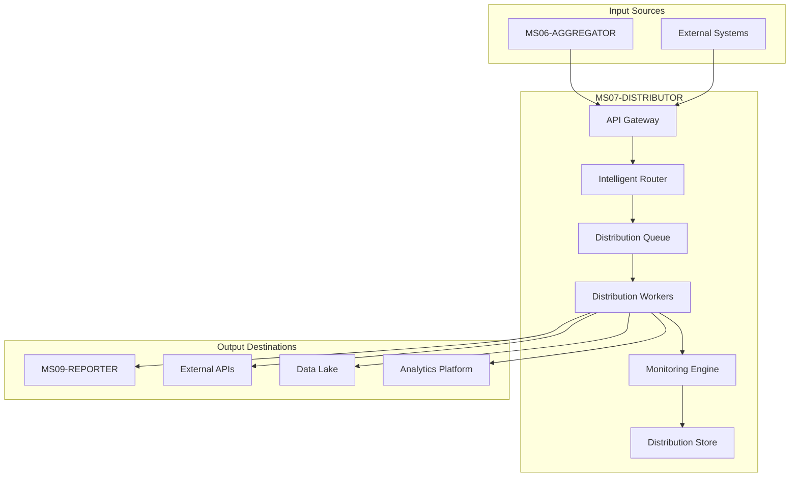

# MS07 - DISTRIBUTOR

**Navigazione**: [← SPECIFICATION.md](SPECIFICATION.md) | [README](README.md) | [API.md](API.md) | [DATABASE-SCHEMA.md](DATABASE-SCHEMA.md) | [TROUBLESHOUTING.md](TROUBLESHOUTING.md) | [Back to MS →](../MS-ARCHITECTURE-MASTER.md#ms07--distributor)

## Panoramica

MS07-DISTRIBUTOR è il servizio di distribuzione intelligente dei risultati aggregati nel sistema ZenIA. Gestisce il routing, la consegna e il monitoraggio della distribuzione dei dati elaborati verso i sistemi consumer downstream, garantendo affidabilità, tracciabilità e ottimizzazione delle performance.

## Responsabilità Principali

- **Intelligent Routing**: Distribuzione intelligente dei risultati basata su regole di business e preferenze dei consumer
- **Reliable Delivery**: Garanzia di consegna con retry logic e circuit breaker patterns
- **Monitoring & Tracking**: Tracciamento completo del ciclo di vita delle distribuzioni
- **Load Balancing**: Bilanciamento del carico tra multiple istanze consumer
- **Data Transformation**: Adattamento del formato dati alle esigenze specifiche dei consumer
- **Security & Compliance**: Gestione sicura delle credenziali e compliance GDPR

## Architettura ad Alto Livello

## Flusso di Distribuzione

1. **Ricezione**: MS07 riceve risultati aggregati da MS06 o sistemi esterni
2. **Analisi**: Valutazione delle regole di distribuzione e preferenze consumer
3. **Routing**: Determinazione dei destinatari appropriati
4. **Preparazione**: Formattazione e preparazione dei dati per ciascun consumer
5. **Distribuzione**: Invio ai sistemi target con retry e circuit breaker
6. **Conferma**: Tracciamento dello stato di consegna e notifiche
7. **Monitoraggio**: Reportistica e alerting per distribuzioni fallite

## Componenti Architetturali

### 1. API Gateway
- **Tecnologia**: FastAPI con middleware custom
- **Responsabilità**: Validazione input, autenticazione, rate limiting
- **Endpoint**: RESTful per submission e status check

### 2. Intelligent Router
- **Tecnologia**: Rule Engine basato su Drools
- **Responsabilità**: Logica di routing basata su metadati e regole business
- **Algoritmi**: Pattern matching, priority queuing, load balancing

### 3. Distribution Queue
- **Tecnologia**: Redis Streams + RabbitMQ
- **Responsabilità**: Buffering e prioritizzazione delle distribuzioni
- **Features**: Dead letter queue, message TTL, persistence

### 4. Distribution Workers
- **Tecnologia**: Python asyncio con concurrent workers
- **Responsabilità**: Esecuzione effettiva delle distribuzioni
- **Protocolli**: HTTP/HTTPS, AMQP, JDBC, REST APIs

### 5. Monitoring Engine
- **Tecnologia**: Prometheus + custom metrics
- **Responsabilità**: Health checks, performance monitoring, alerting
- **Dashboard**: Grafana per visualizzazione distribuzioni

### 6. Distribution Store
- **Tecnologia**: PostgreSQL con TimescaleDB
- **Responsabilità**: Persistenza metadati distribuzioni e audit trail
- **Features**: Time-series data, partitioning, retention policies

## Integrazione con Altri Microservizi

| Microservizio | Tipo Integrazione | Protocollo | Scopo |
|---------------|-------------------|------------|-------|
| MS06-AGGREGATOR | Consumer | REST API + Webhook | Ricezione risultati aggregati |
| MS08-MONITOR | Publisher | REST API | Invio metriche distribuzione |
| MS09-REPORTER | Consumer | REST API + Message Queue | Distribuzione report finali |
| Sistemi Esterni | Bidirezionale | REST API + Message Queue | Integrazione con piattaforme esterne |

## Sicurezza e Compliance

### Autenticazione e Autorizzazione
- **OAuth 2.0 + JWT**: Per API consumer
- **API Keys**: Per sistemi legacy
- **Mutual TLS**: Per comunicazioni critiche
- **Role-Based Access**: Controllo granulare delle distribuzioni

### Data Protection
- **Encryption at Rest**: AES-256 per dati sensibili
- **Encryption in Transit**: TLS 1.3 obbligatorio
- **Data Masking**: Per log e audit trails
- **GDPR Compliance**: Right to erasure, data portability

### Audit e Monitoring
- **Complete Audit Trail**: Ogni distribuzione tracciata
- **Real-time Monitoring**: Alert per distribuzioni fallite
- **Compliance Reporting**: Report periodici per audit
- **Intrusion Detection**: Pattern analysis per anomalie

## Scalabilità e Performance

### Scalabilità Orizzontale
- **Stateless Design**: Ogni istanza indipendente
- **Kubernetes HPA**: Auto-scaling basato su queue length
- **Load Balancing**: Distribuzione automatica del carico
- **Circuit Breaker**: Protezione da failure cascade

### Ottimizzazioni Performance
- **Async Processing**: Non-blocking I/O per alta concorrenza
- **Connection Pooling**: Riutilizzo connessioni database/API
- **Caching**: Redis per metadati e configurazioni
- **Batch Processing**: Raggruppamento distribuzioni simili

### Metriche Chiave
- **Throughput**: Distribuzioni/secondo
- **Latency**: Tempo medio distribuzione end-to-end
- **Success Rate**: Percentuale distribuzioni riuscite
- **Queue Depth**: Numero distribuzioni in coda

## Disaster Recovery

### Backup Strategy
- **Database**: Backup incrementali ogni 15 minuti
- **Configuration**: GitOps con ArgoCD
- **Queue Messages**: Persistence su disco distribuito
- **Cross-region**: Replica in region secondaria

### Recovery Procedures
- **RTO**: 4 ore per recovery completo
- **RPO**: 15 minuti perdita dati massima
- **Failover**: Automatico tra regioni
- **Data Consistency**: Eventual consistency garantita

## Deployment e Operations

### Environment Supportati
- **Development**: Docker Compose locale
- **Staging**: Kubernetes con Helm charts
- **Production**: Kubernetes multi-region con Istio

### Monitoring e Alerting
- **Health Checks**: Endpoint dedicati per load balancer
- **Metrics**: Prometheus per monitoraggio applicativo
- **Logs**: ELK stack per analisi distribuita
- **Alerts**: PagerDuty per incident critici

### Configurazione
- **Environment Variables**: Per configurazione dinamica
- **ConfigMaps**: Per configurazione statica
- **Secrets**: Per credenziali e certificati
- **Feature Flags**: Per rollout graduale nuove funzionalità

## Use Cases Principali

### 1. Report Distribution
**Scenario**: Distribuzione automatica report giornalieri a multiple piattaforme
**Consumer**: MS09-REPORTER, sistemi di business intelligence
**Pattern**: Scheduled distribution con retry logic

### 2. Real-time Data Feed
**Scenario**: Streaming risultati aggregati a piattaforme analytics
**Consumer**: Sistemi di real-time analytics, dashboard executive
**Pattern**: Event-driven distribution con circuit breaker

### 3. API Integration
**Scenario**: Esposizione dati a sistemi esterni via API
**Consumer**: Applicazioni third-party, sistemi legacy
**Pattern**: RESTful API con rate limiting e authentication

### 4. Data Lake Ingestion
**Scenario**: Caricamento dati nel data lake enterprise
**Consumer**: Hadoop/S3 data lake
**Pattern**: Batch distribution con data partitioning

## Roadmap Evolutiva

### Short Term (3 mesi)
- [ ] Implementazione circuit breaker pattern
- [ ] Aggiunta supporto per GraphQL subscriptions
- [ ] Ottimizzazione performance per high-throughput

### Medium Term (6 mesi)
- [ ] Machine learning per predictive routing
- [ ] Supporto per event streaming (Kafka)
- [ ] Multi-cloud distribution capabilities

### Long Term (12 mesi)
- [ ] AI-powered distribution optimization
- [ ] Blockchain-based audit trail
- [ ] Quantum-safe encryption per dati critici