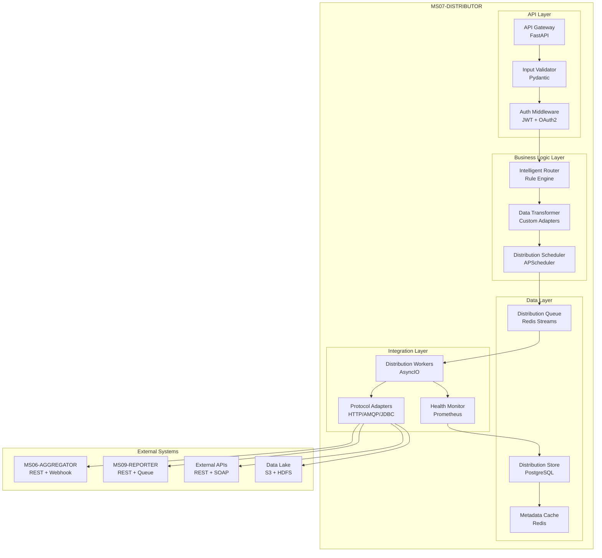

# Specifiche Tecniche - MS07-DISTRIBUTOR

**Navigazione**: [README.md](README.md) | [← API.md](API.md) | [DATABASE-SCHEMA.md](DATABASE-SCHEMA.md) | [TROUBLESHOOTING.md](TROUBLESHOOTING.md) | [Back to MS →](../MS-ARCHITECTURE-MASTER.md#ms07--distributor)

## 1. Architettura del Sistema

### 1.1 Diagramma Architetturale



### 1.2 Componenti Principali

#### 1.2.1 API Gateway (FastAPI)
- **Framework**: FastAPI 0.104+
- **Middleware**: CORS, Rate Limiting, Authentication
- **Protocolli**: RESTful HTTP/HTTPS
- **Sicurezza**: JWT tokens, API keys, mutual TLS

#### 1.2.2 Intelligent Router (Rule Engine)
- **Engine**: Drools 8.x o custom Python rule engine
- **Input**: Metadati distribuzione, regole business, stato sistema
- **Output**: Lista destinatari ordinati per priorità
- **Algoritmi**: Pattern matching, load balancing, failover

#### 1.2.3 Distribution Queue (Redis Streams)
- **Tecnologia**: Redis 7.x con Streams API
- **Features**: Consumer groups, pending messages, trimming
- **Persistence**: AOF + RDB snapshots
- **Scalabilità**: Cluster mode supportato

#### 1.2.4 Distribution Workers (AsyncIO)
- **Runtime**: Python 3.11+ con asyncio
- **Concorrenza**: Multi-threading per I/O bound operations
- **Protocolli**: HTTP/1.1, HTTP/2, AMQP 0-9-1, JDBC
- **Retry Logic**: Exponential backoff con jitter

#### 1.2.5 Distribution Store (PostgreSQL)
- **Versione**: PostgreSQL 15+ con TimescaleDB
- **Schema**: Partizionamento per performance
- **Features**: JSONB per metadati flessibili, full-text search
- **Backup**: Point-in-time recovery, streaming replication

## 2. Specifiche Funzionali

### 2.1 Funzionalità Core

#### 2.1.1 Intelligent Routing
```python
# Esempio pseudocodice per routing intelligente
def route_distribution(data: DistributionRequest) -> List[Destination]:
    # 1. Analisi metadati
    metadata = analyze_metadata(data.payload)

    # 2. Applicazione regole business
    rules = load_business_rules(data.tenant_id)
    candidates = apply_rules(metadata, rules)

    # 3. Load balancing e health check
    healthy_destinations = filter_healthy(candidates)

    # 4. Prioritizzazione e ordinamento
    prioritized = prioritize_destinations(healthy_destinations)

    return prioritized
```

## [Auto-generated heading level 2]
### [Auto-generated heading level 3]
#### 2.1.2 Reliable Delivery
- **Retry Strategy**: Exponential backoff (1s, 2s, 4s, 8s, 16s max)
- **Circuit Breaker**: 5 failure threshold, 30s timeout, 60s recovery
- **Dead Letter Queue**: Messaggi falliti dopo max retry
- **Idempotency**: UUID-based message deduplication

#### 2.1.3 Data Transformation
```python
# Esempio trasformazione dati
def transform_for_consumer(data: dict, consumer_config: dict) -> dict:
    transformer = get_transformer(consumer_config['format'])

    # Applicazione trasformazioni
    transformed = transformer.apply(data)

    # Validazione output
    validator = get_validator(consumer_config['schema'])
    if not validator.validate(transformed):
        raise TransformationError("Invalid output format")

    return transformed
```

## [Auto-generated heading level 2]
### 2.2 Protocolli di Integrazione

#### 2.2.1 REST API Integration
```json
{
  "protocol": "REST",
  "endpoint": "https://api.consumer.com/webhook",
  "method": "POST",
  "headers": {
    "Authorization": "Bearer {token}",
    "Content-Type": "application/json",
    "X-Tenant-ID": "{tenant_id}"
  },
  "timeout": 30,
  "retry_policy": {
    "max_attempts": 3,
    "backoff_multiplier": 2.0,
    "max_backoff": 60
  }
}
```

#### 2.2.2 Message Queue Integration
```json
{
  "protocol": "AMQP",
  "connection": {
    "host": "rabbitmq.cluster.local",
    "port": 5672,
    "vhost": "/zenia",
    "credentials": {
      "username": "zenia_distributor",
      "password": "{secret}"
    }
  },
  "exchange": "zenia.distribution",
  "routing_key": "report.{tenant_id}",
  "delivery_mode": 2
}
```

#### 2.2.3 Database Integration
```json
{
  "protocol": "JDBC",
  "connection": {
    "url": "jdbc:postgresql://db.consumer.com:5432/reports",
    "driver": "org.postgresql.Driver",
    "credentials": {
      "username": "zenia_writer",
      "password": "{secret}"
    }
  },
  "table": "daily_reports",
  "batch_size": 100,
  "isolation_level": "READ_COMMITTED"
}
```

## 3. Specifiche Tecniche Dettagliate

### 3.1 Performance Requirements

| Metric | Target | Critical | Warning |
|--------|--------|----------|---------|
| Throughput | 1000 msg/sec | < 500 msg/sec | < 750 msg/sec |
| Latency P95 | 500ms | > 2s | > 1s |
| Success Rate | 99.9% | < 99% | < 99.5% |
| Queue Depth | < 1000 | > 10000 | > 5000 |

### 3.2 Scalability Requirements

#### 3.2.1 Horizontal Scaling
- **Stateless Design**: Ogni istanza può essere terminata senza perdita dati
- **Shared Nothing**: Nessuna condivisione stato tra istanze
- **Kubernetes HPA**: Scaling basato su CPU/memory e custom metrics
- **Load Balancing**: Distribuzione automatica richieste tra istanze

#### 3.2.2 Vertical Scaling
- **Memory**: 2-8 GB per istanza basato su load
- **CPU**: 1-4 vCPU per istanza
- **Storage**: Ephemeral per cache, persistent per database
- **Network**: 1Gbps minimum, 10Gbps recommended

### 3.3 Reliability Requirements

#### 3.3.1 Availability
- **Uptime SLA**: 99.9% (8.76 ore downtime annuale)
- **MTTR**: < 15 minuti per incident non-critical
- **MTBF**: > 720 ore (30 giorni)
- **Disaster Recovery**: RTO 4h, RPO 15min

#### 3.3.2 Fault Tolerance
- **Graceful Degradation**: Funzionamento ridotto con failure parziali
- **Circuit Breaker**: Isolamento failure automatici
- **Bulkhead Pattern**: Isolamento risorse per tenant
- **Chaos Engineering**: Test regolari failure injection

### 3.4 Security Requirements

#### 3.4.1 Authentication & Authorization
- **Multi-tenant**: Isolamento completo per tenant
- **RBAC**: Role-based access control granulare
- **API Security**: OAuth2 + JWT + API Keys
- **Network Security**: Mutual TLS + VPN per connessioni critiche

#### 3.4.2 Data Protection
- **Encryption**: AES-256 at rest, TLS 1.3 in transit
- **Data Masking**: PII masking in logs e audit
- **GDPR Compliance**: Right to erasure, data portability
- **Audit Trail**: Complete logging per compliance

## 4. Interfacce e Protocolli

### 4.1 API Endpoints

#### 4.1.1 Distribution Submission
```http
POST /api/v1/distribution/submit
Content-Type: application/json
Authorization: Bearer {jwt_token}

{
  "tenant_id": "tenant-123",
  "data_type": "aggregated_report",
  "payload": {...},
  "destinations": ["ms09-reporter", "external-api"],
  "priority": "normal",
  "callback_url": "https://callback.example.com/status"
}
```

#### 4.1.2 Distribution Status
```http
GET /api/v1/distribution/{distribution_id}/status
Authorization: Bearer {jwt_token}

Response:
{
  "distribution_id": "dist-123",
  "status": "completed",
  "progress": 100,
  "destinations": [
    {
      "name": "ms09-reporter",
      "status": "success",
      "attempts": 1,
      "completed_at": "2024-01-15T10:30:00Z"
    }
  ]
}
```

### 4.2 Message Formats

#### 4.2.1 Distribution Request
```json
{
  "$schema": "https://zenia.io/schemas/distribution-request-v1.json",
  "distribution_id": "dist-uuid-123",
  "tenant_id": "tenant-123",
  "timestamp": "2024-01-15T10:00:00Z",
  "data_type": "aggregated_report",
  "priority": "normal",
  "payload": {
    "report_id": "rpt-456",
    "period": "2024-01",
    "metrics": {},
    "metadata": {}
  },
  "destinations": [
    {
      "name": "ms09-reporter",
      "protocol": "REST",
      "endpoint": "https://ms09.zenia.local/api/reports",
      "format": "json",
      "credentials": "cred-ref-789"
    }
  ],
  "callback": {
    "url": "https://webhook.example.com/distribution/callback",
    "headers": {"X-API-Key": "secret"}
  },
  "options": {
    "retry_policy": "exponential_backoff",
    "timeout": 300,
    "idempotency_key": "idem-123"
  }
}
```

#### 4.2.2 Distribution Response
```json
{
  "$schema": "https://zenia.io/schemas/distribution-response-v1.json",
  "distribution_id": "dist-uuid-123",
  "status": "completed",
  "submitted_at": "2024-01-15T10:00:00Z",
  "completed_at": "2024-01-15T10:00:05Z",
  "destinations": [
    {
      "name": "ms09-reporter",
      "status": "success",
      "attempts": 1,
      "delivered_at": "2024-01-15T10:00:02Z",
      "response": {
        "status_code": 200,
        "body": {"accepted": true, "report_id": "ext-rpt-456"}
      }
    }
  ],
  "metrics": {
    "total_latency_ms": 5000,
    "processing_time_ms": 3000,
    "network_time_ms": 2000
  },
  "errors": []
}
```

## 5. Database Schema

### 5.1 Tabelle Principali

#### 5.1.1 distribution_jobs
```sql
CREATE TABLE distribution_jobs (
    id UUID PRIMARY KEY DEFAULT gen_random_uuid(),
    tenant_id VARCHAR(50) NOT NULL,
    distribution_id VARCHAR(100) UNIQUE NOT NULL,
    status VARCHAR(20) NOT NULL DEFAULT 'pending',
    priority VARCHAR(10) NOT NULL DEFAULT 'normal',
    data_type VARCHAR(50) NOT NULL,
    payload JSONB NOT NULL,
    destinations JSONB NOT NULL,
    callback_url TEXT,
    created_at TIMESTAMP WITH TIME ZONE DEFAULT NOW(),
    updated_at TIMESTAMP WITH TIME ZONE DEFAULT NOW(),
    completed_at TIMESTAMP WITH TIME ZONE,
    expires_at TIMESTAMP WITH TIME ZONE,
    retry_count INTEGER DEFAULT 0,
    max_retries INTEGER DEFAULT 3,
    error_message TEXT,
    metadata JSONB DEFAULT '{}'
);

-- Indici per performance
CREATE INDEX idx_distribution_jobs_tenant_status ON distribution_jobs(tenant_id, status);
CREATE INDEX idx_distribution_jobs_created_at ON distribution_jobs(created_at);
CREATE INDEX idx_distribution_jobs_distribution_id ON distribution_jobs(distribution_id);
```

#### 5.1.2 distribution_attempts
```sql
CREATE TABLE distribution_attempts (
    id UUID PRIMARY KEY DEFAULT gen_random_uuid(),
    distribution_job_id UUID NOT NULL REFERENCES distribution_jobs(id),
    destination_name VARCHAR(100) NOT NULL,
    attempt_number INTEGER NOT NULL,
    status VARCHAR(20) NOT NULL,
    started_at TIMESTAMP WITH TIME ZONE NOT NULL,
    completed_at TIMESTAMP WITH TIME ZONE,
    response_status_code INTEGER,
    response_body TEXT,
    error_message TEXT,
    retry_reason VARCHAR(100),
    metadata JSONB DEFAULT '{}'
);

-- Indici per performance
CREATE INDEX idx_distribution_attempts_job_id ON distribution_attempts(distribution_job_id);
CREATE INDEX idx_distribution_attempts_status ON distribution_attempts(status);
CREATE INDEX idx_distribution_attempts_started_at ON distribution_attempts(started_at);
```

## 6. Configurazione e Deployment

### 6.1 Environment Variables
```bash
# Database Configuration
DB_HOST=postgresql.zenia.svc.cluster.local
DB_PORT=5432
DB_NAME=zenia_distributor
DB_USER=zenia_distributor
DB_PASSWORD=${DB_PASSWORD_SECRET}

# Redis Configuration
REDIS_HOST=redis.zenia.svc.cluster.local
REDIS_PORT=6379
REDIS_PASSWORD=${REDIS_PASSWORD_SECRET}

# API Configuration
API_HOST=0.0.0.0
API_PORT=8000
API_WORKERS=4

# Security Configuration
JWT_SECRET_KEY=${JWT_SECRET_KEY}
API_KEY_SECRET=${API_KEY_SECRET}

# Monitoring Configuration
PROMETHEUS_PORT=9090
GRAFANA_URL=https://grafana.zenia.local

# Business Rules Configuration
RULES_ENGINE_URL=http://rules-engine.zenia.svc.cluster.local:8080
```

## [Auto-generated heading level 2]
### 6.2 Kubernetes Deployment
```yaml
apiVersion: apps/v1
kind: Deployment
metadata:
  name: ms07-distributor
  namespace: zenia
spec:
  replicas: 3
  selector:
    matchLabels:
      app: ms07-distributor
  template:
    metadata:
      labels:
        app: ms07-distributor
    spec:
      containers:
      - name: distributor
        image: zenia/ms07-distributor:latest
        ports:
        - containerPort: 8000
        envFrom:
        - configMapRef:
            name: ms07-config
        - secretRef:
            name: ms07-secrets
        resources:
          requests:
            memory: "2Gi"
            cpu: "1000m"
          limits:
            memory: "4Gi"
            cpu: "2000m"
        livenessProbe:
          httpGet:
            path: /health/live
            port: 8000
          initialDelaySeconds: 30
          periodSeconds: 10
        readinessProbe:
          httpGet:
            path: /health/ready
            port: 8000
          initialDelaySeconds: 5
          periodSeconds: 5
```

## 7. Monitoring e Observability

### 7.1 Metrics Principali
```python
# Esempio metriche Prometheus
from prometheus_client import Counter, Histogram, Gauge

# Counters
DISTRIBUTION_REQUESTS = Counter(
    'zenia_distribution_requests_total',
    'Total distribution requests',
    ['tenant_id', 'data_type', 'status']
)

DISTRIBUTION_ATTEMPTS = Counter(
    'zenia_distribution_attempts_total',
    'Total distribution attempts',
    ['destination', 'status']
)

# Histograms
DISTRIBUTION_LATENCY = Histogram(
    'zenia_distribution_latency_seconds',
    'Distribution latency in seconds',
    ['destination']
)

# Gauges
QUEUE_DEPTH = Gauge(
    'zenia_distribution_queue_depth',
    'Current queue depth',
    ['queue_name']
)

ACTIVE_WORKERS = Gauge(
    'zenia_distribution_active_workers',
    'Number of active workers',
    ['worker_type']
)
```

## [Auto-generated heading level 2]
### 7.2 Logging
```json
{
  "timestamp": "2024-01-15T10:00:00Z",
  "level": "INFO",
  "service": "ms07-distributor",
  "component": "DistributionWorker",
  "distribution_id": "dist-123",
  "destination": "ms09-reporter",
  "action": "distribution_attempt",
  "status": "success",
  "latency_ms": 250,
  "metadata": {
    "attempt": 1,
    "response_code": 200,
    "tenant_id": "tenant-123"
  }
}
```

## Gestione Errori

### Scenari di Errore Comuni

1. **Timeout Query**
   - Descrizione: Query supera tempo limite di esecuzione
   - Causa: Query complessa o dati voluminosi
   - Mitigation: Implementare timeout configurabile e fallback

2. **Connessione Database**
   - Descrizione: Perdita connessione ai servizi dipendenti
   - Causa: Servizio non disponibile o problemi rete
   - Mitigation: Retry logic con exponential backoff

3. **Validazione Dati**
   - Descrizione: Input non valido o formato errato
   - Causa: Client fornisce dati non conformi
   - Mitigation: Validazione input e error messages chiari

### Error Codes

| Code | Status | Descrizione | Azione |
|------|--------|-------------|--------|
| 400 | Bad Request | Input non valido | Correggi parametri request |
| 408 | Timeout | Operazione timeout | Riprova con parametri ridotti |
| 500 | Internal Error | Errore interno | Contatta supporto |
| 503 | Service Unavailable | Servizio non disponibile | Riprova più tardi |

### Recovery Procedures

- **Automatic Retry**: Sistema riprova automaticamente con backoff esponenziale
- **Graceful Degradation**: Fallback a cache o risultati parziali se disponibili
- **Error Logging**: Tutti gli errori registrati per analisi e monitoring
- **Alerting**: Notifiche su errori critici ai team di supporto

## 8. Test e Quality Assurance

### 8.1 Test Strategy
- **Unit Tests**: Coverage > 90% per componenti core
- **Integration Tests**: Test end-to-end con mock services
- **Performance Tests**: Load testing con 1000+ concurrent distributions
- **Chaos Tests**: Failure injection per reliability validation

### 8.2 Quality Gates
- **Code Quality**: SonarQube rating A, coverage > 85%
- **Security**: SAST/DAST scans, dependency vulnerability checks
- **Performance**: P95 latency < 500ms, throughput > 1000 msg/sec
- **Reliability**: MTTR < 15min, availability > 99.9%