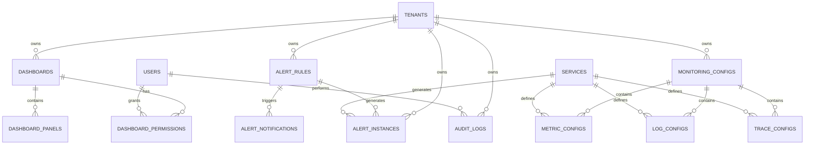

# Database Schema - MS08-MONITOR

**Navigazione**: [README.md](README.md) | [SPECIFICATION.md](SPECIFICATION.md) | [API.md](API.md) | [← TROUBLESHOUTING.md](TROUBLESHOUTING.md) | [Back to MS →](../MS-ARCHITECTURE-MASTER.md#ms08--monitor)

## Panoramica Database

MS08-MONITOR utilizza PostgreSQL come database principale per memorizzare metadati di monitoraggio, configurazioni di alert, dashboard personalizzati e dati di audit. Il database è ottimizzato per query analitiche e supporta partizionamento temporale per performance ottimali.

**Database**: `zenia_monitor`
**Versione PostgreSQL**: 15+
**Charset**: UTF-8
**Collation**: Italian locale

## Schema Architetturale



## Tabelle Principali

### 1. TENANTS
Tabella dei tenant per multi-tenancy.

```sql
CREATE TABLE tenants (
    id UUID PRIMARY KEY DEFAULT gen_random_uuid(),
    name VARCHAR(255) NOT NULL UNIQUE,
    description TEXT,
    domain VARCHAR(255),
    contact_email VARCHAR(255),
    contact_phone VARCHAR(50),
    is_active BOOLEAN DEFAULT true,
    created_at TIMESTAMP WITH TIME ZONE DEFAULT CURRENT_TIMESTAMP,
    updated_at TIMESTAMP WITH TIME ZONE DEFAULT CURRENT_TIMESTAMP,
    settings JSONB DEFAULT '{}',

    CONSTRAINT tenants_name_not_empty CHECK (length(trim(name)) > 0),
    CONSTRAINT tenants_contact_check CHECK (
        contact_email IS NOT NULL OR contact_phone IS NOT NULL
    )
);

-- Indici
CREATE UNIQUE INDEX idx_tenants_name ON tenants (name);
CREATE INDEX idx_tenants_active ON tenants (is_active);
CREATE INDEX idx_tenants_domain ON tenants (domain);
```

### 2. SERVICES
Catalogo dei servizi monitorati.

```sql
CREATE TABLE services (
    id UUID PRIMARY KEY DEFAULT gen_random_uuid(),
    tenant_id UUID NOT NULL REFERENCES tenants(id) ON DELETE CASCADE,
    name VARCHAR(255) NOT NULL,
    display_name VARCHAR(255),
    description TEXT,
    service_type VARCHAR(100) NOT NULL, -- 'microservice', 'infrastructure', 'external'
    version VARCHAR(50),
    environment VARCHAR(50) DEFAULT 'production', -- 'development', 'staging', 'production'
    endpoints JSONB DEFAULT '[]', -- Array di endpoint URLs
    health_check_url VARCHAR(500),
    tags JSONB DEFAULT '{}',
    is_active BOOLEAN DEFAULT true,
    created_at TIMESTAMP WITH TIME ZONE DEFAULT CURRENT_TIMESTAMP,
    updated_at TIMESTAMP WITH TIME ZONE DEFAULT CURRENT_TIMESTAMP,

    CONSTRAINT services_name_not_empty CHECK (length(trim(name)) > 0),
    CONSTRAINT services_type_check CHECK (
        service_type IN ('microservice', 'infrastructure', 'external')
    ),
    CONSTRAINT services_env_check CHECK (
        environment IN ('development', 'staging', 'production')
    )
);

-- Indici
CREATE UNIQUE INDEX idx_services_tenant_name ON services (tenant_id, name);
CREATE INDEX idx_services_type ON services (service_type);
CREATE INDEX idx_services_environment ON services (environment);
CREATE INDEX idx_services_active ON services (is_active);
CREATE INDEX idx_services_tags ON services USING GIN (tags);
```

### 3. DASHBOARDS
Dashboard di monitoraggio personalizzati.

```sql
CREATE TABLE dashboards (
    id UUID PRIMARY KEY DEFAULT gen_random_uuid(),
    tenant_id UUID NOT NULL REFERENCES tenants(id) ON DELETE CASCADE,
    title VARCHAR(255) NOT NULL,
    description TEXT,
    tags JSONB DEFAULT '[]',
    folder VARCHAR(255) DEFAULT 'General',
    is_public BOOLEAN DEFAULT false,
    is_favorite BOOLEAN DEFAULT false,
    refresh_interval VARCHAR(20) DEFAULT '30s', -- '5s', '10s', '30s', '1m', '5m', '15m', '30m', '1h'
    time_from VARCHAR(50) DEFAULT 'now-1h',
    time_to VARCHAR(50) DEFAULT 'now',
    timezone VARCHAR(50) DEFAULT 'UTC',
    configuration JSONB NOT NULL DEFAULT '{}', -- Grafana dashboard JSON
    created_by UUID REFERENCES users(id),
    created_at TIMESTAMP WITH TIME ZONE DEFAULT CURRENT_TIMESTAMP,
    updated_at TIMESTAMP WITH TIME ZONE DEFAULT CURRENT_TIMESTAMP,

    CONSTRAINT dashboards_title_not_empty CHECK (length(trim(title)) > 0),
    CONSTRAINT dashboards_refresh_check CHECK (
        refresh_interval IN ('5s', '10s', '30s', '1m', '5m', '15m', '30m', '1h', '6h', '12h', '1d', '7d', '30d')
    )
);

-- Indici
CREATE INDEX idx_dashboards_tenant ON dashboards (tenant_id);
CREATE INDEX idx_dashboards_folder ON dashboards (tenant_id, folder);
CREATE INDEX idx_dashboards_tags ON dashboards USING GIN (tags);
CREATE INDEX idx_dashboards_public ON dashboards (is_public);
```

### 4. DASHBOARD_PANELS
Pannelli all'interno dei dashboard.

```sql
CREATE TABLE dashboard_panels (
    id UUID PRIMARY KEY DEFAULT gen_random_uuid(),
    dashboard_id UUID NOT NULL REFERENCES dashboards(id) ON DELETE CASCADE,
    panel_id INTEGER NOT NULL,
    title VARCHAR(255) NOT NULL,
    type VARCHAR(100) NOT NULL, -- 'graph', 'singlestat', 'table', 'heatmap', 'bargauge', etc.
    description TEXT,
    position_x INTEGER NOT NULL DEFAULT 0,
    position_y INTEGER NOT NULL DEFAULT 0,
    width INTEGER NOT NULL DEFAULT 12,
    height INTEGER NOT NULL DEFAULT 8,
    configuration JSONB NOT NULL DEFAULT '{}', -- Panel configuration JSON
    targets JSONB DEFAULT '[]', -- Array of metric queries
    created_at TIMESTAMP WITH TIME ZONE DEFAULT CURRENT_TIMESTAMP,
    updated_at TIMESTAMP WITH TIME ZONE DEFAULT CURRENT_TIMESTAMP,

    CONSTRAINT dashboard_panels_title_not_empty CHECK (length(trim(title)) > 0),
    CONSTRAINT dashboard_panels_position_check CHECK (
        position_x >= 0 AND position_y >= 0 AND width > 0 AND height > 0
    ),
    CONSTRAINT dashboard_panels_size_check CHECK (
        width <= 24 AND height <= 100
    )
);

-- Indici
CREATE UNIQUE INDEX idx_dashboard_panels_unique ON dashboard_panels (dashboard_id, panel_id);
CREATE INDEX idx_dashboard_panels_type ON dashboard_panels (type);
```

### 5. ALERT_RULES
Regole di alert configurabili.

```sql
CREATE TABLE alert_rules (
    id UUID PRIMARY KEY DEFAULT gen_random_uuid(),
    tenant_id UUID NOT NULL REFERENCES tenants(id) ON DELETE CASCADE,
    name VARCHAR(255) NOT NULL,
    description TEXT,
    query TEXT NOT NULL, -- PromQL expression
    duration VARCHAR(20) NOT NULL DEFAULT '5m', -- For, duration
    severity VARCHAR(20) NOT NULL DEFAULT 'warning', -- 'info', 'warning', 'error', 'critical'
    labels JSONB DEFAULT '{}',
    annotations JSONB DEFAULT '{}',
    is_active BOOLEAN DEFAULT true,
    is_paused BOOLEAN DEFAULT false,
    created_by UUID REFERENCES users(id),
    created_at TIMESTAMP WITH TIME ZONE DEFAULT CURRENT_TIMESTAMP,
    updated_at TIMESTAMP WITH TIME ZONE DEFAULT CURRENT_TIMESTAMP,

    CONSTRAINT alert_rules_name_not_empty CHECK (length(trim(name)) > 0),
    CONSTRAINT alert_rules_duration_check CHECK (
        duration ~ '^([0-9]+)([smhd])$'
    ),
    CONSTRAINT alert_rules_severity_check CHECK (
        severity IN ('info', 'warning', 'error', 'critical')
    )
);

-- Indici
CREATE UNIQUE INDEX idx_alert_rules_tenant_name ON alert_rules (tenant_id, name);
CREATE INDEX idx_alert_rules_active ON alert_rules (is_active);
CREATE INDEX idx_alert_rules_severity ON alert_rules (severity);
```

### 6. ALERT_INSTANCES
Istanze di alert attivi o storici.

```sql
CREATE TABLE alert_instances (
    id UUID PRIMARY KEY DEFAULT gen_random_uuid(),
    alert_rule_id UUID NOT NULL REFERENCES alert_rules(id) ON DELETE CASCADE,
    tenant_id UUID NOT NULL REFERENCES tenants(id) ON DELETE CASCADE,
    fingerprint VARCHAR(255) NOT NULL, -- Alert fingerprint for deduplication
    status VARCHAR(20) NOT NULL DEFAULT 'firing', -- 'firing', 'resolved', 'silenced'
    severity VARCHAR(20) NOT NULL,
    labels JSONB DEFAULT '{}',
    annotations JSONB DEFAULT '{}',
    value DECIMAL(20,6), -- Alert value
    starts_at TIMESTAMP WITH TIME ZONE NOT NULL,
    ends_at TIMESTAMP WITH TIME ZONE,
    resolved_at TIMESTAMP WITH TIME ZONE,
    silenced_until TIMESTAMP WITH TIME ZONE,
    created_at TIMESTAMP WITH TIME ZONE DEFAULT CURRENT_TIMESTAMP,
    updated_at TIMESTAMP WITH TIME ZONE DEFAULT CURRENT_TIMESTAMP,

    CONSTRAINT alert_instances_status_check CHECK (
        status IN ('firing', 'resolved', 'silenced')
    ),
    CONSTRAINT alert_instances_severity_check CHECK (
        severity IN ('info', 'warning', 'error', 'critical')
    ),
    CONSTRAINT alert_instances_timeline_check CHECK (
        starts_at <= COALESCE(ends_at, CURRENT_TIMESTAMP) AND
        starts_at <= COALESCE(resolved_at, CURRENT_TIMESTAMP)
    )
);

-- Indici
CREATE UNIQUE INDEX idx_alert_instances_fingerprint ON alert_instances (fingerprint);
CREATE INDEX idx_alert_instances_rule ON alert_instances (alert_rule_id);
CREATE INDEX idx_alert_instances_tenant_status ON alert_instances (tenant_id, status);
CREATE INDEX idx_alert_instances_status_time ON alert_instances (status, starts_at);
CREATE INDEX idx_alert_instances_labels ON alert_instances USING GIN (labels);

-- Partizionamento per performance
CREATE TABLE alert_instances_y2024m01 PARTITION OF alert_instances
    FOR VALUES FROM ('2024-01-01') TO ('2024-02-01');
CREATE TABLE alert_instances_y2024m02 PARTITION OF alert_instances
    FOR VALUES FROM ('2024-02-01') TO ('2024-03-01');
-- ... altri mesi
```

### 7. ALERT_NOTIFICATIONS
Notifiche inviate per gli alert.

```sql
CREATE TABLE alert_notifications (
    id UUID PRIMARY KEY DEFAULT gen_random_uuid(),
    alert_instance_id UUID NOT NULL REFERENCES alert_instances(id) ON DELETE CASCADE,
    tenant_id UUID NOT NULL REFERENCES tenants(id) ON DELETE CASCADE,
    notification_type VARCHAR(50) NOT NULL, -- 'email', 'slack', 'webhook', 'sms'
    recipient VARCHAR(255) NOT NULL,
    subject VARCHAR(500),
    message TEXT,
    status VARCHAR(20) DEFAULT 'sent', -- 'sent', 'delivered', 'failed', 'retry'
    sent_at TIMESTAMP WITH TIME ZONE DEFAULT CURRENT_TIMESTAMP,
    delivered_at TIMESTAMP WITH TIME ZONE,
    failed_at TIMESTAMP WITH TIME ZONE,
    error_message TEXT,
    retry_count INTEGER DEFAULT 0,
    max_retries INTEGER DEFAULT 3,

    CONSTRAINT alert_notifications_type_check CHECK (
        notification_type IN ('email', 'slack', 'webhook', 'sms', 'pagerduty', 'teams')
    ),
    CONSTRAINT alert_notifications_status_check CHECK (
        status IN ('sent', 'delivered', 'failed', 'retry')
    )
);

-- Indici
CREATE INDEX idx_alert_notifications_instance ON alert_notifications (alert_instance_id);
CREATE INDEX idx_alert_notifications_tenant ON alert_notifications (tenant_id);
CREATE INDEX idx_alert_notifications_type ON alert_notifications (notification_type);
CREATE INDEX idx_alert_notifications_status ON alert_notifications (status);
```

### 8. MONITORING_CONFIGS
Configurazioni di monitoraggio per tenant.

```sql
CREATE TABLE monitoring_configs (
    id UUID PRIMARY KEY DEFAULT gen_random_uuid(),
    tenant_id UUID NOT NULL REFERENCES tenants(id) ON DELETE CASCADE,
    config_type VARCHAR(50) NOT NULL, -- 'prometheus', 'elasticsearch', 'jaeger', 'grafana'
    name VARCHAR(255) NOT NULL,
    description TEXT,
    configuration JSONB NOT NULL DEFAULT '{}',
    is_active BOOLEAN DEFAULT true,
    version INTEGER DEFAULT 1,
    created_by UUID REFERENCES users(id),
    created_at TIMESTAMP WITH TIME ZONE DEFAULT CURRENT_TIMESTAMP,
    updated_at TIMESTAMP WITH TIME ZONE DEFAULT CURRENT_TIMESTAMP,

    CONSTRAINT monitoring_configs_type_check CHECK (
        config_type IN ('prometheus', 'elasticsearch', 'jaeger', 'grafana', 'alertmanager')
    ),
    CONSTRAINT monitoring_configs_name_not_empty CHECK (length(trim(name)) > 0)
);

-- Indici
CREATE UNIQUE INDEX idx_monitoring_configs_tenant_type_name ON monitoring_configs (tenant_id, config_type, name);
CREATE INDEX idx_monitoring_configs_active ON monitoring_configs (is_active);
```

### 9. METRIC_CONFIGS
Configurazioni specifiche per metriche.

```sql
CREATE TABLE metric_configs (
    id UUID PRIMARY KEY DEFAULT gen_random_uuid(),
    monitoring_config_id UUID NOT NULL REFERENCES monitoring_configs(id) ON DELETE CASCADE,
    service_id UUID REFERENCES services(id) ON DELETE CASCADE,
    metric_name VARCHAR(255) NOT NULL,
    metric_type VARCHAR(50) NOT NULL, -- 'counter', 'gauge', 'histogram', 'summary'
    description TEXT,
    unit VARCHAR(50), -- 'seconds', 'bytes', 'requests', etc.
    labels JSONB DEFAULT '{}',
    scrape_interval VARCHAR(20) DEFAULT '30s',
    scrape_timeout VARCHAR(20) DEFAULT '10s',
    is_active BOOLEAN DEFAULT true,
    created_at TIMESTAMP WITH TIME ZONE DEFAULT CURRENT_TIMESTAMP,
    updated_at TIMESTAMP WITH TIME ZONE DEFAULT CURRENT_TIMESTAMP,

    CONSTRAINT metric_configs_type_check CHECK (
        metric_type IN ('counter', 'gauge', 'histogram', 'summary')
    ),
    CONSTRAINT metric_configs_interval_check CHECK (
        scrape_interval ~ '^([0-9]+)([smhd])$'
    )
);

-- Indici
CREATE UNIQUE INDEX idx_metric_configs_config_name ON metric_configs (monitoring_config_id, metric_name);
CREATE INDEX idx_metric_configs_service ON metric_configs (service_id);
CREATE INDEX idx_metric_configs_active ON metric_configs (is_active);
```

### 10. LOG_CONFIGS
Configurazioni per l'acquisizione dei log.

```sql
CREATE TABLE log_configs (
    id UUID PRIMARY KEY DEFAULT gen_random_uuid(),
    monitoring_config_id UUID NOT NULL REFERENCES monitoring_configs(id) ON DELETE CASCADE,
    service_id UUID REFERENCES services(id) ON DELETE CASCADE,
    log_type VARCHAR(50) NOT NULL, -- 'application', 'access', 'error', 'audit'
    index_pattern VARCHAR(255) NOT NULL,
    retention_days INTEGER DEFAULT 30,
    compression_enabled BOOLEAN DEFAULT true,
    structured_logging BOOLEAN DEFAULT true,
    log_level VARCHAR(20) DEFAULT 'INFO', -- 'DEBUG', 'INFO', 'WARN', 'ERROR'
    filters JSONB DEFAULT '[]', -- Array of log filters
    parsers JSONB DEFAULT '[]', -- Array of log parsers
    is_active BOOLEAN DEFAULT true,
    created_at TIMESTAMP WITH TIME ZONE DEFAULT CURRENT_TIMESTAMP,
    updated_at TIMESTAMP WITH TIME ZONE DEFAULT CURRENT_TIMESTAMP,

    CONSTRAINT log_configs_type_check CHECK (
        log_type IN ('application', 'access', 'error', 'audit', 'system')
    ),
    CONSTRAINT log_configs_level_check CHECK (
        log_level IN ('DEBUG', 'INFO', 'WARN', 'ERROR', 'FATAL')
    ),
    CONSTRAINT log_configs_retention_check CHECK (retention_days > 0)
);

-- Indici
CREATE UNIQUE INDEX idx_log_configs_config_type ON log_configs (monitoring_config_id, log_type);
CREATE INDEX idx_log_configs_service ON log_configs (service_id);
CREATE INDEX idx_log_configs_active ON log_configs (is_active);
```

### 11. TRACE_CONFIGS
Configurazioni per il tracing distribuito.

```sql
CREATE TABLE trace_configs (
    id UUID PRIMARY KEY DEFAULT gen_random_uuid(),
    monitoring_config_id UUID NOT NULL REFERENCES monitoring_configs(id) ON DELETE CASCADE,
    service_id UUID REFERENCES services(id) ON DELETE CASCADE,
    sampling_rate DECIMAL(3,2) DEFAULT 1.0, -- 0.0 to 1.0
    sampling_type VARCHAR(50) DEFAULT 'probabilistic', -- 'probabilistic', 'rate_limiting', 'adaptive'
    max_traces_per_second INTEGER DEFAULT 1000,
    trace_retention_days INTEGER DEFAULT 7,
    tags JSONB DEFAULT '{}', -- Additional tags to add to traces
    exporters JSONB DEFAULT '[]', -- Array of trace exporters
    is_active BOOLEAN DEFAULT true,
    created_at TIMESTAMP WITH TIME ZONE DEFAULT CURRENT_TIMESTAMP,
    updated_at TIMESTAMP WITH TIME ZONE DEFAULT CURRENT_TIMESTAMP,

    CONSTRAINT trace_configs_sampling_check CHECK (
        sampling_rate >= 0.0 AND sampling_rate <= 1.0
    ),
    CONSTRAINT trace_configs_type_check CHECK (
        sampling_type IN ('probabilistic', 'rate_limiting', 'adaptive', 'always_on', 'always_off')
    ),
    CONSTRAINT trace_configs_retention_check CHECK (trace_retention_days > 0)
);

-- Indici
CREATE UNIQUE INDEX idx_trace_configs_config ON trace_configs (monitoring_config_id);
CREATE INDEX idx_trace_configs_service ON trace_configs (service_id);
CREATE INDEX idx_trace_configs_active ON trace_configs (is_active);
```

### 12. AUDIT_LOGS
Log di audit per compliance e sicurezza.

```sql
CREATE TABLE audit_logs (
    id UUID PRIMARY KEY DEFAULT gen_random_uuid(),
    tenant_id UUID NOT NULL REFERENCES tenants(id) ON DELETE CASCADE,
    user_id UUID REFERENCES users(id),
    action VARCHAR(100) NOT NULL,
    resource_type VARCHAR(100) NOT NULL,
    resource_id UUID,
    details JSONB DEFAULT '{}',
    ip_address INET,
    user_agent TEXT,
    session_id VARCHAR(255),
    correlation_id VARCHAR(255),
    timestamp TIMESTAMP WITH TIME ZONE DEFAULT CURRENT_TIMESTAMP,

    CONSTRAINT audit_logs_action_not_empty CHECK (length(trim(action)) > 0),
    CONSTRAINT audit_logs_resource_not_empty CHECK (length(trim(resource_type)) > 0)
);

-- Indici
CREATE INDEX idx_audit_logs_tenant_time ON audit_logs (tenant_id, timestamp);
CREATE INDEX idx_audit_logs_user ON audit_logs (user_id);
CREATE INDEX idx_audit_logs_action ON audit_logs (action);
CREATE INDEX idx_audit_logs_resource ON audit_logs (resource_type, resource_id);
CREATE INDEX idx_audit_logs_correlation ON audit_logs (correlation_id);

-- Partizionamento per performance
CREATE TABLE audit_logs_y2024m01 PARTITION OF audit_logs
    FOR VALUES FROM ('2024-01-01') TO ('2024-02-01');
CREATE TABLE audit_logs_y2024m02 PARTITION OF audit_logs
    FOR VALUES FROM ('2024-02-01') TO ('2024-03-01');
-- ... altri mesi
```

### 13. USERS
Utenti del sistema di monitoraggio.

```sql
CREATE TABLE users (
    id UUID PRIMARY KEY DEFAULT gen_random_uuid(),
    tenant_id UUID REFERENCES tenants(id) ON DELETE CASCADE,
    username VARCHAR(255) NOT NULL UNIQUE,
    email VARCHAR(255) NOT NULL UNIQUE,
    display_name VARCHAR(255),
    password_hash VARCHAR(255),
    is_active BOOLEAN DEFAULT true,
    is_admin BOOLEAN DEFAULT false,
    last_login TIMESTAMP WITH TIME ZONE,
    created_at TIMESTAMP WITH TIME ZONE DEFAULT CURRENT_TIMESTAMP,
    updated_at TIMESTAMP WITH TIME ZONE DEFAULT CURRENT_TIMESTAMP,
    preferences JSONB DEFAULT '{}',

    CONSTRAINT users_username_not_empty CHECK (length(trim(username)) > 0),
    CONSTRAINT users_email_valid CHECK (email ~ '^[A-Za-z0-9._%+-]+@[A-Za-z0-9.-]+\.[A-Za-z]{2,}$')
);

-- Indici
CREATE UNIQUE INDEX idx_users_username ON users (username);
CREATE UNIQUE INDEX idx_users_email ON users (email);
CREATE INDEX idx_users_tenant ON users (tenant_id);
CREATE INDEX idx_users_active ON users (is_active);
```

### 14. DASHBOARD_PERMISSIONS
Permessi sui dashboard.

```sql
CREATE TABLE dashboard_permissions (
    id UUID PRIMARY KEY DEFAULT gen_random_uuid(),
    dashboard_id UUID NOT NULL REFERENCES dashboards(id) ON DELETE CASCADE,
    user_id UUID REFERENCES users(id) ON DELETE CASCADE,
    team_id UUID, -- Future use for team-based permissions
    permission VARCHAR(20) NOT NULL DEFAULT 'view', -- 'view', 'edit', 'admin'
    created_by UUID REFERENCES users(id),
    created_at TIMESTAMP WITH TIME ZONE DEFAULT CURRENT_TIMESTAMP,

    CONSTRAINT dashboard_permissions_perm_check CHECK (
        permission IN ('view', 'edit', 'admin')
    ),
    CONSTRAINT dashboard_permissions_user_team_check CHECK (
        user_id IS NOT NULL OR team_id IS NOT NULL
    )
);

-- Indici
CREATE UNIQUE INDEX idx_dashboard_permissions_dashboard_user ON dashboard_permissions (dashboard_id, user_id);
CREATE INDEX idx_dashboard_permissions_user ON dashboard_permissions (user_id);
CREATE INDEX idx_dashboard_permissions_permission ON dashboard_permissions (permission);
```

## Viste Materializzate

### 1. Alert Summary View
Vista aggregata per riepilogo alert.

```sql
CREATE MATERIALIZED VIEW alert_summary AS
SELECT
    tenant_id,
    status,
    severity,
    COUNT(*) as alert_count,
    MIN(starts_at) as first_alert,
    MAX(starts_at) as last_alert,
    AVG(EXTRACT(EPOCH FROM (COALESCE(ends_at, CURRENT_TIMESTAMP) - starts_at))) as avg_duration_seconds
FROM alert_instances
WHERE starts_at >= CURRENT_TIMESTAMP - INTERVAL '30 days'
GROUP BY tenant_id, status, severity
WITH NO DATA;

-- Refresh policy
CREATE UNIQUE INDEX idx_alert_summary_tenant_status_severity ON alert_summary (tenant_id, status, severity);
REFRESH MATERIALIZED VIEW CONCURRENTLY alert_summary;
```

### 2. Service Health View
Vista per lo stato di salute dei servizi.

```sql
CREATE MATERIALIZED VIEW service_health AS
SELECT
    s.id as service_id,
    s.tenant_id,
    s.name,
    s.environment,
    COUNT(CASE WHEN ai.status = 'firing' AND ai.severity = 'critical' THEN 1 END) as critical_alerts,
    COUNT(CASE WHEN ai.status = 'firing' AND ai.severity = 'warning' THEN 1 END) as warning_alerts,
    MAX(CASE WHEN ai.status = 'firing' THEN ai.starts_at END) as last_alert_time,
    CASE
        WHEN COUNT(CASE WHEN ai.status = 'firing' AND ai.severity = 'critical' THEN 1 END) > 0 THEN 'critical'
        WHEN COUNT(CASE WHEN ai.status = 'firing' AND ai.severity = 'warning' THEN 1 END) > 0 THEN 'warning'
        ELSE 'healthy'
    END as health_status
FROM services s
LEFT JOIN alert_instances ai ON s.id = ai.service_id
    AND ai.starts_at >= CURRENT_TIMESTAMP - INTERVAL '1 hour'
    AND ai.status = 'firing'
GROUP BY s.id, s.tenant_id, s.name, s.environment
WITH NO DATA;

-- Refresh policy
CREATE UNIQUE INDEX idx_service_health_service ON service_health (service_id);
REFRESH MATERIALIZED VIEW CONCURRENTLY service_health;
```

## Funzioni e Trigger

### 1. Funzione di Audit Automatico
```sql
CREATE OR REPLACE FUNCTION audit_trigger_function()
RETURNS TRIGGER AS $$
DECLARE
    action_type TEXT;
    old_data JSONB;
    new_data JSONB;
BEGIN
    IF TG_OP = 'INSERT' THEN
        action_type := 'INSERT';
        old_data := NULL;
        new_data := row_to_json(NEW)::JSONB;
    ELSIF TG_OP = 'UPDATE' THEN
        action_type := 'UPDATE';
        old_data := row_to_json(OLD)::JSONB;
        new_data := row_to_json(NEW)::JSONB;
    ELSIF TG_OP = 'DELETE' THEN
        action_type := 'DELETE';
        old_data := row_to_json(OLD)::JSONB;
        new_data := NULL;
    END IF;

    INSERT INTO audit_logs (
        tenant_id,
        user_id,
        action,
        resource_type,
        resource_id,
        details,
        correlation_id
    ) VALUES (
        COALESCE(NEW.tenant_id, OLD.tenant_id),
        current_setting('app.current_user_id', true)::UUID,
        action_type,
        TG_TABLE_NAME,
        COALESCE(NEW.id, OLD.id),
        jsonb_build_object('old', old_data, 'new', new_data),
        current_setting('app.correlation_id', true)
    );

    RETURN COALESCE(NEW, OLD);
END;
$$ LANGUAGE plpgsql SECURITY DEFINER;
```

### 2. Trigger di Aggiornamento Timestamp
```sql
CREATE OR REPLACE FUNCTION update_updated_at_column()
RETURNS TRIGGER AS $$
BEGIN
    NEW.updated_at = CURRENT_TIMESTAMP;
    RETURN NEW;
END;
$$ LANGUAGE plpgsql;

-- Applicazione trigger a tutte le tabelle
CREATE TRIGGER update_tenants_updated_at BEFORE UPDATE ON tenants
    FOR EACH ROW EXECUTE FUNCTION update_updated_at_column();

CREATE TRIGGER update_services_updated_at BEFORE UPDATE ON services
    FOR EACH ROW EXECUTE FUNCTION update_updated_at_column();

-- ... altri trigger per tutte le tabelle
```

### 3. Funzione di Calcolo Fingerprint Alert
```sql
CREATE OR REPLACE FUNCTION calculate_alert_fingerprint(
    rule_id UUID,
    labels JSONB
) RETURNS VARCHAR(255) AS $$
DECLARE
    fingerprint TEXT;
BEGIN
    -- Create deterministic fingerprint based on rule and labels
    SELECT encode(sha256(concat(rule_id::TEXT, labels::TEXT)::bytea), 'hex') INTO fingerprint;
    RETURN substring(fingerprint, 1, 64);
END;
$$ LANGUAGE plpgsql IMMUTABLE;
```

## Indici Ottimizzati

### 1. Indici Parziali per Performance
```sql
-- Alert attivi recenti
CREATE INDEX idx_alert_instances_active_recent ON alert_instances (tenant_id, starts_at)
WHERE status = 'firing' AND starts_at >= CURRENT_TIMESTAMP - INTERVAL '7 days';

-- Dashboard pubblici
CREATE INDEX idx_dashboards_public_recent ON dashboards (updated_at)
WHERE is_public = true;

-- Configurazioni attive
CREATE INDEX idx_monitoring_configs_active_type ON monitoring_configs (tenant_id, config_type)
WHERE is_active = true;
```

### 2. Indici GIN per JSONB
```sql
-- Ricerca per tag nei servizi
CREATE INDEX idx_services_tags_gin ON services USING GIN (tags);

-- Ricerca per label negli alert
CREATE INDEX idx_alert_instances_labels_gin ON alert_instances USING GIN (labels);

-- Ricerca per annotazioni negli alert
CREATE INDEX idx_alert_instances_annotations_gin ON alert_instances USING GIN (annotations);
```

## Politiche di Sicurezza (RLS)

### 1. Row Level Security per Tenant
```sql
-- Abilita RLS su tutte le tabelle tenant-scoped
ALTER TABLE tenants ENABLE ROW LEVEL SECURITY;
ALTER TABLE services ENABLE ROW LEVEL SECURITY;
ALTER TABLE dashboards ENABLE ROW LEVEL SECURITY;
ALTER TABLE alert_rules ENABLE ROW LEVEL SECURITY;
ALTER TABLE alert_instances ENABLE ROW LEVEL SECURITY;

-- Policy per tenant isolation
CREATE POLICY tenant_isolation_policy ON tenants
    FOR ALL USING (id = current_setting('app.tenant_id', true)::UUID);

CREATE POLICY tenant_isolation_policy ON services
    FOR ALL USING (tenant_id = current_setting('app.tenant_id', true)::UUID);

-- ... altre policy per tutte le tabelle
```

## Strategie di Backup e Recovery

### 1. Backup Incrementale
```sql
-- Backup giornaliero completo
pg_dump zenia_monitor --format=custom --compress=9 --file=backup_full_$(date +%Y%m%d).dump

-- Backup incrementale per tabelle ad alto volume
pg_dump zenia_monitor --table=audit_logs --table=alert_instances --format=directory --compress=9 --file=backup_incremental_$(date +%Y%m%d)
```

### 2. Retention Policy
- **Tabelle principali**: 1 anno
- **Alert instances**: 90 giorni
- **Audit logs**: 2 anni (compliance)
- **Metric data**: 30 giorni (in VictoriaMetrics)

## Monitoraggio Database

### 1. Metriche PostgreSQL
```sql
-- Query per monitoraggio performance
SELECT
    schemaname,
    tablename,
    seq_scan,
    seq_tup_read,
    idx_scan,
    idx_tup_fetch,
    n_tup_ins,
    n_tup_upd,
    n_tup_del
FROM pg_stat_user_tables
ORDER BY seq_tup_read DESC;

-- Connessioni attive
SELECT
    datname,
    usename,
    client_addr,
    state,
    query_start,
    state_change
FROM pg_stat_activity
WHERE state != 'idle';
```

### 2. Allarmi Database
- **Connection pool exhaustion**: > 80% connessioni utilizzate
- **Slow queries**: Query > 5 secondi
- **Table bloat**: Tabelle con > 20% bloat
- **Index usage**: Indici con usage < 5%