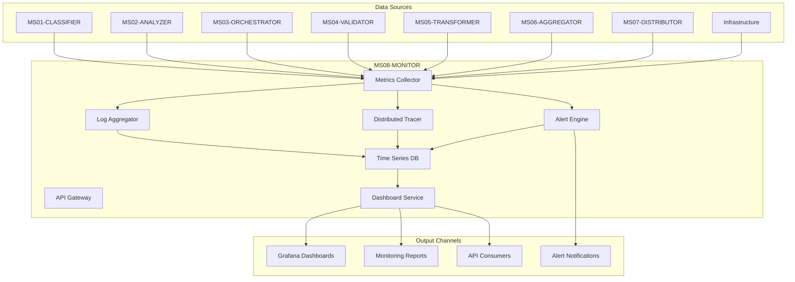

# MS08 - MONITOR

**Navigazione**: [← SPECIFICATION.md](SPECIFICATION.md) | [README](README.md) | [API.md](API.md) | [DATABASE-SCHEMA.md](DATABASE-SCHEMA.md) | [TROUBLESHOOTING.md](TROUBLESHOOTING.md) | [Back to MS →](../MS-ARCHITECTURE-MASTER.md#ms08--monitor)

## Panoramica

MS08-MONITOR è il sistema di monitoraggio centralizzato della piattaforma ZenIA, responsabile della raccolta, analisi e visualizzazione delle metriche operative di tutti i microservizi. Fornisce osservabilità completa attraverso metriche, log aggregati, tracing distribuito e alerting intelligente per garantire la salute e le performance del sistema.

## Responsabilità Principali

- **Metrics Collection**: Raccolta centralizzata di metriche da tutti i microservizi
- **Log Aggregation**: Aggregazione e analisi dei log distribuiti
- **Distributed Tracing**: Tracciamento end-to-end delle richieste
- **Alert Management**: Sistema di alerting intelligente con escalation
- **Performance Monitoring**: Monitoraggio delle performance e identificazione bottleneck
- **Health Dashboard**: Dashboard unificati per monitoraggio dello stato sistema
- **Anomaly Detection**: Rilevamento automatico di anomalie e comportamenti anomali

## Architettura ad Alto Livello

## Flusso di Monitoraggio

1. **Collection**: Raccolta automatica di metriche da tutti i MS via protocolli standard
2. **Aggregation**: Aggregazione e correlazione dei dati di monitoraggio
3. **Analysis**: Analisi real-time per identificare trend e anomalie
4. **Alerting**: Generazione alert basata su soglie configurabili
5. **Visualization**: Presentazione dei dati attraverso dashboard interattivi
6. **Reporting**: Generazione report periodici e on-demand
7. **Feedback Loop**: Utilizzo dei dati per ottimizzazioni automatiche

## Componenti Architetturali

### 1. Metrics Collector
- **Tecnologia**: Prometheus con custom exporters
- **Responsabilità**: Raccolta metriche da tutti i microservizi
- **Protocolli**: Prometheus, StatsD, JMX, OpenTelemetry
- **Features**: Auto-discovery, service mesh integration

### 2. Log Aggregator
- **Tecnologia**: ELK Stack (Elasticsearch, Logstash, Kibana)
- **Responsabilità**: Aggregazione centralizzata dei log
- **Features**: Full-text search, pattern analysis, anomaly detection
- **Storage**: Hot-warm-cold architecture per retention ottimizzata

### 3. Distributed Tracer
- **Tecnologia**: Jaeger + OpenTelemetry
- **Responsabilità**: Tracing end-to-end delle transazioni
- **Features**: Service mesh integration, performance profiling
- **Storage**: Cassandra per alta scalabilità

### 4. Alert Engine
- **Tecnologia**: Prometheus Alertmanager + custom rules
- **Responsabilità**: Alerting intelligente con deduplicazione
- **Features**: Multi-channel notifications, escalation policies
- **Integration**: Email, Slack, PagerDuty, SMS

### 5. Dashboard Service
- **Tecnologia**: Grafana con custom plugins
- **Responsabilità**: Visualizzazione unificata dei dati di monitoraggio
- **Features**: Custom dashboards, alerting integration, user management
- **Templates**: Dashboard templates per ogni tipo di microservizio

### 6. Time Series Database
- **Tecnologia**: VictoriaMetrics + TimescaleDB
- **Responsabilità**: Storage ottimizzato per metriche time-series
- **Features**: High ingestion rate, efficient compression, long-term retention
- **Backup**: Multi-region replication per disaster recovery

## Integrazione con Altri Microservizi

| Microservizio | Tipo Integrazione | Protocollo | Scopo |
|---------------|-------------------|------------|-------|
| Tutti MS | Consumer | Prometheus/OpenTelemetry | Raccolta metriche |
| MS03-ORCHESTRATOR | Bidirezionale | REST API | Health checks e status |
| MS07-DISTRIBUTOR | Consumer | REST API | Invio metriche distribuzione |
| Sistemi Esterni | Provider | Webhooks | Alert notifications |

## Sicurezza e Compliance

### Autenticazione e Autorizzazione
- **Service-to-Service**: Mutual TLS per comunicazioni interne
- **API Access**: JWT tokens per dashboard access
- **Role-Based Access**: Differenti livelli di accesso ai dati di monitoraggio
- **Audit Logging**: Complete audit trail per accessi sensibili

### Data Protection
- **Encryption**: AES-256 per dati at rest e in transit
- **Data Masking**: Masking automatico di dati sensibili nei log
- **Retention Policies**: Automatic cleanup basato su compliance requirements
- **GDPR Compliance**: Data minimization e right to erasure

### Network Security
- **Service Mesh**: Istio per traffic encryption e policy enforcement
- **Network Policies**: Kubernetes network policies per isolamento
- **Zero Trust**: Continuous verification per tutti gli accessi
- **Intrusion Detection**: Real-time monitoring per attività sospette

## Metriche e KPI Principali

### Performance Metrics
- **System Throughput**: Transazioni/secondo per microservizio
- **Latency P95**: Latenza end-to-end delle operazioni critiche
- **Error Rate**: Percentuale errori per servizio e endpoint
- **Resource Utilization**: CPU, memoria, disco per componente

### Business Metrics
- **Document Processing Rate**: Documenti processati per unità di tempo
- **Accuracy Trends**: Trend di accuratezza nel tempo
- **User Satisfaction**: Metriche derivate da feedback utenti
- **SLA Compliance**: Percentuale rispetto degli SLA

### Infrastructure Metrics
- **Availability**: Uptime per servizio e dipendenza
- **Scalability**: Capacità di scaling automatico
- **Cost Efficiency**: Costo per transazione processata
- **Environmental Impact**: Consumo energetico e carbon footprint

## Alerting e Incident Management

### Alert Categories
- **Critical**: System down, data loss, security breaches
- **Warning**: Performance degradation, high error rates
- **Info**: Configuration changes, maintenance notifications

### Escalation Policies
- **Immediate**: P1 alerts - intervento entro 15 minuti
- **Fast**: P2 alerts - intervento entro 1 ora
- **Normal**: P3 alerts - intervento entro 4 ore
- **Low**: P4 alerts - intervento entro 24 ore

### Incident Response
- **Detection**: Automatic alert generation
- **Diagnosis**: Guided troubleshooting con runbook
- **Resolution**: Automated remediation dove possibile
- **Post-Mortem**: Analysis e prevenzione recurrence

## Dashboard e Visualizzazioni

### Executive Dashboard
- **KPI Overview**: Metriche business critiche
- **System Health**: Stato generale della piattaforma
- **Trend Analysis**: Andamenti nel tempo
- **Alert Summary**: Stato corrente degli alert attivi

### Technical Dashboard
- **Service Metrics**: Performance per microservizio
- **Infrastructure**: Utilizzo risorse infrastrutturali
- **Dependencies**: Health delle dipendenze esterne
- **Custom Queries**: Ad-hoc analysis capabilities

### Operational Dashboard
- **Real-time Monitoring**: Vista live delle operazioni
- **Incident Tracking**: Stato corrente degli incident
- **Capacity Planning**: Trend per capacity planning
- **Change Tracking**: Impact delle modifiche al sistema

## Machine Learning e AI

### Anomaly Detection
- **Statistical Models**: Isolation Forest, Prophet per anomaly detection
- **Pattern Recognition**: Machine learning per identificare pattern normali/anomali
- **Predictive Analytics**: Forecasting di performance e capacity needs
- **Root Cause Analysis**: Automated RCA per incident complessi

### Automated Actions
- **Auto-scaling**: Scaling automatico basato su ML predictions
- **Self-healing**: Automated remediation per problemi comuni
- **Smart Alerting**: Alert prioritization basata su ML
- **Performance Optimization**: Automated tuning delle configurazioni

## Scalabilità e Performance

### Scalabilità Orizzontale
- **Stateless Design**: Ogni componente può essere scalata indipendentemente
- **Data Partitioning**: Partizionamento dati per performance ottimali
- **Load Balancing**: Distribuzione automatica del load
- **Caching**: Multi-level caching per ridurre latency

### Performance Optimization
- **Query Optimization**: Indexing e query optimization per database
- **Compression**: Compression per storage e network transfer
- **Async Processing**: Elaborazione asincrona per operazioni pesanti
- **Resource Pooling**: Connection pooling e resource sharing

### High Availability
- **Multi-region**: Deployment multi-region per disaster recovery
- **Active-Active**: Configurazione active-active per zero downtime
- **Failover**: Automatic failover per componenti critiche
- **Backup**: Continuous backup con point-in-time recovery

## Deployment e Operations

### Environment Supportati
- **Development**: Docker Compose con monitoring ridotto
- **Staging**: Kubernetes con monitoring completo
- **Production**: Kubernetes multi-region con advanced monitoring

### Configuration Management
- **GitOps**: Configuration as code con ArgoCD
- **Secret Management**: HashiCorp Vault per secrets
- **Environment Variables**: Configurazione dinamica via env vars
- **Feature Flags**: Rollout graduale nuove funzionalità

### Backup e Recovery
- **Metrics Data**: Backup incrementale ogni 15 minuti
- **Configuration**: Git versioning per configuration
- **Logs**: Distributed storage con replication
- **RTO/RPO**: 4 ore RTO, 15 minuti RPO

## Use Cases Principali

### 1. Real-time System Monitoring
**Scenario**: Monitoraggio continuo dello stato di salute della piattaforma
**Stakeholders**: DevOps team, system administrators
**Tools**: Grafana dashboards, Prometheus alerts

### 2. Performance Analysis
**Scenario**: Analisi delle performance per identificare bottleneck
**Stakeholders**: Performance engineers, architects
**Tools**: Jaeger tracing, custom performance dashboards

### 3. Incident Management
**Scenario**: Gestione incident con root cause analysis
**Stakeholders**: SRE team, incident response team
**Tools**: Alertmanager, ELK stack, incident runbooks

### 4. Capacity Planning
**Scenario**: Pianificazione capacity basata su trend di utilizzo
**Stakeholders**: Infrastructure team, business analysts
**Tools**: Predictive analytics, capacity planning dashboards

## Roadmap Evolutiva

### Short Term (3 mesi)
- [ ] Implementazione anomaly detection ML-based
- [ ] Aggiunta supporto per OpenTelemetry tracing completo
- [ ] Miglioramento dashboard con real-time collaboration

### Medium Term (6 mesi)
- [ ] Predictive scaling basato su ML
- [ ] Automated incident response con AI
- [ ] Advanced log analysis con NLP

### Long Term (12 mesi)
- [ ] Self-healing system con AI completo
- [ ] Predictive maintenance per infrastructure
- [ ] AI-powered capacity optimization
- [ ] Quantum-safe monitoring per dati critici