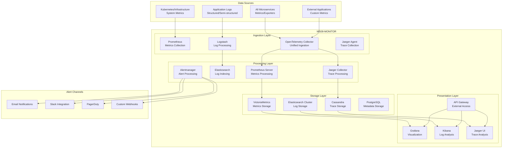

# Specifiche Tecniche - MS08-MONITOR

**Navigazione**: [README.md](README.md) | [← API.md](API.md) | [DATABASE-SCHEMA.md](DATABASE-SCHEMA.md) | [TROUBLESHOOTING.md](TROUBLESHOOTING.md) | [Back to MS →](../MS-ARCHITECTURE-MASTER.md#ms08--monitor)

## 1. Architettura del Sistema

### 1.1 Diagramma Architetturale



### 1.2 Componenti Principali

#### 1.2.1 OpenTelemetry Collector (Ingestion)
- **Versione**: OpenTelemetry Collector v0.80+
- **Protocolli**: OTLP, Prometheus, Jaeger, Zipkin
- **Features**: Data transformation, filtering, routing
- **Scalabilità**: Horizontal scaling con Kubernetes HPA

#### 1.2.2 Prometheus Server (Metrics)
- **Versione**: Prometheus v2.45+
- **Storage**: VictoriaMetrics per long-term storage
- **Features**: Service discovery, alerting, recording rules
- **Integration**: Federation per multi-region setup

#### 1.2.3 Elasticsearch Cluster (Logs)
- **Versione**: Elasticsearch 8.11+ con security enabled
- **Configurazione**: Hot-warm-cold architecture
- **Features**: Full-text search, aggregations, anomaly detection
- **Security**: TLS encryption, RBAC, audit logging

#### 1.2.4 Jaeger (Tracing)
- **Versione**: Jaeger v1.47+
- **Storage**: Cassandra per high-throughput
- **Features**: Distributed tracing, service dependencies
- **UI**: Web UI per trace analysis e debugging

#### 1.2.5 Grafana (Visualization)
- **Versione**: Grafana v10.1+
- **Plugins**: Custom plugins per ZenIA metrics
- **Features**: Dashboard templating, alerting, user management
- **Integration**: SSO, multi-tenant support

## 2. Specifiche Funzionali

### 2.1 Funzionalità Core

#### 2.1.1 Metrics Collection
```yaml
# Esempio configurazione Prometheus per MS collection
global:
  scrape_interval: 15s
  evaluation_interval: 15s

scrape_configs:
  - job_name: 'zenia-microservices'
    kubernetes_sd_configs:
      - role: pod
    relabel_configs:
      - source_labels: [__meta_kubernetes_pod_label_app]
        regex: 'ms\d+-.+'
        action: keep
      - source_labels: [__meta_kubernetes_pod_name]
        target_label: pod_name
      - source_labels: [__meta_kubernetes_namespace]
        target_label: namespace
    metrics_path: '/metrics'
    scrape_interval: 30s
```

#### 2.1.2 Log Aggregation
```json
{
  "log_entry": {
    "@timestamp": "2024-01-15T10:00:00Z",
    "service": "ms01-classifier",
    "level": "INFO",
    "message": "Document classification completed",
    "correlation_id": "corr-123456",
    "tenant_id": "tenant-pa-roma",
    "document_id": "doc-789",
    "processing_time_ms": 150,
    "confidence_score": 0.95,
    "metadata": {
      "pod_name": "ms01-classifier-7f8d9c",
      "node_name": "k8s-worker-01",
      "version": "1.2.3"
    }
  }
}
```

#### 2.1.3 Distributed Tracing
```json
{
  "trace": {
    "trace_id": "7c2f8e8d9f1a4b2c",
    "span_id": "3d7e9b2f8a1c",
    "parent_span_id": "1a4b2c7c2f8e",
    "name": "classify_document",
    "service": "ms01-classifier",
    "start_time": "2024-01-15T10:00:00Z",
    "duration_ms": 150,
    "tags": {
      "tenant_id": "tenant-pa-roma",
      "document_type": "fascicolo_ambientale",
      "operation": "classification"
    },
    "logs": [
      {
        "timestamp": "2024-01-15T10:00:00.050Z",
        "fields": {
          "event": "model_loaded",
          "model_version": "v2.1"
        }
      }
    ]
  }
}
```

### 2.2 Protocolli di Integrazione

#### 2.2.1 Prometheus Metrics Exposition
```python
from prometheus_client import Counter, Histogram, Gauge

# Counters per eventi cumulativi
DOCUMENTS_PROCESSED = Counter(
    'zenia_documents_processed_total',
    'Total documents processed',
    ['service', 'tenant_id', 'document_type']
)

# Histograms per distribuzioni
PROCESSING_LATENCY = Histogram(
    'zenia_processing_latency_seconds',
    'Document processing latency',
    ['service', 'operation'],
    buckets=[0.1, 0.5, 1.0, 2.5, 5.0, 10.0]
)

# Gauges per stati correnti
ACTIVE_WORKERS = Gauge(
    'zenia_active_workers',
    'Number of active workers',
    ['service', 'worker_type']
)
```

#### 2.2.2 OpenTelemetry Integration
```python
from opentelemetry import trace
from opentelemetry.sdk.trace import TracerProvider
from opentelemetry.sdk.trace.export import BatchSpanProcessor
from opentelemetry.exporter.jaeger.thrift import JaegerExporter

# Configurazione tracing
trace.set_tracer_provider(TracerProvider())
tracer = trace.get_tracer(__name__)

jaeger_exporter = JaegerExporter(
    agent_host_name="jaeger-agent.zenia.svc.cluster.local",
    agent_port=6831,
)

span_processor = BatchSpanProcessor(jaeger_exporter)
trace.get_tracer_provider().add_span_processor(span_processor)

# Utilizzo nel codice
with tracer.start_as_span("process_document") as span:
    span.set_attribute("document.id", document_id)
    span.set_attribute("tenant.id", tenant_id)
    # ... processing logic ...
    span.set_status(Status(StatusCode.OK))
```

#### 2.2.3 Structured Logging
```python
import structlog

# Configurazione structured logging
structlog.configure(
    processors=[
        structlog.stdlib.filter_by_level,
        structlog.stdlib.add_logger_name,
        structlog.stdlib.add_log_level,
        structlog.stdlib.PositionalArgumentsFormatter(),
        structlog.processors.TimeStamper(fmt="iso"),
        structlog.processors.StackInfoRenderer(),
        structlog.processors.format_exc_info,
        structlog.processors.UnicodeDecoder(),
        structlog.processors.JSONRenderer()
    ],
    context_class=dict,
    logger_factory=structlog.stdlib.LoggerFactory(),
    wrapper_class=structlog.stdlib.BoundLogger,
    cache_logger_on_first_use=True,
)

logger = structlog.get_logger()

# Utilizzo
logger.info(
    "Document processed successfully",
    document_id=document_id,
    tenant_id=tenant_id,
    processing_time_ms=processing_time,
    confidence_score=confidence_score
)
```

## 3. Specifiche Tecniche Dettagliate

### 3.1 Performance Requirements

| Componente | Throughput | Latency P95 | Availability |
|------------|------------|-------------|--------------|
| Metrics Collection | 100k metrics/sec | 100ms | 99.99% |
| Log Ingestion | 50k logs/sec | 200ms | 99.95% |
| Trace Collection | 10k traces/sec | 150ms | 99.95% |
| Query Performance | 100 queries/sec | 500ms | 99.9% |
| Dashboard Load | 1000 users concurrent | 2s | 99.9% |

### 3.2 Scalability Requirements

#### 3.2.1 Horizontal Scaling
- **Prometheus**: Federation per multi-region
- **Elasticsearch**: Cluster con auto-scaling
- **Jaeger**: Multiple collectors con load balancing
- **Grafana**: Read replicas per high availability

#### 3.2.2 Storage Scaling
- **Metrics**: 1TB/day ingestion, 10+ years retention
- **Logs**: 500GB/day ingestion, 1 year hot, 7 years cold
- **Traces**: 100GB/day ingestion, 30 days retention
- **Metadata**: 100GB total, high availability

### 3.3 Reliability Requirements

#### 3.3.1 Data Durability
- **Metrics**: Replication factor 3, cross-region backup
- **Logs**: Replication factor 3, snapshot backups
- **Traces**: Replication factor 3, time-based partitioning
- **Configuration**: Git versioning, automated backup

#### 3.3.2 Fault Tolerance
- **Single Point of Failure**: Zero SPOF design
- **Graceful Degradation**: Continued operation with partial failure
- **Automatic Recovery**: Self-healing capabilities
- **Circuit Breakers**: Protection from cascade failures

### 3.4 Security Requirements

#### 3.4.1 Network Security
- **Service Mesh**: Istio con mutual TLS
- **Network Policies**: Kubernetes network isolation
- **API Security**: JWT authentication, rate limiting
- **Encryption**: TLS 1.3 obbligatorio

#### 3.4.2 Data Security
- **Encryption at Rest**: AES-256 per tutti i dati
- **Access Control**: RBAC con principle of least privilege
- **Audit Logging**: Complete audit trail per compliance
- **Data Masking**: Automatic masking dati sensibili

## 4. Interfacce e Protocolli

### 4.1 API Endpoints

#### 4.1.1 Metrics Query API
```http
GET /api/v1/metrics/query?query=up&time=2024-01-15T10:00:00Z
Authorization: Bearer {jwt_token}
```

**Response**:
```json
{
  "status": "success",
  "data": {
    "resultType": "vector",
    "result": [
      {
        "metric": {
          "__name__": "up",
          "job": "zenia-microservices",
          "service": "ms01-classifier"
        },
        "value": [1642159200, "1"]
      }
    ]
  }
}
```

#### 4.1.2 Log Search API
```http
POST /api/v1/logs/search
Content-Type: application/json
Authorization: Bearer {jwt_token}
```

**Request Body**:
```json
{
  "query": {
    "bool": {
      "must": [
        {"match": {"service": "ms01-classifier"}},
        {"range": {"@timestamp": {"gte": "2024-01-15T00:00:00Z"}}}
      ]
    }
  },
  "size": 100,
  "sort": [{"@timestamp": {"order": "desc"}}]
}
```

#### 4.1.3 Alert Management API
```http
GET /api/v1/alerts?status=active&severity=critical
Authorization: Bearer {jwt_token}
```

**Response**:
```json
{
  "alerts": [
    {
      "id": "alert-123",
      "name": "High Error Rate",
      "severity": "critical",
      "status": "firing",
      "description": "Error rate > 5% for 5 minutes",
      "labels": {
        "service": "ms01-classifier",
        "tenant": "tenant-pa-roma"
      },
      "annotations": {
        "summary": "High error rate detected",
        "runbook_url": "https://zenia.runbooks/high-error-rate"
      },
      "startsAt": "2024-01-15T10:00:00Z",
      "endsAt": null
    }
  ]
}
```

### 4.2 Message Formats

#### 4.2.1 Metrics Data Format
```json
{
  "metrics": [
    {
      "name": "zenia_documents_processed_total",
      "help": "Total documents processed",
      "type": "counter",
      "labels": {
        "service": "ms01-classifier",
        "tenant_id": "tenant-pa-roma",
        "document_type": "fascicolo_ambientale"
      },
      "value": 1250,
      "timestamp": 1642159200
    }
  ]
}
```

#### 4.2.2 Alert Notification Format
```json
{
  "version": "4",
  "groupKey": "alertname=HighErrorRate",
  "status": "firing",
  "receiver": "team-devops",
  "groupLabels": {
    "alertname": "HighErrorRate"
  },
  "commonLabels": {
    "service": "ms01-classifier",
    "severity": "critical"
  },
  "commonAnnotations": {
    "summary": "High error rate detected",
    "description": "Error rate is 7.5% which is above threshold of 5%"
  },
  "externalURL": "https://alertmanager.zenia.local/#/alerts",
  "alerts": [
    {
      "status": "firing",
      "labels": {
        "alertname": "HighErrorRate",
        "service": "ms01-classifier",
        "severity": "critical"
      },
      "annotations": {
        "summary": "High error rate detected",
        "description": "Error rate is 7.5% which is above threshold of 5%",
        "runbook_url": "https://zenia.runbooks/high-error-rate"
      },
      "startsAt": "2024-01-15T10:00:00Z",
      "endsAt": "0001-01-01T00:00:00Z",
      "generatorURL": "https://prometheus.zenia.local/graph?..."
    }
  ]
}
```

## 5. Database Schema

### 5.1 Tabelle Principali

#### 5.1.1 monitoring_metadata
```sql
CREATE TABLE monitoring_metadata (
    id UUID PRIMARY KEY DEFAULT gen_random_uuid(),
    service_name VARCHAR(100) NOT NULL,
    metric_name VARCHAR(200) NOT NULL,
    metric_type VARCHAR(50) NOT NULL,
    description TEXT,
    unit VARCHAR(50),
    labels JSONB DEFAULT '{}',
    created_at TIMESTAMP WITH TIME ZONE DEFAULT NOW(),
    updated_at TIMESTAMP WITH TIME ZONE DEFAULT NOW(),

    UNIQUE(service_name, metric_name)
);

-- Indici
CREATE INDEX idx_monitoring_metadata_service ON monitoring_metadata(service_name);
CREATE INDEX idx_monitoring_metadata_type ON monitoring_metadata(metric_type);
```

#### 5.1.2 alert_rules
```sql
CREATE TABLE alert_rules (
    id UUID PRIMARY KEY DEFAULT gen_random_uuid(),
    name VARCHAR(200) UNIQUE NOT NULL,
    description TEXT,
    query TEXT NOT NULL,
    duration VARCHAR(50) NOT NULL DEFAULT '5m',
    severity VARCHAR(20) NOT NULL DEFAULT 'warning',
    labels JSONB DEFAULT '{}',
    annotations JSONB DEFAULT '{}',
    enabled BOOLEAN NOT NULL DEFAULT true,
    created_at TIMESTAMP WITH TIME ZONE DEFAULT NOW(),
    updated_at TIMESTAMP WITH TIME ZONE DEFAULT NOW(),

    CHECK (severity IN ('info', 'warning', 'error', 'critical'))
);

-- Indici
CREATE INDEX idx_alert_rules_severity ON alert_rules(severity);
CREATE INDEX idx_alert_rules_enabled ON alert_rules(enabled);
```

#### 5.1.3 alert_history
```sql
CREATE TABLE alert_history (
    id UUID PRIMARY KEY DEFAULT gen_random_uuid(),
    alert_rule_id UUID REFERENCES alert_rules(id),
    fingerprint VARCHAR(100) NOT NULL,
    status VARCHAR(20) NOT NULL,
    starts_at TIMESTAMP WITH TIME ZONE NOT NULL,
    ends_at TIMESTAMP WITH TIME ZONE,
    labels JSONB DEFAULT '{}',
    annotations JSONB DEFAULT '{}',
    created_at TIMESTAMP WITH TIME ZONE DEFAULT NOW(),

    CHECK (status IN ('firing', 'resolved'))
);

-- Indici
CREATE INDEX idx_alert_history_status ON alert_history(status);
CREATE INDEX idx_alert_history_starts_at ON alert_history(starts_at DESC);
CREATE INDEX idx_alert_history_fingerprint ON alert_history(fingerprint);
```

## 6. Configurazione e Deployment

### 6.1 Environment Variables
```bash
# Prometheus Configuration
PROMETHEUS_RETENTION_TIME=30d
PROMETHEUS_STORAGE_PATH=/prometheus
PROMETHEUS_WEB_LISTEN_ADDRESS=:9090

# Elasticsearch Configuration
ES_CLUSTER_NAME=zenia-monitoring
ES_NODE_NAME=monitoring-node-1
ES_PATH_DATA=/usr/share/elasticsearch/data
ES_PATH_LOGS=/usr/share/elasticsearch/logs

# Jaeger Configuration
JAEGER_SERVICE_NAME=ms08-monitor
JAEGER_AGENT_HOST=jaeger-agent
JAEGER_AGENT_PORT=6831
JAEGER_SAMPLER_TYPE=probabilistic
JAEGER_SAMPLER_PARAM=0.1

# Grafana Configuration
GF_SECURITY_ADMIN_PASSWORD=${GRAFANA_ADMIN_PASSWORD}
GF_USERS_ALLOW_SIGN_UP=false
GF_INSTALL_PLUGINS=grafana-piechart-panel,grafana-worldmap-panel

# General Configuration
LOG_LEVEL=INFO
METRICS_PORT=9090
EXTERNAL_URL=https://monitor.zenia.local
```

### 6.2 Kubernetes Deployment
```yaml
apiVersion: apps/v1
kind: Deployment
metadata:
  name: ms08-monitor
  namespace: zenia
spec:
  replicas: 2
  template:
    spec:
      containers:
      - name: prometheus
        image: prom/prometheus:latest
        ports:
        - containerPort: 9090
        volumeMounts:
        - name: prometheus-config
          mountPath: /etc/prometheus
        - name: prometheus-data
          mountPath: /prometheus
      - name: grafana
        image: grafana/grafana:latest
        ports:
        - containerPort: 3000
        env:
        - name: GF_SECURITY_ADMIN_PASSWORD
          valueFrom:
            secretKeyRef:
              name: grafana-secrets
              key: admin-password
        volumeMounts:
        - name: grafana-data
          mountPath: /var/lib/grafana
      volumes:
      - name: prometheus-config
        configMap:
          name: prometheus-config
      - name: prometheus-data
        persistentVolumeClaim:
          claimName: prometheus-pvc
      - name: grafana-data
        persistentVolumeClaim:
          claimName: grafana-pvc
```

## 7. Monitoring e Observability

### 7.1 Self-Monitoring Metrics
```prometheus
# Monitor monitoring system itself
prometheus_tsdb_head_series
prometheus_tsdb_head_chunks
prometheus_evaluations_total
prometheus_evaluations_missed_total

# Elasticsearch metrics
elasticsearch_cluster_health_status
elasticsearch_indices_store_size_bytes
elasticsearch_indices_search_query_total

# Jaeger metrics
jaeger_tracer_reporter_spans_total
jaeger_tracer_sampler_sampled
```

### 7.2 Alert Rules
```yaml
groups:
  - name: monitoring.alerts
    rules:
      - alert: PrometheusTargetMissing
        expr: up == 0
        for: 5m
        labels:
          severity: critical
        annotations:
          summary: "Prometheus target missing"
          description: "Prometheus target {{ $labels.job }} is down"

      - alert: ElasticsearchClusterRed
        expr: elasticsearch_cluster_health_status{status="red"} == 1
        for: 1m
        labels:
          severity: critical
        annotations:
          summary: "Elasticsearch cluster is red"
          description: "Elasticsearch cluster health is red"
```

### 7.3 Logging
```json
{
  "timestamp": "2024-01-15T10:00:00Z",
  "level": "INFO",
  "service": "ms08-monitor",
  "component": "MetricsCollector",
  "message": "Metrics collected successfully",
  "correlation_id": "corr-123456",
  "metadata": {
    "targets_scraped": 15,
    "metrics_collected": 125000,
    "collection_duration_ms": 4500,
    "errors": 0
  }
}
```

## 8. Test e Quality Assurance

### 8.1 Test Strategy
- **Unit Tests**: Testing componenti individuali
- **Integration Tests**: Test end-to-end monitoring pipeline
- **Load Tests**: Testing sotto high load conditions
- **Chaos Tests**: Failure injection per reliability validation

### 8.2 Quality Gates
- **Coverage**: > 85% code coverage
- **Performance**: P95 latency < 500ms per queries
- **Reliability**: MTTR < 15 minuti per incident
- **Security**: SAST/DAST scans passed

### 8.3 Monitoring Validation
- **Metrics Accuracy**: Validation automatica accuracy metriche
- **Alert Effectiveness**: Regular testing alert rules
- **Dashboard Usability**: User testing per dashboard UX
- **Data Integrity**: Checksums e validation per stored data