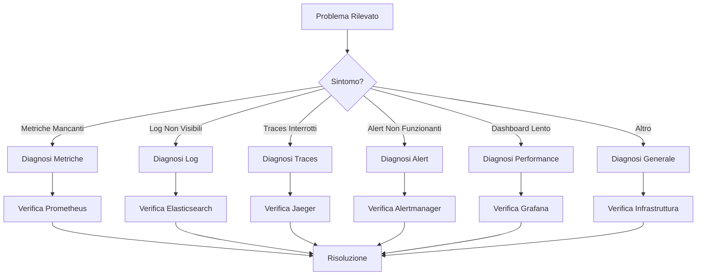

# Troubleshooting Guide - MS08-MONITOR

**Navigazione**: [README.md](README.md) | [SPECIFICATION.md](SPECIFICATION.md) | [API.md](API.md) | [DATABASE-SCHEMA.md](DATABASE-SCHEMA.md) | [Back to MS →](../MS-ARCHITECTURE-MASTER.md#ms08--monitor)

## Panoramica Troubleshooting

Questa guida fornisce procedure diagnostiche e risoluzioni per problemi comuni nel sistema di monitoraggio MS08-MONITOR. Il troubleshooting è organizzato per componente e tipo di problema, con flow chart decisionali per identificare rapidamente la causa radice.

## Flow Chart Diagnostico Generale



## 1. Problemi di Metriche

### 1.1 Metriche Mancanti o Zero

**Sintomi:**
- Metriche non appaiono in Grafana
- Valori metriche sempre zero
- Target down in Prometheus

**Diagnosi:**
```bash
# Verifica stato Prometheus
curl -s http://localhost:9090/api/v1/targets | jq '.data.activeTargets[] | select(.health != "up")'

# Controlla configurazione scrape
curl -s http://localhost:9090/api/v1/targets/metadata?metric=up

# Verifica metriche servizio specifico
curl -s "http://localhost:9090/api/v1/query?query=up{service=\"ms01-classifier\"}"
```

**Risoluzioni:**

#### Target Non Raggiungibile
```yaml
# kubernetes/monitoring-config.yaml
apiVersion: v1
kind: ConfigMap
metadata:
  name: prometheus-config
data:
  prometheus.yml: |
    global:
      scrape_interval: 30s
      scrape_timeout: 10s
    scrape_configs:
      - job_name: 'zenia-microservices'
        kubernetes_sd_configs:
          - role: pod
        relabel_configs:
          - source_labels: [__meta_kubernetes_pod_label_app]
            regex: 'ms.*'
            action: keep
          - source_labels: [__meta_kubernetes_pod_name]
            target_label: service
```

#### Endpoint Metriche Non Esposto
```python
# Aggiungere endpoint /metrics al servizio
from prometheus_client import generate_latest, CONTENT_TYPE_LATEST
from flask import Response

@app.route('/metrics')
def metrics():
    return Response(generate_latest(), mimetype=CONTENT_TYPE_LATEST)
```

#### Firewall/Network Policy
```yaml
# kubernetes/network-policy.yaml
apiVersion: networking.k8s.io/v1
kind: NetworkPolicy
metadata:
  name: allow-prometheus-scraping
spec:
  podSelector:
    matchLabels:
      app: zenia-microservices
  policyTypes:
  - Ingress
  ingress:
  - from:
    - podSelector:
        matchLabels:
          app: prometheus
    ports:
    - protocol: TCP
      port: 8080
```

### 1.2 Metriche Inaccurate

**Sintomi:**
- Valori metriche non realistici
- Picchi improvvisi o cadute
- Metriche duplicate

**Diagnosi:**
```bash
# Verifica duplicati
curl -s "http://localhost:9090/api/v1/query?query=count(up) by (service,instance)"

# Controlla timestamp metriche
curl -s "http://localhost:9090/api/v1/query?query=up" | jq '.data.result[].value'

# Analizza rate metriche
curl -s "http://localhost:9090/api/v1/query_range?query=rate(http_requests_total[5m])&start=2024-01-15T09:00:00Z&end=2024-01-15T10:00:00Z&step=60s"
```

**Risoluzioni:**

#### Metriche Duplicate (Multiple Instance)
```yaml
# Configurazione Prometheus corretta
scrape_configs:
  - job_name: 'zenia-microservices'
    kubernetes_sd_configs:
      - role: pod
    relabel_configs:
      # Rimuovi duplicati mantenendo solo pod attivi
      - source_labels: [__meta_kubernetes_pod_phase]
        regex: 'Running|Succeeded'
        action: keep
      # Evita scraping di pod terminati
      - source_labels: [__meta_kubernetes_pod_name]
        regex: '.*-terminated-.*'
        action: drop
```

#### Clock Skew tra Servizi
```python
# Sincronizzazione timestamp
import time
from prometheus_client import Gauge

last_sync = Gauge('service_clock_last_sync', 'Last clock synchronization timestamp')
sync_interval = Gauge('service_clock_sync_interval_seconds', 'Clock sync interval')

def sync_clock():
    # Implementa sincronizzazione NTP o servizio time
    current_time = time.time()
    last_sync.set(current_time)
    sync_interval.set(300)  # 5 minuti
```

## 2. Problemi di Log

### 2.1 Log Non Indicizzati

**Sintomi:**
- Log non appaiono in Kibana
- Ricerca log restituisce zero risultati
- Errori di connessione Elasticsearch

**Diagnosi:**
```bash
# Verifica connessione Elasticsearch
curl -s http://localhost:9200/_cluster/health | jq '.status'

# Controlla indici esistenti
curl -s http://localhost:9200/_cat/indices?v

# Verifica pipeline log
curl -s http://localhost:9200/_ingest/pipeline/zenia-logs-pipeline

# Test query log
curl -s -X POST "http://localhost:9200/zenia-logs-*/_search" \
  -H 'Content-Type: application/json' \
  -d '{"query":{"match":{"service":"ms01-classifier"}},"size":1}'
```

**Risoluzioni:**

#### Pipeline Log Non Configurata

**elasticsearch/pipeline/zenia-logs.json**
```json
{
  "description": "Pipeline per log ZenIA",
  "processors": [
    {
      "grok": {
        "field": "message",
        "patterns": [
          "%{TIMESTAMP_ISO8601:timestamp} %{LOGLEVEL:level} %{DATA:service} %{GREEDYDATA:message}"
        ]
      }
    },
    {
      "date": {
        "field": "timestamp",
        "target_field": "@timestamp",
        "formats": ["ISO8601"]
      }
    },
    {
      "lowercase": {
        "field": "level"
      }
    },
    {
      "set": {
        "field": "tenant_id",
        "value": "{{{_index}}}",
        "override": false
      }
    }
  ]
}
```

#### Buffer Log Pieno
```yaml
# filebeat/filebeat.yml
filebeat.inputs:
- type: log
  paths:
    - /var/log/zenia/*.log
  processors:
  - add_kubernetes_metadata:
      host: ${NODE_NAME}
      matchers:
      - logs_path:
          logs_path: "/var/log/containers/"

output.elasticsearch:
  hosts: ["elasticsearch:9200"]
  index: "zenia-logs-%{+yyyy.MM.dd}"
  pipeline: "zenia-logs-pipeline"

# Aumenta buffer per alta velocità
queue:
  mem:
    events: 4096
    flush.min_events: 512
    flush.timeout: 5s
```

### 2.2 Log Corrotti o Malformati

**Sintomi:**
- Errori di parsing in Elasticsearch
- Campi mancanti nei log
- Log truncati

**Diagnosi:**
```bash
# Verifica errori parsing
curl -s "http://localhost:9200/zenia-logs-*/_search" \
  -H 'Content-Type: application/json' \
  -d '{"query":{"exists":{"field":"_index.parse_failure"}},"size":10}'

# Controlla mapping campi
curl -s http://localhost:9200/zenia-logs-*/_mapping | jq '.'

# Analizza log di esempio
curl -s "http://localhost:9200/zenia-logs-*/_search" \
  -H 'Content-Type: application/json' \
  -d '{"query":{"match_all":{}},"size":5}' | jq '.hits.hits[]._source'
```

**Risoluzioni:**

#### Structured Logging Implementazione
```python
# logging strutturato
import logging
import json
from pythonjsonlogger import jsonlogger

class CustomJsonFormatter(jsonlogger.JsonFormatter):
    def add_fields(self, log_record, record, message_dict):
        super().add_fields(log_record, record, message_dict)
        log_record['service'] = 'ms01-classifier'
        log_record['version'] = '1.2.3'
        log_record['correlation_id'] = getattr(record, 'correlation_id', None)
        log_record['tenant_id'] = getattr(record, 'tenant_id', 'default')

# Configurazione logger
logger = logging.getLogger()
handler = logging.StreamHandler()
formatter = CustomJsonFormatter('%(asctime)s %(name)s %(levelname)s %(message)s')
handler.setFormatter(formatter)
logger.addHandler(handler)
logger.setLevel(logging.INFO)
```

## 3. Problemi di Tracing

### 3.1 Traces Interrotti

**Sintomi:**
- Traces incomplete
- Span mancanti nella catena
- Errori di propagazione context

**Diagnosi:**
```bash
# Verifica servizio Jaeger
curl -s http://localhost:16686/api/services

# Query trace specifica
curl -s "http://localhost:16686/api/traces?service=ms01-classifier&limit=1"

# Verifica configurazione tracing
curl -s http://localhost:9090/api/v1/query?query=jaeger_tracer_reporter_spans_total
```

**Risoluzioni:**

#### Context Propagation Mancante
```java
// Java - OpenTelemetry context propagation
import io.opentelemetry.api.trace.Span;
import io.opentelemetry.context.Context;
import io.opentelemetry.context.propagation.TextMapPropagator;

@RestController
public class DocumentController {

    @Autowired
    private TextMapPropagator propagator;

    @PostMapping("/classify")
    public ResponseEntity<DocumentClassification> classifyDocument(
            @RequestBody DocumentRequest request,
            @RequestHeader Map<String, String> headers) {

        // Extract context from headers
        Context extractedContext = propagator.extract(Context.current(), headers,
            (carrier, key) -> carrier.get(key));

        // Create child span
        Span span = tracer.spanBuilder("classify_document")
                .setParent(extractedContext)
                .startSpan();

        try (Scope scope = span.makeCurrent()) {
            // Business logic
            return processDocument(request);
        } finally {
            span.end();
        }
    }
}
```

#### Sampling Rate Troppo Bassa
```yaml
# jaeger-config.yaml
apiVersion: v1
kind: ConfigMap
metadata:
  name: jaeger-config
data:
  jaeger-config.yml: |
    service:
      extensions:
        - jaeger_storage
        - jaeger_query
      pipelines:
        traces:
          receivers: [otlp]
          processors: [batch]
          exporters: [jaeger_elasticsearch]
    extensions:
      jaeger_query:
        ui:
          config: /etc/jaeger/ui-config.json
    processors:
      batch:
        timeout: 1s
        send_batch_size: 1024
    exporters:
      jaeger_elasticsearch:
        server_urls: ["http://elasticsearch:9200"]
        index_prefix: "jaeger"
    receivers:
      otlp:
        protocols:
          grpc:
            endpoint: 0.0.0.0:4317
          http:
            endpoint: 0.0.0.0:4318
```

### 3.2 Alta Latenza Tracing

**Sintomi:**
- Traces con alta latenza
- Timeout nelle chiamate tracciate
- Performance degradata

**Diagnosi:**
```bash
# Misura latenza tracing
curl -s "http://localhost:16686/api/traces?service=ms01-classifier&limit=10" \
  | jq '.data[].spans[].duration'

# Verifica configurazione sampling
curl -s http://localhost:9090/api/v1/query?query=jaeger_tracer_sampler_sampled
```

**Risoluzioni:**

#### Ottimizzazione Sampling
```yaml
# Configurazione sampling adattivo
extensions:
  jaeger_query:
    ui:
      config: |
        {
          "sampling": {
            "default_strategy": {
              "type": "probabilistic",
              "param": 0.1
            },
            "service_strategies": [
              {
                "service": "ms01-classifier",
                "type": "probabilistic",
                "param": 0.5
              }
            ]
          }
        }
```

## 4. Problemi di Alert

### 4.1 Alert Non Innescati

**Sintomi:**
- Condizioni alert vere ma no notifica
- Alert mancanti in Alertmanager
- Regole alert non valutate

**Diagnosi:**
```bash
# Verifica regole alert caricate
curl -s http://localhost:9090/api/v1/rules

# Controlla alert attivi
curl -s http://localhost:9093/api/v2/alerts

# Verifica configurazione alertmanager
curl -s http://localhost:9093/api/v2/status
```

**Risoluzioni:**

#### Regola Alert Mal Configurata
```yaml
# alert-rules.yml corretto
groups:
  - name: zenia.alerts
    rules:
      - alert: HighErrorRate
        expr: rate(zenia_errors_total[5m]) / rate(zenia_requests_total[5m]) > 0.05
        for: 5m
        labels:
          severity: critical
          service: "{{ $labels.service }}"
        annotations:
          summary: "High error rate detected"
          description: "Error rate is {{ $value }} which is above threshold of 5%"
          runbook_url: "https://zenia.runbooks/high-error-rate"
```

#### Integrazione Alertmanager Mancante
```yaml
# prometheus-config.yml con alertmanager
global:
  smtp_smarthost: 'smtp.gmail.com:587'
  smtp_from: 'alerts@zenia.local'

alerting:
  alertmanagers:
    - static_configs:
        - targets:
          - alertmanager:9093

rule_files:
  - "alert-rules.yml"
```

### 4.2 False Positive Alert

**Sintomi:**
- Alert innescati senza problemi reali
- Notifiche frequenti per condizioni normali
- Affaticamento operatori

**Diagnosi:**
```bash
# Analizza storico alert
curl -s "http://localhost:9090/api/v1/query_range?query=rate(zenia_errors_total[5m])&start=2024-01-15T00:00:00Z&end=2024-01-15T23:59:59Z&step=300"

# Verifica soglie alert
curl -s http://localhost:9090/api/v1/rules | jq '.data.groups[].rules[] | select(.name == "HighErrorRate")'
```

**Risoluzioni:**

#### Tuning Soglie Alert
```yaml
# Alert con condizioni più robuste
groups:
  - name: zenia.alerts
    rules:
      - alert: HighErrorRate
        expr: |
          rate(zenia_errors_total[10m]) / rate(zenia_requests_total[10m]) > 0.05
          AND
          rate(zenia_errors_total[10m]) > 5
        for: 10m
        labels:
          severity: warning
        annotations:
          summary: "High error rate detected"
          description: "Error rate is {{ $value }} with >5 errors/min for 10 minutes"
```

## 5. Problemi di Performance

### 5.1 Dashboard Lento

**Sintomi:**
- Caricamento dashboard > 10 secondi
- Query timeout in Grafana
- CPU alta su Grafana/Prometheus

**Diagnosi:**
```bash
# Verifica performance query
curl -s "http://localhost:9090/api/v1/query_range?query=up&start=2024-01-15T00:00:00Z&end=2024-01-15T01:00:00Z&step=60s" \
  -w "@curl-format.txt"

# Controlla metriche Prometheus
curl -s http://localhost:9090/metrics | grep -E "(prometheus_evaluator|prometheus_engine)"

# Analizza query lente Grafana
tail -f /var/log/grafana/grafana.log | grep -i "slow query"
```

**Risoluzioni:**

#### Ottimizzazione Query Grafana
```sql
-- Query ottimizzata per dashboard
SELECT
  time_bucket('5 minutes', timestamp) AS bucket,
  service,
  avg(value) as avg_value,
  max(value) as max_value,
  min(value) as min_value
FROM metrics
WHERE
  metric_name = 'http_request_duration_seconds'
  AND timestamp >= now() - interval '1 hour'
  AND service IN ('ms01-classifier', 'ms02-analyzer')
GROUP BY bucket, service
ORDER BY bucket;
```

#### Caching Dashboard
```yaml
# grafana-config.ini
[cache]
enabled = true
ttl = 3600

[metrics]
enabled = true
interval_seconds = 10
timeout_seconds = 30
```

### 5.2 Alta Utilizzo Risorse

**Sintomi:**
- CPU/Memoria alta sui container monitoring
- OOM kills frequenti
- Storage pieno rapidamente

**Diagnosi:**
```bash
# Monitora risorse container
kubectl top pods -n monitoring

# Verifica configurazione risorse
kubectl describe pod prometheus-0 -n monitoring

# Controlla retention dati
curl -s http://localhost:9200/_cat/indices?v | grep zenia-logs
```

**Risoluzioni:**

#### Resource Limits Appropriati
```yaml
# kubernetes/prometheus-deployment.yaml
apiVersion: apps/v1
kind: Deployment
metadata:
  name: prometheus
spec:
  template:
    spec:
      containers:
      - name: prometheus
        resources:
          requests:
            memory: "2Gi"
            cpu: "1000m"
          limits:
            memory: "4Gi"
            cpu: "2000m"
        env:
        - name: PROMETHEUS_STORAGE_TSDB_RETENTION_TIME
          value: "30d"
        - name: PROMETHEUS_STORAGE_TSDB_RETENTION_SIZE
          value: "50GB"
```

## 6. Problemi di Infrastruttura

### 6.1 Connettività Network

**Sintomi:**
- Servizi non raggiungibili
- Timeout nelle chiamate
- Errori di risoluzione DNS

**Diagnosi:**
```bash
# Test connettività
kubectl exec -it prometheus-0 -n monitoring -- curl -v http://elasticsearch:9200

# Verifica DNS
kubectl run dns-test --image=busybox --rm -it -- nslookup elasticsearch.monitoring.svc.cluster.local

# Controlla network policies
kubectl get networkpolicies -n monitoring
```

**Risoluzioni:**

#### Network Policy Permissiva
```yaml
# kubernetes/network-policy-monitoring.yaml
apiVersion: networking.k8s.io/v1
kind: NetworkPolicy
metadata:
  name: monitoring-network-policy
  namespace: monitoring
spec:
  podSelector: {}
  policyTypes:
  - Ingress
  - Egress
  ingress:
  - from:
    - namespaceSelector:
        matchLabels:
          name: zenia
    ports:
    - protocol: TCP
      port: 9090  # Prometheus
    - protocol: TCP
      port: 9200  # Elasticsearch
    - protocol: TCP
      port: 16686 # Jaeger
  egress:
  - to: []
    ports:
    - protocol: TCP
      port: 53    # DNS
    - protocol: TCP
      port: 443   # HTTPS external
```

### 6.2 Persistence Storage

**Sintomi:**
- Dati persi dopo restart
- Storage pieno
- Performance I/O degradata

**Diagnosi:**
```bash
# Verifica PVC
kubectl get pvc -n monitoring

# Controlla utilizzo storage
kubectl exec -it prometheus-0 -n monitoring -- df -h

# Test scrittura storage
kubectl exec -it elasticsearch-0 -n monitoring -- dd if=/dev/zero of=/usr/share/elasticsearch/data/test bs=1M count=100
```

**Risoluzioni:**

#### Storage Class Ottimizzato
```yaml
# kubernetes/storage-class-monitoring.yaml
apiVersion: storage.k8s.io/v1
kind: StorageClass
metadata:
  name: monitoring-storage
provisioner: kubernetes.io/aws-ebs
parameters:
  type: gp3
  iops: "3000"
  throughput: "250"
reclaimPolicy: Retain
allowVolumeExpansion: true
```

## 7. Monitoraggio della Salute del Sistema

### 7.1 Health Checks Automatici

```bash
#!/bin/bash
# health-check.sh

# Verifica componenti core
components=("prometheus" "elasticsearch" "jaeger" "grafana")
for component in "${components[@]}"; do
    if ! curl -f -s "http://$component:9090/health" > /dev/null; then
        echo "ERROR: $component is unhealthy"
        exit 1
    fi
done

# Verifica metriche chiave
error_rate=$(curl -s "http://prometheus:9090/api/v1/query?query=rate(zenia_errors_total[5m])" | jq -r '.data.result[0].value[1]')
if (( $(echo "$error_rate > 0.1" | bc -l) )); then
    echo "WARNING: High error rate detected: $error_rate"
fi

echo "All health checks passed"
```

### 7.2 Metriche di Monitoraggio del Monitoraggio

```yaml
# prometheus-self-monitoring.yml
scrape_configs:
  - job_name: 'prometheus'
    static_configs:
      - targets: ['localhost:9090']
    metric_relabel_configs:
      - regex: 'prometheus_.*'
        action: keep

  - job_name: 'grafana'
    static_configs:
      - targets: ['grafana:3000']
    metrics_path: '/metrics'
```

## 8. Runbook e Procedure di Emergenza

### 8.1 Disaster Recovery

#### Backup Critico
```bash
#!/bin/bash
# backup-monitoring.sh

# Backup configurazioni
kubectl get configmaps -n monitoring -o yaml > monitoring-configs-$(date +%Y%m%d).yaml

# Backup dati Prometheus (se non usando remote write)
kubectl exec prometheus-0 -n monitoring -- tar czf /tmp/prometheus-data.tar.gz /prometheus

# Backup Elasticsearch indices
curl -X PUT "elasticsearch:9200/_snapshot/zenia-backup-$(date +%Y%m%d)" \
  -H 'Content-Type: application/json' \
  -d '{"indices": "zenia-*", "ignore_unavailable": true}'
```

#### Restore Procedure
```bash
#!/bin/bash
# restore-monitoring.sh

# Restore configurazioni
kubectl apply -f monitoring-configs-$(date +%Y%m%d).yaml

# Restore Elasticsearch
curl -X POST "elasticsearch:9200/_snapshot/zenia-backup-$(date +%Y%m%d)/_restore" \
  -H 'Content-Type: application/json' \
  -d '{"indices": "zenia-*"}'

# Verifica integrità
curl -s http://prometheus:9090/api/v1/query?query=up | jq '.status'
```

### 8.2 Escalation Matrix

| Severity | Response Time | Escalation | Actions |
|----------|---------------|------------|---------|
| Critical | 5 minutes | SRE Team Lead | Full incident response, stakeholder notification |
| High | 15 minutes | SRE Team | Investigation, mitigation planning |
| Medium | 1 hour | On-call Engineer | Monitoring, basic troubleshooting |
| Low | 4 hours | Development Team | Ticket creation, scheduled fix |
| Info | Next business day | Development Team | Log analysis, improvement planning |

### 8.3 Contatti di Emergenza

- **SRE Team Lead**: +39 333 123 4567
- **DevOps Engineer**: +39 333 234 5678
- **Database Administrator**: +39 333 345 6789
- **Infrastructure Team**: +39 333 456 7890
- **Security Team**: +39 333 567 8901

## 9. Best Practices Troubleshooting

### 9.1 Approccio Sistematico
1. **Raccolta Sintomi**: Documenta esattamente cosa sta succedendo
2. **Isolamento Componente**: Identifica quale componente è interessato
3. **Verifica Configurazione**: Confronta con configurazioni note funzionanti
4. **Test Incrementali**: Applica cambiamenti uno alla volta
5. **Monitora Impatto**: Osserva effetti di ogni modifica
6. **Rollback Plan**: Prepara piano di rollback prima di cambiamenti critici

### 9.2 Strumenti di Debug
```bash
# Debug toolkit
alias kdebug='kubectl run debug --image=busybox --rm -it --restart=Never -- sh'
alias plogs='kubectl logs -f -n monitoring --tail=100'
alias kexec='kubectl exec -it -n monitoring'
alias pquery='curl -s "http://prometheus:9090/api/v1/query?query="'

# Debug Prometheus query
pquery 'up{job="zenia-microservices"}'

# Debug Elasticsearch query
curl -s -X POST "elasticsearch:9200/zenia-logs-*/_search" \
  -H 'Content-Type: application/json' \
  -d '{"query":{"match":{"level":"ERROR"}},"size":10}'
```

### 9.3 Prevenzione Problemi
- **Monitoring del Monitoring**: Metriche su componenti monitoring stessi
- **Alert su Alert**: Notifiche quando sistema alert non funziona
- **Test Automatici**: Validazione configurazione dopo deploy
- **Documentation**: Aggiornamento procedure dopo risoluzione problemi
- **Training**: Formazione team su troubleshooting comune