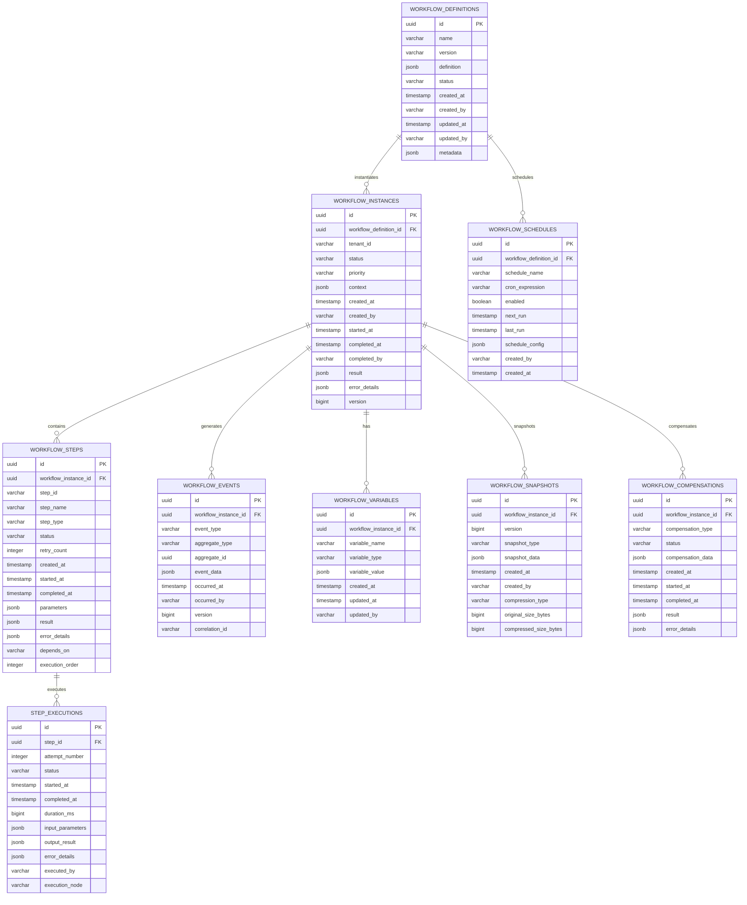

# Schema Database - MS09-MANAGER

**Navigazione**: [README.md](README.md) | [SPECIFICATION.md](SPECIFICATION.md) | [API.md](API.md) | [← DATABASE-SCHEMA.md](DATABASE-SCHEMA.md) | [TROUBLESHOOTING.md](TROUBLESHOOTING.md) | [Back to MS →](../MS-ARCHITECTURE-MASTER.md#ms09--manager)

## 1. Panoramica Database

MS09-MANAGER utilizza PostgreSQL come database primario per la persistenza dei workflow, con Redis per il caching e Elasticsearch per la ricerca avanzata. Lo schema è ottimizzato per alta concorrenza e performance su operazioni di lettura/scrittura intensive.

**Database**: PostgreSQL 15+
**Charset**: UTF-8
**Collation**: Italian locale
**Extensions**: uuid-ossp, pg_stat_statements, timescaledb

## 2. Schema Principale

### 2.1 Diagramma ER



## 3. Tabelle Principali

### 3.1 workflow_definitions

Tabella per la definizione dei workflow.

```sql
CREATE TABLE workflow_definitions (
    id UUID PRIMARY KEY DEFAULT gen_random_uuid(),
    name VARCHAR(255) NOT NULL,
    version VARCHAR(50) NOT NULL,
    definition JSONB NOT NULL,
    status VARCHAR(50) NOT NULL DEFAULT 'draft'
        CHECK (status IN ('draft', 'active', 'deprecated', 'archived')),
    created_at TIMESTAMP WITH TIME ZONE NOT NULL DEFAULT CURRENT_TIMESTAMP,
    created_by VARCHAR(255),
    updated_at TIMESTAMP WITH TIME ZONE NOT NULL DEFAULT CURRENT_TIMESTAMP,
    updated_by VARCHAR(255),
    metadata JSONB DEFAULT '{}',
    UNIQUE(name, version)
);

-- Indici ottimizzati
CREATE INDEX idx_workflow_definitions_status ON workflow_definitions (status);
CREATE INDEX idx_workflow_definitions_name ON workflow_definitions (name);
CREATE INDEX idx_workflow_definitions_metadata ON workflow_definitions USING GIN (metadata);
CREATE INDEX idx_workflow_definitions_definition ON workflow_definitions USING GIN (definition);
```

### 3.2 workflow_instances

Tabella per le istanze di workflow in esecuzione.

```sql
CREATE TABLE workflow_instances (
    id UUID PRIMARY KEY DEFAULT gen_random_uuid(),
    workflow_definition_id UUID NOT NULL REFERENCES workflow_definitions(id),
    tenant_id VARCHAR(255) NOT NULL,
    status VARCHAR(50) NOT NULL DEFAULT 'pending'
        CHECK (status IN ('pending', 'running', 'completed', 'failed', 'cancelled', 'compensating')),
    priority VARCHAR(20) NOT NULL DEFAULT 'normal'
        CHECK (priority IN ('low', 'normal', 'high', 'critical')),
    context JSONB DEFAULT '{}',
    created_at TIMESTAMP WITH TIME ZONE NOT NULL DEFAULT CURRENT_TIMESTAMP,
    created_by VARCHAR(255),
    started_at TIMESTAMP WITH TIME ZONE,
    completed_at TIMESTAMP WITH TIME ZONE,
    completed_by VARCHAR(255),
    result JSONB,
    error_details JSONB,
    version BIGINT NOT NULL DEFAULT 0,
    correlation_id VARCHAR(255),
    estimated_completion TIMESTAMP WITH TIME ZONE,
    progress_percentage DECIMAL(5,2) DEFAULT 0
        CHECK (progress_percentage >= 0 AND progress_percentage <= 100)
);

-- Indici per performance
CREATE INDEX idx_workflow_instances_definition ON workflow_instances (workflow_definition_id);
CREATE INDEX idx_workflow_instances_tenant_status ON workflow_instances (tenant_id, status);
CREATE INDEX idx_workflow_instances_status_created ON workflow_instances (status, created_at DESC);
CREATE INDEX idx_workflow_instances_correlation ON workflow_instances (correlation_id);
CREATE INDEX idx_workflow_instances_priority ON workflow_instances (priority, created_at DESC);
CREATE INDEX idx_workflow_instances_context ON workflow_instances USING GIN (context);
```

### 3.3 workflow_steps

Tabella per i passi dei workflow.

```sql
CREATE TABLE workflow_steps (
    id UUID PRIMARY KEY DEFAULT gen_random_uuid(),
    workflow_instance_id UUID NOT NULL REFERENCES workflow_instances(id) ON DELETE CASCADE,
    step_id VARCHAR(255) NOT NULL,
    step_name VARCHAR(500),
    step_type VARCHAR(100) NOT NULL,
    status VARCHAR(50) NOT NULL DEFAULT 'pending'
        CHECK (status IN ('pending', 'running', 'completed', 'failed', 'skipped', 'compensating')),
    retry_count INTEGER DEFAULT 0,
    max_retries INTEGER DEFAULT 3,
    created_at TIMESTAMP WITH TIME ZONE NOT NULL DEFAULT CURRENT_TIMESTAMP,
    started_at TIMESTAMP WITH TIME ZONE,
    completed_at TIMESTAMP WITH TIME ZONE,
    parameters JSONB DEFAULT '{}',
    result JSONB,
    error_details JSONB,
    depends_on VARCHAR(255),
    execution_order INTEGER,
    timeout_seconds INTEGER,
    retry_backoff_seconds INTEGER DEFAULT 1,
    service_endpoint VARCHAR(500),
    service_action VARCHAR(255),
    UNIQUE(workflow_instance_id, step_id)
);

-- Indici ottimizzati
CREATE INDEX idx_workflow_steps_instance ON workflow_steps (workflow_instance_id);
CREATE INDEX idx_workflow_steps_instance_status ON workflow_steps (workflow_instance_id, status);
CREATE INDEX idx_workflow_steps_status ON workflow_steps (status);
CREATE INDEX idx_workflow_steps_type ON workflow_steps (step_type);
CREATE INDEX idx_workflow_steps_execution_order ON workflow_steps (workflow_instance_id, execution_order);
CREATE INDEX idx_workflow_steps_depends_on ON workflow_steps (workflow_instance_id, depends_on);
```

### 3.4 step_executions

Tabella per il tracking delle esecuzioni dei passi.

```sql
CREATE TABLE step_executions (
    id UUID PRIMARY KEY DEFAULT gen_random_uuid(),
    step_id UUID NOT NULL REFERENCES workflow_steps(id) ON DELETE CASCADE,
    attempt_number INTEGER NOT NULL DEFAULT 1,
    status VARCHAR(50) NOT NULL
        CHECK (status IN ('running', 'completed', 'failed', 'timeout', 'cancelled')),
    started_at TIMESTAMP WITH TIME ZONE NOT NULL DEFAULT CURRENT_TIMESTAMP,
    completed_at TIMESTAMP WITH TIME ZONE,
    duration_ms BIGINT,
    input_parameters JSONB,
    output_result JSONB,
    error_details JSONB,
    executed_by VARCHAR(255),
    execution_node VARCHAR(255),
    retry_reason VARCHAR(500),
    UNIQUE(step_id, attempt_number)
);

-- Indici per analisi performance
CREATE INDEX idx_step_executions_step ON step_executions (step_id);
CREATE INDEX idx_step_executions_status ON step_executions (status);
CREATE INDEX idx_step_executions_started ON step_executions (started_at DESC);
CREATE INDEX idx_step_executions_duration ON step_executions (duration_ms) WHERE duration_ms IS NOT NULL;
```

### 3.5 workflow_events

Tabella per l'event sourcing dei workflow.

```sql
CREATE TABLE workflow_events (
    id UUID PRIMARY KEY DEFAULT gen_random_uuid(),
    workflow_instance_id UUID NOT NULL REFERENCES workflow_instances(id) ON DELETE CASCADE,
    event_type VARCHAR(255) NOT NULL,
    aggregate_type VARCHAR(255) NOT NULL,
    aggregate_id UUID NOT NULL,
    event_data JSONB NOT NULL,
    occurred_at TIMESTAMP WITH TIME ZONE NOT NULL DEFAULT CURRENT_TIMESTAMP,
    occurred_by VARCHAR(255),
    version BIGINT NOT NULL,
    correlation_id VARCHAR(255),
    event_metadata JSONB DEFAULT '{}'
);

-- Indici per event sourcing
CREATE INDEX idx_workflow_events_instance ON workflow_events (workflow_instance_id);
CREATE INDEX idx_workflow_events_type ON workflow_events (event_type);
CREATE INDEX idx_workflow_events_aggregate ON workflow_events (aggregate_type, aggregate_id);
CREATE INDEX idx_workflow_events_occurred ON workflow_events (occurred_at DESC);
CREATE INDEX idx_workflow_events_version ON workflow_events (workflow_instance_id, version);
CREATE INDEX idx_workflow_events_correlation ON workflow_events (correlation_id);
CREATE INDEX idx_workflow_events_data ON workflow_events USING GIN (event_data);
```

### 3.6 workflow_variables

Tabella per le variabili dinamiche dei workflow.

```sql
CREATE TABLE workflow_variables (
    id UUID PRIMARY KEY DEFAULT gen_random_uuid(),
    workflow_instance_id UUID NOT NULL REFERENCES workflow_instances(id) ON DELETE CASCADE,
    variable_name VARCHAR(255) NOT NULL,
    variable_type VARCHAR(50) NOT NULL DEFAULT 'string'
        CHECK (variable_type IN ('string', 'number', 'boolean', 'object', 'array')),
    variable_value JSONB,
    created_at TIMESTAMP WITH TIME ZONE NOT NULL DEFAULT CURRENT_TIMESTAMP,
    updated_at TIMESTAMP WITH TIME ZONE NOT NULL DEFAULT CURRENT_TIMESTAMP,
    updated_by VARCHAR(255),
    scope VARCHAR(50) DEFAULT 'workflow'
        CHECK (scope IN ('workflow', 'step', 'global')),
    UNIQUE(workflow_instance_id, variable_name)
);

-- Indici ottimizzati
CREATE INDEX idx_workflow_variables_instance ON workflow_variables (workflow_instance_id);
CREATE INDEX idx_workflow_variables_name ON workflow_variables (variable_name);
CREATE INDEX idx_workflow_variables_scope ON workflow_variables (workflow_instance_id, scope);
CREATE INDEX idx_workflow_variables_updated ON workflow_variables (updated_at DESC);
```

## 4. Tabelle di Supporto

### 4.1 workflow_schedules

Tabella per la schedulazione automatica dei workflow.

```sql
CREATE TABLE workflow_schedules (
    id UUID PRIMARY KEY DEFAULT gen_random_uuid(),
    workflow_definition_id UUID NOT NULL REFERENCES workflow_definitions(id),
    schedule_name VARCHAR(255) NOT NULL,
    cron_expression VARCHAR(255) NOT NULL,
    enabled BOOLEAN NOT NULL DEFAULT true,
    next_run TIMESTAMP WITH TIME ZONE,
    last_run TIMESTAMP WITH TIME ZONE,
    last_run_status VARCHAR(50),
    schedule_config JSONB DEFAULT '{}',
    created_by VARCHAR(255),
    created_at TIMESTAMP WITH TIME ZONE NOT NULL DEFAULT CURRENT_TIMESTAMP,
    updated_at TIMESTAMP WITH TIME ZONE NOT NULL DEFAULT CURRENT_TIMESTAMP,
    UNIQUE(workflow_definition_id, schedule_name)
);

-- Indici per schedulazione
CREATE INDEX idx_workflow_schedules_enabled_next ON workflow_schedules (enabled, next_run) WHERE enabled = true;
CREATE INDEX idx_workflow_schedules_definition ON workflow_schedules (workflow_definition_id);
```

### 4.2 workflow_snapshots

Tabella per gli snapshot di stato dei workflow.

```sql
CREATE TABLE workflow_snapshots (
    id UUID PRIMARY KEY DEFAULT gen_random_uuid(),
    workflow_instance_id UUID NOT NULL REFERENCES workflow_instances(id) ON DELETE CASCADE,
    version BIGINT NOT NULL,
    snapshot_type VARCHAR(50) NOT NULL DEFAULT 'full'
        CHECK (snapshot_type IN ('full', 'incremental', 'minimal')),
    snapshot_data JSONB NOT NULL,
    created_at TIMESTAMP WITH TIME ZONE NOT NULL DEFAULT CURRENT_TIMESTAMP,
    created_by VARCHAR(255),
    compression_type VARCHAR(20) DEFAULT 'lz4',
    original_size_bytes BIGINT,
    compressed_size_bytes BIGINT,
    retention_days INTEGER DEFAULT 90,
    UNIQUE(workflow_instance_id, version)
);

-- Indici per snapshot management
CREATE INDEX idx_workflow_snapshots_instance ON workflow_snapshots (workflow_instance_id);
CREATE INDEX idx_workflow_snapshots_version ON workflow_snapshots (workflow_instance_id, version DESC);
CREATE INDEX idx_workflow_snapshots_created ON workflow_snapshots (created_at DESC);
CREATE INDEX idx_workflow_snapshots_retention ON workflow_snapshots (retention_days, created_at);
```

### 4.3 workflow_compensations

Tabella per il tracking delle operazioni di compensazione.

```sql
CREATE TABLE workflow_compensations (
    id UUID PRIMARY KEY DEFAULT gen_random_uuid(),
    workflow_instance_id UUID NOT NULL REFERENCES workflow_instances(id) ON DELETE CASCADE,
    compensation_type VARCHAR(100) NOT NULL,
    status VARCHAR(50) NOT NULL DEFAULT 'pending'
        CHECK (status IN ('pending', 'running', 'completed', 'failed')),
    compensation_data JSONB NOT NULL,
    created_at TIMESTAMP WITH TIME ZONE NOT NULL DEFAULT CURRENT_TIMESTAMP,
    started_at TIMESTAMP WITH TIME ZONE,
    completed_at TIMESTAMP WITH TIME ZONE,
    result JSONB,
    error_details JSONB,
    retry_count INTEGER DEFAULT 0,
    max_retries INTEGER DEFAULT 3
);

-- Indici per compensazione
CREATE INDEX idx_workflow_compensations_instance ON workflow_compensations (workflow_instance_id);
CREATE INDEX idx_workflow_compensations_status ON workflow_compensations (status);
CREATE INDEX idx_workflow_compensations_type ON workflow_compensations (compensation_type);
```

## 5. Partitioning Strategy

### 5.1 Partitioning per Tenant

```sql
-- Funzione per creare partizioni mensili per tenant
CREATE OR REPLACE FUNCTION create_monthly_partition(
    table_name TEXT,
    tenant_id TEXT,
    year_month TEXT
) RETURNS VOID AS $$
DECLARE
    partition_name TEXT := table_name || '_' || tenant_id || '_' || year_month;
    start_date DATE := TO_DATE(year_month || '-01', 'YYYY-MM-DD');
    end_date DATE := start_date + INTERVAL '1 month';
BEGIN
    EXECUTE format('
        CREATE TABLE IF NOT EXISTS %I PARTITION OF %I
        FOR VALUES FROM (%L) TO (%L)
        PARTITION BY RANGE (created_at)',
        partition_name, table_name, tenant_id, tenant_id
    );

    EXECUTE format('
        ALTER TABLE %I ADD CONSTRAINT %I
        CHECK (tenant_id = %L AND created_at >= %L AND created_at < %L)',
        partition_name,
        partition_name || '_check',
        tenant_id,
        start_date,
        end_date
    );
END;
$$ LANGUAGE plpgsql;

-- Creazione partizioni di esempio
SELECT create_monthly_partition('workflow_instances', 'tenant-pa-roma', '2024-01');
SELECT create_monthly_partition('workflow_events', 'tenant-pa-roma', '2024-01');
```

### 5.2 Partitioning Temporale

```sql
-- Partitioning mensile per workflow_instances
CREATE TABLE workflow_instances_y2024m01 PARTITION OF workflow_instances
    FOR VALUES FROM ('2024-01-01') TO ('2024-02-01');

CREATE TABLE workflow_instances_y2024m02 PARTITION OF workflow_instances
    FOR VALUES FROM ('2024-02-01') TO ('2024-03-01');

-- Automazione creazione partizioni
CREATE OR REPLACE FUNCTION create_time_partitions() RETURNS VOID AS $$
DECLARE
    next_month DATE := CURRENT_DATE + INTERVAL '1 month';
    partition_name TEXT;
BEGIN
    partition_name := 'workflow_instances_y' || TO_CHAR(next_month, 'YYYY') || 'm' || TO_CHAR(next_month, 'MM');

    EXECUTE format('
        CREATE TABLE IF NOT EXISTS %I PARTITION OF workflow_instances
        FOR VALUES FROM (%L) TO (%L)',
        partition_name,
        DATE_TRUNC('month', next_month),
        DATE_TRUNC('month', next_month + INTERVAL '1 month')
    );
END;
$$ LANGUAGE plpgsql;
```

## 6. Indici e Performance

### 6.1 Indici Composti Ottimizzati

```sql
-- Indice per query composite frequenti
CREATE INDEX idx_workflow_instances_tenant_status_priority_created
    ON workflow_instances (tenant_id, status, priority, created_at DESC);

-- Indice parziale per workflow attivi
CREATE INDEX idx_workflow_instances_active
    ON workflow_instances (tenant_id, created_at DESC)
    WHERE status IN ('pending', 'running');

-- Indice per ricerca full-text su eventi
CREATE INDEX idx_workflow_events_data_fts
    ON workflow_events USING GIN (to_tsvector('italian', event_data::text));

-- Indice per query temporali ottimizzate
CREATE INDEX idx_workflow_steps_temporal
    ON workflow_steps (workflow_instance_id, status, created_at DESC)
    WHERE status IN ('running', 'failed');
```

### 6.2 Indici JSONB

```sql
-- Indici GIN per query JSON efficienti
CREATE INDEX idx_workflow_instances_context_gin ON workflow_instances USING GIN (context);
CREATE INDEX idx_workflow_steps_result_gin ON workflow_steps USING GIN (result);
CREATE INDEX idx_workflow_events_data_gin ON workflow_events USING GIN (event_data);

-- Indici per path specifici JSON
CREATE INDEX idx_workflow_instances_context_doc_id
    ON workflow_instances ((context->>'document_id'))
    WHERE context ? 'document_id';

CREATE INDEX idx_workflow_steps_result_confidence
    ON workflow_steps ((result->>'confidence')::numeric)
    WHERE result ? 'confidence';
```

## 7. Constraints e Triggers

### 7.1 Constraints di Business Logic

```sql
-- Constraint per workflow completati
ALTER TABLE workflow_instances
    ADD CONSTRAINT chk_completed_workflow
    CHECK (
        (status IN ('completed', 'failed', 'cancelled') AND completed_at IS NOT NULL) OR
        (status NOT IN ('completed', 'failed', 'cancelled'))
    );

-- Constraint per step dependencies
ALTER TABLE workflow_steps
    ADD CONSTRAINT chk_step_dependencies
    CHECK (
        (depends_on IS NULL) OR
        (depends_on IN (SELECT step_id FROM workflow_steps WHERE workflow_instance_id = workflow_steps.workflow_instance_id))
    );

-- Constraint per versioni eventi
ALTER TABLE workflow_events
    ADD CONSTRAINT chk_event_version_order
    CHECK (version > 0);

-- Constraint per compensazioni
ALTER TABLE workflow_compensations
    ADD CONSTRAINT chk_compensation_retry
    CHECK (retry_count <= max_retries);
```

### 7.2 Triggers Automatici

```sql
-- Trigger per aggiornare updated_at
CREATE OR REPLACE FUNCTION update_updated_at_column()
RETURNS TRIGGER AS $$
BEGIN
    NEW.updated_at = CURRENT_TIMESTAMP;
    RETURN NEW;
END;
$$ LANGUAGE plpgsql;

CREATE TRIGGER update_workflow_definitions_updated_at
    BEFORE UPDATE ON workflow_definitions
    FOR EACH ROW EXECUTE FUNCTION update_updated_at_column();

-- Trigger per versionamento automatico
CREATE OR REPLACE FUNCTION increment_workflow_version()
RETURNS TRIGGER AS $$
BEGIN
    NEW.version = OLD.version + 1;
    RETURN NEW;
END;
$$ LANGUAGE plpgsql;

CREATE TRIGGER increment_workflow_version_trigger
    BEFORE UPDATE ON workflow_instances
    FOR EACH ROW EXECUTE FUNCTION increment_workflow_version();

-- Trigger per logging audit
CREATE OR REPLACE FUNCTION audit_workflow_changes()
RETURNS TRIGGER AS $$
BEGIN
    IF TG_OP = 'INSERT' THEN
        INSERT INTO audit_log (table_name, operation, record_id, new_values, changed_at)
        VALUES (TG_TABLE_NAME, TG_OP, NEW.id, row_to_json(NEW), CURRENT_TIMESTAMP);
        RETURN NEW;
    ELSIF TG_OP = 'UPDATE' THEN
        INSERT INTO audit_log (table_name, operation, record_id, old_values, new_values, changed_at)
        VALUES (TG_TABLE_NAME, TG_OP, NEW.id, row_to_json(OLD), row_to_json(NEW), CURRENT_TIMESTAMP);
        RETURN NEW;
    ELSIF TG_OP = 'DELETE' THEN
        INSERT INTO audit_log (table_name, operation, record_id, old_values, changed_at)
        VALUES (TG_TABLE_NAME, TG_OP, OLD.id, row_to_json(OLD), CURRENT_TIMESTAMP);
        RETURN OLD;
    END IF;
    RETURN NULL;
END;
$$ LANGUAGE plpgsql;

CREATE TRIGGER audit_workflow_instances
    AFTER INSERT OR UPDATE OR DELETE ON workflow_instances
    FOR EACH ROW EXECUTE FUNCTION audit_workflow_changes();
```

## 8. Views e Materialized Views

### 8.1 Workflow Status View

```sql
CREATE VIEW workflow_status_view AS
SELECT
    wi.id,
    wi.workflow_definition_id,
    wd.name as workflow_name,
    wi.tenant_id,
    wi.status,
    wi.priority,
    wi.created_at,
    wi.started_at,
    wi.completed_at,
    wi.progress_percentage,
    wi.correlation_id,
    COUNT(ws.id) as total_steps,
    COUNT(CASE WHEN ws.status = 'completed' THEN 1 END) as completed_steps,
    COUNT(CASE WHEN ws.status = 'failed' THEN 1 END) as failed_steps,
    COUNT(CASE WHEN ws.status = 'running' THEN 1 END) as running_steps,
    MAX(we.occurred_at) as last_event_at,
    wi.estimated_completion
FROM workflow_instances wi
JOIN workflow_definitions wd ON wi.workflow_definition_id = wd.id
LEFT JOIN workflow_steps ws ON wi.id = ws.workflow_instance_id
LEFT JOIN workflow_events we ON wi.id = we.workflow_instance_id
GROUP BY wi.id, wi.workflow_definition_id, wd.name, wi.tenant_id,
         wi.status, wi.priority, wi.created_at, wi.started_at,
         wi.completed_at, wi.progress_percentage, wi.correlation_id,
         wi.estimated_completion;
```

### 8.2 Performance Metrics View

```sql
CREATE MATERIALIZED VIEW workflow_performance_metrics AS
SELECT
    DATE_TRUNC('hour', wi.created_at) as hour_bucket,
    wi.tenant_id,
    wd.name as workflow_type,
    COUNT(*) as total_workflows,
    AVG(EXTRACT(EPOCH FROM (wi.completed_at - wi.started_at))) as avg_duration_seconds,
    PERCENTILE_CONT(0.95) WITHIN GROUP (ORDER BY EXTRACT(EPOCH FROM (wi.completed_at - wi.started_at))) as p95_duration_seconds,
    COUNT(CASE WHEN wi.status = 'completed' THEN 1 END)::decimal / COUNT(*) * 100 as success_rate_percent,
    COUNT(CASE WHEN wi.status = 'failed' THEN 1 END) as failed_count,
    COUNT(CASE WHEN wi.status = 'cancelled' THEN 1 END) as cancelled_count
FROM workflow_instances wi
JOIN workflow_definitions wd ON wi.workflow_definition_id = wd.id
WHERE wi.created_at >= CURRENT_DATE - INTERVAL '30 days'
GROUP BY DATE_TRUNC('hour', wi.created_at), wi.tenant_id, wd.name;

-- Refresh automatico ogni ora
CREATE UNIQUE INDEX idx_workflow_performance_metrics_unique
    ON workflow_performance_metrics (hour_bucket, tenant_id, workflow_type);

REFRESH MATERIALIZED VIEW CONCURRENTLY workflow_performance_metrics;
```

## 9. Stored Procedures

### 9.1 Cleanup Procedure

```sql
CREATE OR REPLACE PROCEDURE cleanup_old_workflows(
    retention_days INTEGER DEFAULT 90,
    batch_size INTEGER DEFAULT 1000
) AS $$
DECLARE
    deleted_count INTEGER := 0;
    total_deleted INTEGER := 0;
BEGIN
    LOOP
        -- Delete old completed workflows
        DELETE FROM workflow_instances
        WHERE status IN ('completed', 'failed', 'cancelled')
          AND completed_at < CURRENT_DATE - INTERVAL '1 day' * retention_days
          AND id IN (
              SELECT id FROM workflow_instances
              WHERE status IN ('completed', 'failed', 'cancelled')
                AND completed_at < CURRENT_DATE - INTERVAL '1 day' * retention_days
              LIMIT batch_size
          );

        GET DIAGNOSTICS deleted_count = ROW_COUNT;
        total_deleted := total_deleted + deleted_count;

        -- Exit if no more rows to delete
        EXIT WHEN deleted_count = 0;

        -- Small pause to avoid overwhelming the system
        PERFORM pg_sleep(0.1);
    END LOOP;

    RAISE NOTICE 'Cleaned up % old workflow instances', total_deleted;
END;
$$ LANGUAGE plpgsql;
```

### 9.2 Workflow Retry Procedure

```sql
CREATE OR REPLACE PROCEDURE retry_failed_workflow(
    workflow_instance_id UUID,
    from_step VARCHAR(255) DEFAULT NULL,
    max_retries INTEGER DEFAULT 3
) AS $$
DECLARE
    workflow_record RECORD;
    step_record RECORD;
BEGIN
    -- Get workflow instance
    SELECT * INTO workflow_record
    FROM workflow_instances
    WHERE id = workflow_instance_id;

    IF NOT FOUND THEN
        RAISE EXCEPTION 'Workflow instance % not found', workflow_instance_id;
    END IF;

    IF workflow_record.status NOT IN ('failed', 'cancelled') THEN
        RAISE EXCEPTION 'Workflow instance % is not in failed/cancelled state', workflow_instance_id;
    END IF;

    -- Reset workflow status
    UPDATE workflow_instances
    SET status = 'pending',
        started_at = NULL,
        completed_at = NULL,
        error_details = NULL,
        version = version + 1
    WHERE id = workflow_instance_id;

    -- Reset steps from specified step or all failed steps
    FOR step_record IN
        SELECT * FROM workflow_steps
        WHERE workflow_instance_id = workflow_instance_id
          AND (from_step IS NULL OR step_id >= from_step)
          AND status IN ('failed', 'running')
          AND retry_count < max_retries
    LOOP
        UPDATE workflow_steps
        SET status = 'pending',
            retry_count = retry_count + 1,
            started_at = NULL,
            completed_at = NULL,
            error_details = NULL,
            result = NULL
        WHERE id = step_record.id;
    END LOOP;

    -- Log retry event
    INSERT INTO workflow_events (
        workflow_instance_id, event_type, aggregate_type, aggregate_id,
        event_data, occurred_by, version, correlation_id
    ) VALUES (
        workflow_instance_id, 'WorkflowRetried', 'WorkflowInstance', workflow_instance_id,
        jsonb_build_object('from_step', from_step, 'max_retries', max_retries),
        'system', workflow_record.version + 1, workflow_record.correlation_id
    );

    RAISE NOTICE 'Workflow % retry initiated', workflow_instance_id;
END;
$$ LANGUAGE plpgsql;
```

## 10. Backup e Recovery

### 10.1 Backup Strategy

```sql
-- Backup completo settimanale
CREATE OR REPLACE FUNCTION create_full_backup() RETURNS TEXT AS $$
DECLARE
    backup_file TEXT;
BEGIN
    backup_file := '/backups/workflow_manager_' || TO_CHAR(CURRENT_TIMESTAMP, 'YYYYMMDD_HH24MI') || '.dump';

    EXECUTE format('pg_dump -Fc -f %s -d zenia_workflow_manager', backup_file);

    -- Log backup creation
    INSERT INTO backup_log (backup_type, file_path, created_at, size_bytes)
    VALUES ('full', backup_file, CURRENT_TIMESTAMP, pg_stat_file(backup_file).size);

    RETURN backup_file;
END;
$$ LANGUAGE plpgsql;

-- Backup incrementale giornaliero
CREATE OR REPLACE FUNCTION create_incremental_backup() RETURNS TEXT AS $$
DECLARE
    backup_file TEXT;
    last_backup TIMESTAMP;
BEGIN
    -- Get last full backup
    SELECT MAX(created_at) INTO last_backup
    FROM backup_log WHERE backup_type = 'full';

    backup_file := '/backups/workflow_manager_inc_' || TO_CHAR(CURRENT_TIMESTAMP, 'YYYYMMDD_HH24MI') || '.dump';

    EXECUTE format('pg_dump -Fc -f %s -d zenia_workflow_manager --data-only --compress=9', backup_file);

    -- Log incremental backup
    INSERT INTO backup_log (backup_type, file_path, created_at, size_bytes, parent_backup_date)
    VALUES ('incremental', backup_file, CURRENT_TIMESTAMP, pg_stat_file(backup_file).size, last_backup);

    RETURN backup_file;
END;
$$ LANGUAGE plpgsql;
```

### 10.2 Recovery Procedures

```sql
-- Recovery function
CREATE OR REPLACE FUNCTION restore_from_backup(
    backup_file TEXT,
    target_database TEXT DEFAULT 'zenia_workflow_manager_restored'
) RETURNS VOID AS $$
BEGIN
    -- Create recovery database
    EXECUTE format('CREATE DATABASE %I', target_database);

    -- Restore from backup
    EXECUTE format('pg_restore -d %I -Fc %s', target_database, backup_file);

    -- Validate restoration
    EXECUTE format('SELECT COUNT(*) FROM %I.workflow_instances', target_database);

    RAISE NOTICE 'Database restored successfully to %', target_database;
END;
$$ LANGUAGE plpgsql;
```

## 11. Monitoring Queries

### 11.1 Health Check Queries

```sql
-- Database connectivity check
SELECT 1 as db_status;

-- Active workflows count
SELECT
    tenant_id,
    status,
    COUNT(*) as count
FROM workflow_instances
WHERE status IN ('pending', 'running')
GROUP BY tenant_id, status;

-- Queue depth check
SELECT
    'workflow_queue' as queue_name,
    COUNT(*) as depth,
    MAX(created_at) as oldest_item
FROM workflow_instances
WHERE status = 'pending';

-- Performance metrics
SELECT
    'avg_step_duration' as metric,
    AVG(EXTRACT(EPOCH FROM (completed_at - started_at))) as value
FROM step_executions
WHERE completed_at IS NOT NULL
  AND started_at IS NOT NULL
  AND completed_at >= CURRENT_TIMESTAMP - INTERVAL '1 hour';
```

### 11.2 Alert Queries

```sql
-- Long running workflows
SELECT
    id,
    workflow_definition_id,
    tenant_id,
    created_at,
    EXTRACT(EPOCH FROM (CURRENT_TIMESTAMP - started_at))/3600 as running_hours
FROM workflow_instances
WHERE status = 'running'
  AND started_at < CURRENT_TIMESTAMP - INTERVAL '2 hours'
ORDER BY started_at;

-- Failed workflow rate
SELECT
    DATE_TRUNC('hour', created_at) as hour,
    COUNT(*) as total,
    COUNT(CASE WHEN status = 'failed' THEN 1 END) as failed,
    ROUND(
        COUNT(CASE WHEN status = 'failed' THEN 1 END)::decimal /
        COUNT(*)::decimal * 100, 2
    ) as failure_rate_percent
FROM workflow_instances
WHERE created_at >= CURRENT_TIMESTAMP - INTERVAL '24 hours'
GROUP BY DATE_TRUNC('hour', created_at)
HAVING COUNT(CASE WHEN status = 'failed' THEN 1 END) > 0
ORDER BY hour DESC;

-- Step failure analysis
SELECT
    step_type,
    COUNT(*) as total_executions,
    COUNT(CASE WHEN status = 'failed' THEN 1 END) as failures,
    ROUND(
        COUNT(CASE WHEN status = 'failed' THEN 1 END)::decimal /
        COUNT(*)::decimal * 100, 2
    ) as failure_rate_percent
FROM step_executions
WHERE started_at >= CURRENT_TIMESTAMP - INTERVAL '24 hours'
GROUP BY step_type
ORDER BY failure_rate_percent DESC;
```