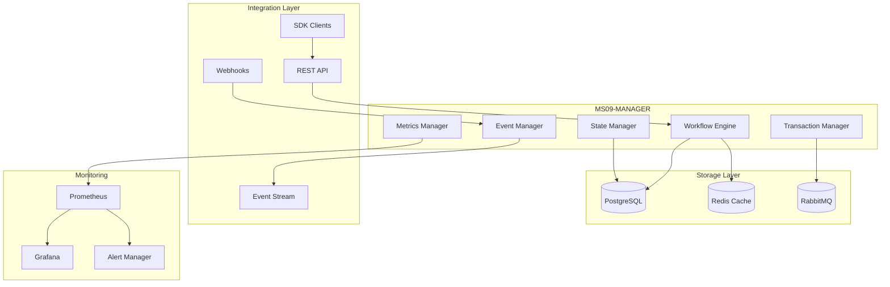
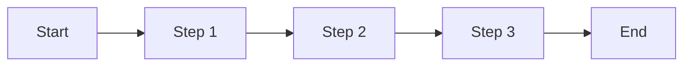
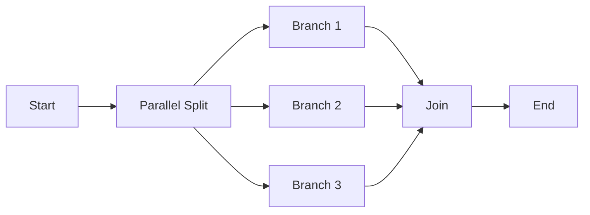
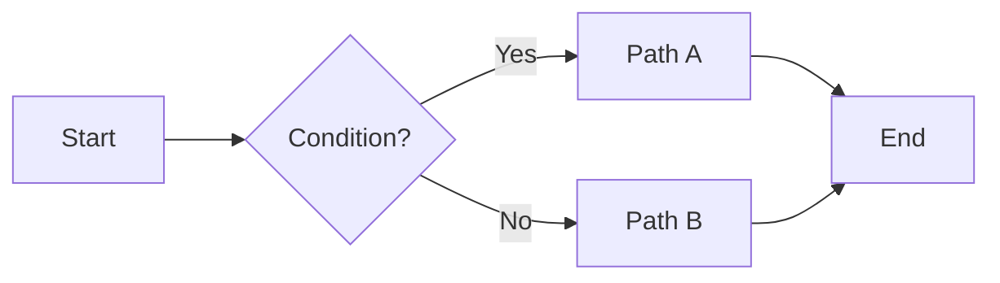
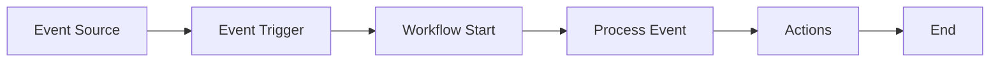

# MS09-MANAGER - Gestore Workflow e Orchestrazione

**Navigazione**: [← MS08-MONITOR](../MS08-MONITOR/README.md) | [SPECIFICATION.md](SPECIFICATION.md) | [API.md](API.md) | [DATABASE-SCHEMA.md](DATABASE-SCHEMA.md) | [TROUBLESHOOTING.md](TROUBLESHOOTING.md) | [Back to MS →](../MS-ARCHITECTURE-MASTER.md#ms09--manager)

## Panoramica

MS09-MANAGER è il servizio centrale di gestione e orchestrazione dei workflow nel sistema ZenIA. Fornisce un motore di workflow flessibile e scalabile per coordinare l'esecuzione di processi complessi tra i diversi microservizi, gestire le dipendenze, monitorare lo stato di avanzamento e garantire la consistenza transazionale.

**Tipo**: Microservizio Core di Orchestrazione
**Funzione**: Gestione Workflow e Coordinamento Processi
**Criticità**: Alta - Servizio Centrale di Coordinamento

## Responsabilità Principali

### 🎯 Orchestrazione Workflow
- **Definizione Workflow**: Creazione e gestione di workflow complessi con logica condizionale
- **Esecuzione Coordinata**: Orchestrazione sequenziale e parallela di attività tra microservizi
- **Gestione Dipendenze**: Risoluzione automatica delle dipendenze tra attività
- **Transazioni Distribuite**: Garanzia di consistenza ACID nei workflow multi-servizio

### 📊 Monitoraggio e Controllo
- **Stato Real-time**: Monitoraggio dello stato di esecuzione dei workflow
- **Metriche Performance**: Raccolta di metriche di performance e affidabilità
- **Alert e Notifiche**: Sistema di alert per workflow bloccati o in errore
- **Dashboard Operative**: Interfacce per monitoraggio e controllo manuale

### 🔄 Gestione Stati e Transizioni
- **State Machine**: Implementazione di macchine a stati per workflow complessi
- **Transizioni Condizionali**: Logica di routing basata su risultati intermedi
- **Rollback Automatico**: Recupero automatico da stati di errore
- **Retry e Recovery**: Strategie di retry configurabili per attività fallite

### 🔗 Integrazione e API
- **API RESTful**: Interfacce programmatiche per creazione e gestione workflow
- **Webhook e Callback**: Notifiche asincrone per eventi workflow
- **SDK e Client**: Librerie client per integrazione semplificata
- **Event Streaming**: Pubblicazione eventi workflow su bus di eventi

## Architettura



## Workflow Types Supportati

### 1. Sequential Workflow
Workflow lineare con esecuzione step-by-step.



### 2. Parallel Workflow
Esecuzione parallela di attività indipendenti.



### 3. Conditional Workflow
Routing condizionale basato su risultati.



### 4. Event-Driven Workflow
Workflow attivati da eventi esterni.



## Componenti Core

### Workflow Engine
**Responsabilità**: Esecuzione e orchestrazione dei workflow
- **Linguaggio Workflow**: DSL JSON-based per definizione workflow
- **Execution Runtime**: Interprete ottimizzato per alta performance
- **Concurrency Control**: Gestione concorrenza per workflow paralleli
- **Resource Management**: Allocazione risorse per workflow pesanti

### State Manager
**Responsabilità**: Gestione dello stato dei workflow
- **Persistent State**: Salvataggio affidabile dello stato su database
- **State Transitions**: Transizioni atomiche tra stati
- **Versioning**: Supporto versioning per evoluzione workflow
- **Recovery**: Recupero automatico da crash del sistema

### Transaction Manager
**Responsabilità**: Gestione transazioni distribuite
- **Saga Pattern**: Implementazione saga per transazioni long-running
- **Compensation**: Logica di compensazione per rollback
- **Isolation Levels**: Controllo isolamento transazionale
- **Deadlock Prevention**: Prevenzione deadlock in workflow complessi

### Event Manager
**Responsabilità**: Gestione eventi e comunicazione asincrona
- **Event Publishing**: Pubblicazione eventi workflow su message broker
- **Event Subscription**: Sottoscrizione a eventi esterni
- **Event Correlation**: Correlazione eventi per workflow complessi
- **Event Persistence**: Archiviazione eventi per audit e replay

## Integrazione con Altri MS

### Upstream Dependencies
- **MS03-ORCHESTRATOR**: Riceve richieste di esecuzione workflow
- **MS07-DISTRIBUTOR**: Coordina distribuzione risultati workflow
- **MS08-MONITOR**: Monitora performance e stato workflow

### Downstream Dependencies
- **Tutti i MS**: Può orchestrare attività su qualsiasi microservizio
- **MS04-VALIDATOR**: Utilizzato per validazione risultati intermedi
- **MS05-TRANSFORMER**: Utilizzato per trasformazione dati in workflow

## Sicurezza e Compliance

### Autenticazione e Autorizzazione
- **JWT Tokens**: Autenticazione basata su token JWT
- **RBAC**: Role-Based Access Control per workflow
- **Tenant Isolation**: Isolamento completo per multi-tenancy
- **API Keys**: Chiavi API per integrazioni esterne

### Audit e Compliance
- **Audit Logging**: Log completo di tutte le operazioni workflow
- **GDPR Compliance**: Gestione dati personali nei workflow
- **Data Encryption**: Crittografia dati sensibili in transito e at-rest
- **Retention Policies**: Policy di retention per dati workflow

## Performance e Scalabilità

### Metriche Chiave
- **Throughput**: Workflow completati al secondo
- **Latency**: Tempo medio esecuzione workflow
- **Success Rate**: Percentuale workflow completati con successo
- **Active Workflows**: Numero workflow attivi contemporaneamente

### Scalabilità
- **Horizontal Scaling**: Auto-scaling basato su carico
- **Partitioning**: Partizionamento workflow per tenant
- **Caching**: Cache Redis per stati workflow frequenti
- **Async Processing**: Elaborazione asincrona per workflow pesanti

## Deployment e Configurazione

### Environment Variables
```bash
# Database
DB_HOST=postgres
DB_PORT=5432
DB_NAME=zenia_manager
DB_USER=zenia
DB_PASSWORD=${DB_PASSWORD}

# Redis Cache
REDIS_URL=redis://redis:6379
REDIS_POOL_SIZE=20

# Message Broker
RABBITMQ_HOST=rabbitmq
RABBITMQ_PORT=5672
RABBITMQ_USER=zenia
RABBITMQ_PASSWORD=${RABBITMQ_PASSWORD}

# Monitoring
PROMETHEUS_URL=http://prometheus:9090
GRAFANA_URL=http://grafana:3000
```

### Configurazione Workflow
```json
{
  "workflow": {
    "id": "document-processing-workflow",
    "version": "1.0",
    "description": "Workflow completo elaborazione documenti",
    "steps": [
      {
        "id": "classify",
        "service": "ms01-classifier",
        "action": "classify",
        "timeout": "300s",
        "retry": {
          "max_attempts": 3,
          "backoff": "exponential"
        }
      },
      {
        "id": "analyze",
        "service": "ms02-analyzer",
        "action": "analyze",
        "depends_on": ["classify"],
        "condition": "steps.classify.result.confidence > 0.8"
      }
    ]
  }
}
```

## Monitoraggio e Alert

### Metriche Principali
- `zenia_manager_workflows_active`: Workflow attivi
- `zenia_manager_workflows_completed_total`: Workflow completati
- `zenia_manager_workflow_duration_seconds`: Durata esecuzione
- `zenia_manager_step_failures_total`: Fallimenti step

### Alert Configurati
- **Workflow Stuck**: Workflow bloccati per più di 30 minuti
- **High Failure Rate**: Tasso fallimenti workflow > 5%
- **Queue Backlog**: Code workflow in backlog
- **Resource Exhaustion**: Risorse sistema esaurite

## Esempi di Utilizzo

### Creazione Workflow Semplice
```bash
curl -X POST http://ms09-manager.zenia.local/api/v1/workflows \
  -H "Authorization: Bearer ${JWT_TOKEN}" \
  -H "Content-Type: application/json" \
  -d '{
    "name": "simple-document-process",
    "description": "Workflow semplice elaborazione documento",
    "steps": [
      {
        "id": "validate",
        "service": "ms04-validator",
        "action": "validate_document",
        "parameters": {
          "document_id": "${input.document_id}"
        }
      },
      {
        "id": "transform",
        "service": "ms05-transformer",
        "action": "transform_document",
        "depends_on": ["validate"],
        "parameters": {
          "input_format": "${steps.validate.output.format}",
          "target_format": "pdf"
        }
      }
    ]
  }'
```

### Monitoraggio Stato Workflow
```bash
curl -X GET http://ms09-manager.zenia.local/api/v1/workflows/${workflow_id}/status \
  -H "Authorization: Bearer ${JWT_TOKEN}"
```

**Risposta**:
```json
{
  "workflow_id": "wf-123456",
  "status": "running",
  "progress": 0.6,
  "current_step": "transform",
  "started_at": "2024-01-15T10:00:00Z",
  "estimated_completion": "2024-01-15T10:05:00Z",
  "steps": {
    "validate": {
      "status": "completed",
      "started_at": "2024-01-15T10:00:00Z",
      "completed_at": "2024-01-15T10:01:30Z",
      "result": {
        "format": "docx",
        "valid": true
      }
    },
    "transform": {
      "status": "running",
      "started_at": "2024-01-15T10:01:30Z"
    }
  }
}
```

## Troubleshooting

### Workflow Bloccati
```bash
# Verifica workflow bloccati
curl -X GET http://ms09-manager.zenia.local/api/v1/workflows?status=stuck \
  -H "Authorization: Bearer ${JWT_TOKEN}"

# Force retry step fallito
curl -X POST http://ms09-manager.zenia.local/api/v1/workflows/${workflow_id}/steps/${step_id}/retry \
  -H "Authorization: Bearer ${JWT_TOKEN}"
```

### Performance Issues
```bash
# Verifica metriche performance
curl -X GET http://ms09-manager.zenia.local/api/v1/metrics/performance \
  -H "Authorization: Bearer ${JWT_TOKEN}"

# Analizza bottleneck
curl -X GET http://ms09-manager.zenia.local/api/v1/workflows/slow \
  -H "Authorization: Bearer ${JWT_TOKEN}"
```

## Roadmap

### Versione 1.1 (Q1 2025)
- **Event-Driven Workflows**: Supporto workflow attivati da eventi
- **Dynamic Scaling**: Auto-scaling basato su carico workflow
- **Advanced Retry**: Strategie retry più sofisticate

### Versione 1.2 (Q2 2025)
- **Workflow Templates**: Libreria di template workflow riutilizzabili
- **Visual Designer**: Interfaccia drag-and-drop per creazione workflow
- **AI Optimization**: Ottimizzazione automatica workflow basata su ML

### Versione 2.0 (Q3 2025)
- **Microservices Mesh**: Integrazione con service mesh per routing intelligente
- **Multi-Cloud**: Supporto esecuzione workflow su multiple cloud
- **Real-time Collaboration**: Collaborazione real-time su workflow attivi