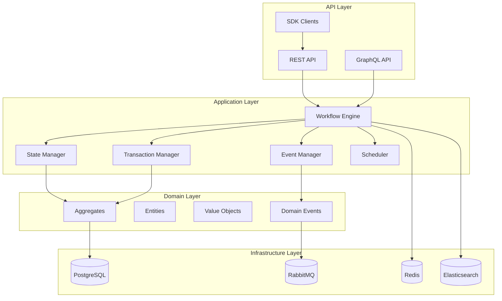

# Specifiche Tecniche - MS09-MANAGER

**Navigazione**: [README.md](README.md) | [← API.md](API.md) | [DATABASE-SCHEMA.md](DATABASE-SCHEMA.md) | [TROUBLESHOOTING.md](TROUBLESHOOTING.md) | [Back to MS →](../MS-ARCHITECTURE-MASTER.md#ms09--manager)

## 1. Panoramica Architetturale

MS09-MANAGER implementa un motore di workflow enterprise-grade per l'orchestrazione di processi complessi nel sistema ZenIA. Utilizza una combinazione di pattern architetturali consolidati per garantire affidabilità, scalabilità e manutenibilità.

**Paradigma Architetturale**: Event-Driven Architecture + Saga Pattern
**Stile di Design**: Domain-Driven Design (DDD) con CQRS
**Pattern di Comunicazione**: Command Query Responsibility Segregation (CQRS)

## 2. Architettura Dettagliata

### 2.1 Componenti Principali



### 2.2 Workflow Engine

**Tecnologie**: Java 21 + Spring Boot 3.2 + Camunda BPM
**Responsabilità**: Esecuzione e interpretazione dei workflow

#### Caratteristiche Tecniche
- **DSL Workflow**: Linguaggio dichiarativo JSON-based per definizione workflow
- **Execution Model**: Interprete a stati con supporto concorrenza
- **Performance**: Throughput fino a 1000 workflow/secondo
- **Memory Footprint**: < 512MB per 100 workflow attivi

#### Algoritmi di Esecuzione
```java
public class WorkflowExecutor {
    private final WorkflowRepository repository;
    private final StepExecutor stepExecutor;
    private final StateManager stateManager;

    public WorkflowExecutionResult execute(Workflow workflow, Map<String, Object> context) {
        WorkflowInstance instance = createInstance(workflow, context);

        while (!instance.isCompleted()) {
            Step currentStep = selectNextStep(instance);

            try {
                StepResult result = stepExecutor.execute(currentStep, instance.getContext());
                handleStepSuccess(instance, currentStep, result);
            } catch (StepException e) {
                handleStepFailure(instance, currentStep, e);
            }
        }

        return instance.getResult();
    }
}
```

### 2.3 State Manager

**Pattern**: Event Sourcing + Snapshot
**Persistenza**: PostgreSQL con ottimizzazioni per alta frequenza scritture

#### Gestione Stato
```sql
-- Tabella principale stati workflow
CREATE TABLE workflow_states (
    workflow_id UUID PRIMARY KEY,
    version BIGINT NOT NULL,
    state_json JSONB NOT NULL,
    created_at TIMESTAMP WITH TIME ZONE NOT NULL,
    snapshot_version BIGINT,
    UNIQUE(workflow_id, version)
);

-- Indice per query ottimizzate
CREATE INDEX idx_workflow_states_version ON workflow_states (workflow_id, version DESC);
CREATE INDEX idx_workflow_states_state ON workflow_states USING GIN (state_json);
```

#### Snapshot Strategy
- **Snapshot Frequency**: Ogni 100 eventi o 1 ora
- **Compression**: LZ4 per ridurre footprint storage
- **Retention**: Snapshot mantenuti per 90 giorni

### 2.4 Transaction Manager

**Pattern**: Saga Pattern con Choreography
**Coordinamento**: Event-driven con compensazione automatica

#### Saga Implementation
```java
public class SagaManager {
    private final EventPublisher eventPublisher;
    private final CompensationHandler compensationHandler;

    public SagaResult executeSaga(SagaDefinition saga, Map<String, Object> initialContext) {
        SagaInstance sagaInstance = createSagaInstance(saga, initialContext);

        try {
            for (SagaStep step : saga.getSteps()) {
                SagaStepResult result = executeStep(step, sagaInstance);
                publishStepEvent(sagaInstance, step, result);

                if (!result.isSuccess()) {
                    return compensateSaga(sagaInstance, step);
                }
            }

            return SagaResult.success(sagaInstance);
        } catch (Exception e) {
            return compensateSaga(sagaInstance, null);
        }
    }

    private SagaResult compensateSaga(SagaInstance instance, SagaStep failedStep) {
        List<SagaStep> completedSteps = getCompletedSteps(instance, failedStep);

        for (SagaStep step : completedSteps.reverse()) {
            try {
                compensationHandler.compensate(step, instance);
            } catch (Exception e) {
                // Log compensation failure - manual intervention required
                publishCompensationFailureEvent(instance, step, e);
            }
        }

        return SagaResult.compensated(instance);
    }
}
```

## 3. Modelli di Dati

### 3.1 Workflow Definition Model

```json
{
  "$schema": "https://zenia.local/schemas/workflow-definition-v1.0.json",
  "id": "document-processing-workflow",
  "version": "1.0.0",
  "name": "Workflow Elaborazione Documenti",
  "description": "Workflow completo per elaborazione documenti PA",
  "metadata": {
    "author": "DevOps Team",
    "created": "2024-01-01T00:00:00Z",
    "tags": ["documenti", "pa", "elaborazione"],
    "category": "business-process"
  },
  "variables": {
    "document_id": {
      "type": "string",
      "required": true,
      "description": "ID univoco del documento"
    },
    "tenant_id": {
      "type": "string",
      "required": true,
      "description": "ID del tenant"
    },
    "priority": {
      "type": "enum",
      "values": ["low", "normal", "high", "critical"],
      "default": "normal"
    }
  },
  "steps": [
    {
      "id": "initial_validation",
      "name": "Validazione Iniziale",
      "type": "service_call",
      "service": "ms04-validator",
      "action": "validate_document",
      "parameters": {
        "document_id": "${variables.document_id}",
        "validation_rules": ["format_check", "integrity_check"]
      },
      "timeout": "60s",
      "retry": {
        "max_attempts": 3,
        "backoff": {
          "type": "exponential",
          "initial_delay": "1s",
          "max_delay": "30s"
        }
      },
      "on_success": {
        "next": "classification"
      },
      "on_failure": {
        "action": "fail_workflow",
        "error_code": "VALIDATION_FAILED"
      }
    },
    {
      "id": "parallel_processing",
      "name": "Elaborazione Parallela",
      "type": "parallel",
      "branches": [
        {
          "id": "classification_branch",
          "steps": [
            {
              "id": "classification",
              "name": "Classificazione Documento",
              "type": "service_call",
              "service": "ms01-classifier",
              "action": "classify",
              "depends_on": ["initial_validation"],
              "parameters": {
                "document_content": "${steps.initial_validation.output.content}",
                "classification_model": "pa-documents-v2"
              }
            }
          ]
        },
        {
          "id": "analysis_branch",
          "steps": [
            {
              "id": "analysis",
              "name": "Analisi Contenuto",
              "type": "service_call",
              "service": "ms02-analyzer",
              "action": "analyze",
              "depends_on": ["initial_validation"],
              "parameters": {
                "text_content": "${steps.initial_validation.output.text}",
                "analysis_type": "semantic"
              }
            }
          ]
        }
      ],
      "join_type": "all_success"
    },
    {
      "id": "decision_point",
      "name": "Punto Decisione",
      "type": "decision",
      "depends_on": ["parallel_processing"],
      "conditions": [
        {
          "expression": "${steps.classification.output.confidence} > 0.8",
          "next": "high_confidence_path"
        },
        {
          "expression": "${steps.classification.output.confidence} > 0.5",
          "next": "medium_confidence_path"
        }
      ],
      "default_next": "low_confidence_path"
    },
    {
      "id": "high_confidence_path",
      "name": "Path Alta Confidenza",
      "type": "sequence",
      "steps": [
        {
          "id": "auto_approval",
          "name": "Approvazione Automatica",
          "type": "service_call",
          "service": "ms03-orchestrator",
          "action": "approve_document"
        }
      ]
    },
    {
      "id": "medium_confidence_path",
      "name": "Path Media Confidenza",
      "type": "sequence",
      "steps": [
        {
          "id": "manual_review",
          "name": "Revisione Manuale",
          "type": "human_task",
          "assignee_group": "document_reviewers",
          "form_definition": {
            "fields": [
              {
                "id": "review_decision",
                "type": "select",
                "options": ["approve", "reject", "escalate"],
                "required": true
              },
              {
                "id": "review_comments",
                "type": "textarea",
                "max_length": 1000
              }
            ]
          }
        }
      ]
    },
    {
      "id": "low_confidence_path",
      "name": "Path Bassa Confidenza",
      "type": "sequence",
      "steps": [
        {
          "id": "escalation",
          "name": "Escalation",
          "type": "service_call",
          "service": "ms03-orchestrator",
          "action": "escalate_to_supervisor"
        }
      ]
    }
  ],
  "error_handling": {
    "global_timeout": "30m",
    "max_retries": 5,
    "retry_backoff": {
      "type": "exponential",
      "initial_delay": "5s",
      "max_delay": "5m"
    },
    "compensation_steps": [
      {
        "id": "cleanup_temp_files",
        "service": "ms05-transformer",
        "action": "cleanup_temp_files",
        "parameters": {
          "workflow_id": "${workflow.id}"
        }
      }
    ]
  },
  "monitoring": {
    "metrics": {
      "enable_detailed_metrics": true,
      "custom_metrics": [
        {
          "name": "document_processing_time",
          "type": "histogram",
          "description": "Tempo totale elaborazione documento"
        }
      ]
    },
    "alerts": {
      "enable_default_alerts": true,
      "custom_alerts": [
        {
          "name": "SlowProcessingAlert",
          "condition": "workflow_duration > 600",
          "severity": "warning",
          "message": "Workflow elaborazione documento lento"
        }
      ]
    }
  }
}
```

### 3.2 Workflow Instance Model

```json
{
  "id": "wf-instance-123456789",
  "workflow_definition_id": "document-processing-workflow",
  "version": "1.0.0",
  "tenant_id": "tenant-pa-roma",
  "status": "running",
  "priority": "normal",
  "context": {
    "document_id": "doc-2024-001-abc",
    "tenant_id": "tenant-pa-roma",
    "user_id": "user-pa-roma-456",
    "correlation_id": "corr-789-abc-123-def"
  },
  "variables": {
    "start_time": "2024-01-15T10:00:00Z",
    "current_step": "parallel_processing",
    "progress_percentage": 60,
    "estimated_completion": "2024-01-15T10:05:00Z"
  },
  "steps": {
    "initial_validation": {
      "status": "completed",
      "started_at": "2024-01-15T10:00:00Z",
      "completed_at": "2024-01-15T10:00:30Z",
      "attempts": 1,
      "result": {
        "valid": true,
        "format": "pdf",
        "size_bytes": 2048576,
        "checksum": "sha256:abc123..."
      },
      "metrics": {
        "duration_ms": 30000,
        "cpu_usage_percent": 15.2,
        "memory_usage_mb": 128
      }
    },
    "parallel_processing": {
      "status": "running",
      "started_at": "2024-01-15T10:00:30Z",
      "branches": {
        "classification_branch": {
          "status": "running",
          "current_step": "classification"
        },
        "analysis_branch": {
          "status": "running",
          "current_step": "analysis"
        }
      }
    }
  },
  "events": [
    {
      "id": "event-001",
      "type": "WorkflowStarted",
      "timestamp": "2024-01-15T10:00:00Z",
      "data": {
        "workflow_id": "wf-instance-123456789",
        "triggered_by": "api_call"
      }
    },
    {
      "id": "event-002",
      "type": "StepCompleted",
      "timestamp": "2024-01-15T10:00:30Z",
      "data": {
        "step_id": "initial_validation",
        "result": "success"
      }
    }
  ],
  "metadata": {
    "created_at": "2024-01-15T10:00:00Z",
    "created_by": "api-user",
    "updated_at": "2024-01-15T10:02:15Z",
    "version": 5,
    "tags": ["document-processing", "pa-roma"]
  }
}
```

## 4. Protocolli di Comunicazione

### 4.1 Service-to-Service Communication

**Protocollo**: HTTP/2 con gRPC fallback
**Serializzazione**: Protocol Buffers per performance

```protobuf
syntax = "proto3";

package zenia.workflow;

service WorkflowService {
  rpc ExecuteWorkflow (ExecuteWorkflowRequest) returns (ExecuteWorkflowResponse);
  rpc GetWorkflowStatus (GetWorkflowStatusRequest) returns (GetWorkflowStatusResponse);
  rpc CancelWorkflow (CancelWorkflowRequest) returns (CancelWorkflowResponse);
}

message ExecuteWorkflowRequest {
  string workflow_definition_id = 1;
  string tenant_id = 2;
  map<string, string> variables = 3;
  WorkflowPriority priority = 4;
  string correlation_id = 5;
}

message ExecuteWorkflowResponse {
  string workflow_instance_id = 1;
  WorkflowStatus status = 2;
  string estimated_completion = 3;
}

enum WorkflowPriority {
  LOW = 0;
  NORMAL = 1;
  HIGH = 2;
  CRITICAL = 3;
}

enum WorkflowStatus {
  PENDING = 0;
  RUNNING = 1;
  COMPLETED = 2;
  FAILED = 3;
  CANCELLED = 4;
}
```

### 4.2 Event-Driven Communication

**Message Broker**: RabbitMQ con partitioning per tenant
**Event Format**: CloudEvents specification

```json
{
  "specversion": "1.0",
  "type": "zenia.workflow.step.completed",
  "source": "ms09-manager",
  "id": "event-123456789",
  "time": "2024-01-15T10:00:30Z",
  "subject": "workflow-step",
  "data": {
    "workflow_instance_id": "wf-instance-123456789",
    "step_id": "initial_validation",
    "status": "completed",
    "result": {
      "valid": true,
      "format": "pdf"
    },
    "metadata": {
      "tenant_id": "tenant-pa-roma",
      "correlation_id": "corr-789-abc-123-def",
      "version": "1.0"
    }
  }
}
```

## 5. Sicurezza e Compliance

### 5.1 Authentication & Authorization

**Framework**: Spring Security 6.0 + OAuth 2.0
**Token Format**: JWT con JWS signature

```java
@Configuration
@EnableWebSecurity
public class SecurityConfig {

    @Bean
    public SecurityFilterChain filterChain(HttpSecurity http) throws Exception {
        http
            .csrf().disable()
            .authorizeHttpRequests(authz -> authz
                .requestMatchers("/api/v1/workflows/public/**").permitAll()
                .requestMatchers("/api/v1/workflows/**").hasRole("WORKFLOW_USER")
                .requestMatchers("/api/v1/admin/**").hasRole("WORKFLOW_ADMIN")
                .anyRequest().authenticated()
            )
            .oauth2ResourceServer(oauth2 -> oauth2
                .jwt(jwt -> jwt
                    .decoder(jwtDecoder())
                    .jwtAuthenticationConverter(jwtAuthenticationConverter())
                )
            );

        return http.build();
    }

    @Bean
    public JwtDecoder jwtDecoder() {
        return NimbusJwtDecoder.withJwkSetUri("https://auth.zenia.local/.well-known/jwks.json").build();
    }
}
```

### 5.2 Data Encryption

**At-Rest**: AES-256-GCM per dati sensibili
**In-Transit**: TLS 1.3 obbligatorio
**Key Management**: AWS KMS integration

```java
@Service
public class EncryptionService {

    private final KeyManagementService kms;

    public String encrypt(String plaintext, String context) {
        // Generate data key
        GenerateDataKeyResponse keyResponse = kms.generateDataKey(
            GenerateDataKeyRequest.builder()
                .keyId("alias/zenia-workflow-encryption")
                .keySpec(KeySpec.AES_256)
                .encryptionContext(Map.of("workflow", context))
                .build()
        );

        // Encrypt data
        Cipher cipher = Cipher.getInstance("AES/GCM/NoPadding");
        cipher.init(Cipher.ENCRYPT_MODE, new SecretKeySpec(keyResponse.plaintext().asByteArray(), "AES"));

        byte[] encrypted = cipher.doFinal(plaintext.getBytes(StandardCharsets.UTF_8));

        // Return encrypted data + encrypted key
        return Base64.getEncoder().encodeToString(
            keyResponse.ciphertextBlob().asByteArray()
        ) + ":" + Base64.getEncoder().encodeToString(encrypted);
    }
}
```

## 6. Performance e Scalabilità

### 6.1 Metriche di Performance

| Metrica | Target | Alert Threshold |
|---------|--------|-----------------|
| Throughput (workflow/sec) | 500 | < 100 |
| Latency P95 (ms) | 500 | > 2000 |
| Memory Usage (%) | < 80 | > 90 |
| CPU Usage (%) | < 70 | > 85 |
| Active Workflows | 10000 | > 15000 |

### 6.2 Ottimizzazioni Architetturali

#### Caching Strategy
```java
@Configuration
@EnableCaching
public class CacheConfig {

    @Bean
    public RedisCacheManager cacheManager(RedisConnectionFactory connectionFactory) {
        RedisCacheConfiguration config = RedisCacheConfiguration.defaultCacheConfig()
            .entryTtl(Duration.ofHours(1))
            .serializeKeysWith(
                RedisSerializationContext.SerializationPair.fromSerializer(
                    new StringRedisSerializer()))
            .serializeValuesWith(
                RedisSerializationContext.SerializationPair.fromSerializer(
                    new GenericJackson2JsonRedisSerializer()));

        return RedisCacheManager.builder(connectionFactory)
            .cacheDefaults(config)
            .build();
    }
}
```

#### Database Optimization
```sql
-- Partitioning per performance
CREATE TABLE workflow_instances_y2024m01 PARTITION OF workflow_instances
    FOR VALUES FROM ('2024-01-01') TO ('2024-02-01');

-- Indici ottimizzati
CREATE INDEX CONCURRENTLY idx_workflow_instances_tenant_status
    ON workflow_instances (tenant_id, status)
    WHERE status IN ('running', 'pending');

CREATE INDEX CONCURRENTLY idx_workflow_instances_created_at
    ON workflow_instances (created_at DESC)
    WHERE created_at >= CURRENT_DATE - INTERVAL '30 days';
```

## 7. Monitoraggio e Osservabilità

### 7.1 Metriche Custom

```java
@Service
public class WorkflowMetricsService {

    private final MeterRegistry registry;

    public void recordWorkflowStarted(String workflowType, String tenantId) {
        Counter.builder("zenia_workflow_started_total")
            .tag("workflow_type", workflowType)
            .tag("tenant_id", tenantId)
            .register(registry)
            .increment();
    }

    public void recordWorkflowDuration(String workflowType, long durationMs) {
        Timer.builder("zenia_workflow_duration_seconds")
            .tag("workflow_type", workflowType)
            .register(registry)
            .record(Duration.ofMillis(durationMs));
    }

    public void recordStepFailure(String stepType, String errorType) {
        Counter.builder("zenia_workflow_step_failures_total")
            .tag("step_type", stepType)
            .tag("error_type", errorType)
            .register(registry)
            .increment();
    }
}
```

### 7.2 Health Checks

```java
@Component
public class WorkflowHealthIndicator implements HealthIndicator {

    private final WorkflowRepository repository;
    private final DataSource dataSource;

    @Override
    public Health health() {
        try {
            // Check database connectivity
            dataSource.getConnection().close();

            // Check active workflows
            long activeWorkflows = repository.countActiveWorkflows();
            if (activeWorkflows > 50000) {
                return Health.down()
                    .withDetail("activeWorkflows", activeWorkflows)
                    .withDetail("message", "Too many active workflows")
                    .build();
            }

            return Health.up()
                .withDetail("activeWorkflows", activeWorkflows)
                .build();

        } catch (Exception e) {
            return Health.down(e)
                .withDetail("error", e.getMessage())
                .build();
        }
    }
}
```

## 8. Disaster Recovery

### 8.1 Backup Strategy

**Database**: Backup incrementale ogni 15 minuti
**Configuration**: Backup giornaliero su Git
**State Snapshots**: Snapshot ogni ora per workflow critici

### 8.2 Recovery Procedures

```bash
#!/bin/bash
# disaster-recovery.sh

# 1. Restore database
pg_restore -d zenia_manager /backups/manager-$(date +%Y%m%d).dump

# 2. Restore configurations
kubectl apply -f /backups/config-backup-$(date +%Y%m%d).yaml

# 3. Restart services
kubectl rollout restart deployment/ms09-manager

# 4. Verify recovery
curl -f http://ms09-manager.zenia.local/api/v1/health
```

## Gestione Errori

### Scenari di Errore Comuni

1. **Timeout Query**
   - Descrizione: Query supera tempo limite di esecuzione
   - Causa: Query complessa o dati voluminosi
   - Mitigation: Implementare timeout configurabile e fallback

2. **Connessione Database**
   - Descrizione: Perdita connessione ai servizi dipendenti
   - Causa: Servizio non disponibile o problemi rete
   - Mitigation: Retry logic con exponential backoff

3. **Validazione Dati**
   - Descrizione: Input non valido o formato errato
   - Causa: Client fornisce dati non conformi
   - Mitigation: Validazione input e error messages chiari

### Error Codes

| Code | Status | Descrizione | Azione |
|------|--------|-------------|--------|
| 400 | Bad Request | Input non valido | Correggi parametri request |
| 408 | Timeout | Operazione timeout | Riprova con parametri ridotti |
| 500 | Internal Error | Errore interno | Contatta supporto |
| 503 | Service Unavailable | Servizio non disponibile | Riprova più tardi |

### Recovery Procedures

- **Automatic Retry**: Sistema riprova automaticamente con backoff esponenziale
- **Graceful Degradation**: Fallback a cache o risultati parziali se disponibili
- **Error Logging**: Tutti gli errori registrati per analisi e monitoring
- **Alerting**: Notifiche su errori critici ai team di supporto

## 9. Roadmap Tecnologico

### Fase 1 (Q1 2025): Performance Enhancement
- **In-Memory Workflow Execution**: Esecuzione workflow in memoria per bassa latenza
- **Distributed Caching**: Redis Cluster per scalabilità cache
- **Async I/O**: Reactive programming per throughput elevato

### Fase 2 (Q2 2025): Advanced Features
- **AI-Powered Optimization**: ML per ottimizzazione automatica workflow
- **Dynamic Workflow Modification**: Modifica workflow a runtime
- **Multi-Version Concurrency**: Gestione concorrenza versioni multiple

### Fase 3 (Q3 2025): Enterprise Features
- **Workflow Federation**: Orchestrazione workflow cross-cluster
- **Advanced Analytics**: Analisi predittiva performance workflow
- **Integration Mesh**: Service mesh nativo per comunicazione
