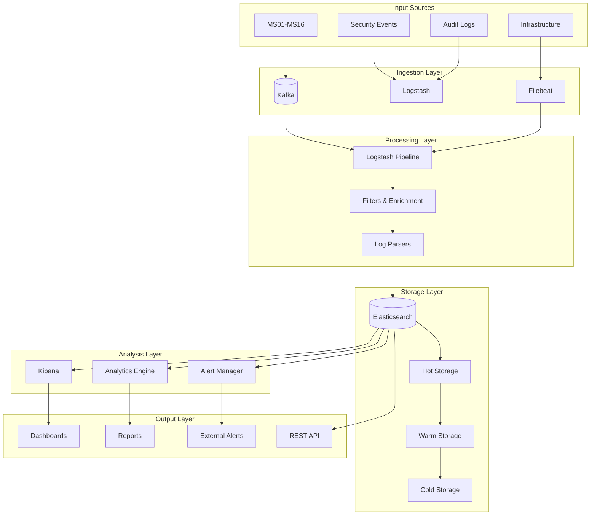
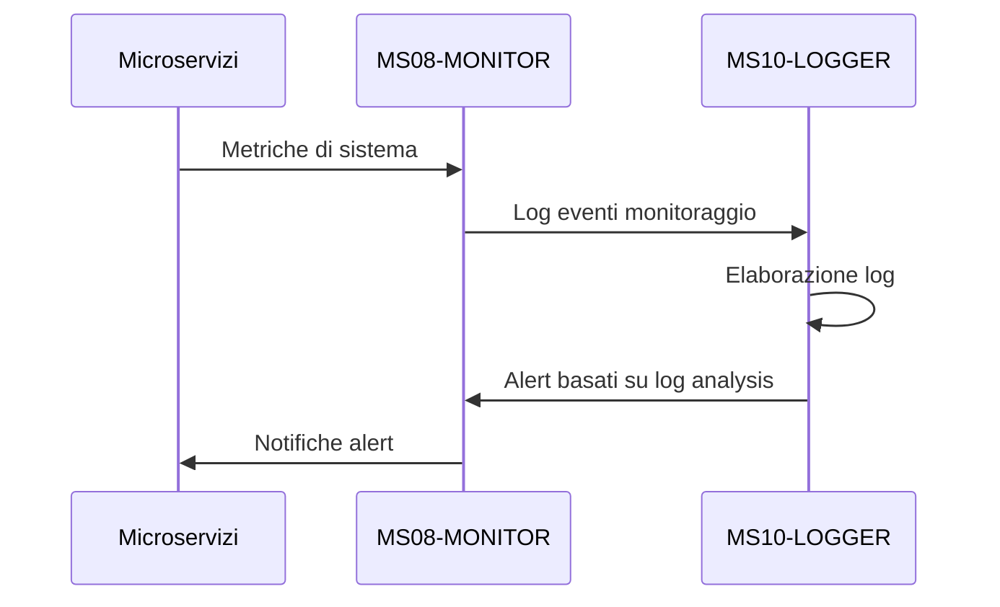
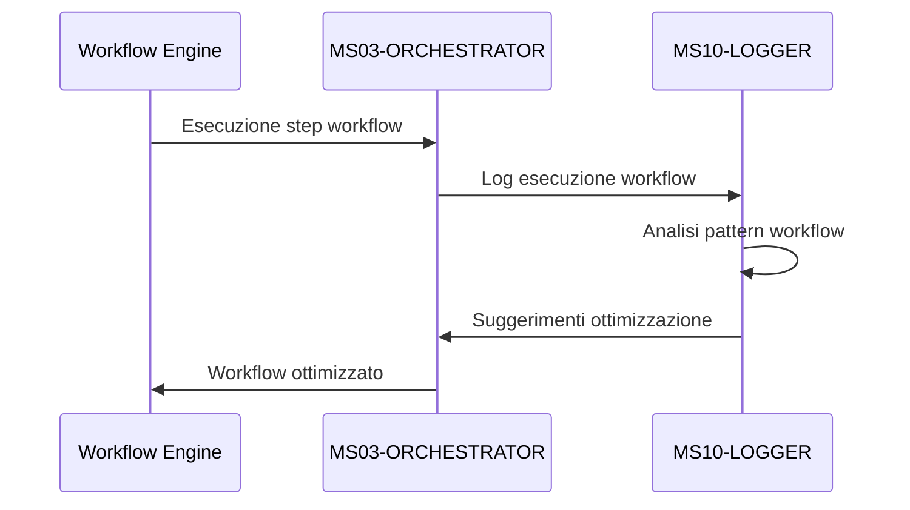
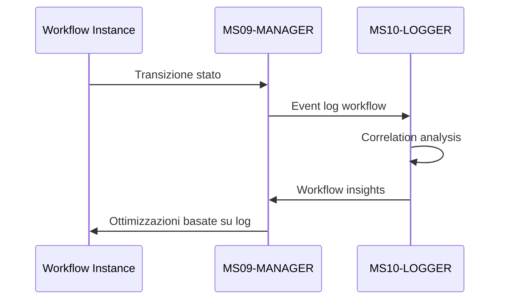

# MS10-LOGGER - Servizio di Logging Centralizzato

**Navigazione**: [README.md](README.md) | [SPECIFICATION.md](SPECIFICATION.md) | [API.md](API.md) | [DATABASE-SCHEMA.md](DATABASE-SCHEMA.md) | [TROUBLESHOOTING.md](TROUBLESHOOTING.md) | [Back to MS →](../MS-ARCHITECTURE-MASTER.md#ms10--logger)

## 1. Panoramica

MS10-LOGGER è il servizio centralizzato per la raccolta, elaborazione, archiviazione e analisi dei log di sistema in ZenIA. Implementa una soluzione enterprise-grade per la gestione dei log che garantisce tracciabilità completa, analisi real-time e compliance normativa.

**Ruolo nel Sistema**: Logging centralizzato e analisi eventi
**Paradigma**: Event-Driven Architecture + Log Aggregation
**Tecnologie**: Elasticsearch + Logstash + Kibana (ELK Stack) + Kafka

## 2. Architettura e Componenti

### 2.1 Architettura Generale



### 2.2 Componenti Principali

#### Log Ingestion Engine
- **Kafka Connect**: Integrazione con Apache Kafka per ingestion ad alto volume
- **Logstash Pipelines**: Elaborazione e trasformazione dei log in tempo reale
- **Filebeat**: Collection di log da file system e container

#### Log Processing Pipeline
- **Multi-format Parser**: Supporto per JSON, XML, CSV, plain text
- **Field Extraction**: Estrazione automatica di campi strutturati
- **Data Enrichment**: Aggiunta di metadati contestuali (tenant, correlation ID, etc.)

#### Storage Management
- **Hot Storage**: Dati recenti ad alta frequenza di accesso
- **Warm Storage**: Dati intermedi con retention configurabile
- **Cold Storage**: Archivio storico con compressione avanzata

#### Analytics Engine
- **Real-time Analytics**: Analisi streaming con Apache Flink
- **Batch Analytics**: Elaborazione batch con Apache Spark
- **Machine Learning**: Rilevamento anomalie e pattern analysis

## 3. Funzionalità Principali

### 3.1 Raccolta Log Multi-Source

#### Application Logs
```json
{
  "timestamp": "2024-01-15T10:30:45.123Z",
  "level": "INFO",
  "service": "ms01-classifier",
  "instance": "ms01-classifier-7x9k2",
  "tenant_id": "tenant-pa-roma",
  "correlation_id": "corr-123-abc-456-def",
  "user_id": "user-pa-roma-789",
  "session_id": "session-pa-roma-20240115-001",
  "message": "Document classification completed",
  "context": {
    "document_id": "DOC-2024-001234-ABC",
    "classification": "provvedimento",
    "confidence": 0.87,
    "processing_time_ms": 1250
  },
  "mdc": {
    "request_id": "req-456-def-789-ghi",
    "client_ip": "192.168.1.100",
    "user_agent": "ZenIA-PA-Portal/2.1.0"
  }
}
```

#### Infrastructure Logs
```json
{
  "timestamp": "2024-01-15T10:30:45.500Z",
  "level": "WARN",
  "source": "kubernetes",
  "node": "k8s-worker-node-03",
  "namespace": "zenia",
  "pod": "ms04-validator-4n2m8",
  "container": "ms04-validator",
  "message": "High memory usage detected",
  "metrics": {
    "cpu_percent": 75.2,
    "memory_percent": 85.6,
    "memory_used_mb": 1712,
    "memory_limit_mb": 2048,
    "disk_usage_percent": 45.8
  }
}
```

#### Security Events
```json
{
  "timestamp": "2024-01-15T10:31:00.000Z",
  "event_type": "SECURITY_VIOLATION",
  "severity": "HIGH",
  "source": "ms03-orchestrator",
  "tenant_id": "tenant-pa-roma",
  "user_id": "user-pa-roma-789",
  "action": "UNAUTHORIZED_ACCESS_ATTEMPT",
  "resource": "/api/v1/workflows/admin",
  "details": {
    "client_ip": "10.0.0.50",
    "user_agent": "Suspicious-Agent/1.0",
    "request_method": "POST",
    "response_code": 403,
    "violation_type": "INSUFFICIENT_PERMISSIONS"
  },
  "correlation_id": "corr-123-abc-456-def"
}
```

### 3.2 Log Processing e Enrichment

#### Field Extraction Automatica
```java
public class LogEnrichmentProcessor {

    public LogEntry enrich(LogEntry rawLog) {
        // Estrazione campi comuni
        rawLog.setTenantId(extractTenantId(rawLog.getMessage()));
        rawLog.setCorrelationId(extractCorrelationId(rawLog.getMessage()));
        rawLog.setUserId(extractUserId(rawLog.getMessage()));

        // Enrichment contestuale
        enrichWithUserContext(rawLog);
        enrichWithTenantContext(rawLog);
        enrichWithGeographicContext(rawLog);

        // Classificazione automatica
        rawLog.setCategory(classifyLogCategory(rawLog));
        rawLog.setSeverity(calculateSeverity(rawLog));

        return rawLog;
    }
}
```

#### Data Enrichment Pipeline
```json
{
  "enrichment_rules": [
    {
      "name": "tenant_enrichment",
      "type": "lookup",
      "source_field": "tenant_id",
      "lookup_index": "tenant_metadata",
      "output_fields": {
        "tenant_name": "name",
        "tenant_type": "type",
        "tenant_region": "region",
        "tenant_compliance_level": "compliance_level"
      }
    },
    {
      "name": "user_enrichment",
      "type": "lookup",
      "source_field": "user_id",
      "lookup_index": "user_metadata",
      "output_fields": {
        "user_name": "full_name",
        "user_role": "role",
        "user_department": "department",
        "user_clearance_level": "clearance_level"
      }
    },
    {
      "name": "geo_enrichment",
      "type": "geoip",
      "source_field": "client_ip",
      "output_fields": {
        "country": "country_name",
        "city": "city_name",
        "region": "region_name",
        "location": "location"
      }
    }
  ]
}
```

### 3.3 Storage Management Intelligente

#### Hot-Warm-Cold Strategy
```yaml
storage_policies:
  - name: hot_policy
    conditions:
      - "timestamp > now-7d"
    settings:
      replicas: 2
      refresh_interval: 10s
      index_codec: default

  - name: warm_policy
    conditions:
      - "timestamp > now-30d AND timestamp <= now-7d"
    settings:
      replicas: 1
      refresh_interval: 30s
      index_codec: best_compression

  - name: cold_policy
    conditions:
      - "timestamp <= now-30d"
    settings:
      replicas: 0
      index_codec: best_compression
      searchable_snapshot: true
```

#### Data Retention Policies
```json
{
  "retention_policies": [
    {
      "name": "application_logs",
      "hot_retention": "7d",
      "warm_retention": "30d",
      "cold_retention": "1y",
      "delete_after": "7y"
    },
    {
      "name": "security_events",
      "hot_retention": "30d",
      "warm_retention": "1y",
      "cold_retention": "7y",
      "delete_after": "10y"
    },
    {
      "name": "audit_logs",
      "hot_retention": "1y",
      "warm_retention": "7y",
      "cold_retention": "10y",
      "delete_after": "never"
    }
  ]
}
```

### 3.4 Analytics e Alerting

#### Real-time Alerting Rules
```json
{
  "alert_rules": [
    {
      "name": "HighErrorRate",
      "description": "Tasso di errori superiore alla soglia",
      "query": {
        "bool": {
          "must": [
            {"term": {"level": "ERROR"}},
            {"range": {"timestamp": {"gte": "now-5m"}}}
          ]
        }
      },
      "condition": {
        "type": "threshold",
        "field": "count",
        "operator": "gte",
        "value": 10
      },
      "actions": [
        {
          "type": "email",
          "recipients": ["devops@zenia.local"],
          "subject": "ALERT: High error rate detected",
          "template": "high_error_rate_alert"
        },
        {
          "type": "slack",
          "channel": "#alerts",
          "message": "🚨 High error rate in {{service}}"
        }
      ],
      "throttle_period": "5m"
    },
    {
      "name": "SecurityViolation",
      "description": "Violazione di sicurezza rilevata",
      "query": {
        "term": {"event_type": "SECURITY_VIOLATION"}
      },
      "condition": {
        "type": "always"
      },
      "actions": [
        {
          "type": "webhook",
          "url": "https://security.zenia.local/incidents",
          "method": "POST"
        }
      ],
      "severity": "critical"
    }
  ]
}
```

#### Analytics Dashboard
```json
{
  "dashboard": {
    "title": "ZenIA System Overview",
    "description": "Dashboard principale monitoraggio sistema",
    "panels": [
      {
        "title": "Error Rate by Service",
        "type": "line_chart",
        "query": {
          "aggs": {
            "by_service": {
              "terms": {"field": "service"},
              "aggs": {
                "error_rate": {
                  "date_histogram": {"field": "timestamp", "interval": "1h"},
                  "aggs": {
                    "errors": {"filter": {"term": {"level": "ERROR"}}},
                    "total": {"value_count": {"field": "timestamp"}}
                  }
                }
              }
            }
          }
        }
      },
      {
        "title": "Response Time Distribution",
        "type": "histogram",
        "query": {
          "aggs": {
            "response_times": {
              "histogram": {"field": "response_time_ms", "interval": 100}
            }
          }
        }
      }
    ]
  }
}
```

## 4. Integrazione con Altri Microservizi

### 4.1 Integrazione con MS08-MONITOR



### 4.2 Integrazione con MS03-ORCHESTRATOR



### 4.3 Integrazione con MS09-MANAGER



## 5. Sicurezza e Compliance

### 5.1 Data Protection

#### Log Encryption
```yaml
encryption:
  at_rest:
    algorithm: AES-256-GCM
    key_rotation: 90d
  in_transit:
    protocol: TLS 1.3
    cipher_suites:
      - TLS_AES_256_GCM_SHA384
      - TLS_CHACHA20_POLY1305_SHA256
```

#### Access Control
```json
{
  "access_policies": [
    {
      "name": "admin_full_access",
      "roles": ["ADMIN"],
      "permissions": ["read", "write", "delete", "admin"],
      "indices": ["*"],
      "filters": []
    },
    {
      "name": "service_limited_access",
      "roles": ["SERVICE"],
      "permissions": ["read", "write"],
      "indices": ["application_logs_*", "infrastructure_logs_*"],
      "filters": [
        {"term": {"tenant_id": "{{tenant_id}}"}}
      ]
    },
    {
      "name": "user_tenant_access",
      "roles": ["USER"],
      "permissions": ["read"],
      "indices": ["application_logs_*"],
      "filters": [
        {"term": {"tenant_id": "{{tenant_id}}"}},
        {"bool": {"should": [
          {"term": {"user_id": "{{user_id}}"}},
          {"term": {"correlation_id": "{{correlation_id}}"}}
        ]}}
      ]
    }
  ]
}
```

### 5.2 Audit Logging

#### Audit Events
```json
{
  "audit_event": {
    "timestamp": "2024-01-15T10:30:45.123Z",
    "event_type": "LOG_ACCESS",
    "actor": {
      "user_id": "user-pa-roma-789",
      "roles": ["USER"],
      "ip_address": "192.168.1.100"
    },
    "resource": {
      "type": "log_search",
      "indices": ["application_logs_2024-01-15"],
      "query": "level:ERROR AND service:ms01-classifier"
    },
    "action": "SEARCH",
    "result": "SUCCESS",
    "details": {
      "hits_returned": 25,
      "query_duration_ms": 150,
      "filters_applied": ["tenant_filter", "time_range_filter"]
    }
  }
}
```

## 6. Performance e Scalabilità

### 6.1 Metriche di Performance

| Metrica | Target | Alert Threshold |
|---------|--------|-----------------|
| Ingestion Rate (logs/sec) | 10,000 | < 5,000 |
| Query Response Time P95 (ms) | 500 | > 2,000 |
| Storage Growth Rate (GB/day) | < 100 | > 500 |
| Index Refresh Time (s) | < 30 | > 120 |
| Search Throughput (queries/sec) | 500 | < 100 |

### 6.2 Ottimizzazioni Architetturali

#### Index Optimization
```json
{
  "index_settings": {
    "number_of_shards": 3,
    "number_of_replicas": 1,
    "refresh_interval": "30s",
    "translog": {
      "durability": "async",
      "sync_interval": "5s"
    },
    "mappings": {
      "properties": {
        "timestamp": {"type": "date", "format": "strict_date_optional_time||epoch_millis"},
        "level": {"type": "keyword"},
        "service": {"type": "keyword"},
        "tenant_id": {"type": "keyword"},
        "correlation_id": {"type": "keyword"},
        "message": {"type": "text", "analyzer": "italian"}
      }
    }
  }
}
```

#### Query Optimization
```json
{
  "optimized_queries": {
    "recent_errors": {
      "query": {
        "bool": {
          "must": [
            {"term": {"level": "ERROR"}},
            {"range": {"timestamp": {"gte": "now-1h"}}}
          ]
        }
      },
      "sort": [{"timestamp": "desc"}],
      "size": 100,
      "_source": ["timestamp", "service", "message", "correlation_id"]
    },
    "service_metrics": {
      "aggs": {
        "by_service": {
          "terms": {"field": "service", "size": 50},
          "aggs": {
            "error_count": {
              "filter": {"term": {"level": "ERROR"}}
            },
            "avg_response_time": {
              "avg": {"field": "response_time_ms"}
            }
          }
        }
      }
    }
  }
}
```

## 7. Esempi di Utilizzo

### 7.1 Ricerca Log Interattiva

```bash
# Ricerca errori recenti
GET /ms10-logger/v1/logs/_search
{
  "query": {
    "bool": {
      "must": [
        {"term": {"level": "ERROR"}},
        {"range": {"timestamp": {"gte": "now-1h"}}}
      ]
    }
  },
  "sort": [{"timestamp": "desc"}],
  "size": 50
}
```

## [Auto-generated heading level 2]
### 7.2 Dashboard Analytics

```json
{
  "dashboard_config": {
    "title": "Error Analysis Dashboard",
    "time_range": "last_24h",
    "widgets": [
      {
        "type": "pie_chart",
        "title": "Errors by Service",
        "query": {
          "aggs": {
            "by_service": {
              "terms": {"field": "service"}
            }
          }
        }
      },
      {
        "type": "line_chart",
        "title": "Error Trend",
        "query": {
          "aggs": {
            "over_time": {
              "date_histogram": {"field": "timestamp", "interval": "1h"},
              "aggs": {
                "errors": {"filter": {"term": {"level": "ERROR"}}}
              }
            }
          }
        }
      }
    ]
  }
}
```

### 7.3 Alert Configuration

```json
{
  "alert_config": {
    "name": "DatabaseConnectionErrors",
    "description": "Alert per errori di connessione database",
    "query": {
      "bool": {
        "must": [
          {"match": {"message": "connection refused"}},
          {"term": {"component": "database"}}
        ]
      }
    },
    "condition": {
      "type": "threshold",
      "min_count": 5,
      "time_window": "5m"
    },
    "actions": [
      {
        "type": "email",
        "to": ["dba@zenia.local"],
        "subject": "Database Connection Issues"
      },
      {
        "type": "pagerduty",
        "service_key": "database-alerts"
      }
    ]
  }
}
```

## 8. Roadmap Tecnologico

### Fase 1 (Q1 2025): Advanced Analytics
- **Machine Learning Integration**: Rilevamento anomalie con ML
- **Predictive Analytics**: Previsione failure basata su pattern
- **Automated Root Cause Analysis**: Analisi automatica cause problemi

### Fase 2 (Q2 2025): Enhanced Security
- **SIEM Integration**: Integrazione con sistemi SIEM enterprise
- **Advanced Threat Detection**: Rilevamento minacce avanzate
- **Compliance Automation**: Automazione report compliance

### Fase 3 (Q3 2025): AI-Powered Insights
- **Natural Language Queries**: Ricerca log in linguaggio naturale
- **Automated Report Generation**: Generazione automatica report
- **Intelligent Alerting**: Alerting basato su AI e apprendimento

Questa documentazione fornisce una panoramica completa del servizio MS10-LOGGER, che rappresenta il pilastro centrale per l'osservabilità e la tracciabilità del sistema ZenIA.
