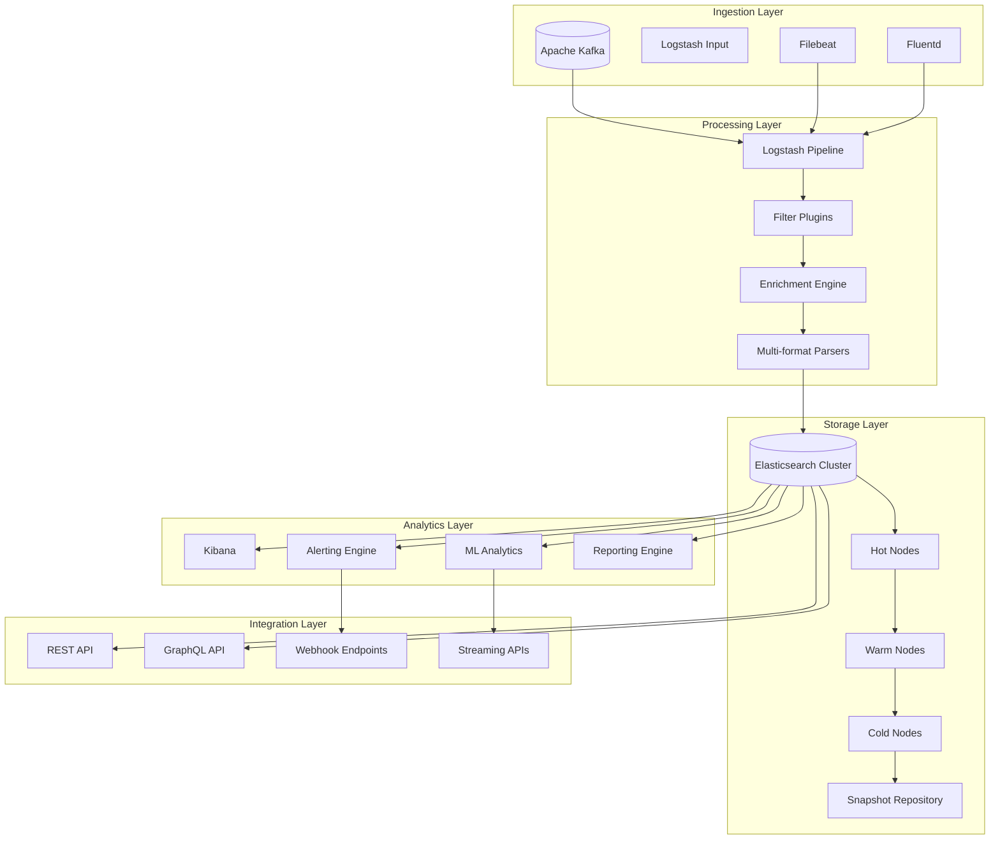

# Specifiche Tecniche - MS10-LOGGER

**Navigazione**: [README.md](README.md) | [← SPECIFICATION.md](SPECIFICATION.md) | [API.md](API.md) | [DATABASE-SCHEMA.md](DATABASE-SCHEMA.md) | [TROUBLESHOUTING.md](TROUBLESHOUTING.md) | [Back to MS →](../MS-ARCHITECTURE-MASTER.md#ms10--logger)

## 1. Panoramica Architetturale

MS10-LOGGER implementa una soluzione enterprise di log aggregation e analytics basata su ELK Stack (Elasticsearch, Logstash, Kibana) integrata con Apache Kafka per ingestion ad alto volume. Il sistema garantisce raccolta centralizzata, elaborazione real-time e analisi avanzata dei log di sistema.

**Paradigma Architetturale**: Event-Driven Log Aggregation + Real-Time Analytics
**Stile di Design**: Lambda Architecture (Speed Layer + Batch Layer)
**Pattern di Scalabilità**: Horizontal Scaling + Data Partitioning

## 2. Architettura Dettagliata

### 2.1 Componenti Architetturali



### 2.2 Logstash Processing Pipeline

**Tecnologie**: Logstash 8.x + Custom Plugins
**Throughput**: Fino a 100,000 eventi/secondo per pipeline
**Latency**: < 100ms end-to-end per evento semplice

#### Pipeline Configuration
```ruby
# logstash.conf
input {
  kafka {
    bootstrap_servers => "kafka-cluster:9092"
    topics => ["zenia-logs", "zenia-events", "zenia-metrics"]
    consumer_threads => 3
    decorate_events => true
    codec => json
  }

  beats {
    port => 5044
    ssl => true
    ssl_certificate => "/etc/ssl/certs/logstash.crt"
    ssl_key => "/etc/ssl/private/logstash.key"
  }
}

filter {
  # Parsing e normalizzazione
  json {
    source => "message"
    target => "parsed"
  }

  # Enrichment con metadati
  mutate {
    add_field => {
      "processing_timestamp" => "%{+YYYY-MM-dd HH:mm:ss.SSS}"
      "pipeline_version" => "2.1.0"
    }
  }

  # Geo enrichment
  geoip {
    source => "client_ip"
    target => "geo"
    database => "/etc/logstash/geoip/GeoLite2-City.mmdb"
  }

  # Tenant enrichment
  translate {
    field => "tenant_id"
    destination => "tenant_info"
    dictionary => {
      "tenant-pa-roma" => '{"name":"Comune di Roma","type":"PA","region":"Lazio"}'
      "tenant-pa-milano" => '{"name":"Comune di Milano","type":"PA","region":"Lombardia"}'
    }
    exact => true
    override => true
  }

  # Correlation ID extraction
  grok {
    match => { "message" => "%{SYSLOGTIMESTAMP:timestamp} %{WORD:level} %{DATA:correlation_id}" }
    tag_on_failure => ["grok_parse_failure"]
  }

  # Error classification
  if [level] == "ERROR" or [level] == "FATAL" {
    mutate {
      add_tag => ["error_event"]
      add_field => { "error_category" => "application_error" }
    }
  }

  # Performance metrics extraction
  if [metrics] {
    json {
      source => "metrics"
      target => "parsed_metrics"
    }
  }
}

output {
  # Main Elasticsearch output
  elasticsearch {
    hosts => ["es-hot-01:9200", "es-hot-02:9200", "es-hot-03:9200"]
    index => "zenia-logs-%{+YYYY.MM.dd}"
    document_type => "_doc"
    template => "/etc/logstash/templates/zenia-logs.json"
    template_name => "zenia-logs"
    template_overwrite => true
  }

  # Error events to separate index
  if "error_event" in [tags] {
    elasticsearch {
      hosts => ["es-hot-01:9200"]
      index => "zenia-errors-%{+YYYY.MM.dd}"
      document_type => "_doc"
    }
  }

  # Security events
  if [event_type] == "SECURITY_VIOLATION" {
    elasticsearch {
      hosts => ["es-hot-01:9200"]
      index => "zenia-security-%{+YYYY.MM.dd}"
      document_type => "_doc"
    }
  }

  # Audit logs
  if [log_type] == "audit" {
    elasticsearch {
      hosts => ["es-hot-01:9200"]
      index => "zenia-audit-%{+YYYY.MM.dd}"
      document_type => "_doc"
    }
  }
}
```

### 2.3 Elasticsearch Cluster Architecture

**Versione**: Elasticsearch 8.x
**Cluster Size**: 9 nodi (3 Hot + 3 Warm + 3 Cold)
**Storage**: 50TB totali con data tiering

#### Index Lifecycle Management
```json
{
  "policy": {
    "phases": {
      "hot": {
        "min_age": "0ms",
        "actions": {
          "rollover": {
            "max_age": "1d",
            "max_size": "50gb"
          },
          "set_priority": {
            "priority": 100
          }
        }
      },
      "warm": {
        "min_age": "7d",
        "actions": {
          "allocate": {
            "number_of_replicas": 1,
            "include": { "data": "warm" }
          },
          "shrink": {
            "number_of_shards": 1
          },
          "set_priority": {
            "priority": 50
          }
        }
      },
      "cold": {
        "min_age": "30d",
        "actions": {
          "allocate": {
            "number_of_replicas": 0,
            "include": { "data": "cold" }
          },
          "set_priority": {
            "priority": 0
          },
          "searchable_snapshot": {
            "snapshot_repository": "cold_snapshots"
          }
        }
      },
      "delete": {
        "min_age": "365d",
        "actions": {
          "delete": {}
        }
      }
    }
  }
}
```

#### Index Template Configuration
```json
{
  "index_patterns": ["zenia-logs-*"],
  "template": {
    "settings": {
      "number_of_shards": 3,
      "number_of_replicas": 1,
      "refresh_interval": "30s",
      "index.codec": "best_compression",
      "analysis": {
        "analyzer": {
          "zenia_analyzer": {
            "type": "custom",
            "tokenizer": "standard",
            "filter": ["lowercase", "zenia_stop", "zenia_stemmer"]
          }
        },
        "filter": {
          "zenia_stop": {
            "type": "stop",
            "stopwords": ["_italian_"]
          },
          "zenia_stemmer": {
            "type": "stemmer",
            "language": "italian"
          }
        }
      }
    },
    "mappings": {
      "properties": {
        "timestamp": {
          "type": "date",
          "format": "strict_date_optional_time||epoch_millis"
        },
        "level": {
          "type": "keyword"
        },
        "service": {
          "type": "keyword"
        },
        "instance": {
          "type": "keyword"
        },
        "tenant_id": {
          "type": "keyword"
        },
        "correlation_id": {
          "type": "keyword",
          "index": true
        },
        "user_id": {
          "type": "keyword"
        },
        "session_id": {
          "type": "keyword"
        },
        "message": {
          "type": "text",
          "analyzer": "zenia_analyzer",
          "fields": {
            "keyword": {
              "type": "keyword",
              "ignore_above": 256
            }
          }
        },
        "context": {
          "type": "object",
          "dynamic": true
        },
        "mdc": {
          "type": "object",
          "dynamic": true
        },
        "metrics": {
          "type": "object",
          "dynamic": true
        },
        "geo": {
          "type": "object",
          "properties": {
            "country_name": {"type": "keyword"},
            "city_name": {"type": "keyword"},
            "region_name": {"type": "keyword"},
            "location": {"type": "geo_point"}
          }
        },
        "processing_timestamp": {
          "type": "date",
          "format": "yyyy-MM-dd HH:mm:ss.SSS"
        },
        "pipeline_version": {
          "type": "keyword"
        }
      }
    }
  }
}
```

### 2.4 Kafka Integration

**Cluster**: 3 broker con replication factor 3
**Topics**: Partizionati per tenant e tipo di log
**Throughput**: 500MB/s ingress, 1GB/s egress

#### Topic Configuration
```yaml
# Kafka topics configuration
topics:
  - name: zenia-application-logs
    partitions: 12
    replication-factor: 3
    config:
      retention.ms: 604800000  # 7 days
      segment.bytes: 1073741824  # 1GB
      cleanup.policy: delete

  - name: zenia-security-events
    partitions: 6
    replication-factor: 3
    config:
      retention.ms: 2592000000  # 30 days
      cleanup.policy: compact

  - name: zenia-audit-logs
    partitions: 3
    replication-factor: 3
    config:
      retention.ms: -1  # Never delete
      cleanup.policy: compact

  - name: zenia-metrics
    partitions: 9
    replication-factor: 3
    config:
      retention.ms: 86400000  # 24 hours
      cleanup.policy: delete
```

## 3. Modelli di Dati

### 3.1 Log Entry Model

```json
{
  "$schema": "https://zenia.local/schemas/log-entry-v2.0.json",
  "id": "log-123456789-abcdef-001",
  "timestamp": "2024-01-15T10:30:45.123Z",
  "ingestion_timestamp": "2024-01-15T10:30:45.145Z",
  "processing_timestamp": "2024-01-15T10:30:45.167Z",

  "source": {
    "type": "application",
    "service": "ms01-classifier",
    "instance": "ms01-classifier-7x9k2",
    "version": "2.1.0",
    "environment": "production",
    "region": "eu-west-1"
  },

  "context": {
    "tenant_id": "tenant-pa-roma",
    "user_id": "user-pa-roma-789",
    "session_id": "session-pa-roma-20240115-001",
    "correlation_id": "corr-123-abc-456-def-789-ghi",
    "request_id": "req-456-def-789-ghi-jkl",
    "trace_id": "trace-789-ghi-jkl-mno-pqr"
  },

  "log": {
    "level": "INFO",
    "logger": "com.zenia.classifier.DocumentClassifier",
    "thread": "workflow-executor-5",
    "message": "Document classification completed successfully",
    "formatted_message": "2024-01-15 10:30:45.123 INFO [workflow-executor-5] com.zenia.classifier.DocumentClassifier - Document classification completed successfully"
  },

  "data": {
    "document_id": "DOC-2024-001234-ABC",
    "classification_result": {
      "category": "provvedimento",
      "confidence": 0.87,
      "subcategories": ["autorizzazione", "ambientale"],
      "processing_time_ms": 1250,
      "model_version": "pa-documents-v2.1"
    },
    "metrics": {
      "cpu_usage_percent": 45.2,
      "memory_usage_mb": 512.8,
      "response_time_ms": 1250
    }
  },

  "mdc": {
    "client_ip": "192.168.1.100",
    "user_agent": "ZenIA-PA-Portal/2.1.0",
    "request_method": "POST",
    "request_uri": "/api/v1/classify",
    "response_status": 200
  },

  "enrichment": {
    "geo": {
      "country_name": "Italy",
      "city_name": "Rome",
      "region_name": "Lazio",
      "location": {
        "lat": 41.9028,
        "lon": 12.4964
      }
    },
    "tenant_info": {
      "name": "Comune di Roma",
      "type": "PA",
      "region": "Lazio",
      "compliance_level": "high"
    },
    "user_info": {
      "full_name": "Mario Rossi",
      "role": "operator",
      "department": "Ambiente",
      "clearance_level": "standard"
    }
  },

  "processing": {
    "pipeline_version": "2.1.0",
    "processing_node": "logstash-02",
    "parsing_errors": [],
    "enrichment_errors": [],
    "warnings": []
  },

  "tags": ["application", "classification", "success"],
  "labels": {
    "severity": "info",
    "category": "business",
    "compliance": "gdpr-compliant"
  }
}
```

### 3.2 Security Event Model

```json
{
  "$schema": "https://zenia.local/schemas/security-event-v1.0.json",
  "id": "sec-123456789-abcdef-002",
  "timestamp": "2024-01-15T10:31:00.000Z",
  "event_type": "SECURITY_VIOLATION",
  "severity": "HIGH",

  "source": {
    "service": "ms03-orchestrator",
    "instance": "ms03-orchestrator-4n2m8",
    "component": "authorization"
  },

  "actor": {
    "user_id": "user-pa-roma-789",
    "session_id": "session-pa-roma-20240115-001",
    "ip_address": "192.168.1.100",
    "user_agent": "ZenIA-PA-Portal/2.1.0",
    "location": {
      "country": "Italy",
      "city": "Rome"
    }
  },

  "resource": {
    "type": "api_endpoint",
    "identifier": "/api/v1/workflows/admin/bulk-action",
    "method": "POST",
    "parameters": {
      "action": "delete",
      "workflow_ids": ["wf-123", "wf-456"]
    }
  },

  "violation": {
    "type": "INSUFFICIENT_PERMISSIONS",
    "description": "User attempted to perform administrative action without required role",
    "required_roles": ["ADMIN", "WORKFLOW_ADMIN"],
    "actual_roles": ["USER"],
    "policy_id": "workflow-admin-policy-v2"
  },

  "context": {
    "correlation_id": "corr-123-abc-456-def-789-ghi",
    "request_id": "req-456-def-789-ghi-jkl",
    "tenant_id": "tenant-pa-roma",
    "session_start": "2024-01-15T09:30:00Z"
  },

  "response": {
    "status_code": 403,
    "status_text": "Forbidden",
    "response_time_ms": 45
  },

  "enrichment": {
    "risk_score": 8.5,
    "similar_events_count": 3,
    "user_risk_profile": "low",
    "ip_reputation": "trusted"
  },

  "mitigation": {
    "actions_taken": ["session_logged", "alert_generated"],
    "recommended_actions": ["review_user_permissions", "monitor_user_activity"],
    "escalation_required": false
  }
}
```

### 3.3 Audit Log Model

```json
{
  "$schema": "https://zenia.local/schemas/audit-log-v1.0.json",
  "id": "audit-123456789-abcdef-003",
  "timestamp": "2024-01-15T10:32:15.000Z",
  "event_type": "DATA_ACCESS",

  "actor": {
    "type": "user",
    "identifier": "user-pa-roma-789",
    "name": "Mario Rossi",
    "roles": ["USER"],
    "department": "Ambiente"
  },

  "action": {
    "name": "DOCUMENT_VIEW",
    "category": "READ",
    "description": "User viewed document details"
  },

  "resource": {
    "type": "document",
    "identifier": "DOC-2024-001234-ABC",
    "attributes": {
      "type": "provvedimento",
      "classification": "autorizzazione_ambientale",
      "size_bytes": 2048576,
      "created_date": "2024-01-10"
    }
  },

  "context": {
    "tenant_id": "tenant-pa-roma",
    "session_id": "session-pa-roma-20240115-001",
    "correlation_id": "corr-123-abc-456-def-789-ghi",
    "ip_address": "192.168.1.100",
    "user_agent": "ZenIA-PA-Portal/2.1.0",
    "location": "Rome, Italy"
  },

  "result": {
    "status": "SUCCESS",
    "details": {
      "access_granted": true,
      "data_returned": true,
      "fields_accessed": ["content", "metadata", "classification"]
    }
  },

  "compliance": {
    "gdpr_compliant": true,
    "retention_required": true,
    "retention_period_years": 7,
    "data_sensitivity": "personal"
  },

  "enrichment": {
    "business_context": "Autorizzazione ambientale richiesta",
    "regulatory_reference": "D.Lgs. 152/2006",
    "risk_assessment": "low"
  }
}
```

## 4. Protocolli di Comunicazione

### 4.1 Log Ingestion Protocols

#### Kafka Protocol
```protobuf
syntax = "proto3";

package zenia.logging;

message LogEntry {
  string id = 1;
  google.protobuf.Timestamp timestamp = 2;
  Source source = 3;
  Context context = 4;
  LogData log = 5;
  google.protobuf.Struct data = 6;
  google.protobuf.Struct mdc = 7;

  message Source {
    string type = 1;
    string service = 2;
    string instance = 3;
    string version = 4;
  }

  message Context {
    string tenant_id = 1;
    string user_id = 2;
    string correlation_id = 3;
  }

  message LogData {
    string level = 1;
    string message = 2;
    string logger = 3;
  }
}
```

#### HTTP Ingestion API
```http
POST /ms10-logger/v1/logs/bulk
Content-Type: application/json
Authorization: Bearer {service-token}
X-Tenant-ID: tenant-pa-roma

{
  "entries": [
    {
      "timestamp": "2024-01-15T10:30:45.123Z",
      "level": "INFO",
      "service": "ms01-classifier",
      "message": "Document processed successfully",
      "context": {
        "document_id": "DOC-2024-001234-ABC",
        "correlation_id": "corr-123-abc-456-def"
      }
    }
  ]
}
```

### 4.2 Query Protocols

#### Elasticsearch Query DSL
```json
{
  "query": {
    "bool": {
      "must": [
        {"term": {"tenant_id": "tenant-pa-roma"}},
        {"term": {"level": "ERROR"}},
        {"range": {"timestamp": {"gte": "now-1h"}}}
      ],
      "should": [
        {"match": {"service": "ms01-classifier"}},
        {"match": {"correlation_id": "corr-123-abc-456-def"}}
      ]
    }
  },
  "sort": [
    {"timestamp": {"order": "desc"}}
  ],
  "size": 100,
  "_source": ["timestamp", "level", "service", "message", "correlation_id"]
}
```

#### GraphQL Query Interface
```graphql
query GetApplicationLogs(
  $tenantId: String!
  $timeRange: TimeRange!
  $filters: LogFilters
  $pagination: Pagination
) {
  logs(tenantId: $tenantId, timeRange: $timeRange, filters: $filters, pagination: $pagination) {
    edges {
      node {
        id
        timestamp
        level
        service
        message
        correlationId
        context
        metrics
      }
    }
    pageInfo {
      hasNextPage
      endCursor
    }
    totalCount
  }
}

query GetErrorAnalytics($tenantId: String!, $period: String!) {
  errorAnalytics(tenantId: $tenantId, period: $period) {
    byService {
      service
      errorCount
      errorRate
      topErrors {
        message
        count
        firstSeen
        lastSeen
      }
    }
    trends {
      timestamp
      errorCount
      uniqueErrors
    }
  }
}
```

## 5. Sicurezza e Compliance

### 5.1 Data Encryption

**At-Rest Encryption**:
```yaml
elasticsearch:
  security:
    encryption:
      at_rest:
        type: AES256
        key_provider: aws-kms
        key_id: alias/zenia-logging-encryption

kafka:
  security:
    encryption:
      inter_broker: TLS
      client_broker: TLS
      cipher_suites:
        - TLS_ECDHE_RSA_WITH_AES_256_GCM_SHA384
```

**In-Transit Encryption**:
```yaml
network:
  encryption:
    protocols:
      - TLS 1.3
    certificate_authority: zenia-ca
    certificate_rotation: 90d
    mutual_tls: enabled
```

### 5.2 Access Control

#### Role-Based Access Control
```json
{
  "roles": {
    "log_viewer": {
      "indices": ["zenia-logs-*"],
      "permissions": ["read"],
      "filters": [
        {"term": {"tenant_id": "{{tenant_id}}"}}
      ]
    },
    "log_admin": {
      "indices": ["*"],
      "permissions": ["read", "write", "delete", "admin"],
      "filters": []
    },
    "security_analyst": {
      "indices": ["zenia-security-*", "zenia-audit-*"],
      "permissions": ["read"],
      "filters": []
    }
  }
}
```

#### Attribute-Based Access Control
```json
{
  "policies": [
    {
      "name": "tenant_data_isolation",
      "effect": "allow",
      "principals": ["user:*"],
      "actions": ["es:Read"],
      "resources": ["index:zenia-logs-*"],
      "conditions": {
        "StringEquals": {
          "tenant_id": "${user.tenant_id}"
        }
      }
    },
    {
      "name": "correlation_id_access",
      "effect": "allow",
      "principals": ["user:*"],
      "actions": ["es:Read"],
      "resources": ["index:zenia-logs-*"],
      "conditions": {
        "StringEquals": {
          "correlation_id": "${user.current_correlation_id}"
        }
      }
    }
  ]
}
```

### 5.3 Audit e Compliance

#### Audit Trail
```json
{
  "audit_entry": {
    "id": "audit-log-access-123456",
    "timestamp": "2024-01-15T10:35:00Z",
    "event_type": "LOG_ACCESS",
    "actor": {
      "user_id": "user-pa-roma-789",
      "roles": ["USER"],
      "ip_address": "192.168.1.100"
    },
    "action": {
      "type": "SEARCH",
      "resource": "zenia-logs-2024-01-15",
      "query": "level:ERROR AND service:ms01-classifier"
    },
    "result": {
      "status": "SUCCESS",
      "records_returned": 25,
      "query_duration_ms": 150
    },
    "compliance": {
      "gdpr_compliant": true,
      "retention_years": 7,
      "data_classification": "sensitive"
    }
  }
}
```

## 6. Performance e Scalabilità

### 6.1 Metriche di Performance

| Componente | Metrica | Target | Alert Threshold |
|------------|---------|--------|-----------------|
| Logstash | Events/second | 50,000 | < 25,000 |
| Elasticsearch | Query latency P95 | 200ms | > 1s |
| Kafka | Producer latency | 10ms | > 100ms |
| Storage | Daily growth rate | < 200GB | > 500GB |
| Search | Concurrent queries | 1,000 | < 500 |

### 6.2 Scalabilità Automatica

#### Horizontal Pod Autoscaling
```yaml
apiVersion: autoscaling/v2
kind: HorizontalPodAutoscaler
metadata:
  name: logstash-hpa
spec:
  scaleTargetRef:
    apiVersion: apps/v1
    kind: Deployment
    name: logstash
  minReplicas: 3
  maxReplicas: 10
  metrics:
  - type: Resource
    resource:
      name: cpu
      target:
        type: Utilization
        averageUtilization: 70
  - type: External
    external:
      metric:
        name: kafka_consumer_lag
        selector:
          matchLabels:
            topic: zenia-logs
      target:
        type: AverageValue
        averageValue: "1000"
```

#### Elasticsearch Auto-scaling
```json
{
  "persistent": {
    "cluster": {
      "routing": {
        "allocation": {
          "disk": {
            "watermark": {
              "low": "85%",
              "high": "90%",
              "flood_stage": "95%"
            }
          }
        }
      }
    }
  }
}
```

## 7. Disaster Recovery

### 7.1 Backup Strategy

**Elasticsearch Snapshots**:
```json
{
  "snapshot": {
    "repository": "s3_repository",
    "indices": "zenia-logs-*",
    "ignore_unavailable": true,
    "include_global_state": false,
    "partial": false
  }
}
```

**Kafka Data Backup**:
```bash
#!/bin/bash
# kafka-backup.sh

TOPICS=("zenia-logs" "zenia-events" "zenia-metrics")
BACKUP_DIR="/backup/kafka/$(date +%Y%m%d)"

for topic in "${TOPICS[@]}"; do
  kafka-console-consumer \
    --bootstrap-server kafka-cluster:9092 \
    --topic "$topic" \
    --from-beginning \
    --timeout-ms 60000 > "$BACKUP_DIR/$topic.json"
done
```

### 7.2 Recovery Procedures

**Elasticsearch Recovery**:
```bash
# Restore from snapshot
curl -X POST "elasticsearch:9200/_snapshot/s3_repository/snapshot_20240115/_restore" \
  -H 'Content-Type: application/json' \
  -d '{
    "indices": "zenia-logs-*",
    "ignore_unavailable": true
  }'
```

**Logstash Configuration Recovery**:
```yaml
# logstash-recovery-config.yml
apiVersion: v1
kind: ConfigMap
metadata:
  name: logstash-recovery-config
data:
  pipelines.yml: |
    - pipeline.id: recovery-pipeline
      path.config: "/usr/share/logstash/pipeline/recovery.conf"
      pipeline.workers: 1
      pipeline.batch.size: 1
```

## 8. Monitoraggio e Osservabilità

### 8.1 Metriche Custom

```java
@Service
public class LoggingMetricsService {

    private final MeterRegistry registry;

    @Autowired
    public LoggingMetricsService(MeterRegistry registry) {
        this.registry = registry;
    }

    public void recordLogIngestion(String source, int count) {
        Counter.builder("zenia_logs_ingested_total")
            .tag("source", source)
            .register(registry)
            .increment(count);
    }

    public void recordQueryExecution(String queryType, long durationMs) {
        Timer.builder("zenia_log_query_duration_seconds")
            .tag("query_type", queryType)
            .register(registry)
            .record(Duration.ofMillis(durationMs));
    }

    public void recordStorageUsage(String index, long bytes) {
        Gauge.builder("zenia_log_storage_bytes", () -> bytes)
            .tag("index", index)
            .register(registry);
    }

    public void recordAlertTriggered(String alertType, String severity) {
        Counter.builder("zenia_log_alerts_triggered_total")
            .tag("alert_type", alertType)
            .tag("severity", severity)
            .register(registry)
            .increment();
    }
}
```

### 8.2 Health Checks

```java
@Component
public class LoggingHealthIndicator implements HealthIndicator {

    private final ElasticsearchClient esClient;
    private final KafkaAdminClient kafkaAdmin;

    @Override
    public Health health() {
        try {
            // Check Elasticsearch connectivity
            var clusterHealth = esClient.cluster().health();
            if (clusterHealth.status() != ClusterHealthStatus.GREEN &&
                clusterHealth.status() != ClusterHealthStatus.YELLOW) {
                return Health.down()
                    .withDetail("elasticsearch", "Cluster status: " + clusterHealth.status())
                    .build();
            }

            // Check Kafka connectivity
            var topics = kafkaAdmin.listTopics();
            if (!topics.names().get().contains("zenia-logs")) {
                return Health.down()
                    .withDetail("kafka", "Required topic 'zenia-logs' not found")
                    .build();
            }

            // Check ingestion rate
            var ingestionRate = getCurrentIngestionRate();
            if (ingestionRate < 1000) { // logs per minute
                return Health.down()
                    .withDetail("ingestion_rate", "Low ingestion rate: " + ingestionRate + "/min")
                    .build();
            }

            return Health.up()
                .withDetail("elasticsearch", clusterHealth.status().toString())
                .withDetail("kafka_topics", topics.names().get().size())
                .withDetail("ingestion_rate", ingestionRate + "/min")
                .build();

        } catch (Exception e) {
            return Health.down(e)
                .withDetail("error", e.getMessage())
                .build();
        }
    }
}
```

Questa documentazione tecnica fornisce le specifiche complete per l'implementazione di MS10-LOGGER, coprendo tutti gli aspetti architetturali, di sicurezza, performance e operational del sistema di logging centralizzato di ZenIA.