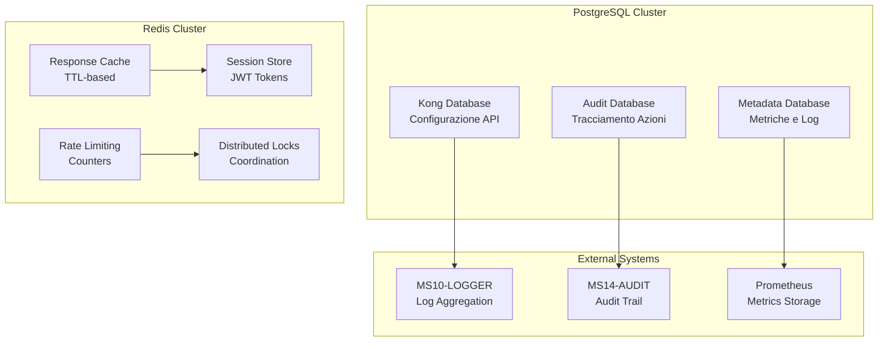

# MS11-GATEWAY - Schema Database

> **Database Schema per API Gateway ZenIA - PostgreSQL e Redis**

[](https://postgresql.org)
[](https://redis.io)
[](https://konghq.com)

## 🎯 Overview Database

MS11-GATEWAY utilizza due sistemi di storage principali:

- **PostgreSQL** - Database relazionale per configurazione Kong e metadati
- **Redis** - Cache distribuito per sessioni, rate limiting e caching risposte

### Architettura Storage



## 🐘 PostgreSQL Schema

### Database Kong (kong)

Kong utilizza PostgreSQL per memorizzare configurazione API, servizi, routes, plugins, consumer e certificati.

#### Schema Principale

```sql
-- Kong Database Schema (Version 3.4.x)
-- Tabella principale dei servizi
CREATE TABLE IF NOT EXISTS services (
    id uuid PRIMARY KEY DEFAULT gen_random_uuid(),
    created_at timestamp with time zone DEFAULT (now() AT TIME ZONE 'utc'),
    updated_at timestamp with time zone DEFAULT (now() AT TIME ZONE 'utc'),
    name text UNIQUE,
    protocol text NOT NULL DEFAULT 'http',
    host text NOT NULL,
    port integer NOT NULL DEFAULT 80,
    path text,
    connect_timeout integer DEFAULT 60000,
    write_timeout integer DEFAULT 60000,
    read_timeout integer DEFAULT 60000,
    retries integer DEFAULT 5,
    client_certificate_id uuid REFERENCES certificates(id) ON DELETE SET NULL,
    tls_verify boolean DEFAULT false,
    tls_verify_depth integer DEFAULT 1,
    ca_certificates uuid[] DEFAULT ARRAY[]::uuid[],
    tags text[] DEFAULT ARRAY[]::text[]
);

-- Tabella delle routes
CREATE TABLE IF NOT EXISTS routes (
    id uuid PRIMARY KEY DEFAULT gen_random_uuid(),
    created_at timestamp with time zone DEFAULT (now() AT TIME ZONE 'utc'),
    updated_at timestamp with time zone DEFAULT (now() AT TIME ZONE 'utc'),
    service_id uuid NOT NULL REFERENCES services(id) ON DELETE CASCADE,
    name text UNIQUE,
    methods text[] DEFAULT ARRAY[]::text[],
    hosts text[] DEFAULT ARRAY[]::text[],
    paths text[] DEFAULT ARRAY[]::text[],
    headers jsonb DEFAULT '{}'::jsonb,
    https_redirect_status_code integer DEFAULT 426,
    regex_priority integer DEFAULT 0,
    strip_path boolean DEFAULT true,
    path_handling text DEFAULT 'v0',
    preserve_host boolean DEFAULT false,
    request_buffering boolean DEFAULT true,
    response_buffering boolean DEFAULT true,
    tags text[] DEFAULT ARRAY[]::text[]
);

-- Tabella dei consumer (utenti API)
CREATE TABLE IF NOT EXISTS consumers (
    id uuid PRIMARY KEY DEFAULT gen_random_uuid(),
    created_at timestamp with time zone DEFAULT (now() AT TIME ZONE 'utc'),
    updated_at timestamp with time zone DEFAULT (now() AT TIME ZONE 'utc'),
    username text UNIQUE,
    custom_id text UNIQUE,
    tags text[] DEFAULT ARRAY[]::text[]
);

-- Tabella dei plugin
CREATE TABLE IF NOT EXISTS plugins (
    id uuid PRIMARY KEY DEFAULT gen_random_uuid(),
    created_at timestamp with time zone DEFAULT (now() AT TIME ZONE 'utc'),
    updated_at timestamp with time zone DEFAULT (now() AT TIME ZONE 'utc'),
    name text NOT NULL,
    service_id uuid REFERENCES services(id) ON DELETE CASCADE,
    route_id uuid REFERENCES routes(id) ON DELETE CASCADE,
    consumer_id uuid REFERENCES consumers(id) ON DELETE CASCADE,
    config jsonb NOT NULL DEFAULT '{}'::jsonb,
    enabled boolean NOT NULL DEFAULT true,
    tags text[] DEFAULT ARRAY[]::text[],
    UNIQUE(service_id, route_id, consumer_id, name)
);

-- Tabella delle chiavi API
CREATE TABLE IF NOT EXISTS keyauth_credentials (
    id uuid PRIMARY KEY DEFAULT gen_random_uuid(),
    created_at timestamp with time zone DEFAULT (now() AT TIME ZONE 'utc'),
    updated_at timestamp with time zone DEFAULT (now() AT TIME ZONE 'utc'),
    consumer_id uuid NOT NULL REFERENCES consumers(id) ON DELETE CASCADE,
    key text UNIQUE NOT NULL,
    tags text[] DEFAULT ARRAY[]::text[]
);

-- Tabella JWT credentials
CREATE TABLE IF NOT EXISTS jwt_secrets (
    id uuid PRIMARY KEY DEFAULT gen_random_uuid(),
    created_at timestamp with time zone DEFAULT (now() AT TIME ZONE 'utc'),
    updated_at timestamp with time zone DEFAULT (now() AT TIME ZONE 'utc'),
    consumer_id uuid NOT NULL REFERENCES consumers(id) ON DELETE CASCADE,
    secret text NOT NULL,
    algorithm text DEFAULT 'HS256',
    rsa_public_key text,
    key text UNIQUE,
    tags text[] DEFAULT ARRAY[]::text[]
);

-- Tabella certificati SSL
CREATE TABLE IF NOT EXISTS certificates (
    id uuid PRIMARY KEY DEFAULT gen_random_uuid(),
    created_at timestamp with time zone DEFAULT (now() AT TIME ZONE 'utc'),
    updated_at timestamp with time zone DEFAULT (now() AT TIME ZONE 'utc'),
    cert text NOT NULL,
    key text NOT NULL,
    tags text[] DEFAULT ARRAY[]::text[]
);

-- Tabella SNI (Server Name Indication)
CREATE TABLE IF NOT EXISTS snis (
    id uuid PRIMARY KEY DEFAULT gen_random_uuid(),
    created_at timestamp with time zone DEFAULT (now() AT TIME ZONE 'utc'),
    updated_at timestamp with time zone DEFAULT (now() AT TIME ZONE 'utc'),
    name text UNIQUE NOT NULL,
    certificate_id uuid NOT NULL REFERENCES certificates(id) ON DELETE CASCADE,
    tags text[] DEFAULT ARRAY[]::text[]
);

-- Tabella upstreams per load balancing
CREATE TABLE IF NOT EXISTS upstreams (
    id uuid PRIMARY KEY DEFAULT gen_random_uuid(),
    created_at timestamp with time zone DEFAULT (now() AT TIME ZONE 'utc'),
    updated_at timestamp with time zone DEFAULT (now() AT TIME ZONE 'utc'),
    name text UNIQUE NOT NULL,
    algorithm text DEFAULT 'round-robin',
    hash_on text,
    hash_fallback text,
    hash_on_cookie_path text,
    slots integer DEFAULT 10000,
    healthchecks jsonb DEFAULT '{"active": {"healthy": {"interval": 0, "successes": 0}, "unhealthy": {"interval": 0, "tcp_failures": 0, "timeouts": 0, "http_failures": 0, "http_statuses": []}, "passive": {"healthy": {"successes": 0}, "unhealthy": {"tcp_failures": 0, "timeouts": 0, "http_failures": 0, "http_statuses": []}}, "threshold": 0}'::jsonb,
    tags text[] DEFAULT ARRAY[]::text[]
);

-- Tabella targets per upstream
CREATE TABLE IF NOT EXISTS targets (
    id uuid PRIMARY KEY DEFAULT gen_random_uuid(),
    created_at timestamp with time zone DEFAULT (now() AT TIME ZONE 'utc'),
    updated_at timestamp with time zone DEFAULT (now() AT TIME ZONE 'utc'),
    upstream_id uuid NOT NULL REFERENCES upstreams(id) ON DELETE CASCADE,
    target text NOT NULL,
    weight integer DEFAULT 100,
    tags text[] DEFAULT ARRAY[]::text[],
    UNIQUE(upstream_id, target)
);
```

#### Schema Metadata (zenia_gateway_metadata)

Database dedicato per metriche, log e configurazione aggiuntiva del gateway.

```sql
-- Database: zenia_gateway_metadata
-- Schema per metriche e metadati del gateway

-- Tabella richieste API
CREATE TABLE IF NOT EXISTS api_requests (
    id bigserial PRIMARY KEY,
    request_id varchar(255) UNIQUE NOT NULL,
    correlation_id varchar(255),
    timestamp timestamp with time zone DEFAULT now(),
    method varchar(10) NOT NULL,
    path text NOT NULL,
    query_string text,
    user_agent text,
    client_ip inet NOT NULL,
    consumer_id uuid,
    service_name varchar(255),
    route_name varchar(255),
    response_status integer,
    response_time_ms integer,
    request_size_bytes bigint,
    response_size_bytes bigint,
    user_id varchar(255),
    session_id varchar(255),
    api_version varchar(50),
    rate_limit_exceeded boolean DEFAULT false,
    cached_response boolean DEFAULT false,
    error_message text,
    tags jsonb DEFAULT '{}'::jsonb
);

-- Tabella metriche aggregate
CREATE TABLE IF NOT EXISTS metrics_aggregated (
    id bigserial PRIMARY KEY,
    timestamp timestamp with time zone DEFAULT now(),
    service_name varchar(255) NOT NULL,
    route_name varchar(255),
    time_bucket varchar(50) NOT NULL, -- '1m', '5m', '1h', '1d'
    request_count bigint DEFAULT 0,
    error_count bigint DEFAULT 0,
    avg_response_time_ms numeric(10,2),
    p95_response_time_ms numeric(10,2),
    p99_response_time_ms numeric(10,2),
    total_request_size_bytes bigint DEFAULT 0,
    total_response_size_bytes bigint DEFAULT 0,
    unique_clients_count integer DEFAULT 0,
    rate_limit_hits bigint DEFAULT 0,
    cache_hits bigint DEFAULT 0,
    cache_misses bigint DEFAULT 0,
    UNIQUE(service_name, route_name, time_bucket, timestamp)
);

-- Tabella health checks upstream
CREATE TABLE IF NOT EXISTS upstream_health (
    id bigserial PRIMARY KEY,
    timestamp timestamp with time zone DEFAULT now(),
    upstream_name varchar(255) NOT NULL,
    target varchar(255) NOT NULL,
    healthy boolean NOT NULL,
    response_time_ms integer,
    error_message text,
    check_type varchar(50) DEFAULT 'active', -- 'active', 'passive'
    consecutive_failures integer DEFAULT 0,
    tags jsonb DEFAULT '{}'::jsonb
);

-- Tabella configurazioni dinamiche
CREATE TABLE IF NOT EXISTS dynamic_configs (
    id bigserial PRIMARY KEY,
    config_key varchar(255) UNIQUE NOT NULL,
    config_value jsonb NOT NULL,
    config_type varchar(50) NOT NULL, -- 'route', 'plugin', 'upstream', 'global'
    service_name varchar(255),
    route_name varchar(255),
    version integer DEFAULT 1,
    is_active boolean DEFAULT true,
    created_at timestamp with time zone DEFAULT now(),
    updated_at timestamp with time zone DEFAULT now(),
    created_by varchar(255),
    description text
);

-- Tabella audit trail
CREATE TABLE IF NOT EXISTS audit_log (
    id bigserial PRIMARY KEY,
    timestamp timestamp with time zone DEFAULT now(),
    action varchar(50) NOT NULL, -- 'CREATE', 'UPDATE', 'DELETE', 'LOGIN', 'LOGOUT'
    resource_type varchar(50) NOT NULL, -- 'service', 'route', 'plugin', 'consumer'
    resource_id varchar(255),
    resource_name varchar(255),
    user_id varchar(255),
    user_name varchar(255),
    client_ip inet,
    user_agent text,
    old_values jsonb,
    new_values jsonb,
    success boolean DEFAULT true,
    error_message text,
    correlation_id varchar(255),
    tags jsonb DEFAULT '{}'::jsonb
);

-- Tabella rate limiting counters
CREATE TABLE IF NOT EXISTS rate_limit_counters (
    id bigserial PRIMARY KEY,
    identifier varchar(255) NOT NULL, -- consumer_id, ip, etc.
    limit_type varchar(50) NOT NULL, -- 'minute', 'hour', 'day'
    window_start timestamp with time zone NOT NULL,
    window_end timestamp with time zone NOT NULL,
    counter bigint DEFAULT 0,
    limit_value bigint NOT NULL,
    last_updated timestamp with time zone DEFAULT now(),
    UNIQUE(identifier, limit_type, window_start)
);

-- Indici per performance
CREATE INDEX IF NOT EXISTS idx_api_requests_timestamp ON api_requests(timestamp);
CREATE INDEX IF NOT EXISTS idx_api_requests_consumer ON api_requests(consumer_id);
CREATE INDEX IF NOT EXISTS idx_api_requests_service ON api_requests(service_name);
CREATE INDEX IF NOT EXISTS idx_api_requests_correlation ON api_requests(correlation_id);

CREATE INDEX IF NOT EXISTS idx_metrics_timestamp ON metrics_aggregated(timestamp);
CREATE INDEX IF NOT EXISTS idx_metrics_service ON metrics_aggregated(service_name);
CREATE INDEX IF NOT EXISTS idx_metrics_bucket ON metrics_aggregated(time_bucket);

CREATE INDEX IF NOT EXISTS idx_health_timestamp ON upstream_health(timestamp);
CREATE INDEX IF NOT EXISTS idx_health_upstream ON upstream_health(upstream_name);

CREATE INDEX IF NOT EXISTS idx_audit_timestamp ON audit_log(timestamp);
CREATE INDEX IF NOT EXISTS idx_audit_user ON audit_log(user_id);
CREATE INDEX IF NOT EXISTS idx_audit_resource ON audit_log(resource_type, resource_id);

CREATE INDEX IF NOT EXISTS idx_rate_limit_identifier ON rate_limit_counters(identifier);
CREATE INDEX IF NOT EXISTS idx_rate_limit_window ON rate_limit_counters(window_start, window_end);
```

## 🔴 Redis Schema

Redis viene utilizzato per caching ad alte prestazioni, sessioni e rate limiting.

### Strutture Dati

```redis
# Response Cache
# Key: cache:{service}:{route}:{method}:{query_hash}
# TTL: 300 secondi (5 minuti)
SET cache:ms01-classifier:classify-route:POST:abc123def456
{
  "status": 200,
  "headers": {"Content-Type": "application/json"},
  "body": "{\"result\": \"cached response\"}",
  "cached_at": "2025-11-18T10:30:00Z",
  "ttl": 300
}
EXPIRE cache:ms01-classifier:classify-route:POST:abc123def456 300

# Session Store
# Key: session:{session_id}
# TTL: 3600 secondi (1 ora)
SET session: sess_123456789
{
  "user_id": "user_123",
  "consumer_id": "consumer_456",
  "permissions": ["read", "write"],
  "issued_at": "2025-11-18T10:30:00Z",
  "expires_at": "2025-11-18T11:30:00Z",
  "ip_address": "192.168.1.100",
  "user_agent": "Mozilla/5.0..."
}
EXPIRE session:sess_123456789 3600

# Rate Limiting Counters
# Key: ratelimit:{identifier}:{window}:{limit_type}
# Esempio: ratelimit:user_123:minute:1000
SET ratelimit:user_123:1637242800:minute 45
EXPIRE ratelimit:user_123:1637242800:minute 60

SET ratelimit:user_123:1637242800:hour 2340
EXPIRE ratelimit:user_123:1637242800:hour 3600

# Distributed Locks
# Key: lock:{resource_name}
# TTL: 30 secondi
SET lock:config_update user_123 NX EX 30

# Circuit Breaker State
# Key: circuit:{service_name}
# Value: OPEN|CLOSED|HALF_OPEN
SET circuit:ms01-classifier CLOSED
SET circuit:ms02-analyzer OPEN
EXPIRE circuit:ms01-classifier 300

# Circuit Breaker Stats
# Key: circuit_stats:{service_name}:{window}
HSET circuit_stats:ms01-classifier:1637242800 failures 5
HSET circuit_stats:ms01-classifier:1637242800 successes 95
HSET circuit_stats:ms01-classifier:1637242800 requests 100
EXPIRE circuit_stats:ms01-classifier:1637242800 3600

# API Key Cache
# Key: apikey:{api_key}
# Value: consumer_id
SET apikey:sk-123456789 consumer_456
EXPIRE apikey:sk-123456789 3600

# JWT Token Blacklist
# Key: jwt_blacklist:{token_hash}
# Value: expiry_timestamp
SET jwt_blacklist:abc123def456 1637246400
EXPIRE jwt_blacklist:abc123def456 3600

# Configuration Cache
# Key: config:{service}:{version}
# Value: JSON configuration
SET config:ms01-classifier:v1.0
{
  "timeout": 30000,
  "retries": 3,
  "rate_limit": 1000
}
EXPIRE config:ms01-classifier:v1.0 1800

# Metrics Cache (temporaneo)
# Key: metrics:{service}:{timestamp}
ZADD metrics:ms01-classifier:2025-11-18 1637242800 245
ZADD metrics:ms01-classifier:2025-11-18 1637242860 234
EXPIRE metrics:ms01-classifier:2025-11-18 86400
```

## [Auto-generated heading level 2]
### Redis Cluster Configuration

```yaml
# redis.conf per cluster
cluster-enabled yes
cluster-config-file nodes.conf
cluster-node-timeout 5000
appendonly yes
appendfilename "appendonly.aof"
appendfsync everysec

# Memory management
maxmemory 2gb
maxmemory-policy allkeys-lru

# Security
requirepass zenia-redis-password
protected-mode yes

# Performance
tcp-keepalive 300
timeout 0
databases 16
```

## 🔄 Data Migration

### Strategie di Migrazione

```sql
-- Migrazione da Kong 2.x a 3.x
-- 1. Backup database esistente
pg_dump -h localhost -U kong -d kong > kong_backup_pre_migration.sql

-- 2. Esegui migrazione Kong
kong migrations up

-- 3. Verifica integrità dati
SELECT COUNT(*) as services_count FROM services;
SELECT COUNT(*) as routes_count FROM routes;
SELECT COUNT(*) as plugins_count FROM plugins;

-- 4. Aggiorna configurazione Redis
# Redis migration script
KEYS cache:* | xargs -I {} MIGRATE new-redis-host 6379 {} 0 5000
KEYS session:* | xargs -I {} MIGRATE new-redis-host 6379 {} 0 5000
KEYS ratelimit:* | xargs -I {} MIGRATE new-redis-host 6379 {} 0 5000
```

## [Auto-generated heading level 2]
### Backup e Recovery

```bash
# PostgreSQL Backup
#!/bin/bash
BACKUP_DIR="/backup/kong"
TIMESTAMP=$(date +%Y%m%d_%H%M%S)

# Backup Kong database
pg_dump -h postgres -U kong -d kong > ${BACKUP_DIR}/kong_${TIMESTAMP}.sql

# Backup metadata database
pg_dump -h postgres -U zenia -d zenia_gateway_metadata > ${BACKUP_DIR}/metadata_${TIMESTAMP}.sql

# Redis backup
redis-cli --rdb ${BACKUP_DIR}/redis_${TIMESTAMP}.rdb

# Compress backups
tar -czf ${BACKUP_DIR}/backup_${TIMESTAMP}.tar.gz ${BACKUP_DIR}/kong_${TIMESTAMP}.sql ${BACKUP_DIR}/metadata_${TIMESTAMP}.sql ${BACKUP_DIR}/redis_${TIMESTAMP}.rdb

# Cleanup old backups (keep last 30 days)
find ${BACKUP_DIR} -name "backup_*.tar.gz" -mtime +30 -delete
```

## 📊 Query di Monitoraggio

### PostgreSQL Monitoring Queries

```sql
-- Top API consumers per richieste
SELECT
    consumer_id,
    COUNT(*) as request_count,
    AVG(response_time_ms) as avg_response_time,
    COUNT(CASE WHEN response_status >= 400 THEN 1 END) as error_count
FROM api_requests
WHERE timestamp >= now() - interval '1 hour'
GROUP BY consumer_id
ORDER BY request_count DESC
LIMIT 10;

-- Error rate per servizio
SELECT
    service_name,
    COUNT(*) as total_requests,
    COUNT(CASE WHEN response_status >= 500 THEN 1 END) as server_errors,
    ROUND(
        COUNT(CASE WHEN response_status >= 500 THEN 1 END)::numeric /
        COUNT(*)::numeric * 100, 2
    ) as error_rate_percent
FROM api_requests
WHERE timestamp >= now() - interval '24 hours'
GROUP BY service_name
ORDER BY error_rate_percent DESC;

-- Upstream health status
SELECT
    upstream_name,
    target,
    healthy,
    AVG(response_time_ms) as avg_response_time,
    MAX(consecutive_failures) as max_consecutive_failures
FROM upstream_health
WHERE timestamp >= now() - interval '1 hour'
GROUP BY upstream_name, target, healthy
ORDER BY upstream_name, target;

-- Rate limiting violations
SELECT
    identifier,
    limit_type,
    COUNT(*) as violations,
    MAX(counter) as max_counter,
    MAX(limit_value) as limit_value
FROM rate_limit_counters
WHERE counter >= limit_value
AND window_start >= now() - interval '24 hours'
GROUP BY identifier, limit_type
ORDER BY violations DESC;
```

### Redis Monitoring Commands

```bash
# Memory usage
INFO memory

# Connected clients
INFO clients

# Keyspace hits/misses
INFO stats

# Slow log
SLOWLOG GET 10

# Cache hit ratio
EVAL "local hits = redis.call('GET', 'cache_hits') or 0; local misses = redis.call('GET', 'cache_misses') or 0; return {hits, misses, hits/(hits+misses)}" 0

# Rate limiting stats
KEYS ratelimit:*
MGET ratelimit:user_123:*

# Session count
EVAL "return redis.call('DBSIZE')" 0

# Memory fragmentation
INFO memory | grep mem_fragmentation_ratio
```

## 🔒 Sicurezza Database

### PostgreSQL Security

```sql
-- Crea utente Kong con permessi limitati
CREATE USER kong_user WITH PASSWORD 'secure_password';
GRANT CONNECT ON DATABASE kong TO kong_user;
GRANT USAGE ON SCHEMA public TO kong_user;
GRANT SELECT, INSERT, UPDATE, DELETE ON ALL TABLES IN SCHEMA public TO kong_user;
GRANT USAGE, SELECT ON ALL SEQUENCES IN SCHEMA public TO kong_user;

-- Crea utente readonly per monitoring
CREATE USER kong_monitor WITH PASSWORD 'monitor_password';
GRANT CONNECT ON DATABASE kong TO kong_monitor;
GRANT USAGE ON SCHEMA public TO kong_monitor;
GRANT SELECT ON ALL TABLES IN SCHEMA public TO kong_monitor;

-- Abilita RLS (Row Level Security) per multi-tenancy
ALTER TABLE api_requests ENABLE ROW LEVEL SECURITY;
CREATE POLICY api_requests_tenant_policy ON api_requests
    FOR ALL USING (tenant_id = current_setting('app.tenant_id')::uuid);
```

### Redis Security

```redis
# ACL Configuration
USER kong +@all ~cache:* ~session:* ~ratelimit:* on >kong_password
USER monitor +GET +INFO +SLOWLOG on >monitor_password
USER default off

# TLS Configuration
tls-port 6380
tls-cert-file /etc/redis/tls/redis.crt
tls-key-file /etc/redis/tls/redis.key
tls-ca-cert-file /etc/redis/tls/ca.crt
tls-auth-clients optional
```

---

**📖 Documentazione Correlata**: [SPECIFICATION.md](SPECIFICATION.md) | [API.md](API.md) | [TROUBLESHOOTING.md](TROUBLESHOOTING.md)
