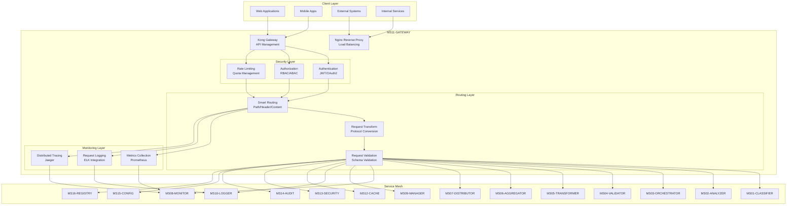

# MS11-GATEWAY - API Gateway ZenIA

> **Microservizio di routing e gestione API centralizzato per ZenIA**

[](https://docker.com)
[](https://kubernetes.io)
[](https://konghq.com)
[](https://nginx.org)

## 🎯 Panoramica

**MS11-GATEWAY** è il punto di ingresso unificato per tutte le API ZenIA, fornendo:

- **Routing intelligente** basato su path, header e contenuto
- **Load balancing** e fault tolerance
- **Sicurezza centralizzata** (autenticazione, autorizzazione, rate limiting)
- **Monitoring e analytics** del traffico API
- **Versioning API** e backward compatibility
- **Caching distribuito** per ottimizzazione performance

### Copertura Funzionale
- ✅ **UC5** - Produzione Documentale Integrata (routing documenti)
- ✅ **UC6** - Validazione Documenti (proxy validazione)
- ✅ **UC7** - Archiviazione Integrata (routing storage)
- ✅ **UC9** - Monitoraggio Operativo (metriche API)
- ✅ **UC11** - Reporting e Analytics (proxy reporting)

## 🏗️ Architettura



### Componenti Principali

| Componente | Tecnologia | Responsabilità |
|------------|------------|----------------|
| **Kong Gateway** | Lua/Nginx | API management, plugins, routing |
| **Nginx Proxy** | C/Lua | Load balancing, SSL termination |
| **Security Layer** | JWT/OAuth2 | Autenticazione e autorizzazione |
| **Monitoring** | Prometheus/ELK | Metriche e logging centralizzato |

## 🚀 Quick Start (5 minuti)

### Prerequisiti
- Docker & Docker Compose
- 4GB RAM disponibile
- Port 8000-8002 liberi

### Setup Locale

```bash
# 1. Clona repository
cd docs/microservices/MS11-GATEWAY

# 2. Avvia ambiente sviluppo
docker-compose up -d

# 3. Verifica health
curl http://localhost:8000/health

# 4. Test routing
curl http://localhost:8000/api/v1/classifier/health
```

### Verifica Installazione

```bash
# Status containers
docker-compose ps

# Logs Kong
docker-compose logs kong

# Test API gateway
curl -H "Authorization: Bearer <token>" \
     http://localhost:8000/api/v1/documents/classify
```

## 📋 API Endpoints

### Routing Principali

| Endpoint | Metodo | Target Service | Descrizione |
|----------|--------|----------------|-------------|
| `/api/v1/documents/*` | ALL | MS01-CLASSIFIER | Classificazione documenti |
| `/api/v1/analysis/*` | ALL | MS02-ANALYZER | Analisi contenuto |
| `/api/v1/workflow/*` | ALL | MS03-ORCHESTRATOR | Orchestrazione |
| `/api/v1/validation/*` | ALL | MS04-VALIDATOR | Validazione dati |
| `/api/v1/transform/*` | ALL | MS05-TRANSFORMER | Trasformazione |
| `/api/v1/aggregate/*` | ALL | MS06-AGGREGATOR | Aggregazione |
| `/api/v1/distribute/*` | ALL | MS07-DISTRIBUTOR | Distribuzione |
| `/api/v1/monitor/*` | GET | MS08-MONITOR | Monitoraggio |
| `/api/v1/manage/*` | ALL | MS09-MANAGER | Gestione risorse |
| `/api/v1/logs/*` | ALL | MS10-LOGGER | Logging |
| `/api/v1/cache/*` | ALL | MS12-CACHE | Cache distribuito |
| `/api/v1/security/*` | ALL | MS13-SECURITY | Sicurezza |
| `/api/v1/audit/*` | ALL | MS14-AUDIT | Audit |
| `/api/v1/config/*` | ALL | MS15-CONFIG | Configurazione |
| `/api/v1/registry/*` | ALL | MS16-REGISTRY | Service discovery |

### Endpoint di Sistema

```bash
# Health check
GET /health

# Metrics (Prometheus)
GET /metrics

# Kong Admin API
GET /admin/status

# Rate limiting status
GET /status/ratelimit
```

## 🔧 Configurazione

### Environment Variables

```bash
# Kong Configuration
KONG_DATABASE=postgres
KONG_PG_HOST=postgres
KONG_PG_PORT=5432
KONG_ADMIN_LISTEN=0.0.0.0:8001

# Security
JWT_SECRET_KEY=your-secret-key
OAUTH2_CLIENT_ID=zenia-gateway
RATE_LIMIT_REQUESTS_PER_MINUTE=1000

# Upstream Services
UPSTREAM_MS01=http://ms01-classifier:8080
UPSTREAM_MS02=http://ms02-analyzer:8080
# ... altri MS
```

### Kong Plugins Attivi

- **cors** - Cross-Origin Resource Sharing
- **key-auth** - API Key authentication
- **jwt** - JWT token validation
- **rate-limiting** - Request rate limiting
- **request-transformer** - Request/response transformation
- **response-transformer** - Response formatting
- **correlation-id** - Request tracing
- **prometheus** - Metrics collection

## 🔍 Monitoraggio

### Metriche Disponibili

```prometheus
# Request metrics
kong_http_requests_total{method="GET",service="ms01-classifier"}
kong_http_requests_duration_ms{service="ms02-analyzer"}

# Rate limiting
kong_ratelimit_usage{service="api-gateway"}

# Upstream health
kong_upstream_healthy{service="ms03-orchestrator"}
```

### Dashboard Grafana

- **API Performance** - Latenza e throughput per endpoint
- **Error Rates** - Tassi di errore per servizio
- **Rate Limiting** - Utilizzo quote per client
- **Security Events** - Tentativi autenticazione falliti

## 🐛 Troubleshooting

### Problemi Comuni

**❌ 502 Bad Gateway**
```bash
# Verifica upstream services
docker-compose logs | grep upstream

# Test connessione diretta
curl http://localhost:8081/api/v1/classifier/health
```

**❌ 429 Too Many Requests**
```bash
# Verifica rate limiting
curl http://localhost:8000/status/ratelimit

# Aumenta quota se necessario
curl -X POST http://localhost:8001/plugins/rate-limiting \
  -d "config.minute=2000"
```

**❌ Autenticazione fallita**
```bash
# Verifica JWT token
curl -H "Authorization: Bearer <token>" \
     http://localhost:8000/api/v1/auth/verify
```

### Log Analysis

```bash
# Kong logs
docker-compose logs kong | grep ERROR

# Access logs
docker-compose logs nginx | tail -100

# Debug mode
docker-compose exec kong kong config -c /etc/kong/kong.conf
```

## 📁 Struttura Progetto

```
MS11-GATEWAY/
├── README.md                    # Questa guida
├── SPECIFICATION.md            # Specifiche tecniche
├── API.md                      # Documentazione API
├── DATABASE-SCHEMA.md          # Schema database
├── TROUBLESHOOTING.md          # Guida risoluzione problemi
├── docker-compose.yml          # Ambiente sviluppo
├── examples/                   # Esempi utilizzo
│   ├── README.md
│   ├── api-request.json
│   └── routing-config.json
└── kubernetes/                 # Deployment K8s
    ├── README.md
    ├── deployment.yaml
    ├── service.yaml
    ├── ingress.yaml
    └── configmap.yaml
```

## 🔗 Risorse Correlate

- **[MS13-SECURITY](../MS13-SECURITY/README.md)** - Sicurezza API
- **[MS08-MONITOR](../MS08-MONITOR/README.md)** - Monitoraggio infrastruttura
- **[MS10-LOGGER](../MS10-LOGGER/README.md)** - Logging centralizzato
- **[MS16-REGISTRY](../MS16-REGISTRY/README.md)** - Service discovery

---

**📖 Approfondimenti**: [SPECIFICATION.md](SPECIFICATION.md) | [API.md](API.md) | [TROUBLESHOOTING.md](TROUBLESHOOTING.md)
