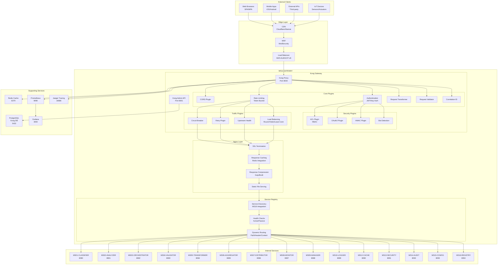

# MS11-GATEWAY - Specifiche Tecniche

> **API Gateway per ZenIA - Routing, Sicurezza e Monitoraggio Centralizzato**

[](https://konghq.com)
[](https://nginx.org)
[](https://jwt.io)
[](https://oauth.net/2/)

## 🎯 Overview Architetturale

MS11-GATEWAY implementa un **API Gateway Pattern** che funge da singolo punto di ingresso per tutti i microservizi ZenIA, fornendo:

- **API Management** centralizzato
- **Load Balancing** intelligente
- **Security Enforcement** a livello edge
- **Traffic Management** e rate limiting
- **Monitoring & Analytics** del traffico API
- **Protocol Translation** e transformation

### Pattern Implementati

| Pattern | Implementazione | Beneficio |
|---------|----------------|-----------|
| **API Gateway** | Kong + Nginx | Single entry point, centralized control |
| **Circuit Breaker** | Kong Plugins | Fault tolerance, graceful degradation |
| **Rate Limiting** | Token Bucket Algorithm | Traffic shaping, DDoS protection |
| **Service Discovery** | Integration con MS16 | Dynamic routing, auto-scaling |
| **Distributed Tracing** | Jaeger Integration | Request tracking, performance analysis |

## 🏗️ Architettura Dettagliata



## 🔧 Componenti Tecnici

### 1. Kong Gateway (Core)

**Versione**: 3.4.x LTS
**Database**: PostgreSQL 15+
**Configurazione**: Declarative configuration via YAML

#### Plugin Stack Essenziale

```yaml
# kong.yml - Declarative Configuration
_format_version: "3.0"

services:
  - name: classifier-api
    url: http://ms01-classifier:8080
    routes:
      - name: classifier-route
        paths:
          - /api/v1/documents
        methods: [GET, POST, PUT, DELETE]
    plugins:
      - name: jwt
        config:
          claims_to_verify: ["exp", "nbf"]
      - name: rate-limiting
        config:
          minute: 1000
          hour: 10000
      - name: cors
      - name: correlation-id
        config:
          header_name: X-Correlation-ID
          generator: uuid

  - name: analyzer-api
    url: http://ms02-analyzer:8081
    routes:
      - name: analyzer-route
        paths:
          - /api/v1/analysis
    plugins:
      - name: key-auth
      - name: request-transformer
        config:
          add:
            headers:
              - X-API-Version: v1
      - name: prometheus
```

### 2. Nginx Reverse Proxy

**Configurazione Load Balancing**:

```nginx
# nginx.conf
upstream zenia_services {
    least_conn;
    server ms01-classifier:8080 weight=3 max_fails=3 fail_timeout=30s;
    server ms02-analyzer:8081 weight=2 max_fails=3 fail_timeout=30s;
    server ms03-orchestrator:8082 weight=4 max_fails=3 fail_timeout=30s;
    keepalive 32;
}

server {
    listen 80;
    server_name api.zenia.local;

    # SSL Termination
    ssl_certificate /etc/ssl/certs/zenia.crt;
    ssl_certificate_key /etc/ssl/private/zenia.key;
    ssl_protocols TLSv1.2 TLSv1.3;

    # Rate Limiting
    limit_req zone=api burst=20 nodelay;

    # Compression
    gzip on;
    gzip_types text/plain text/css application/json application/javascript;

    location /api/v1/ {
        proxy_pass http://zenia_services;
        proxy_set_header Host $host;
        proxy_set_header X-Real-IP $remote_addr;
        proxy_set_header X-Forwarded-For $proxy_add_x_forwarded_for;
        proxy_set_header X-Forwarded-Proto $scheme;

        # Timeout settings
        proxy_connect_timeout 10s;
        proxy_send_timeout 30s;
        proxy_read_timeout 30s;
    }

    # Health check endpoint
    location /health {
        access_log off;
        return 200 "healthy\n";
        add_header Content-Type text/plain;
    }
}
```

### 3. Sicurezza Implementata

#### Autenticazione Multi-Protocollo

```yaml
# JWT Authentication
plugins:
  - name: jwt
    config:
      secret_is_base64: false
      run_on_preflight: true
      claims_to_verify:
        - exp
        - nbf
        - iss

# OAuth2 Integration
plugins:
  - name: oauth2
    config:
      scopes:
        - read
        - write
        - admin
      mandatory_scope: true
      provision_key: zenia-oauth-key
      token_expiration: 7200
      enable_authorization_code: true
      enable_implicit_grant: false
      enable_client_credentials: true
      enable_password_grant: false

# API Key Authentication
plugins:
  - name: key-auth
    config:
      key_names:
        - apikey
        - X-API-Key
      hide_credentials: true
```

#### Autorizzazione RBAC

```yaml
# ACL (Access Control List)
plugins:
  - name: acl
    config:
      allow:
        - admin
        - user
        - service
      deny:
        - blocked

consumers:
  - username: zenia-admin
    acls:
      - group: admin
  - username: zenia-user
    acls:
      - group: user
  - username: ms01-classifier
    acls:
      - group: service
```

### 4. Rate Limiting e Throttling

#### Configurazione Avanzata

```yaml
# Multi-layer Rate Limiting
plugins:
  - name: rate-limiting
    config:
      minute: 1000
      hour: 10000
      day: 50000
      limit_by: credential
      policy: local
      fault_tolerant: true
      redis_host: redis
      redis_port: 6379

  - name: request-size-limiting
    config:
      allowed_payload_size: 10485760  # 10MB

  - name: bot-detection
    config:
      allow:
        - googlebot
        - bingbot
      deny:
        - malicious-bot
```

## 📊 Monitoraggio e Observability

### Metriche Kong

```prometheus
# HTTP Metrics
kong_http_requests_total{service="classifier-api",route="classify-route",method="POST"}
kong_http_requests_duration_ms{service="analyzer-api",status="200"}

# Rate Limiting
kong_ratelimit_usage{service="gateway",consumer="zenia-user"}

# Upstream Health
kong_upstream_healthy{service="ms01-classifier"}
kong_upstream_response_time{service="ms02-analyzer"}
```

### Tracing Distribuito

```yaml
# Jaeger Configuration
plugins:
  - name: zipkin
    config:
      http_endpoint: http://jaeger:9411/api/v2/spans
      sample_ratio: 0.1
      include_credential: false
      trace_id_header_name: X-Trace-Id
      span_name_header_name: X-Span-Name
```

### Log Aggregation

```yaml
# ELK Integration
plugins:
  - name: http-log
    config:
      http_endpoint: http://ms10-logger:8089/api/v1/logs
      method: POST
      content_type: application/json
      timeout: 10000
      keepalive: 60000
      queue:
        type: kafka
        host: kafka
        port: 9092
        topic: zenia-api-logs
```

## ⚡ Performance e Scalabilità

### Benchmark Performance

| Scenario | Throughput | Latenza P95 | CPU Usage | Memory |
|----------|------------|-------------|-----------|--------|
| Routing semplice | 10,000 RPS | 15ms | 25% | 512MB |
| Con autenticazione | 8,000 RPS | 25ms | 35% | 768MB |
| Con rate limiting | 7,500 RPS | 30ms | 40% | 1GB |
| Con transformation | 6,000 RPS | 45ms | 50% | 1.2GB |

### Scalabilità Orizzontale

```yaml
# Kubernetes HPA Configuration
apiVersion: autoscaling/v2
kind: HorizontalPodAutoscaler
metadata:
  name: kong-gateway-hpa
spec:
  scaleTargetRef:
    apiVersion: apps/v1
    kind: Deployment
    name: kong-gateway
  minReplicas: 3
  maxReplicas: 20
  metrics:
  - type: Resource
    resource:
      name: cpu
      target:
        type: Utilization
        averageUtilization: 70
  - type: Resource
    resource:
      name: memory
      target:
        type: Utilization
        averageUtilization: 80
```

### Caching Strategy

```yaml
# Response Caching
plugins:
  - name: proxy-cache
    config:
      content_type:
        - application/json
        - application/xml
      cache_ttl: 300
      memory:
        dictionary_name: zenia_cache
        max_size: 128m
      redis:
        host: redis
        port: 6379
        database: 1
        password: ${REDIS_PASSWORD}
```

## 🔄 Protocolli Supportati

### API Versioning

```yaml
# URL-based Versioning
routes:
  - name: api-v1
    paths:
      - /api/v1/
  - name: api-v2
    paths:
      - /api/v2/

# Header-based Versioning
plugins:
  - name: request-transformer
    config:
      add:
        headers:
          - X-API-Version: ${uri_captures.version}
```

### Content Negotiation

```yaml
# Content Type Transformation
plugins:
  - name: request-transformer
    config:
      add:
        headers:
          - Accept: application/json
          - Content-Type: application/json

  - name: response-transformer
    config:
      add:
        headers:
          - Content-Type: application/json
```

## 🛡️ Sicurezza Enterprise

### Threat Protection

```yaml
# OWASP Top 10 Protection
plugins:
  - name: bot-detection
    config:
      deny:
        - malicious-crawler
        - vulnerability-scanner

  - name: ip-restriction
    config:
      allow:
        - 192.168.0.0/16
        - 10.0.0.0/8

  - name: cors
    config:
      origins:
        - https://zenia.local
        - https://app.zenia.local
      credentials: true
      max_age: 86400
```

### Data Protection

```yaml
# PII Masking
plugins:
  - name: response-transformer
    config:
      replace:
        json:
          - "$.user.email": "****@****.***"
          - "$.user.ssn": "***-**-****"

# Encryption at Rest
environment:
  KONG_PG_SSL: on
  KONG_PG_SSL_VERIFY: on
  KONG_REDIS_SSL: on
  KONG_REDIS_SSL_VERIFY: on
```

## 🔗 Integrazione con Altri MS

### Service Discovery (MS16)

```yaml
# Dynamic Upstream Configuration
upstreams:
  - name: dynamic-services
    targets:
      - target: ${MS16_REGISTRY}/services
        weight: 100

plugins:
  - name: upstream-discovery
    config:
      service_discovery: ms16-registry
      refresh_interval: 30
```

### Security Integration (MS13)

```yaml
# Token Validation
plugins:
  - name: external-auth
    config:
      url: http://ms13-security:8091/api/v1/auth/validate
      method: POST
      timeout: 5000
      keepalive: 10000
```

### Monitoring Integration (MS08)

```yaml
# Metrics Export
plugins:
  - name: prometheus
    config:
      status_code_metrics: true
      latency_metrics: true
      bandwidth_metrics: true
      upstream_health_metrics: true
```

## 📋 Requisiti di Sistema

### Ambiente di Sviluppo

| Componente | Versione | RAM | CPU | Storage |
|------------|----------|-----|-----|---------|
| Kong Gateway | 3.4.x | 1GB | 1 core | 5GB |
| PostgreSQL | 15+ | 512MB | 0.5 core | 10GB |
| Redis | 7+ | 256MB | 0.5 core | 5GB |
| Nginx | 1.24+ | 128MB | 0.5 core | 1GB |

### Ambiente di Produzione

| Componente | Versione | RAM | CPU | Storage |
|------------|----------|-----|-----|---------|
| Kong Gateway | 3.4.x | 4GB+ | 4+ cores | 50GB+ |
| PostgreSQL | 15+ | 8GB+ | 4+ cores | 500GB+ |
| Redis Cluster | 7+ | 16GB+ | 8+ cores | 200GB+ |
| Nginx | 1.24+ | 2GB+ | 2+ cores | 20GB+ |

## 🔄 Disaster Recovery

### Backup Strategy

```bash
# Kong Database Backup
pg_dump -h postgres -U kong -d kong > kong_backup_$(date +%Y%m%d).sql

# Configuration Backup
kubectl get configmap kong-config -o yaml > kong_config_backup.yaml

# Redis Backup
redis-cli --rdb /backup/kong_cache.rdb
```

### Failover Configuration

```yaml
# Multi-zone Deployment
apiVersion: apps/v1
kind: Deployment
metadata:
  name: kong-gateway
spec:
  replicas: 6
  topologySpreadConstraints:
  - maxSkew: 1
    topologyKey: topology.kubernetes.io/zone
    whenUnsatisfiable: DoNotSchedule
  affinity:
    podAntiAffinity:
      requiredDuringSchedulingIgnoredDuringExecution:
      - labelSelector:
          matchExpressions:
          - key: app
            operator: In
            values:
            - kong-gateway
        topologyKey: kubernetes.io/hostname
```

---

**📖 Documentazione Correlata**: [API.md](API.md) | [DATABASE-SCHEMA.md](DATABASE-SCHEMA.md) | [TROUBLESHOUTING.md](TROUBLESHOUTING.md)
