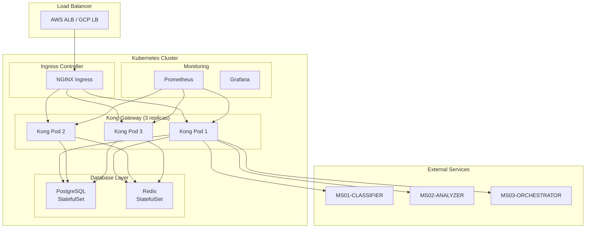

# MS11-GATEWAY - Deployment Kubernetes

> **Manifest Kubernetes per API Gateway ZenIA**

[](https://kubernetes.io)
[](https://helm.sh)
[](https://konghq.com)

## 🎯 Overview Deployment

Questa directory contiene i manifest Kubernetes per il deployment di **MS11-GATEWAY** in ambiente containerizzato.

### Componenti Deployati

| Componente | Tipo | Replica | Descrizione |
|------------|------|---------|-------------|
| **Kong Gateway** | Deployment | 3 | API Gateway principale |
| **Kong Admin** | Service | - | Interfaccia amministrativa |
| **Kong Proxy** | Service | - | Endpoint API pubblico |
| **PostgreSQL** | StatefulSet | 1 | Database configurazione |
| **Redis** | StatefulSet | 1 | Cache e sessioni |
| **Kong Ingress** | Ingress | - | Ingress controller |
| **ConfigMaps** | ConfigMap | - | Configurazioni |
| **Secrets** | Secret | - | Credenziali e certificati |

## 🚀 Quick Start

### Prerequisiti
- Kubernetes 1.24+
- kubectl configurato
- Namespace `zenia` creato
- Certificati SSL disponibili

### Deployment

```bash
# 1. Crea namespace
kubectl create namespace zenia

# 2. Applica configurazioni base
kubectl apply -f configmap.yaml
kubectl apply -f secrets.yaml

# 3. Deploy PostgreSQL
kubectl apply -f postgresql-statefulset.yaml
kubectl wait --for=condition=ready pod -l app=postgresql --timeout=300s

# 4. Deploy Redis
kubectl apply -f redis-statefulset.yaml
kubectl wait --for=condition=ready pod -l app=redis --timeout=300s

# 5. Deploy Kong
kubectl apply -f kong-deployment.yaml
kubectl apply -f kong-service.yaml
kubectl wait --for=condition=ready pod -l app=kong --timeout=300s

# 6. Deploy Ingress
kubectl apply -f ingress.yaml

# 7. Verifica deployment
kubectl get pods -n zenia
kubectl get services -n zenia
kubectl get ingress -n zenia
```

### Verifica Installazione

```bash
# Health check
curl https://api.zenia.local/health

# Kong Admin API
curl http://kong-admin.zenia.svc.cluster.local:8001/status

# Test API routing
curl -H "Authorization: Bearer <token>" \
     https://api.zenia.local/api/v1/documents/classify
```

## 📁 Struttura Manifest

```
kubernetes/
├── README.md                    # Questa guida
├── configmap.yaml              # Configurazioni Kong
├── secrets.yaml                # Credenziali e certificati
├── postgresql-statefulset.yaml # Database PostgreSQL
├── redis-statefulset.yaml      # Cache Redis
├── kong-deployment.yaml        # Deployment Kong
├── kong-service.yaml           # Services Kong
├── ingress.yaml                # Ingress controller
├── network-policies.yaml       # Network policies
├── hpa.yaml                    # Horizontal Pod Autoscaler
├── pdb.yaml                    # Pod Disruption Budget
└── monitoring/                 # Configurazioni monitoring
    ├── service-monitor.yaml
    └── prometheus-rules.yaml
```

## 🔧 Configurazioni

### Environment Variables

```yaml
# kong-deployment.yaml
env:
  - name: KONG_DATABASE
    value: "postgres"
  - name: KONG_PG_HOST
    value: "postgresql"
  - name: KONG_PG_PORT
    value: "5432"
  - name: KONG_PG_USER
    valueFrom:
      secretKeyRef:
        name: kong-secrets
        key: postgres-user
  - name: KONG_PG_PASSWORD
    valueFrom:
      secretKeyRef:
        name: kong-secrets
        key: postgres-password
  - name: KONG_ADMIN_LISTEN
    value: "0.0.0.0:8001"
  - name: KONG_PROXY_LISTEN
    value: "0.0.0.0:8000, 0.0.0.0:8443 ssl"
  - name: KONG_LOG_LEVEL
    value: "info"
  - name: KONG_PLUGINS
    value: "bundled,custom-auth"
```

### ConfigMap Kong

```yaml
# configmap.yaml
apiVersion: v1
kind: ConfigMap
metadata:
  name: kong-config
  namespace: zenia
data:
  kong.yml: |
    _format_version: "3.0"
    services:
      - name: classifier-api
        url: http://ms01-classifier.zenia.svc.cluster.local:8080
        routes:
          - name: classifier-route
            paths:
              - /api/v1/documents
            methods: [GET, POST, PUT, DELETE]
        plugins:
          - name: jwt
          - name: rate-limiting
            config:
              minute: 1000
              hour: 10000
          - name: cors
          - name: prometheus
```

### Secrets

```yaml
# secrets.yaml
apiVersion: v1
kind: Secret
metadata:
  name: kong-secrets
  namespace: zenia
type: Opaque
data:
  # Base64 encoded values
  postgres-user: a29uZw==  # kong
  postgres-password: c2VjdXJlX3Bhc3N3b3Jk  # secure_password
  jwt-secret: eXlKaGJHY2lPaUpJVXpJMU5pSXNJblI1Y0NJNklt...  # JWT secret
  redis-password: cmVkaXNfcGFzc3dvcmQ=  # redis_password
  ssl-cert: LS0tLS1CRUdJTi...  # SSL certificate
  ssl-key: LS0tLS1CRUdJTi...   # SSL private key
```

## 🏗️ Architettura Deployment

### High Availability



### Scalabilità

#### Horizontal Pod Autoscaler

```yaml
# hpa.yaml
apiVersion: autoscaling/v2
kind: HorizontalPodAutoscaler
metadata:
  name: kong-gateway-hpa
  namespace: zenia
spec:
  scaleTargetRef:
    apiVersion: apps/v1
    kind: Deployment
    name: kong-gateway
  minReplicas: 3
  maxReplicas: 20
  metrics:
  - type: Resource
    resource:
      name: cpu
      target:
        type: Utilization
        averageUtilization: 70
  - type: Resource
    resource:
      name: memory
      target:
        type: Utilization
        averageUtilization: 80
  - type: Pods
    pods:
      metric:
        name: kong_http_requests_total
      target:
        type: AverageValue
        averageValue: 1000
```

#### Pod Disruption Budget

```yaml
# pdb.yaml
apiVersion: policy/v1
kind: PodDisruptionBudget
metadata:
  name: kong-gateway-pdb
  namespace: zenia
spec:
  minAvailable: 2
  selector:
    matchLabels:
      app: kong-gateway
```

## 🔒 Sicurezza

### Network Policies

```yaml
# network-policies.yaml
apiVersion: networking.k8s.io/v1
kind: NetworkPolicy
metadata:
  name: kong-gateway-netpol
  namespace: zenia
spec:
  podSelector:
    matchLabels:
      app: kong-gateway
  policyTypes:
  - Ingress
  - Egress
  ingress:
  - from:
    - namespaceSelector:
        matchLabels:
          name: ingress-nginx
    ports:
    - protocol: TCP
      port: 8000
    - protocol: TCP
      port: 8443
  - from:
    - podSelector:
        matchLabels:
          app: kong-gateway
    ports:
    - protocol: TCP
      port: 8001
  egress:
  - to:
    - podSelector:
        matchLabels:
          app: postgresql
    ports:
    - protocol: TCP
      port: 5432
  - to:
    - podSelector:
        matchLabels:
          app: redis
    ports:
    - protocol: TCP
      port: 6379
  - to: []
    ports:
    - protocol: TCP
      port: 53
```

### RBAC

```yaml
# Service Account per Kong
apiVersion: v1
kind: ServiceAccount
metadata:
  name: kong-service-account
  namespace: zenia

---
# ClusterRole per Kong
apiVersion: rbac.authorization.k8s.io/v1
kind: ClusterRole
metadata:
  name: kong-cluster-role
rules:
- apiGroups: [""]
  resources: ["configmaps", "secrets"]
  verbs: ["get", "list", "watch"]
- apiGroups: ["networking.k8s.io"]
  resources: ["ingresses"]
  verbs: ["get", "list", "watch"]

---
# ClusterRoleBinding
apiVersion: rbac.authorization.k8s.io/v1
kind: ClusterRoleBinding
metadata:
  name: kong-cluster-role-binding
roleRef:
  apiVersion: rbac.authorization.k8s.io/v1
  kind: ClusterRole
  name: kong-cluster-role
subjects:
- kind: ServiceAccount
  name: kong-service-account
  namespace: zenia
```

## 📊 Monitoraggio

### Service Monitor

```yaml
# monitoring/service-monitor.yaml
apiVersion: monitoring.coreos.com/v1
kind: ServiceMonitor
metadata:
  name: kong-gateway-monitor
  namespace: zenia
spec:
  selector:
    matchLabels:
      app: kong-gateway
  endpoints:
  - port: metrics
    path: /metrics
    interval: 30s
    scrapeTimeout: 10s
```

### Prometheus Rules

```yaml
# monitoring/prometheus-rules.yaml
apiVersion: monitoring.coreos.com/v1
kind: PrometheusRule
metadata:
  name: kong-gateway-alerts
  namespace: zenia
spec:
  groups:
  - name: kong-gateway
    rules:
    - alert: KongGatewayDown
      expr: up{job="kong-gateway"} == 0
      for: 5m
      labels:
        severity: critical
      annotations:
        summary: "Kong Gateway is down"
        description: "Kong Gateway has been down for more than 5 minutes."

    - alert: KongHighErrorRate
      expr: rate(kong_http_requests_total{status=~"5.."}[5m]) / rate(kong_http_requests_total[5m]) > 0.05
      for: 5m
      labels:
        severity: warning
      annotations:
        summary: "High error rate on Kong Gateway"
        description: "Kong Gateway error rate is {{ $value }}%."

    - alert: KongHighLatency
      expr: histogram_quantile(0.95, rate(kong_http_request_duration_ms_bucket[5m])) > 5000
      for: 5m
      labels:
        severity: warning
      annotations:
        summary: "High latency on Kong Gateway"
        description: "Kong Gateway 95th percentile latency is {{ $value }}ms."
```

### Dashboard Grafana

- **Kong Gateway Overview** - Status pods, throughput, latenza
- **API Performance** - Metriche per endpoint e servizio
- **Security Dashboard** - Rate limiting, autenticazione fallita
- **Error Analysis** - Error rate per tipo e servizio

## 🔄 Aggiornamenti e Rollback

### Rolling Update

```bash
# Aggiornamento versione Kong
kubectl set image deployment/kong-gateway kong=kong:3.5.0

# Monitora rollout
kubectl rollout status deployment/kong-gateway

# Rollback se necessario
kubectl rollout undo deployment/kong-gateway
```

### Blue-Green Deployment

```bash
# Crea nuova versione (green)
kubectl apply -f kong-deployment-green.yaml

# Switch traffic via Ingress
kubectl patch ingress kong-ingress -p '{"spec":{"rules":[{"host":"api.zenia.local","http":{"paths":[{"path":"/","pathType":"Prefix","backend":{"service":{"name":"kong-gateway-green","port":{"number":80}}}}]}}]}}'

# Verifica e rimuovi vecchia versione
kubectl delete deployment kong-gateway-blue
```

## 🐛 Troubleshooting

### Pod CrashLoopBackOff

```bash
# Verifica logs
kubectl logs -f deployment/kong-gateway -n zenia

# Verifica eventi
kubectl describe pod -l app=kong-gateway -n zenia

# Verifica risorse
kubectl top pods -n zenia
```

### Connettività Database

```bash
# Test connessione PostgreSQL
kubectl exec -it deployment/kong-gateway -- psql -h postgresql -U kong -d kong -c "SELECT 1;"

# Test connessione Redis
kubectl exec -it deployment/kong-gateway -- redis-cli -h redis -a $REDIS_PASSWORD ping
```

### Configurazione Plugin

```bash
# Lista plugin attivi
kubectl exec -it deployment/kong-gateway -- curl http://localhost:8001/plugins

# Verifica configurazione plugin
kubectl exec -it deployment/kong-gateway -- curl http://localhost:8001/plugins/{plugin-id}
```

## 📋 Checklist Deployment

### Pre-Deployment
- [ ] Namespace `zenia` creato
- [ ] Secrets configurati correttamente
- [ ] Certificati SSL validi
- [ ] Database PostgreSQL disponibile
- [ ] Redis cluster operativo
- [ ] Upstream services raggiungibili

### Durante Deployment
- [ ] Pods avviati correttamente
- [ ] Services esposti
- [ ] Ingress configurato
- [ ] Health checks funzionanti
- [ ] Routing testato

### Post-Deployment
- [ ] Metriche Prometheus raccolte
- [ ] Alerting configurato
- [ ] Log aggregation attivo
- [ ] Backup pianificato
- [ ] Documentazione aggiornata

---

**📖 Documentazione Correlata**: [README.md](../README.md) | [SPECIFICATION.md](../SPECIFICATION.md) | [API.md](../API.md)