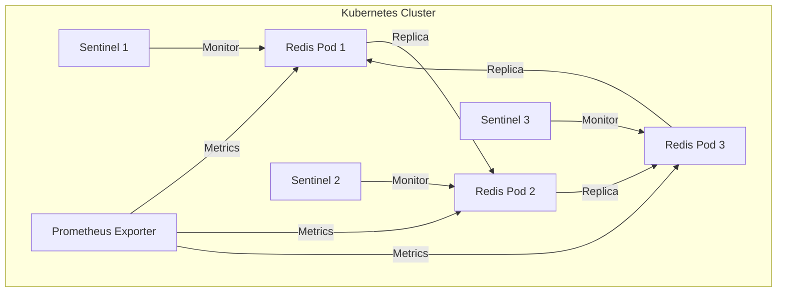

# MS12-CACHE - Deployment Kubernetes

> **Manifest Kubernetes per Redis Cluster/Sentinel**

[](https://redis.io)
[](https://kubernetes.io)

## 🎯 Overview Deployment

Questa directory contiene i manifest Kubernetes per il deployment di **MS12-CACHE** (Redis Cluster + Sentinel) in ambiente containerizzato.

### Componenti Deployati

| Componente         | Tipo         | Replica | Descrizione                |
|--------------------|--------------|---------|----------------------------|
| Redis Cluster      | StatefulSet  | 3+      | Redis nodi dati            |
| Redis Sentinel     | Deployment   | 3+      | Monitoraggio e failover    |
| ConfigMap          | ConfigMap    | -       | Configurazione redis.conf  |
| Secret             | Secret       | -       | Password, ACL, TLS         |
| Service            | ClusterIP    | -       | Accesso Redis/Sentinel     |
| Prometheus Exporter| Deployment   | 1       | Metriche monitoring        |

## 🚀 Quick Start

### Prerequisiti
- Kubernetes 1.24+
- kubectl configurato
- Namespace `zenia` creato

### Deployment

```bash
# 1. Crea namespace
kubectl create namespace zenia

# 2. Applica configurazioni base
kubectl apply -f configmap.yaml
kubectl apply -f secrets.yaml

# 3. Deploy Redis Cluster
kubectl apply -f redis-statefulset.yaml
kubectl wait --for=condition=ready pod -l app=ms12-cache --timeout=300s

# 4. Deploy Sentinel
kubectl apply -f sentinel-deployment.yaml
kubectl wait --for=condition=ready pod -l app=ms12-cache-sentinel --timeout=300s

# 5. Deploy Exporter
kubectl apply -f redis-exporter.yaml

# 6. Verifica deployment
kubectl get pods -n zenia
kubectl get svc -n zenia
```

## [Auto-generated heading level 2]
### Verifica Installazione

```bash
# Test connessione Redis
kubectl exec -it <pod> -- redis-cli -h ms12-cache -a <password> ping

# Test Sentinel
kubectl exec -it <pod> -- redis-cli -p 26379 info Sentinel

# Metriche Prometheus
kubectl port-forward svc/ms12-cache-exporter 9121:9121
curl http://localhost:9121/metrics
```

## 📁 Struttura Manifest

```
kubernetes/
├── README.md
├── configmap.yaml
├── secrets.yaml
├── redis-statefulset.yaml
├── sentinel-deployment.yaml
├── redis-exporter.yaml
├── service.yaml
├── network-policies.yaml
├── hpa.yaml
├── pdb.yaml
├── monitoring/
│   ├── service-monitor.yaml
│   └── prometheus-rules.yaml
```

## 🔧 Configurazioni

### Environment Variables

```yaml
# redis-statefulset.yaml
env:
  - name: REDIS_PASSWORD
    valueFrom:
      secretKeyRef:
        name: ms12-cache-secrets
        key: redis-password
  - name: REDIS_ACL
    valueFrom:
      secretKeyRef:
        name: ms12-cache-secrets
        key: redis-acl
  - name: REDIS_TLS
    value: "true"
```

## [Auto-generated heading level 2]
### ConfigMap Redis

```yaml
apiVersion: v1
kind: ConfigMap
metadata:
  name: ms12-cache-config
  namespace: zenia
data:
  redis.conf: |
    ...
```

### Secrets

```yaml
apiVersion: v1
kind: Secret
metadata:
  name: ms12-cache-secrets
  namespace: zenia
type: Opaque
data:
  redis-password: c2VjdXJlX3JlZGlzX3Bhc3N3b3Jk  # secure_redis_password (base64)
  redis-acl: Y2FjaGVfdXNlcjpwYXNzd29yZCBvblJlYWRXcml0ZQ==  # ACL (base64)
  tls-cert: LS0tLS1CRUdJTiBDRVJUSUZJQ0FURS0tLS0t  # Certificato (base64)
  tls-key: LS0tLS1CRUdJTiBQUklWQVRFIEtFWS0tLS0t  # Chiave privata (base64)
```

## 🏗️ Architettura Deployment



## 🔒 Sicurezza

### Network Policies

```yaml
apiVersion: networking.k8s.io/v1
kind: NetworkPolicy
metadata:
  name: ms12-cache-netpol
  namespace: zenia
spec:
  podSelector:
    matchLabels:
      app: ms12-cache
  policyTypes:
  - Ingress
  - Egress
  ingress:
  - from:
    - namespaceSelector:
        matchLabels:
          name: zenia
    ports:
    - protocol: TCP
      port: 6379
    - protocol: TCP
      port: 6380
  egress:
  - to: []
    ports:
    - protocol: TCP
      port: 53
```

## 📊 Monitoraggio

### Service Monitor

```yaml
apiVersion: monitoring.coreos.com/v1
kind: ServiceMonitor
metadata:
  name: ms12-cache-monitor
  namespace: zenia
spec:
  selector:
    matchLabels:
      app: ms12-cache-exporter
  endpoints:
  - port: metrics
    path: /metrics
    interval: 30s
    scrapeTimeout: 10s
```

### Prometheus Rules

```yaml
apiVersion: monitoring.coreos.com/v1
kind: PrometheusRule
metadata:
  name: ms12-cache-alerts
  namespace: zenia
spec:
  groups:
  - name: ms12-cache
    rules:
    - alert: RedisDown
      expr: up{job="ms12-cache"} == 0
      for: 5m
      labels:
        severity: critical
      annotations:
        summary: "Redis cluster is down"
        description: "Redis cluster is not reachable for more than 5 minutes."
    - alert: RedisHighMemory
      expr: redis_memory_used_bytes / redis_memory_max_bytes > 0.9
      for: 5m
      labels:
        severity: warning
      annotations:
        summary: "Redis high memory usage"
        description: "Redis memory usage is above 90%."
```

## 🔄 Aggiornamenti e Rollback

### Rolling Update

```bash
kubectl rollout restart statefulset/ms12-cache
```

### Backup e Restore

- Backup automatico con RDB/AOF
- Restore tramite volume mount

## 🐛 Troubleshooting

Vedi [TROUBLESHOOTING.md](../TROUBLESHOOTING.md)

---

**Documentazione correlata**: [README.md](../README.md) | [SPECIFICATION.md](../SPECIFICATION.md) | [API.md](../API.md)
