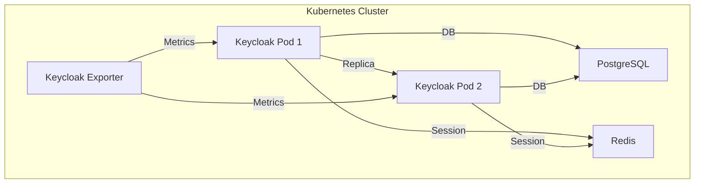

# MS13-SECURITY - Deployment Kubernetes

> **Manifest Kubernetes per Identity Provider (Keycloak)**

[](https://www.keycloak.org/)
[](https://kubernetes.io)

## 🎯 Overview Deployment

Questa directory contiene i manifest Kubernetes per il deployment di **MS13-SECURITY** (Keycloak + PostgreSQL + Redis) in ambiente containerizzato.

### Componenti Deployati

| Componente         | Tipo         | Replica | Descrizione                |
|--------------------|--------------|---------|----------------------------|
| Keycloak           | Deployment   | 2+      | Identity Provider          |
| PostgreSQL         | StatefulSet  | 1       | Database utenti/policy     |
| Redis              | StatefulSet  | 1       | Sessioni                   |
| ConfigMap          | ConfigMap    | -       | Configurazione Keycloak    |
| Secret             | Secret       | -       | Password, TLS, JWT         |
| Service            | ClusterIP    | -       | Accesso Keycloak/DB/Redis  |
| Prometheus Exporter| Deployment   | 1       | Metriche monitoring        |

## 🚀 Quick Start

### Prerequisiti
- Kubernetes 1.24+
- kubectl configurato
- Namespace `zenia` creato

### Deployment

```bash
# 1. Crea namespace
kubectl create namespace zenia

# 2. Applica configurazioni base
kubectl apply -f configmap.yaml
kubectl apply -f secrets.yaml

# 3. Deploy PostgreSQL
kubectl apply -f postgresql-statefulset.yaml
kubectl wait --for=condition=ready pod -l app=ms13-security-db --timeout=300s

# 4. Deploy Redis
kubectl apply -f redis-statefulset.yaml
kubectl wait --for=condition=ready pod -l app=ms13-security-redis --timeout=300s

# 5. Deploy Keycloak
kubectl apply -f keycloak-deployment.yaml
kubectl wait --for=condition=ready pod -l app=ms13-security-keycloak --timeout=300s

# 6. Deploy Exporter
kubectl apply -f keycloak-exporter.yaml

# 7. Verifica deployment
kubectl get pods -n zenia
kubectl get svc -n zenia
```

### Verifica Installazione

```bash
# Test Keycloak
kubectl port-forward svc/ms13-security-keycloak 8080:8080
curl http://localhost:8080/auth/realms/zenia/.well-known/openid-configuration

# Test DB
kubectl exec -it <pod> -- psql -h ms13-security-db -U keycloak -d keycloak

# Test Redis
kubectl exec -it <pod> -- redis-cli -h ms13-security-redis -a <password> ping

# Metriche Prometheus
kubectl port-forward svc/ms13-security-keycloak-exporter 8081:8081
curl http://localhost:8081/metrics
```

## 📁 Struttura Manifest

```
kubernetes/
├── README.md
├── configmap.yaml
├── secrets.yaml
├── keycloak-deployment.yaml
├── postgresql-statefulset.yaml
├── redis-statefulset.yaml
├── keycloak-exporter.yaml
├── service.yaml
├── network-policies.yaml
├── hpa.yaml
├── pdb.yaml
├── monitoring/
│   ├── service-monitor.yaml
│   └── prometheus-rules.yaml
```

## 🔧 Configurazioni

### Environment Variables

```yaml
# keycloak-deployment.yaml
env:
  - name: KEYCLOAK_ADMIN
    valueFrom:
      secretKeyRef:
        name: ms13-security-secrets
        key: admin-user
  - name: KEYCLOAK_ADMIN_PASSWORD
    valueFrom:
      secretKeyRef:
        name: ms13-security-secrets
        key: admin-password
  - name: KC_DB
    value: postgres
  - name: KC_DB_URL
    value: jdbc:postgresql://ms13-security-db:5432/keycloak
  - name: KC_DB_USERNAME
    valueFrom:
      secretKeyRef:
        name: ms13-security-secrets
        key: db-user
  - name: KC_DB_PASSWORD
    valueFrom:
      secretKeyRef:
        name: ms13-security-secrets
        key: db-password
  - name: KC_HOSTNAME
    value: ms13-security-keycloak.zenia.svc.cluster.local
  - name: KC_HTTPS_CERTIFICATE_FILE
    value: /tls/keycloak.crt
  - name: KC_HTTPS_CERTIFICATE_KEY_FILE
    value: /tls/keycloak.key
```

### ConfigMap Keycloak

```yaml
apiVersion: v1
kind: ConfigMap
metadata:
  name: ms13-security-config
  namespace: zenia
data:
  keycloak.conf: |
    ...
```

### Secrets

```yaml
apiVersion: v1
kind: Secret
metadata:
  name: ms13-security-secrets
  namespace: zenia
type: Opaque
data:
  admin-user: YWRtaW4=  # admin (base64)
  admin-password: c2VjdXJlX2tleWNsb2FrX3B3  # secure_keycloak_pw (base64)
  db-user: a2V5Y2xvYWs=  # keycloak (base64)
  db-password: c2VjdXJlX2RiX3B3  # secure_db_pw (base64)
  redis-password: c2VjdXJlX3JlZGlzX3B3  # secure_redis_pw (base64)
  tls-cert: LS0tLS1CRUdJTiBDRVJUSUZJQ0FURS0tLS0t  # Certificato (base64)
  tls-key: LS0tLS1CRUdJTiBQUklWQVRFIEtFWS0tLS0t  # Chiave privata (base64)
```

## 🏗️ Architettura Deployment



## 🔒 Sicurezza

### Network Policies

```yaml
apiVersion: networking.k8s.io/v1
kind: NetworkPolicy
metadata:
  name: ms13-security-netpol
  namespace: zenia
spec:
  podSelector:
    matchLabels:
      app: ms13-security-keycloak
  policyTypes:
  - Ingress
  - Egress
  ingress:
  - from:
    - namespaceSelector:
        matchLabels:
          name: zenia
    ports:
    - protocol: TCP
      port: 8080
    - protocol: TCP
      port: 8443
  egress:
  - to: []
    ports:
    - protocol: TCP
      port: 5432
    - protocol: TCP
      port: 6379
    - protocol: TCP
      port: 53
```

## 📊 Monitoraggio

### Service Monitor

```yaml
apiVersion: monitoring.coreos.com/v1
kind: ServiceMonitor
metadata:
  name: ms13-security-keycloak-monitor
  namespace: zenia
spec:
  selector:
    matchLabels:
      app: ms13-security-keycloak-exporter
  endpoints:
  - port: metrics
    path: /metrics
    interval: 30s
    scrapeTimeout: 10s
```

### Prometheus Rules

```yaml
apiVersion: monitoring.coreos.com/v1
kind: PrometheusRule
metadata:
  name: ms13-security-keycloak-alerts
  namespace: zenia
spec:
  groups:
  - name: ms13-security-keycloak
    rules:
    - alert: KeycloakDown
      expr: up{job="ms13-security-keycloak"} == 0
      for: 5m
      labels:
        severity: critical
      annotations:
        summary: "Keycloak is down"
        description: "Keycloak is not reachable for more than 5 minutes."
    - alert: KeycloakLoginErrors
      expr: increase(keycloak_failed_login_attempts_total[5m]) > 10
      for: 5m
      labels:
        severity: warning
      annotations:
        summary: "High login error rate"
        description: "Keycloak failed login attempts > 10 in 5m."
```

## 🔄 Aggiornamenti e Rollback

### Rolling Update

```bash
kubectl rollout restart deployment/ms13-security-keycloak
```

### Backup e Restore

- Backup automatico DB
- Restore tramite volume mount

## 🐛 Troubleshooting

Vedi [TROUBLESHOOTING.md](../TROUBLESHOOTING.md)

---

**Documentazione correlata**: [README.md](../README.md) | [SPECIFICATION.md](../SPECIFICATION.md) | [API.md](../API.md)