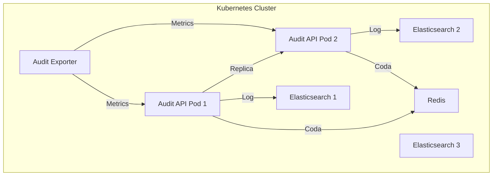

# MS14-AUDIT - Deployment Kubernetes

> **Manifest Kubernetes per Audit e Logging centralizzato**

[](https://www.elastic.co/elasticsearch/)
[](https://kubernetes.io)

## 🎯 Overview Deployment

Questa directory contiene i manifest Kubernetes per il deployment di **MS14-AUDIT** (API, Elasticsearch, Redis/Kafka, Exporter) in ambiente containerizzato.

### Componenti Deployati

| Componente         | Tipo         | Replica | Descrizione                |
|--------------------|--------------|---------|----------------------------|
| Audit API          | Deployment   | 2+      | API REST per log/ricerca   |
| Elasticsearch      | StatefulSet  | 3       | Storage log, cluster       |
| Redis/Kafka        | StatefulSet  | 1       | Coda eventi (opzionale)    |
| ConfigMap          | ConfigMap    | -       | Configurazione API         |
| Secret             | Secret       | -       | Password, TLS, JWT         |
| Service            | ClusterIP    | -       | Accesso API/DB/Redis       |
| Prometheus Exporter| Deployment   | 1       | Metriche monitoring        |

## 🚀 Quick Start

### Prerequisiti
- Kubernetes 1.24+
- kubectl configurato
- Namespace `zenia` creato

### Deployment

```bash
# 1. Crea namespace
kubectl create namespace zenia

# 2. Applica configurazioni base
kubectl apply -f configmap.yaml
kubectl apply -f secrets.yaml

# 3. Deploy Elasticsearch
kubectl apply -f elasticsearch-statefulset.yaml
kubectl wait --for=condition=ready pod -l app=ms14-audit-es --timeout=600s

# 4. Deploy Redis/Kafka (opzionale)
kubectl apply -f redis-statefulset.yaml
kubectl wait --for=condition=ready pod -l app=ms14-audit-redis --timeout=300s

# 5. Deploy Audit API
kubectl apply -f audit-api-deployment.yaml
kubectl wait --for=condition=ready pod -l app=ms14-audit-api --timeout=300s

# 6. Deploy Exporter
kubectl apply -f audit-exporter.yaml

# 7. Verifica deployment
kubectl get pods -n zenia
kubectl get svc -n zenia
```

### Verifica Installazione

```bash
# Test API
kubectl port-forward svc/ms14-audit-api 8080:8080
curl http://localhost:8080/api/audit/log

# Test Elasticsearch
kubectl exec -it <pod> -- curl http://ms14-audit-es:9200/_cat/indices

# Test Redis
kubectl exec -it <pod> -- redis-cli -h ms14-audit-redis -a <password> ping

# Metriche Prometheus
kubectl port-forward svc/ms14-audit-exporter 8081:8081
curl http://localhost:8081/metrics
```

## 📁 Struttura Manifest

```
kubernetes/
├── README.md
├── configmap.yaml
├── secrets.yaml
├── audit-api-deployment.yaml
├── elasticsearch-statefulset.yaml
├── redis-statefulset.yaml
├── audit-exporter.yaml
├── service.yaml
├── network-policies.yaml
├── hpa.yaml
├── pdb.yaml
├── monitoring/
│   ├── service-monitor.yaml
│   └── prometheus-rules.yaml
```

## 🔧 Configurazioni

### Environment Variables

```yaml
# audit-api-deployment.yaml
env:
  - name: JWT_SECRET
    valueFrom:
      secretKeyRef:
        name: ms14-audit-secrets
        key: jwt-secret
  - name: ELASTICSEARCH_URL
    value: http://ms14-audit-es:9200
  - name: REDIS_URL
    value: redis://:$(REDIS_PASSWORD)@ms14-audit-redis:6379/0
  - name: LOG_RETENTION_DAYS
    value: "365"
```

### ConfigMap API

```yaml
apiVersion: v1
kind: ConfigMap
metadata:
  name: ms14-audit-config
  namespace: zenia
data:
  app.conf: |
    ...
```

### Secrets

```yaml
apiVersion: v1
kind: Secret
metadata:
  name: ms14-audit-secrets
  namespace: zenia
type: Opaque
data:
  jwt-secret: c2VjdXJlX2p3dF9rZXk=  # secure_jwt_key (base64)
  elasticsearch-password: c2VjdXJlX2VzX3B3  # secure_es_pw (base64)
  redis-password: c2VjdXJlX3JlZGlzX3B3  # secure_redis_pw (base64)
  tls-cert: LS0tLS1CRUdJTiBDRVJUSUZJQ0FURS0tLS0t  # Certificato (base64)
  tls-key: LS0tLS1CRUdJTiBQUklWQVRFIEtFWS0tLS0t  # Chiave privata (base64)
```

## 🏗️ Architettura Deployment



## 🔒 Sicurezza

### Network Policies

```yaml
apiVersion: networking.k8s.io/v1
kind: NetworkPolicy
metadata:
  name: ms14-audit-netpol
  namespace: zenia
spec:
  podSelector:
    matchLabels:
      app: ms14-audit-api
  policyTypes:
  - Ingress
  - Egress
  ingress:
  - from:
    - namespaceSelector:
        matchLabels:
          name: zenia
    ports:
    - protocol: TCP
      port: 8080
  egress:
  - to: []
    ports:
    - protocol: TCP
      port: 9200
    - protocol: TCP
      port: 6379
    - protocol: TCP
      port: 53
```

## 📊 Monitoraggio

### Service Monitor

```yaml
apiVersion: monitoring.coreos.com/v1
kind: ServiceMonitor
metadata:
  name: ms14-audit-api-monitor
  namespace: zenia
spec:
  selector:
    matchLabels:
      app: ms14-audit-exporter
  endpoints:
  - port: metrics
    path: /metrics
    interval: 30s
    scrapeTimeout: 10s
```

### Prometheus Rules

```yaml
apiVersion: monitoring.coreos.com/v1
kind: PrometheusRule
metadata:
  name: ms14-audit-api-alerts
  namespace: zenia
spec:
  groups:
  - name: ms14-audit-api
    rules:
    - alert: AuditApiDown
      expr: up{job="ms14-audit-api"} == 0
      for: 5m
      labels:
        severity: critical
      annotations:
        summary: "Audit API is down"
        description: "Audit API non raggiungibile da oltre 5 minuti."
    - alert: AuditLogErrors
      expr: increase(audit_log_error_total[5m]) > 10
      for: 5m
      labels:
        severity: warning
      annotations:
        summary: "Errori log elevati"
        description: "Errori log audit > 10 in 5m."
```

## 🔄 Aggiornamenti e Rollback

### Rolling Update

```bash
kubectl rollout restart deployment/ms14-audit-api
```

### Backup e Restore

- Snapshot automatico Elasticsearch
- Restore tramite volume mount

## 🐛 Troubleshooting

Vedi [TROUBLESHOOTING.md](../TROUBLESHOOTING.md)

---

**Documentazione correlata**: [README.md](../README.md) | [SPECIFICATION.md](../SPECIFICATION.md) | [API.md](../API.md)
