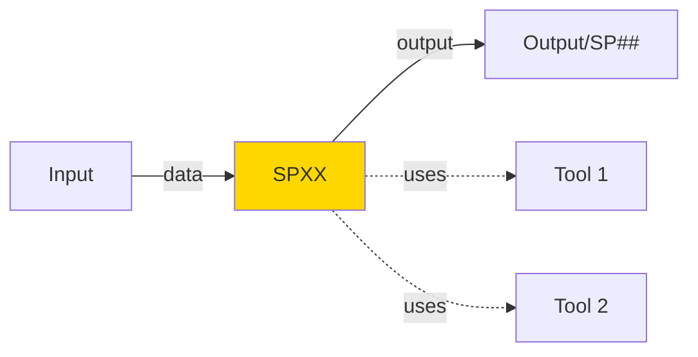

# Template Standardizzato Documentazione Sottoprogetti (SP)

Usare questo template per documentare ogni Sottoprogetto in modo coerente e completo.

---

## Template - Copia e Adatta

```markdown
# SPXX - [Nome Componente]

## 1. Informazioni Generali

| Proprietà | Valore |
|---|---|
| **Numero SP** | SPXX |
| **Nome** | [Nome componente] |
| **Caso d'Uso** | UC# |
| **Categoria** | Core AI / Platform / Infrastructure / Cross-Cutting |
| **MS Primario** | MS## [Nome] |
| **MS Supporto** | MS##, MS## [Nomi] |
| **Status** | [Planned / In Design / In Development / In Review / Complete] |

## 2. Panoramica

**Scopo**: Una frase che descrive COSA fa e PERCHÉ è importante

**Business Value**:
- Valore 1
- Valore 2
- Valore 3

## 3. Responsabilità Principali

Bullet list delle core capabilities:

1. **Capability 1**: Descrizione
2. **Capability 2**: Descrizione
3. **Capability 3**: Descrizione

## 4. Input/Output

### Input
| Nome | Tipo | Fonte | Formato | Note |
|---|---|---|---|---|
| Input 1 | Data type | SP## | JSON/CSV/... | Descrizione |
| Input 2 | Data type | SP## | JSON/CSV/... | Descrizione |

### Output
| Nome | Tipo | Destinazione | Formato | Note |
|---|---|---|---|---|
| Output 1 | Data type | SP##, MS##, DB | JSON/CSV/... | Descrizione |
| Output 2 | Data type | SP##, Dashboard | JSON/CSV/... | Descrizione |

## 5. Dipendenze

### Upstream (Cosa richiede)
```
SP## [Nome] → SPXX [Este componente]
  Data: [tipo dati scambiati]
  Timing: [sincrono/asincrono]
  SLA: [latenza target]
```

### Downstream (Cosa fornisce)
```
SPXX [Este componente] → SP## [Nome]
  Data: [tipo dati scambiati]
  Timing: [sincrono/asincrono]
  SLA: [latenza target]
```

### Non-Dipendenze (Cosa NON utilizza)
- SP##: Motivo perché non dipende
- SP##: Motivo perché non dipende

## 6. Architettura Tecnica

### Componenti Core
```
SPXX
├── Component A [Descrizione]
├── Component B [Descrizione]
└── Component C [Descrizione]
```

### Data Flow Diagram


### Storage Layer
- **Database**: PostgreSQL tabelle: [lista]
- **Cache**: Redis keys: [lista]
- **Document Storage**: MinIO paths: [lista]
- **Vector DB**: FAISS/Pinecone collections: [lista]

## 7. Implementazione Tecnica

### Stack Tecnologico
| Componente | Tecnologia | Versione | Note |
|---|---|---|---|
| Language | Python / Node.js / ... | 3.11 / 18.x / ... | Primary |
| Framework | FastAPI / Express / ... | 0.104 / 4.18 / ... | API |
| ML/AI | Llama / BERT / spaCy / ... | 3.3-70b / v3 / 3.7 / ... | Models |
| DB | PostgreSQL / ... | 15 / ... | Metadata |
| Cache | Redis | 7.2 | Performance |
| Queue | Kafka / RabbitMQ | 3.6 / 3.12 | Async |
| Container | Docker | 24.0 | Deployment |

### API Endpoints
```http
POST /api/v1/SPXX/process
Content-Type: application/json

{
  "input_field_1": "value",
  "input_field_2": "value"
}

Response:
{
  "status": "success",
  "output": { ... },
  "metadata": { "timestamp": "...", "execution_time_ms": 123 }
}
```

### Database Schema
```sql
-- SPXX_results table
CREATE TABLE spxx_results (
  id SERIAL PRIMARY KEY,
  input_hash VARCHAR(256) UNIQUE,
  output JSONB,
  confidence FLOAT,
  created_at TIMESTAMP,
  metadata JSONB
);

CREATE INDEX idx_spxx_timestamp ON spxx_results(created_at);
```

### Configuration
```yaml
spxx:
  model: "llama3.3-70b"
  confidence_threshold: 0.8
  max_retry: 3
  timeout_ms: 30000
  cache_ttl: 3600
```

## 8. Performance & Scalability

### Target KPIs
| Metrica | Target | Note |
|---|---|---|
| **Throughput** | X req/s | Peak load scenario |
| **Latency (p50)** | Yms | Median response time |
| **Latency (p99)** | Zms | 99th percentile |
| **Availability** | 99.9% | SLA target |
| **Error Rate** | < 0.1% | Per 10k requests |

### Scaling Strategy
- **Horizontal**: Multiple instances behind load balancer
- **Vertical**: GPU acceleration per models pesanti
- **Auto-scaling**: Based on queue length / CPU metrics
- **Caching**: Redis per risultati frequenti

### Load Testing Scenarios
- **Normal**: X req/s sustained
- **Peak**: X*2 req/s burst
- **Recovery**: Graceful degradation

## 9. Security & Compliance

### Data Protection
- **At Rest**: AES-256 encryption
- **In Transit**: TLS 1.3
- **PII**: Detect + mask sensitive data
- **Retention**: [X days/months]

### Access Control
- **Authentication**: JWT / OAuth2
- **Authorization**: RBAC [roles needed]
- **API Rate Limiting**: [X] req/min per user

### Audit & Logging
- **Audit Log**: Every request logged (audit trail)
- **Error Logging**: Structured JSON logging
- **Sensitive Data**: Never log [field_names]

### Compliance
- **GDPR**: Consent tracking, right-to-delete
- **CAD**: Digital signature validation
- **AgID**: Conformità linee guida
- **SOC2**: Compliance monitoring

## 10. Monitoring & Alerting

### Prometheus Metrics
```
spxx_requests_total{method, status}
spxx_request_duration_seconds{endpoint}
spxx_model_inference_time{model}
spxx_cache_hit_ratio
spxx_error_rate{error_type}
```

### Alerts
- Accuracy < 80% → Page on-call
- Latency p99 > 5s → Warning
- Error rate > 1% → Critical
- Queue length > 10000 → Scaling trigger

### Health Checks
```http
GET /health/spxx
Response: { "status": "healthy", "last_check": "...", "queue_length": 42 }
```

## 11. Deployment

### Docker Image
```dockerfile
FROM python:3.11-slim
COPY requirements.txt .
RUN pip install -r requirements.txt
COPY . /app
WORKDIR /app
CMD ["python", "-m", "uvicorn", "main:app"]
```

### Kubernetes Deployment
```yaml
apiVersion: v1
kind: Pod
metadata:
  name: spxx-pod
spec:
  containers:
  - name: spxx
    image: zenai/spxx:latest
    env:
    - name: MODEL_PATH
      value: /models/spxx
    resources:
      requests:
        memory: "2Gi"
        cpu: "1"
        nvidia.com/gpu: "1"
      limits:
        memory: "4Gi"
        cpu: "2"
```

### CI/CD Pipeline
- **Build**: Docker image on push to main
- **Test**: Unit + integration tests
- **Deploy**: Auto-deploy to staging, manual promote to prod
- **Rollback**: Automatic on health check failure

## 12. Testing Strategy

### Unit Tests
- Core functions covered
- Edge cases covered
- Coverage target: > 80%

### Integration Tests
- Upstream dependencies (SP##)
- Downstream consumers
- Database interactions
- Cache invalidation

### E2E Tests
- Full pipeline from input to output
- Performance benchmarks
- Failure scenarios

### Test Data
- Production-like samples
- Anonymized real data
- Edge case datasets

## 13. Operational Runbook

### Startup Checklist
- [ ] Database connectivity
- [ ] Model weights loaded
- [ ] Cache initialized
- [ ] Healthcheck passing
- [ ] Metrics exported

### Common Issues
| Problema | Sintomo | Soluzione |
|---|---|---|
| OOM Error | Container killed | Increase memory limit, check for leaks |
| High Latency | p99 > target | Check GPU availability, review queries |
| Cache Stale | Outdated results | Flush cache, verify TTL |

### Incident Response
1. Page on-call team if availability < 99%
2. Check logs for error patterns
3. Roll back to last stable version if broken
4. Run post-mortem if > 30min downtime

### Rollback Procedure
```bash
kubectl rollout history deployment/spxx
kubectl rollout undo deployment/spxx --to-revision=N
```

## 14. Roadmap & Evoluzione

### Current Version
- v1.0: Baseline implementation

### Planned Enhancements
- v1.1 (Q2): [Feature 1]
- v2.0 (Q3): [Feature 2]
- v3.0 (Q4): [Feature 3]

### Known Limitations
- Limitation 1
- Limitation 2

### Future Considerations
- Multi-language support
- Real-time processing
- Federated learning

## 15. Documentazione Correlata

- [SP-MS-MAPPING-MASTER.md](../SP-MS-MAPPING-MASTER.md) - Full mapping
- [UC# - Caso d'Uso](../use_cases/UC#) - Parent use case
- [MS## - Microservizio](../microservices/MS##) - Primary MS
- [Architecture - UC#](../use_cases/UC#/00-Architecture.md) - Architecture diagram
```

---

## Checklist Compilazione

Quando crei un nuovo SP documento:

- [ ] **Header**: Numero SP, nome, UC
- [ ] **Overview**: Scopo business in 2-3 righe
- [ ] **Responsabilità**: 3-5 bullet points
- [ ] **Input/Output**: Tabella con tipi dati e fonti/destinazioni
- [ ] **Dipendenze**: Upstream e downstream documentate
- [ ] **Architettura**: Diagram mermaid + componenti core
- [ ] **Stack Tecnologico**: Linguaggio, framework, modelli
- [ ] **API**: Almeno 1 endpoint POST di esempio
- [ ] **KPIs**: Throughput, latency, availability target
- [ ] **Security**: Encryption, access control, PII handling
- [ ] **Monitoring**: Prometheus metrics + alerts
- [ ] **Deployment**: Docker + K8s manifest
- [ ] **Testing**: Unit, integration, E2E approach
- [ ] **Runbook**: Startup, troubleshooting, incident response
- [ ] **Roadmap**: Versione attuale, prossimi step
- [ ] **References**: Link a UC, MS, docs correlate

---

## Gestione Errori

### Scenari di Errore Comuni

1. **Timeout Query**
   - Descrizione: Query supera tempo limite di esecuzione
   - Causa: Query complessa o dati voluminosi
   - Mitigation: Implementare timeout configurabile e fallback

2. **Connessione Database**
   - Descrizione: Perdita connessione ai servizi dipendenti
   - Causa: Servizio non disponibile o problemi rete
   - Mitigation: Retry logic con exponential backoff

3. **Validazione Dati**
   - Descrizione: Input non valido o formato errato
   - Causa: Client fornisce dati non conformi
   - Mitigation: Validazione input e error messages chiari

### Error Codes

| Code | Status | Descrizione | Azione |
|------|--------|-------------|--------|
| 400 | Bad Request | Input non valido | Correggi parametri request |
| 408 | Timeout | Operazione timeout | Riprova con parametri ridotti |
| 500 | Internal Error | Errore interno | Contatta supporto |
| 503 | Service Unavailable | Servizio non disponibile | Riprova più tardi |

### Recovery Procedures

- **Automatic Retry**: Sistema riprova automaticamente con backoff esponenziale
- **Graceful Degradation**: Fallback a cache o risultati parziali se disponibili
- **Error Logging**: Tutti gli errori registrati per analisi e monitoring
- **Alerting**: Notifiche su errori critici ai team di supporto

## Linee Guida Stilistiche

### Scrittura
- **Chiarezza**: Scrivi per developer che non conosce il dominio
- **Concisione**: Evita ridondanza, usa bullet points
- **Coerenza**: Usa stessi termini lungo il documento
- **Esempi**: Fornisci esempi concreti per API, queries, config

### Terminologia
- SP = Sottoprogetto (logico, business-focused)
- MS = Microservizio (fisico, tecnico, riusabile)
- UC = Caso d'Uso (business scenario)
- Input = Dati che arrivano a SP
- Output = Dati che escono da SP

### Formattazione
- Titoli: Usa # per livelli gerarchici
- Codice: Backtick per inline, triple-backtick per block
- Diagrammi: Mermaid per flowchart/architecture
- Tabelle: Markdown tables per data strutturato

